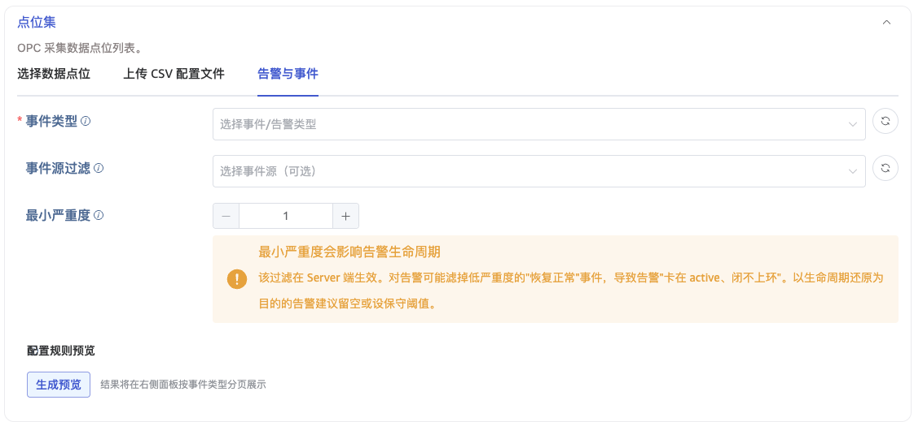
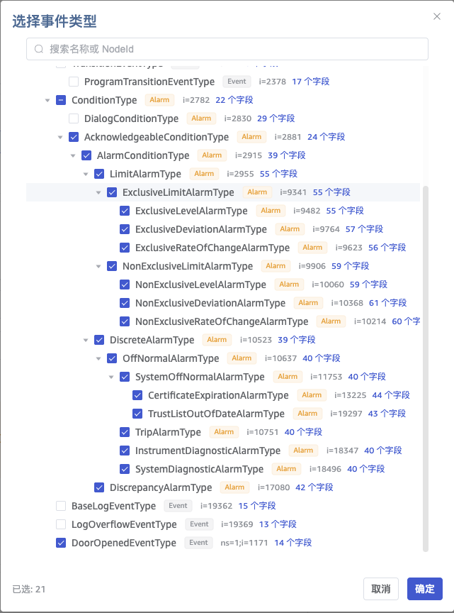
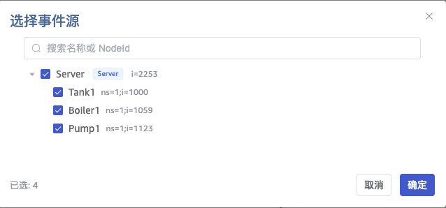
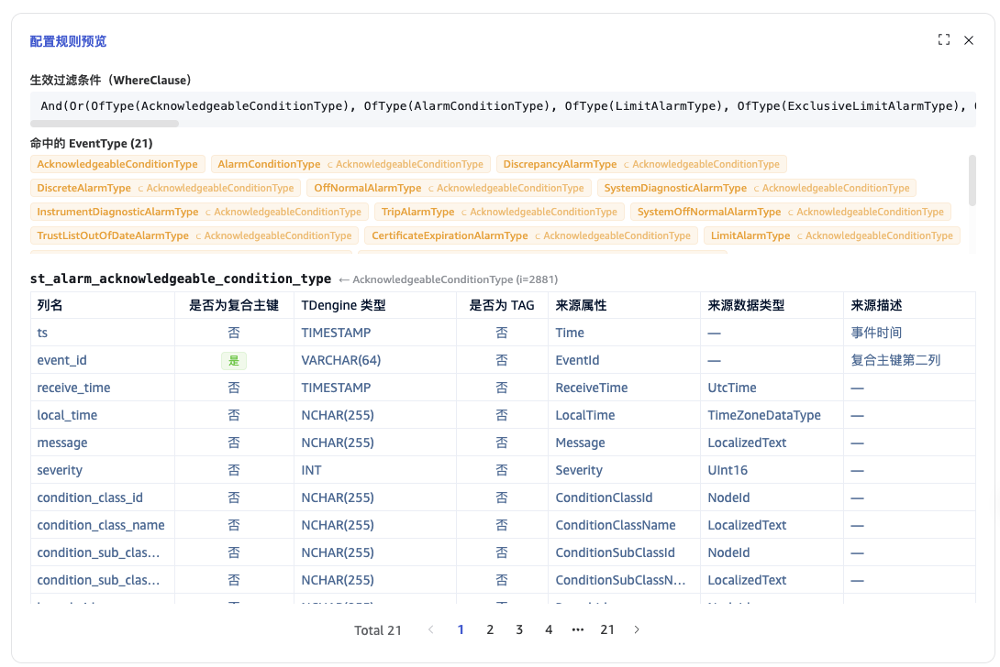

本文讲述如何通过 taosExplorer 创建 OPC UA 数据接入任务，把 OPC UA Server 上的 **告警与事件** 采集写入 TDengine。

:::note
基础的任务创建流程（数据源、连接、认证）与普通点位采集一致，请先阅读 [OPC UA](./index.md)。本文只描述 A&E 采集特有的部分。
:::

## 功能简介

工业现场 OPC UA Server 上除了普通数据点位（Value）外，还会以 **事件** 的形式对外推送告警与通知。TDengine 的 OPC UA 接入支持两种采集模式：

| 采集模式                  | 监视对象              | 适用数据                   |
| ------------------------- | --------------------- | -------------------------- |
| **点位采集（Value）**     | 节点的属性值          | 温度、压力、液位等过程量   |
| **告警与事件采集（A&E）** | Server 推送的事件通知 | 告警、状态切换、操作日志等 |

A&E 采集通过 OPC UA 标准的 `Subscription + MonitoredItem + EventFilter` 机制订阅 Server 推送的事件，并把 **每一次状态变化逐行写入** TDengine，完整还原告警生命周期。

相较用点位订阅"模拟"告警，原生 A&E 采集有两个显著优势：

1. **高效**：一条订阅即可接收 Server 上某类全部告警；用点位模拟则需要为每个告警字段建一行订阅（典型场景上百告警 × 数十字段 = 上万行订阅）。
2. **语义完整**：原生拿到 `EventId`、状态切换时间点、严重度变化、操作员（`ClientUserId`）等关键语义，能还原 Active → Ack → Inactive → Confirm 的完整过程。

### 两种数据形态

OPC UA 事件分为两类，采集与建表规则不同：

- **Alarm（告警）**：带生命周期的状态对象，如液位越限、设备跳闸。同一告警实例反复触发，每次状态切换推送一条事件。
- **Event（普通事件）**：一次性、无状态的瞬时通知，如开门、系统启停、审计事件。每条事件彼此独立。

## 适用场景

- **纯告警采集**：把产线告警（液位 / 压力 / 跳闸等）原生采集入库，逐条还原生命周期。
- **Value + A&E 混采**：同一 Server 上，点位任务采过程量、A&E 任务采告警，两者按 `device_id` 关联，供数据中台统一分析。
- **多 Server 汇聚**：多台 Server 的同类告警汇入同一超级表，靠 `server_endpoint` 区分来源。
- **按需过滤降噪**：只订阅关心的告警子类 + 指定产线的事件源 + 最小严重度，过滤在 Server 端完成。

## 前置条件

使用 A&E 采集前，目标 OPC UA Server 须满足：

1. **仅支持 OPC UA**：不支持基于 DCOM 的 OPC Classic AE。若现场仅有 Classic AE，需先部署 UA Wrapper（如 GE / KEPServerEX）将其暴露为 OPC UA，再由 taosX 采集。
2. **Server 须实现 "A & C - Standard" Profile**，且 Server 节点（`i=2253`）的 `EventNotifier` 属性 ≠ 0，否则无法订阅事件。
3. **网络可达**：taosX 主机能直连 Server 的 OPC UA endpoint（默认 4840）。
4. **最小权限**：采集账号只需 Subscribe（或只读）权限，无需方法调用权限。

若 Server 不满足条件，taosExplorer 会在进入「告警与事件」配置时提示不可用，此时请回退普通点位采集或先部署 Wrapper。

## 配置步骤

按 [OPC UA](./index.md) 完成数据源、连接配置、认证方式的前 4 步后，进入「点位集」配置。

OPC UA 任务的 **点位集** 提供三种互斥模式，通过 tab 切换：

1. **选择数据点位**（默认，普通点位采集）
2. **上传 CSV 配置文件**（普通点位采集）
3. **告警与事件**（A&E 采集，本节内容）

选择「**告警与事件**」tab，进入 A&E 采集配置。该模式下可配置事件类型、事件源过滤、最小严重度三项过滤条件，并可生成配置规则预览。



### 选择事件类型（必选）

点击「事件类型」，taosExplorer 会向 Server 发起浏览，从 `BaseEventType`(`i=2041`) 沿 `HasSubtype` 递归构建 **事件类型继承树**，以树形结构展示供多选。

- 每个类型节点显示其 NodeId、BrowseName，以及该类型自带 + 继承的字段列表。
- **选中一个类型即自动包含其所有子类**（对应 EventFilter 的 `OfType`）。
- 类型树默认走缓存（界面秒开）；如需强制重新浏览，点击右上角「**刷新（不使用缓存）**」。
- **降级**：若 Server 不暴露完整类型树，taosExplorer 回退到内置的标准 OPC UA 事件类型目录（命名空间 0 内的固定 NodeId + 标准字段集），此时仅厂商自定义类型无法被发现。



:::tip
事件类型树变化频率极低，默认缓存即可。仅当 Endpoint、安全策略、账号变化，或上次浏览报错时，缓存才会自动失效。
:::

### 事件源过滤（可选）

「事件源过滤」与事件类型 **相互独立**，取自实例空间：从 Server 节点 (`i=2253`) 沿 `HasNotifier` / `HasEventSource` 展开"通知者 / 事件源"层级，同样以树形展示、支持多选和关键字搜索。

- **叶子节点 = 真正的事件源**：勾选后仅采集这些源（`SourceNode`）发出的事件。
- **枝干节点 = Area（区域）**：仅作分组，勾选它等价于选中其下全部叶子源。
- 工业现场源可能成百上千，可用搜索框按名称或 NodeId 过滤。
- **不选 = 不过滤，采集所有源**（默认）。



:::note
若 Server 未建立通知者 / 事件源层级，事件源树为空。此时可手工输入 `SourceNode` 的 NodeId 后回车添加，或留空以采集所有源。
:::

### 最小严重度（可选）

「最小严重度」是一个数值输入框，取值 **1–1000**，对应 EventFilter 的 `Severity ≥ 该值`。**留空 = 不过滤（采集全部严重度）**。

:::warning
最小严重度过滤在 **Server 端** 生效。对告警启用该过滤可能产生副作用：当某告警"恢复正常"事件的严重度降到阈值以下时，会被 Server 一并滤掉，导致该告警在库中"卡在 active、闭不上环"。

- 以 **还原告警生命周期** 为目的的订阅：建议 **留空** 或设置很保守的阈值。
- 仅采集 **Event**：可放心使用，普通事件无生命周期，过滤低严重度无副作用。

:::

### 配置规则预览

正式提交前，点击「**配置规则预览**」区域的「生成预览」按钮，taosExplorer 会调用后端接口对当前配置做 **静态推导**，在右侧面板展示采集后将得到的结果：

1. **命中的全部事件类型**：含被子类隐式选中的类型。
2. **每个命中类型将建的超级表名 + 完整列结构**：包括列名、是否为复合主键、TDengine 类型、是否为 TAG、来源属性等。
3. **生效过滤条件**：以可读形式回显 EventFilter 的 `WhereClause`。



预览是 **静态推导**：只读取类型字段并按建表规则推导，**不会建立订阅、不会写入 TDengine**。它与任务运行时实际建表复用同一套规则，因此 **预览所见即实际所建**。

:::tip
只要选择了至少一个事件类型，预览必然非空且确定，不依赖"窗口内是否恰好有告警发生"。建议提交前务必预览，确认将建的表结构与过滤条件符合预期。
:::

预览 **无法** 验证：事件源是否真的会发事件、字段的真实取值、Server 是否接受该 EventFilter——这些只能等任务运行后观察。

### 采集模式

选择「告警与事件」tab 后，「采集配置」中的 **采集模式会自动锁定为 `event`** 且不可修改；普通点位采集对应的 `observe` / `subscribe` 模式仅在「选择数据点位」或「上传 CSV 配置文件」tab 下可用。因此你无需手动选择采集模式——切换 tab 即可。

配置完成后点击「提交」，即创建 A&E 采集任务。

## 数据入库规则

taosX 依据订阅到的事件 **自动建表并写入**，规则如下。了解这些规则有助于后续查询。

### 超级表与子表

- **一个事件类型对应一张超级表**，避免不同子类字段差异导致大量空列。
  - 告警类型超级表名形如 `st_alarm_<类型>`，普通事件类型形如 `st_evt_<类型>`。
  - 类型名由 BrowseName 转为下划线小写，并去除 `_alarm_type` / `_event_type` 后缀。例如 `ExclusiveLimitAlarmType` → `st_alarm_exclusive_limit`；`DoorOpenedEventType` → `st_evt_door_opened`。
- **子表维度按数据形态区分**：

  | 数据形态              | 子表维度                            | 一行 =       | 说明                                             |
  | --------------------- | ----------------------------------- | ------------ | ------------------------------------------------ |
  | **Alarm（告警）**     | `ConditionId`（一个告警点一张子表） | 一次状态切换 | 子表累积该告警点历史上所有次告警，与点位子表同构 |
  | **Event（普通事件）** | `SourceNode`（一个事件源一张子表）  | 一次独立事件 | 每条事件独立成行                                 |

- **子表命名** 用语义稳定字段拼接，保证同一告警点 / 事件源永远落到同一张子表：`{超级表名}_{SourceNode}[_{ConditionName}]`（告警含 ConditionName，普通事件不含）。NodeId 中的非字母数字字符（如 `=`、`;`、`/`）会被替换为 `_`，例如 `ns=2;s=Tank1` → `ns_2_s_Tank1`。子表名过长时会被自动截断并加哈希后缀以保证唯一。

:::note
告警子表是"长时间序列"而非"几行"。`ConditionId` 在 Server 运行期内固定，一次告警生命周期（约几行）只是子表里的一段——子表累积的是该告警点 **历史上所有次** 告警。这与点位子表完全同构：点位子表 = 一个测点的值序列，告警子表 = 一个告警点的状态切换序列。
:::

### 字段类型映射

列由 EventFilter 的 `SelectClauses` 决定（默认采集所选类型的全部继承字段）。OPC UA 类型到 TDengine 类型的映射如下：

| OPC UA 类型                                                      | TDengine 类型  |
| ---------------------------------------------------------------- | -------------- |
| Boolean                                                          | BOOL           |
| SByte / Byte / Int16 / UInt16 / Int32                            | INT            |
| UInt32 / Int64 / UInt64                                          | BIGINT         |
| Float                                                            | FLOAT          |
| Double / Duration                                                | DOUBLE         |
| DateTime / UtcTime                                               | TIMESTAMP      |
| ByteString                                                       | VARBINARY(255) |
| StatusCode                                                       | INT            |
| String / LocalizedText / NodeId / ExpandedNodeId / QualifiedName | NCHAR(255)     |
| 结构体 / 其他未知类型                                            | NCHAR(255)     |

:::note
`EventId` 虽然是 ByteString，但因用作复合主键的第二列（TDengine 复合主键仅支持整型 / VARCHAR），会 **例外地存为 `VARCHAR(64)` 的十六进制字符串**，是上表的唯一例外。
:::

### 状态机字段拆列（仅告警）

告警的 `ActiveState` / `AckedState` / `ConfirmedState` / `EnabledState` 等状态机字段会拆成两列：

- `xxx_id`（BOOL）：状态布尔值
- `xxx_text`（NCHAR）：可读文本

例如 `ActiveState` → `active_state_id` + `active_state_text`。这样既能用布尔值做高效过滤，又能保留可读的状态文本。

### 复合主键与去重

每张子表使用 **复合主键 `(ts, event_id)`**：

- `ts`：事件时间（第一主键）。
- `event_id`：单条事件通知的唯一标识（第二主键，VARCHAR(64)）。

冷启动或断线重连后，taosX 会调用 OPC UA 标准方法 `ConditionRefresh`(`i=3875`) 让 Server 重发当前活跃告警快照。重发事件携带与原事件相同的 `EventId` 与 `Time`，重复写入时由复合主键自动覆盖去重；不同事件即便 `Time` 相同，因 `EventId` 不同也会保留为独立行，避免状态切换被覆盖丢失。

### TAG 列

每张超级表附带以下 TAG（均为 NCHAR），用于按设备 / 源 / 类型维度查询与关联：

| TAG               | 说明                          | 告警 / 普通 |
| ----------------- | ----------------------------- | ----------- |
| `device_id`       | 设备标识（从事件反推）        | 两者皆有    |
| `source_node`     | 事件源 NodeId                 | 两者皆有    |
| `source_name`     | 事件源可读名                  | 两者皆有    |
| `event_type`      | 事件类型 BrowseName           | 两者皆有    |
| `server_endpoint` | OPC UA Server endpoint        | 两者皆有    |
| `condition_id`    | 告警实例 NodeId（运行期固定） | 仅告警      |
| `condition_name`  | 告警实例可读名                | 仅告警      |

### 告警生命周期落行示例

以一个液位互斥限值告警（`ExclusiveLimitAlarmType`）为例，一次"液位升破上限 → 操作员确认 → 液位回落 → 操作员确认处理完成"的完整生命周期，在子表中落为 **多行**：

| ts           | event_id | severity | active_state_id | acked_state_id | confirmed_state_id | message                    |
| ------------ | -------- | -------- | --------------- | -------------- | ------------------ | -------------------------- |
| 12:00:00.100 | 0xA1…    | 900      | true            | false          | false              | Level exceeds HighHigh     |
| 12:00:04.100 | 0xA2…    | 900      | true            | true           | false              | Acknowledged by operator01 |
| 12:00:09.500 | 0xA3…    | 0        | false           | true           | false              | Alarm returned to normal   |
| 12:00:13.500 | 0xA4…    | 0        | false           | true           | true               | Confirmed by operator01    |

:::note
A&E 采集把每次状态切换落为新行（**追加**），而不是更新同一行。操作员经 HMI 做的每次 Ack / Confirm 都会作为新事件推回 taosX 并逐条落库，因此采集到的告警数据比 Server 单一状态更完整。
:::

## SQL 示例

以下超级表 / 子表均由 taosX **自动创建**，无需手写。给出示例是为了帮助你理解表结构、编写查询。

以液位互斥限值告警为例（代表性列子集，实际列集按所选类型全字段展开）：

```sql
-- 超级表 = 事件类型
CREATE STABLE st_alarm_exclusive_limit (
  ts               TIMESTAMP,               -- 事件时间
  event_id         VARCHAR(64) PRIMARY KEY, -- 复合主键第二列
  receive_time     TIMESTAMP,
  message          NCHAR(255),
  severity         INT,
  last_severity    INT,
  quality          INT,
  client_user_id   NCHAR(255),              -- 操作员实名 (审计链)
  branch_id        NCHAR(255),
  -- 状态机字段：拆 _id(BOOL) + _text(NCHAR)
  enabled_state_id  BOOL, enabled_state_text  NCHAR(32),
  active_state_id   BOOL, active_state_text   NCHAR(32),
  acked_state_id    BOOL, acked_state_text    NCHAR(32),
  confirmed_state_id BOOL, confirmed_state_text NCHAR(32),
  high_limit DOUBLE, highhigh_limit DOUBLE, low_limit DOUBLE, lowlow_limit DOUBLE
  -- …其余继承字段按全字段展开
) TAGS (
  device_id NCHAR(255), source_node NCHAR(255), source_name NCHAR(255),
  event_type NCHAR(255), condition_id NCHAR(255), condition_name NCHAR(255),
  server_endpoint NCHAR(255)
);
```

典型查询：

```sql
-- 查某告警点全部历史
SELECT * FROM st_alarm_exclusive_limit
WHERE condition_name = 'Tank1_Level' ORDER BY ts;

-- 查某设备的全部 A&E (靠 TAG 关联，不依赖子表名)
SELECT * FROM st_alarm_exclusive_limit WHERE device_id = 'tank1';

-- 统计某设备今日各严重度告警次数
SELECT severity, COUNT(*) FROM st_alarm_exclusive_limit
WHERE device_id = 'tank1' AND ts >= TODAY
GROUP BY severity;

-- 关联同一设备的 A&E 与普通点位数据：两张超级表按同一 device_id 过滤后 JOIN
```

## 运行行为说明

### 只读旁路（不反向控制）

taosX 在告警生命周期中是 **被动订阅者**，对生产 Server 不做任何写入或反向控制：

- **不调用** `Acknowledge`、`Confirm`、`AddComment` 等任何告警方法；
- **不回写** 任何 OPC UA 点位。

告警的 Ack / Confirm 由操作员通过 HMI / SCADA 完成。这样既确保"不可能影响生产"，也避免代操作员执行动作而破坏 ISA-18.2 / IEC 62682 要求的实名审计链（`ClientUserId`）。`ConditionRefresh` 属协议层必需的只读调用，不属于反向控制。

### 冷启动 / 重连快照

taosX 重启或与 Server 断连重连后，会自动调用 `ConditionRefresh` 补齐当前活跃告警快照（仅 Condition / Alarm 会被重发，一次性普通事件不受影响），并靠复合主键去重，不产生重复行。该行为由后端固定开启，无需配置。

### Schema 平滑演进

当你调整事件过滤导致字段增减时：多出的字段会用 `ALTER STABLE ... ADD COLUMN` 自动扩展；减少的字段 **不会删列**，缺失时写空值。

## 约束与限制

- 仅支持 OPC UA，不支持 OPC Classic AE（DCOM）；后者需先部署 UA Wrapper。
- 依赖 Server 的 "A & C - Standard" Profile 且 Server 节点 `EventNotifier ≠ 0`。
- 自定义高级过滤表达式（直接手写 `ContentFilter`）、动态样本预览为后续版本，当前不提供。当前过滤项为：事件类型、事件源、最小严重度。
- 字段选择（SelectClauses）当前默认采集所选类型的全部字段，不支持逐字段勾选。
- 经 Wrapper 接入的告警，部分字段（如 `Message`、事件类型细分、`ConditionClass`、`Confirm`、Suppression/Shelving 等）可能丢失，落库为空值属预期行为，非缺陷。
- Schema 只增不删。

## 常见问题

| 现象                                             | 可能原因                                            | 处理                                                                                        |
| ------------------------------------------------ | --------------------------------------------------- | ------------------------------------------------------------------------------------------- |
| 无法进入或保存「告警与事件」配置，提示不支持事件 | Server 未实现 A&C Profile，或 `EventNotifier=0`     | 确认 Server Profile 与 `i=2253` 的 `EventNotifier` 属性；否则回退普通点位采集或部署 Wrapper |
| 事件类型树为空 / 只有标准类型                    | Server 不支持沿 `HasSubtype` 浏览类型树             | 使用内置标准类型目录；厂商自定义类型需手输 NodeId                                           |
| 事件源树为空                                     | Server 未建立 `HasNotifier` / `HasEventSource` 层级 | 手工输入 SourceNode NodeId，或留空采集所有源                                                |
| 预览有类型，任务运行后收不到数据                 | 所选源从不发事件 / 过滤过严 / 现场无活跃告警        | 放宽源与严重度过滤；确认现场是否真有告警发生                                                |
| 告警"卡在 active"、没有恢复行                    | 最小严重度过滤把"恢复正常"事件滤掉了                | 降低或移除最小严重度（尤其对告警）                                                          |
| 创建监视项失败 / 过滤被拒                        | Server 不接受某过滤算子                             | 简化过滤（减少算子 / 源）；查看任务日志中的 Server 状态码                                   |
