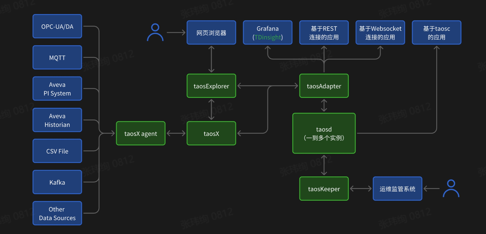

在 TDengine 的安装包中，除了 TDengine 数据库引擎 taosd 以外，还提供了一些附加组件，以方便用户的使用。taosAdapter 是应用和 TDengine 之间的桥梁；taosKeeper 是TDengine 监控指标的导出工具；taosX 是数据管道（data pipeline）工具；taosExplorer 是可视化图形管理工具；taosc 是 TDengine 客户端驱动。下图展示了整个 TDengine 产品生态的拓扑架构，其中绿色背景的方块是 TDengine 组件（组件 taosX、taosX Agent 仅 TDengine Enterprise 提供）。

## taosd

在 TDengine 中，taosd 是一个关键的守护进程，同时也是核心服务进程。它负责处理所有与数据相关的操作，包括数据写入、查询和管理等。在 Linux 操作系统中，用户可以利用 systemd 命令来便捷地启动、停止 taosd 进程。为了查看 taosd 的所有命令行参数，用户可以执行 taosd -h 命令。

taosd 进程的日志默认存储在 /var/log/taos/ 目录下，方便用户进行日志查看和管理。

TDengine 采用 vnode 机制对存储的数据进行切分，每个 vnode 包含一定数量的数据采集点的数据。为了提供高可用服务，TDengine 采用多副本方式，确保数据的可靠性和持久性。不同节点上的 vnode 可以组成一个 vgroup，实现实时数据同步。这种设计不仅提高了数据的可用性和容错能力，还有助于实现负载均衡和高效的数据处理。

## taosc

taosc 是 TDengine 的客户端程序，为开发人员提供了一组函数和接口，以便编写应用程序并连接到 TDengine，执行各种 SQL。由于 taosc 是用 C 语言编写的，因此可以轻松地与 C/C++ 应用程序集成。

当使用其他编程语言与 TDengine 交互时，如果使用原生连接，也需要依赖 taosc。这是因为 taosc 提供了与 TDengine 通信所需的底层协议和数据结构，确保了不同编程语言应用程序能够顺利地与 TDengine 进行交互。

通过使用 taosc，开发人员可以轻松地构建与 TDengine 交互的应用程序，实现数据的存储、查询和管理等功能。这种设计提高了应用程序的可维护性和可扩展性，同时降低了开发难度，使得开发人员能够专注于业务逻辑的实现。

## taosAdapter

taosAdapter 是 TDengine 安装包中的一个标准组件，充当着 TDengine 集群与应用程序之间的桥梁和适配器角色。它支持用户通过 RESTful 接口和 WebSocket 连接访问TDengine 服务，实现数据的便捷接入和处理。

taosAdapter 能够与各种数据收集代理工具（如 Telegraf、StatsD、collectd 等）无缝对接，从而将数据导入 TDengine。此外，它还提供了与 InfluxDB/OpenTSDB 兼容的数据写入接口，使得原本使用 InfluxDB/OpenTSDB 的应用程序能够轻松移植到 TDengine 上，无须进行大量修改。

通过 taosAdapter，用户可以灵活地将 TDengine 集成到现有的应用系统中，实现数据的实时存储、查询和分析。

taosAdapter 提供了以下功能：
- RESTful 接口；
- WebSocket 连接；
- 兼容 InfluxDB v1 格式写入；
- 兼容 OpenTSDB JSON 和 Telnet 格式写入；
- 无缝连接到 Telegraf；
- 无缝连接到 collectd；
- 无缝连接到 StatsD；
- 支持 Prometheus remote_read 和 remote_write。

## taosKeeper

taosKeeper 是 TDengine 3.0 版本中新增的监控指标导出工具，旨在方便用户对TDengine 的运行状态和性能指标进行实时监控。通过简单的配置，TDengine 能够将其运行状态、指标等信息上报给 taosKeeper。当接收到监控数据后，taosKeeper 会利用 taosAdapter 提供的 RESTful 接口，将这些数据存储到 TDengine 中。

taosKeeper 的一个重要价值在于，它能够将多个甚至一批 TDengine 集群的监控数据集中存储在一个统一的平台上。这使得监控软件能够轻松获取这些数据，从而实现对 TDengine 集群的全面监控和实时分析。通过 taosKeeper，用户可以更加便捷地掌握TDengine 的运行状况，及时发现并解决潜在问题，确保系统的稳定性和高效性。

## taosExplorer

为了简化用户对数据库的使用和管理，TDengine Enterprise 引入了一个全新的可视化组件—taosExplorer。这个工具为用户提供了一个直观的界面，方便用户轻松管理数据库系统中的各类元素，如数据库、超级表、子表等，以及它们的生命周期。

通过 taosExplorer，用户可以执行 SQL 查询，实时监控系统状态、管理用户权限、完成数据的备份和恢复操作。此外，它还支持与其他集群之间的数据同步、导出数据，以及管理主题和流计算等功能。

值得一提的是，taosExplorer 的社区版与企业版在功能上有所区别。企业版提供了更丰富的功能和更高级别的技术支持，以满足企业用户的需求。具体的差异和详细信息，用户可以查阅 TDengine 的官方文档。

## taosX

taosX 作为 TDengine Enterprise 的数据管道功能组件，旨在为用户提供一种无须编写代码即可轻松对接第三方数据源的方法，实现数据的便捷导入。目前，taosX 已支持众多主流数据源，包括 AVEVA PI System、AVEVA Historian、OPC-UA/DA、InfluxDB、OpenTSDB、MQTT、Kafka、CSV、TDengine 2.x、TDengine 3.x、MySQL、PostgreSQL和 Oracle 等。

在实际使用中， 用户通常无须直接与 taosX 进行交互。 相反， 他们可以通 过taosExplorer 提供的浏览器用户界面轻松访问和使用 taosX 的强大功能。这种设计简化了操作流程，降低了使用门槛，使得用户能够更加专注于数据处理和分析，从而提高工作效率。

## taosX Agent

taosX Agent 是 TDengine Enterprise 数据管道功能的重要组成部分，它与 taosX 协同工作，负责接收 taosX 下发的外部数据源导入任务。taosX Agent 能够启动连接器或直接从外部数据源获取数据，随后将采集的数据转发给 taosX 进行处理。

在边云协同场景中，taosX Agent 通常部署在边缘侧，尤其适用于那些外部数据源无法直接通过公网访问的情况。通过在边缘侧部署 taosX Agent，可以有效地解决网络限制和数据传输延迟等问题，确保数据的实时性和安全性。

## 应用程序或第三方工具

通过与各类应用程序、可视化和 BI（Business Intelligence，商业智能）工具以及数据源集成，TDengine 为用户提供了灵活、高效的数据处理和分析能力，以满足不同场景下的业务需求。应用程序或第三方工具主要包括以下几类。

1. 应用程序

这些应用程序负责向业务集群写入、查询业务数据以及订阅数据。应用程序可以通过以下 3 种方式与业务集群进行交互。
- 基于 taosc 的应用程序：采用原生连接的应用程序，直接连接到业务集群，默认端口为 6030。
- 基于 RESTful 连接的应用程序：使用 RESTful 接口访问业务集群的应用程序，需要通过 taosAdapter 进行连接，默认端口为 6041。
- 基于 WebSkcket 连接的应用程序：采用 WebSocket 连接的应用程序，同样需要通过 taosAdapter 进行连接，默认端口为 6041。

2. 可视化/BI 工具

TDengine 支持与众多可视化及 BI 工具无缝对接，如 Grafana、Power BI 以及国产的可视化和 BI 工具。此外，用户还可以利用 Grafana 等工具来监测 TDengine 集群的运行状态。

3. 数据源

TDengine 具备强大的数据接入能力，可以对接各种数据源，如 MQTT、OPC-UA/DA、Kafka、AVEVA PI System、AVEVA Historian 等。这使得 TDengine 能够轻松整合来自不同数据源的数据，为用户提供全面、统一的数据视图。

关于 TDengine 组件的详细介绍和使用请看[参考手册-组件](./reference/components)。
