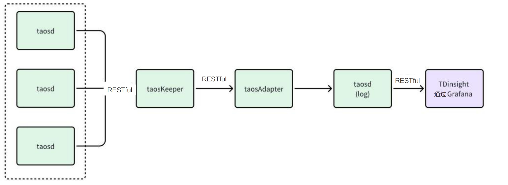
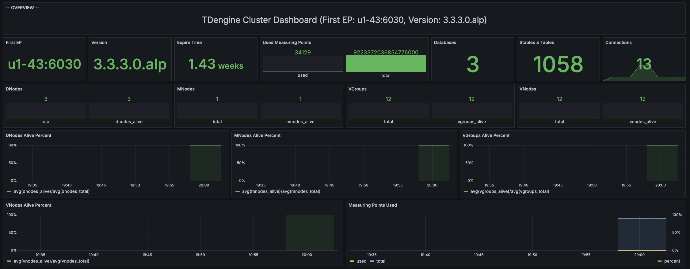
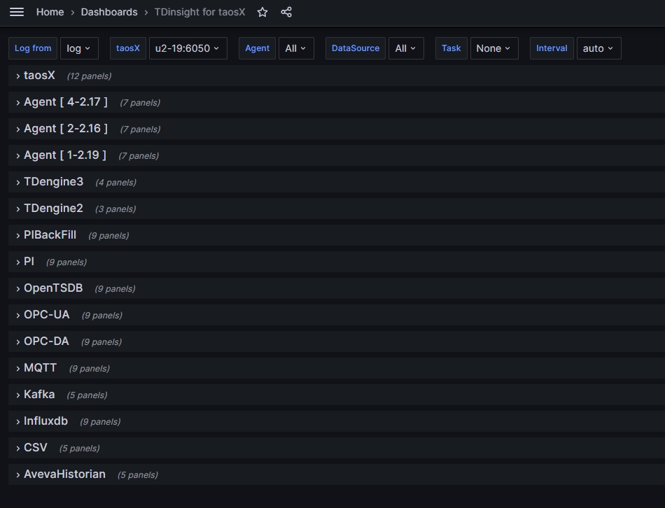
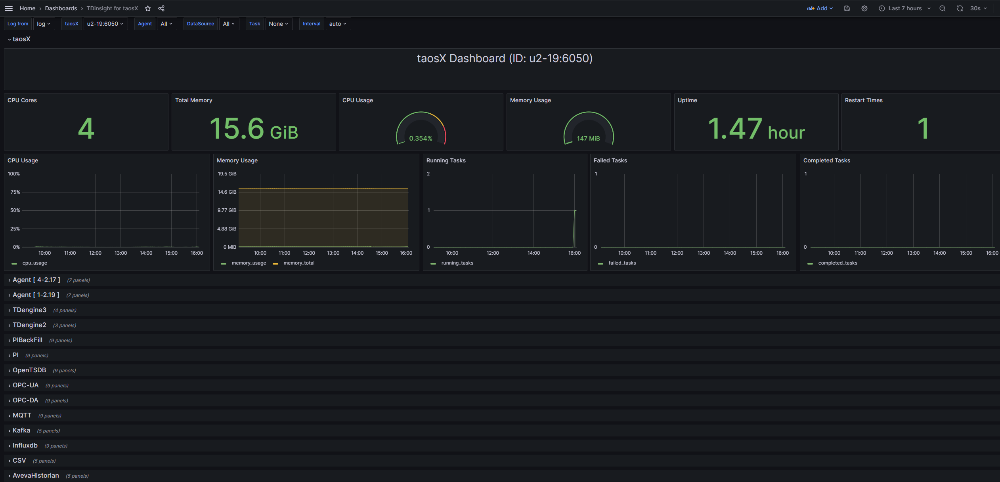
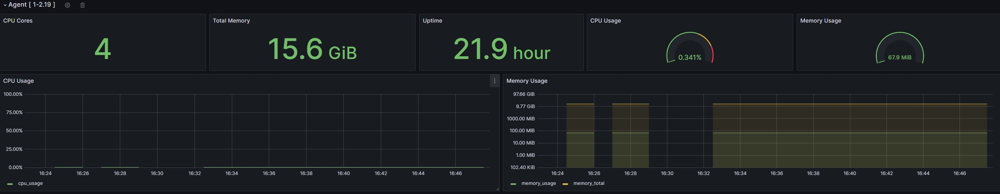
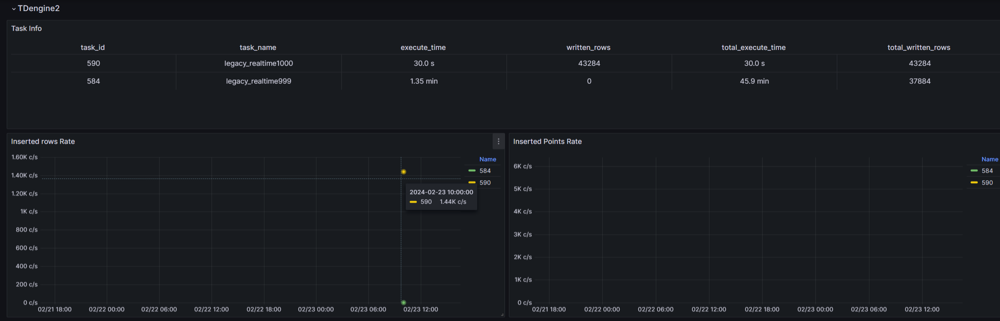
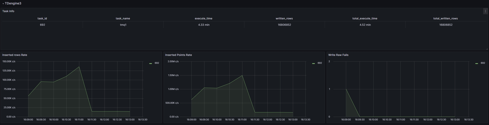
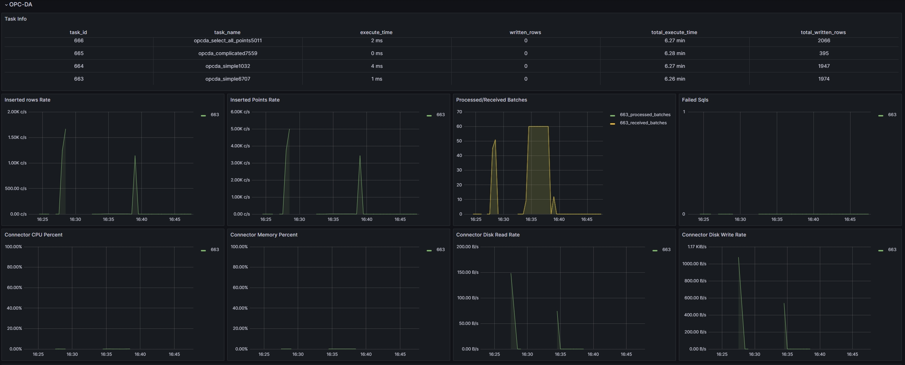

为了确保集群稳定运行，TDengine 集成了多种监控指标收集机制，并通 过taosKeeper 进行汇总。taosKeeper负责接收这些数据，并将其写入一个独立的 TDengine 实例中，该实例可以与被监控的 TDengine 集群保持独立。TDengine 中的两个核心组件 taosd （数据库引擎） 和 taosX （数据接入平台）都通过相同的监控架构来实现对其运行时的监控，但各自的监控指标设计有所不同。 

至于如何获取和使用这些监控数据，用户可以使用第三方的监测工具比如 Zabbix 来获取这些保存的系统监测数据，进而将 TDengine 的运行状况无缝集成到现有的 IT 监控系统中。也可以使用 TDengine 提供的 TDinsight 插件，使用该插件用户可以通过 Grafana 平台直观地展示和管理这些监控信息，如下图所示。这为用户提供了灵活的监控选项，以满足不同场景下的运维需求。



## 配置 taosKeeper

因为 TDengine 的监控数据都通过 taosKeeper 上报并存储，所以本节先介绍 taosKeeper 的配置。

taosKeeper 的配置文件默认位于 `/etc/taos/taoskeeper.toml`。 详细配置见 [参考手册](../../reference/components/taoskeeper/#配置文件)。其中最为关键的一个配置项是 `database`，它决定了收集到的监控数据存储在目标系统的哪个数据库中。

## 监控 taosd

### 基于 TDinsight 监控 taosd

为了简化用户在 TDengine 监控方面的配置工作，TDengine 提供了一个名为 TDinsight 的 Grafana 插件。该插件与 taosKeeper 协同工作，能够实时监控 TDengine 的各项性能指标。

通过集成 Grafana 和 TDengine 数据源插件，TDinsight 能够读取 taosKeeper 收集的监控数据。这使得用户可以在 Grafana 平台上直观地查看 TDengine 集群的状态、节点信息、读写请求以及资源使用情况等关键指标，实现数据的可视化展示。

以下是TDinsight 的详细使用说明，以帮助你充分利用这一强大工具。

#### 前置条件

若要顺利使用 TDinsight，应满足如下条件。
- TDengine 已安装并正常运行。
- taosAdapter 已经安装并正常运行。
- taosKeeper 已经安装并正常运行。
- Grafana 已安装并正常运行，以下介绍以 Grafna 11.0.0 为例。

同时记录以下信息。
- taosAdapter 的 RESTful 接口地址，如 `http://www.example.com:6041`。
- TDengine 集群的认证信息，包括用户名及密码。

#### 导入仪表盘

TDengine 数据源插件已提交至 Grafana 官网，如何安装 TDengine 数据源插件和配置数据源请参考：[安装 Grafana Plugin 并配置数据源](../../third-party/visual/grafana/#安装-grafana-plugin-并配置数据源)。完成插件的安装和数据源的创建后，可以进行 TDinsight 仪表盘的导入。

在 Grafana 的 “Home” -> “Dashboards” 页面，点击位于右上角的 “New” -> “import” 按钮，即可进入 Dashboard 的导入页面，它支持以下两种导入方式。
- Dashboard ID：18180。
- Dashboard URL：https://grafana.com/grafana/dashboards/18180-tdinsight-for-3-x/

填写以上 Dashboard ID 或 Dashboard URL 以后，点击 “Load” 按钮，按照向导操作，即可完成导入。导入成功后，Dashboards 列表页面会出现 “TDinsight for 3.x” 仪表盘，点击进入后，就可以看到 TDinsight 中已创建的各个指标的面板，如下图所示：



**注意** 在 TDinsight 界面左上角的 “Log from” 下拉列表中可以选择 `log` 数据库。

### TDengine V3 监控数据

TDinsight dashboard 数据来源于 `log` 库（存放监控数据的默认数据库，可以在 taoskeeper 配置文件中修改）。“TDinsight for 3.x” 仪表盘查询了 taosd 和 TaosAdapter 的监控指标。
- taosd 的监控指标请参考 [taosd 监控指标](../../reference/components/taosd/#taosd-监控指标)
- taosAdapter 的监控指标请参考 [taosAdapter 监控指标](../../reference/components/taosadapter/#taosadapter-监控指标)

## 监控 taosX

taosX 是 TDengine 中提供零代码数据接入能力的核心组件，对它的监控也十分重要。taosX 监控与 TDengine 监控类似，都是通过 taosKeeper 将服务搜集的 metrics 写入指定数据库，然后借助 Grafana 面板做可视化和报警。这个功能可监控的对象包括：
1. taosX 进程
2. 所有运行中的 taosx-agent 进程
3. 运行在 taosX 端或 taosx-agent 端的各个连接器子进程
4. 运行中的各类数据写入任务

### 前置条件

1. taosd，taosAdapter 和 taosKeeper 都已经部署完成并启动成功。
2. taosX 服务监控配置正确，如何配置可以参考下文 “配置 taosX 监控”，服务启动成功。  
   **注意**：TDengine 企业版本 3.2.3.0 或以上版本包含的 taosX 才包含此功能。如果单独安装 taosX，需要 taosX 1.5.0 或以上版本。
3. 部署 Grafana ，安装 TDengine Datasource 插件，配置好数据源。可以参考：[安装 Grafana Plugin 并配置数据源](../../third-party/visual/grafana/#安装-grafana-plugin-并配置数据源)。  
   **注意**：需要安装 Grafana 插件 [TDengie Datasource v3.5.0](https://grafana.com/grafana/plugins/tdengine-datasource/) 或以上版本。

### 配置 taosX 监控

toasX 的配置文件(默认 /etc/taos/taosx.toml) 中与 monitor 相关的配置如下：

```toml
[monitor]
# FQDN of taosKeeper service, no default value
# fqdn = "localhost"
# port of taosKeeper service, default 6043
# port = 6043
# how often to send metrics to taosKeeper, default every 10 seconds. Only value from 1 to 10 is valid.
# interval = 10
```

每个配置也有对应的命令行选项和环境变量。通过以下表格说明：

| 配置文件配置项 | 命令行选项         | 环境变量          | 含义                                                    | 取值范围 | 默认值                                   |
| -------------- | ------------------ | ----------------- | ------------------------------------------------------- | -------- | ---------------------------------------- |
| fqdn           | --monitor-fqdn     | MONITOR_FQDN      | taosKeeper 服务的 FQDN                                  |          | 无默认值，配置 fqdn 就等于开启了监控功能 |
| port           | --monitor-port     | MONITOR_PORT      | taosKeeper 服务的端口                                   |          | 6043                                     |
| interval       | --monitor-interval | MONITTOR_INTERVAL | taosX 发送 metrics 数据到 taosKeeper 的时间间隔，单位秒 | 1-10     | 10                                       |

### 基于 TDinsight 监控 tasoX

“TDinsight for taosX” 是专门为 taosX 监控创建的 Grafana 面板。使用前需要先导入这个面板。

#### 进入面板

1. 在 Grafana 界面菜单中点击 “Data sources”， 然后选择已经配置好的 TDengine 数据源。
2. 在数据源配置界面选择 “Dashboard” Tab, 然后导入 “TDinsight for taosX” 面板（第一次使用需要先导入）。 下面是一个示例图：
   
   
    
   该面板每一行代表一个或一类监控对象。最上面是 taosX 监控行，然后是 Agent 监控行, 最后是各类数据写入任务的监控。
   :::note
   - 如果打开这个面板后看不到任何数据，你很可能需要点击左上角的数据库列表（即 “Log from” 下拉菜单），切换到监控数据所在的数据库。
   - 数据库包含多少个 Agent 的数据就会自动创建多少个 Agent 行。(如上图)
   :::


#### 监控示例

1. taosX 监控示例图

   

2. Agent 监控示例图

   

3. TDengine2 数据源监控示例图

   

   :::info
   监控面板只展示了数据写入任务的部分监控指标，在 Explorer 页面上有更全面的监控指标，且有每个指标的具体说明。

   :::

4. TDengine3 数据源监控示例图

   


5. 其它数据源监控示例图
   


#### 限制

只有在以 server 模式运行 taosX 时，与监控相关的配置才生效。
