为方便用户更高效地使用和管理 TDengine，TDengine 3.0 版本推出了一个全新的可视化组件—taosExplorer。这个组件旨在帮助用户在不熟悉 SQL 的情况下，也能轻松管理 TDengine 集群。通过 taosExplorer，用户可以轻松查看 TDengine 的运行状态、浏览数据、配置数据源、实现流计算和数据订阅等功能。此外，用户还可以利用taosExplorer 进行数据的备份、复制和同步操作，以及配置用户的各种访问权限。这些功能极大地简化了数据库的使用过程，提高了用户体验。

本节介绍可视化管理的基本功能。

## 登录

在完成 TDengine 的安装与启动流程之后，用户便可立即开始使用 taosExplorer。该组件默认监听 TCP 端口 6060，用户只须在浏览器中输入 `http://<IP>:6060/login`（其中的IP 是用户自己的地址），便可顺利登录。成功登录集群后，用户会发现在左侧的导航栏中各项功能被清晰地划分为不同的模块。接下来将简单介绍主要模块。

## 运行监控面板

在 Grafana 上安装 TDengine 数据源插件后，即可添加 TDengine 数据源，并导入TDengine 的 Grafana Dashboard: TDengine for 3.x。通过这一操作，用户将能够在不编写任何代码的情况下实现对 TDengine 运行状态的实时监控和告警功能。详情请参考[运行监控](../monitor)

## 编程

通过“编程”页面，可以看到不同编程语言如何与 TDengine 进行交互，实现写入和查询等基本操作。用户通过复制粘贴，即可完成一个示例工程的创建。目前支持的编程语言包括 Java、Go、Python、Node.js（Javascript）、C#、Rust、R 等。

## 数据写入

通过创建不同的任务，用户能够以零代码的方式，将来自不同外部数据源的数据导入 TDengine。目前，TDengine 支持的数据源包括 AVEVA PI System、OPC-UA/DA、MQTT、Kafka、InfluxDB、OpenTSDB、TDengine 2、TDengine 3、CSV、AVEVA Historian 等。在任务的配置中，用户还可以添加与 ETL 相关的配置。

在任务列表页中，可以实现任务的启动、停止、编辑、删除、查看任务的活动日志等操作。

关于数据写入的详细内容，请参考[数据接入]

## 数据浏览器

点击功能列表的“数据浏览器”入口，在“数据浏览器”中可以创建和删除数据库、创建和删除超级表和子表，执行SQL语句，查看SQL语句的执行结果。此外，超级管理员还有对数据库的管理权限，其他用户不提供该功能。如下图所示：

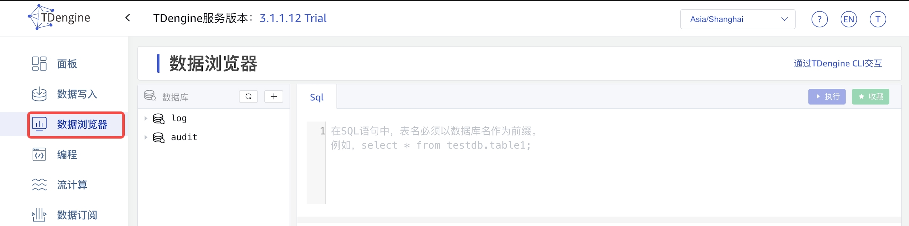

### 创建数据库

下面通过创建数据库，来熟悉数据浏览器页面的功能和操作，接下来看创建数据库的两种方式：

1. 通过点击图中的 + 号，跳转到创建数据数库页面，点击 创建 按钮，如下图：

第一步 点击 + 号；

第二步 填写数据库名称、需要的数据库配置参数，配置参数进行了分类和折叠，点击可展开；
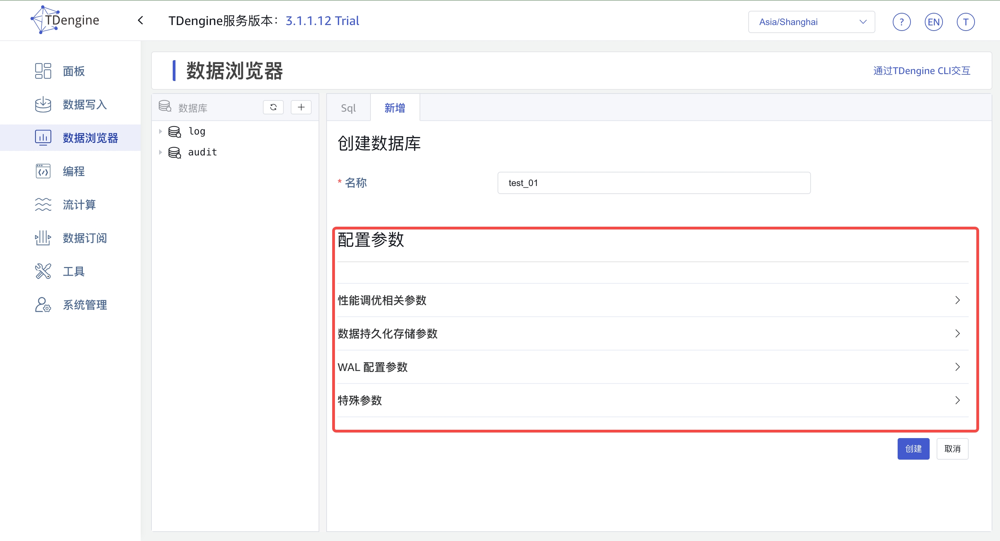

弟三步 点击“创建”按钮之后，如下图左边出现数据库名称则创建数据库成功。

2. 通过在 Sql 编辑器中数据 sql 语句，点击 执行 按钮，如下图：

第一步 输入 sql 语句；
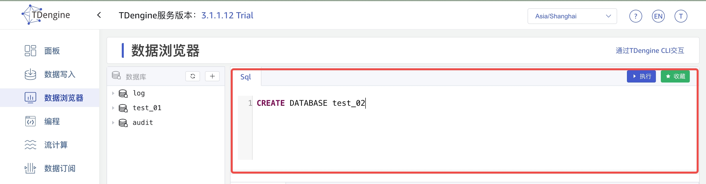

第二步 点击“执行”按钮，左边出现 test02， 则数据库创建成功。
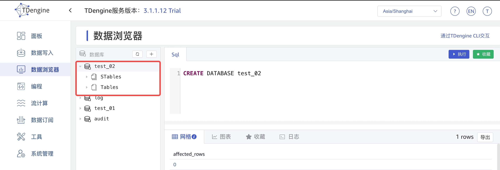

由于创建、修改和删除超级表、创建表、创建子表在行为上是一致的，就以创建超级表为示例做演示：

### 创建超级表

第一步 鼠标移动到 STables 上，点击出现的 + 号，出现创建超级表 tab；
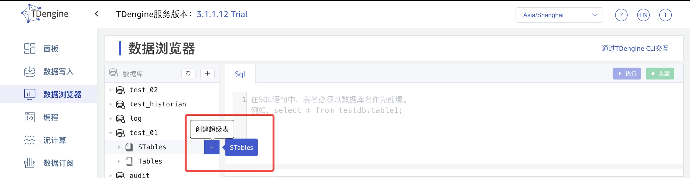

第二步 填写超级表信息， 点击“创建”按钮；

第三步 点击 Stables 出现刚才填写的超级表名，则证明创建成功。
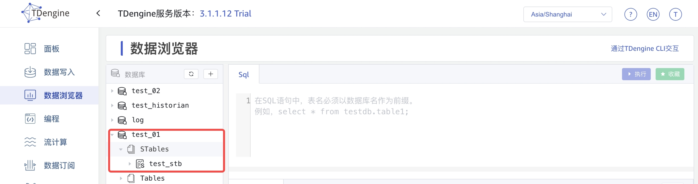

### 查看超级表

鼠标放在需要查看的超级表上，出现如下图所示图标，点击“眼睛图标”查看超级表信息
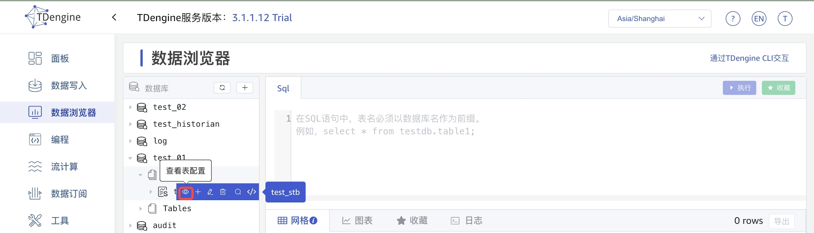
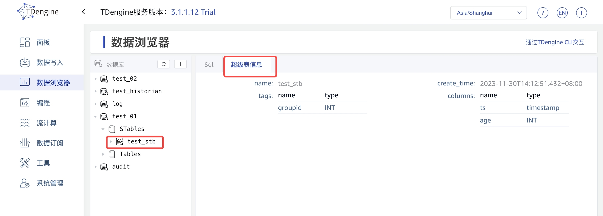

### 修改超级表

鼠标放在需要编辑的超级表上，出现如下图所示图标，点击“编辑图标”修改超级表信息
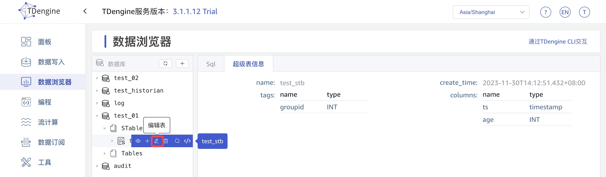

### 删除超级表

鼠标放在需要删除的超级表上，出现如下图所示图标，点击“删除图标”删除超级表
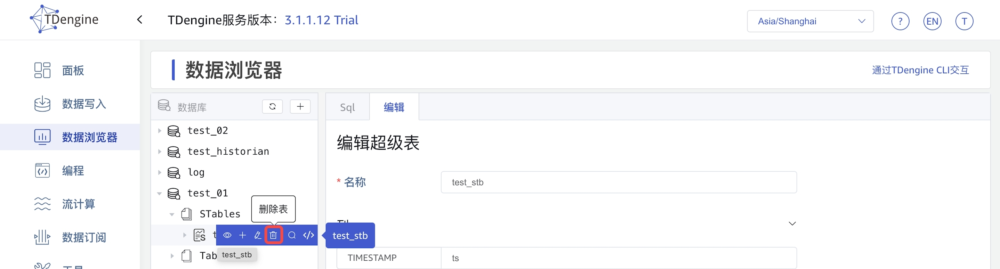

### Sql 编辑器使用

当输入多条语句，可以鼠标选中需要指执行的语句，也可以对语句进行注释（快捷键 Control-/ Command-/），然后再点击执行即可
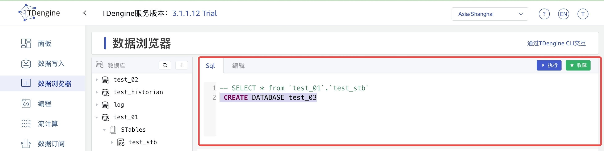

### Sql 收藏功能使用

鼠标选中窗口中的 SQL，点击收藏按钮，即可对 SQL 进行收藏，并可以填写对该 SQL 语句的描述
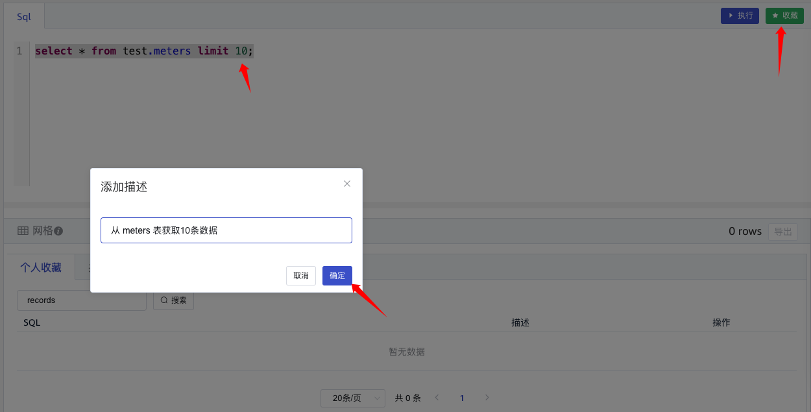

个人收藏中，点击 SQL 的共享按钮，当前 SQL 会被添加到共享收藏中

共享收藏中的 SQL 对所有用户可见
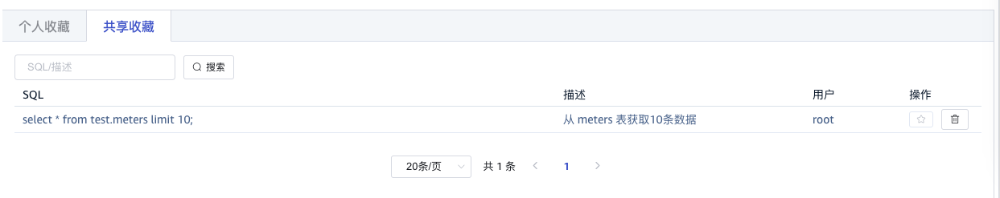

点击取消共享按钮，可以撤回对此 SQL 的共享
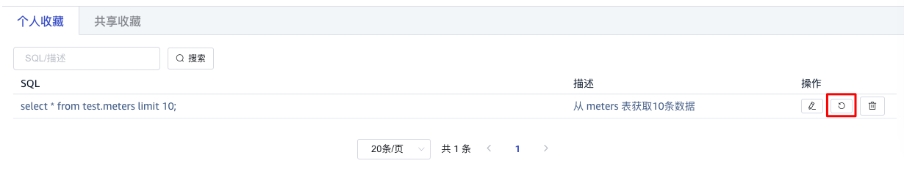

在搜索栏中可以对 SQL 或描述进行模糊搜索
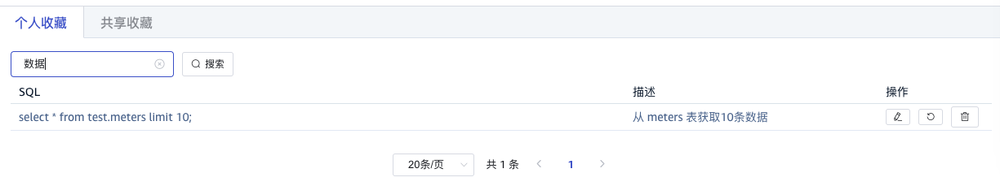

点击删除按钮，SQL 将会从个人收藏中删除，如果 SQL 已经共享到共享收藏，那么共享收藏中对应 SQL 也会同步删除

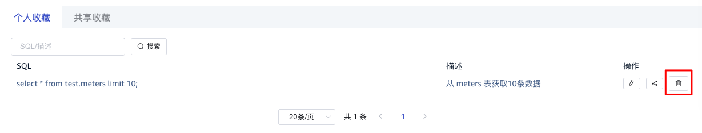

> 注意:
>
> 1. 如果欲收藏的 SQL 已经在个人收藏中，则无法重复收藏，该操作会报错但不产生任何后果
> 2. 如果欲共享的 SQL 已经被自己或他人共享过，则无法重复共享，该操作会报错但不产生任何后果
>
>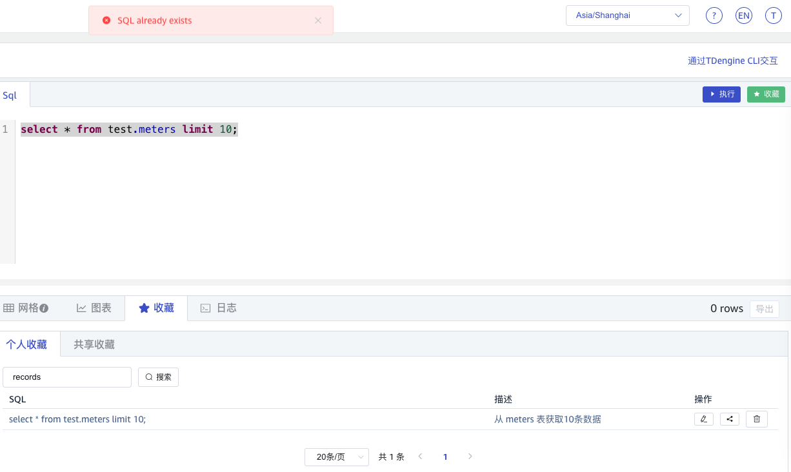

## 流计算

通过 Explorer， 您可以轻松地完成对流的管理，从而更好地利用 TDengine 提供的流计算能力。
点击左侧导航栏中的“流计算”，即可跳转至流计算配置管理页面。
您可以通过以下两种方式创建流：流计算向导和自定义 SQL 语句。当前，通过流计算向导创建流时，暂不支持分组功能。通过自定义 SQL 创建流时，您需要了解 TDengine 提供的流计算 SQL 语句的语法，并保证其正确性。

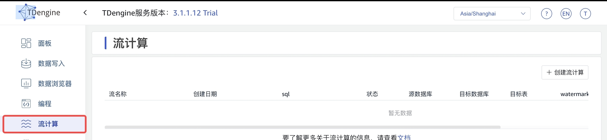

### 创建流计算 Wizard

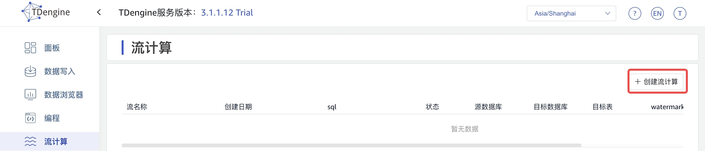

第一步 填写创建流计算需要的信息，点击 创建 按钮；

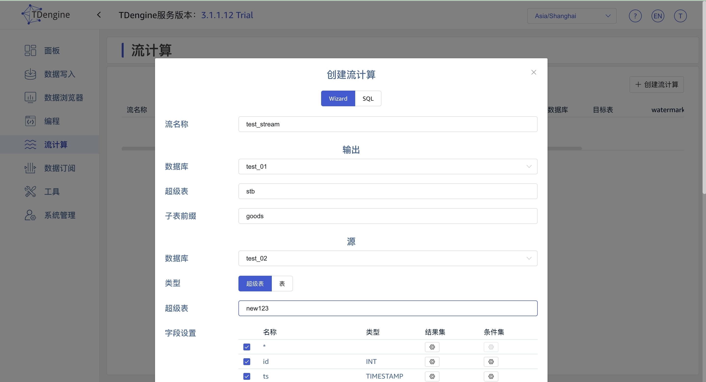
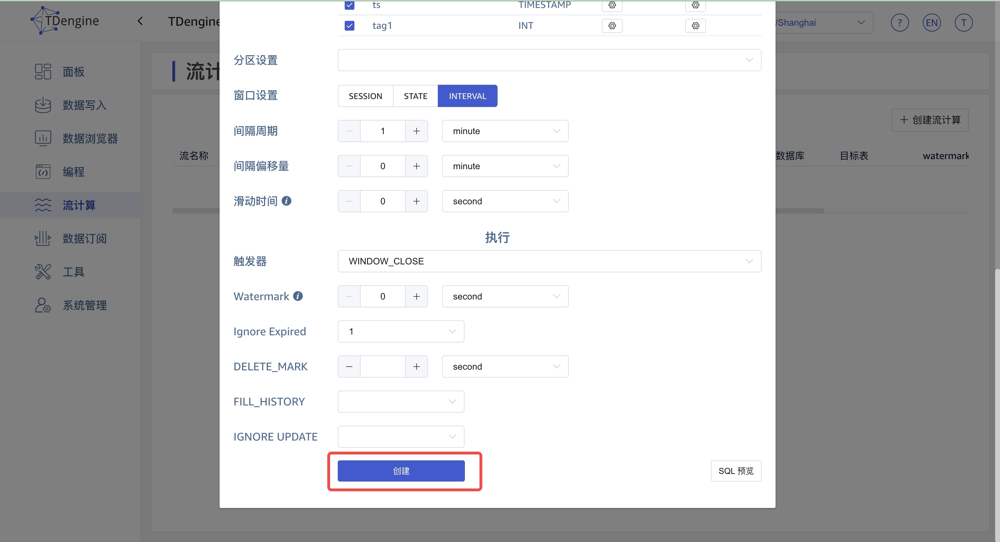

第二步 页面出现以下记录，则证明创建成功。
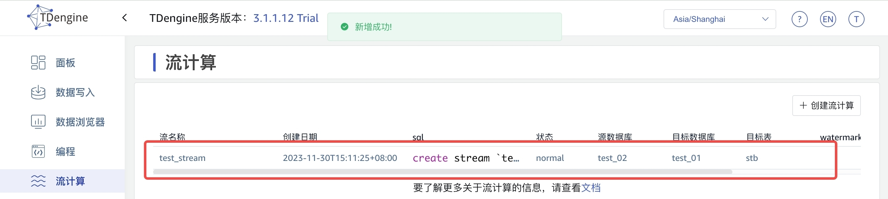

### 使用 SQL

第一步 切换到 SQL 页，直接输入创建流计算 sql， 点击 创建 按钮；
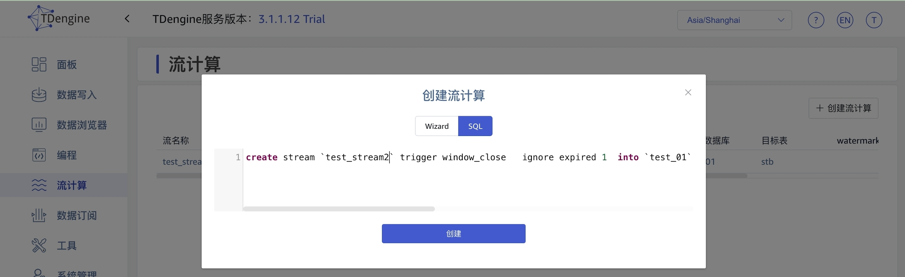

第二步 页面出现以下记录，则证明创建成功。
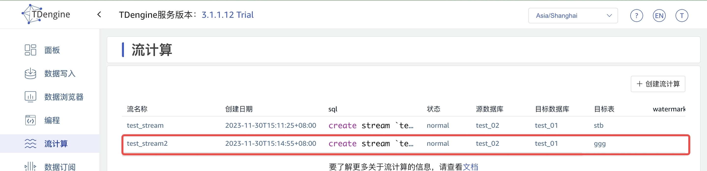

## 数据订阅

通过 Explorer， 您可以轻松地完成对数据订阅的管理，从而更好地利用 TDengine 提供的数据订阅能力。
点击左侧导航栏中的“数据订阅”，即可跳转至数据订阅配置管理页面。
您可以通过以下两种方式创建主题：使用向导和自定义 SQL 语句。通过自定义 SQL 创建主题时，您需要了解 TDengine 提供的数据订阅 SQL 语句的语法，并保证其正确性。

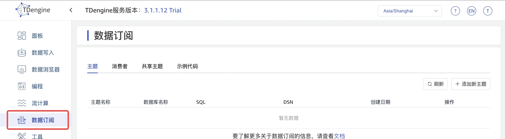

### 添加数据订阅

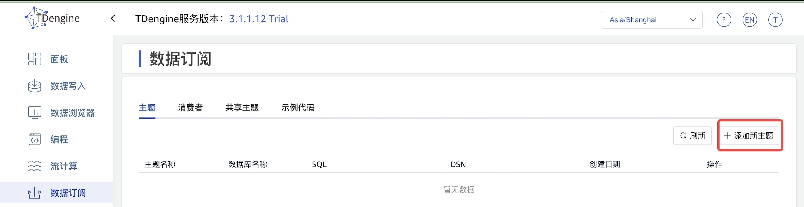

1. Wizard 方式
   
第一步 填写添加新主题需要的信息，点击“创建”按钮；
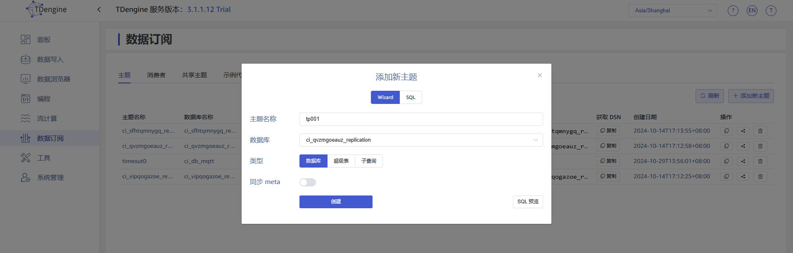

第二步 页面出现以下记录，则证明创建成功。
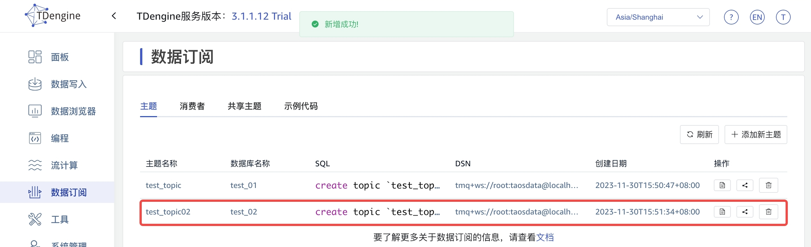

2. Sql 方式

第一步 切换到 SQL 页，直接输入添加新主题 sql， 点击“创建”按钮；
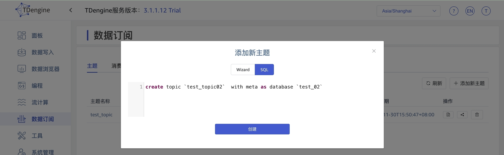

第二步 页面出现以下记录，则证明创建成功。
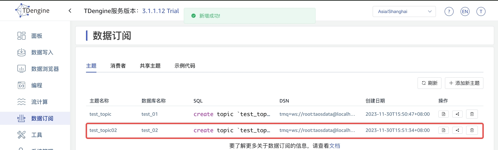

### 共享主题

在“共享主题”标签页，在“主题“下拉列表中，选择将要分享的主题；
点击“添加可消费该主题的用户”按钮，然后在“用户名”下拉列表中选择相应的用户，然后点击“新增”，即可将该主题分享给此用户

### 查看消费者信息
通过执行下一节“示例代码”所述的“完整实例”，即可消费共享主题
在“消费者”标签页，可查看到消费者的有关信息

### 示例代码
在“示例代码”标签页，在“主题“下拉列表中，选择相应的主题；
选择您熟悉的语言，然后您可以阅读以及使用这部分示例代码用来”创建消费“，”订阅主题“，通过执行 “完整实例”中的程序即可消费共享主题
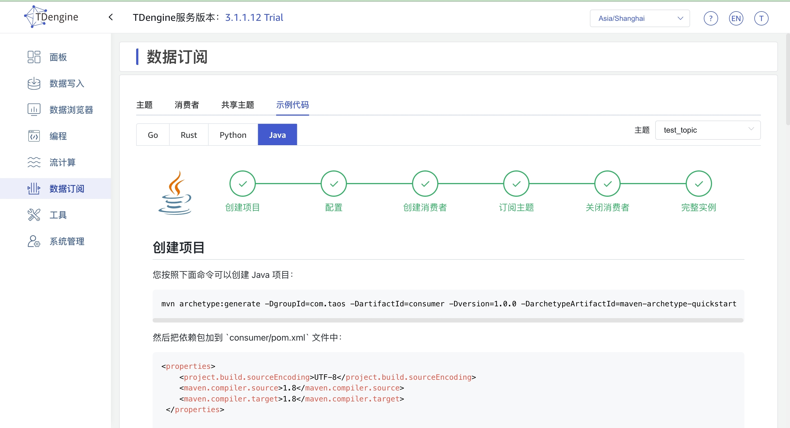

## 工具

通过 “工具” 页面，用户可以了解如下 TDengine 周边工具的使用方法。
- TDengine CLI。
- taosBenchmark。
- taosDump。
- TDengine 与 BI 工具的集成，例如 Google Data Studio、Power BI、永洪 BI 等。
- TDengine 与 Grafana、Seeq 的集成。

## 系统管理

点击功能列表中的“系统管理”入口，可以创建用户、对用户进行访问授权、以及删除用户，还能够对当前所管理的集群中的数据进行备份和恢复，也可以配置一个远程 TDengine 的地址进行数据同步，同时也提供了集群信息和许可证的信息以及代理信息以供查看。系统管理菜单只有 root 用户才有权限看到。

### 用户管理

点击“系统管理”后，默认会进入“用户”标签页。
在用户列表，可以查看系统中已存在的用户及其创建时间，并可以对用户进行启用、禁用，编辑（包括修改密码，数据库的读写权限等），删除等操作。
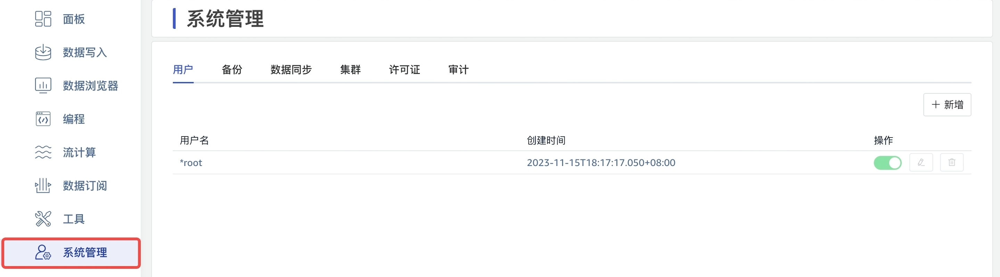

第一步 点击用户列表右上方的“+新增”按钮，即可打开“新增用户”对话框，填写新增用户的信息，点击“确定”按钮：
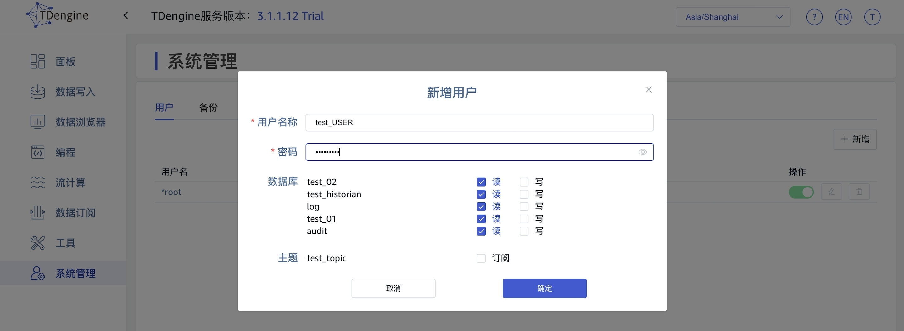

第二步 查看新增的用户
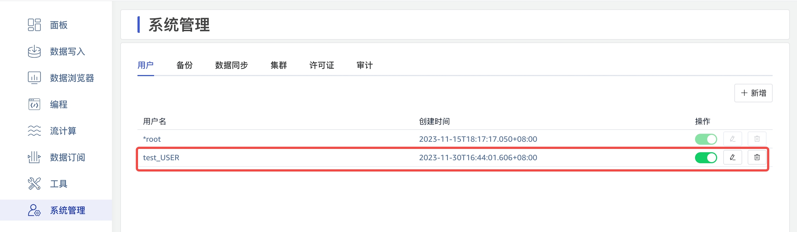

### 导入用户/权限
点击 导入按钮，弹出导入用户/权限表单填写信息，点击确定提交表单

- 服务地址：从指定集群导入（taosAdapter 访问地址，如 http://127.0.0.1:6041)
- 密码：源集群 root 密码
- 导入内容：
  - 用户名和密码：（实际包含 sysinfo/super 等用户基本信息）
  - 权限
  - 白名单

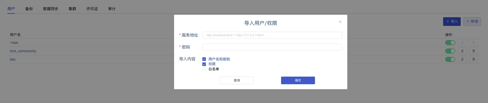。