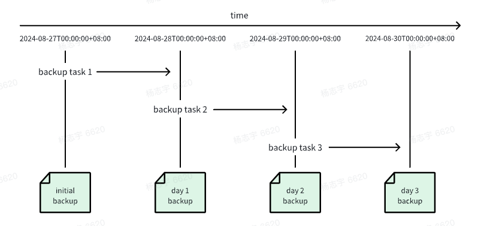

为了防止数据丢失、误删操作，TDengine 提供全面的数据备份、恢复、容错、异地数据实时同步等功能，以保证数据存储的安全。本节简要说明备份和恢复功能。

# 1. 基于 taosdump 进行数据备份恢复

taosdump 是一个开源工具，用于支持从运行中的 TDengine 集群备份数据并将备份的数据恢复到相同或另一个正在运行的 TDengine 集群中。taosdump 可以将数据库作为逻辑数据单元进行备份，也可以对数据库中指定时间段内的数据记录进行备份。在使用 taosdump 时，可以指定数据备份的目录路径。如果不指定目录路径，taosdump 将默认将数据备份到当前目录。

以下为 taosdump 执行数据备份的使用示例。

```shell
taosdump -h localhost -P 6030 -D dbname -o /file/path
```

执行上述命令后，taosdump 会连接 localhost:6030 所在的 TDengine 集群，查询数据库 dbname 中的所有数据，并将数据备份到 /file/path 下。

在使用 taosdump 时，如果指定的存储路径已经包含数据文件，taosdump 会提示用户并立即退出，以避免数据被覆盖。这意味着同一存储路径只能用于一次备份。如果你看到相关提示，请谨慎操作，以免误操作导致数据丢失。

要将本地指定文件路径中的数据文件恢复到正在运行的 TDengine 集群中，可以通过指定命令行参数和数据文件所在路径来执行 taosdump 命令。以下为 taosdump 执行数据恢复的示例代码。

```shell
taosdump -i /file/path -h localhost -P 6030
```

执行上述命令后，taosdump 会连接 localhost:6030 所在的 TDengine 集群，并将 /file/path 下的数据文件恢复到 TDengine 集群中。

# 2. 基于 TDengine Enterprise 进行数据备份恢复

## 2.1. 概述

基于 TDengine 的数据订阅功能，TDengine Enterprise 实现了数据的增量备份和恢复。用户可以通过 taosExplorer 对 TDengine
集群进行备份和恢复。

TDengine Enterprise 的备份和恢复功能包括以下几个概念：

1. 增量数据备份：基于 TDengine 的数据订阅功能，将**备份对象**的所有数据变更（包括：新增、修改、删除、元数据变更等）记录下来，生成备份文件。
2. 数据恢复：使用增量数据备份生成的备份文件，将**备份对象**恢复到指定的时间点。
3. 备份对象：用户备份的对象，可以是一个**数据库**，也可以是一个**超级表**。
4. 备份计划：用户为备份对象创建一个周期性执行的备份任务。备份计划从指定的时间点开始，以**备份周期**为间隔，周期性地执行备份任务。备份任务每次生成一个**备份点**。
5. 备份点：每次执行备份任务，生成一组备份文件，它们对应一个时间点，称为**备份点**。第一个备份点称为**初始备份点**。
6. 恢复任务：用户选择备份计划的某个备份点，创建一个恢复任务。恢复任务从**初始备份点**开始，逐个回放**备份文件**中的数据变更，直到指定的备份点结束。



以上图为例：

1. 用户创建了一个**备份计划**，从 2024-08-27 00:00:00 开始，每隔 1 天执行一次**备份任务**。
2. 在 2024-08-27 00:00:00 执行了第一次备份任务，生成了一个**初始备份点**。
3. 之后，每隔 1 天执行一次备份任务，生成了多个**备份点**。
4. 用户可以选择某个**备份点**，创建一个**恢复任务**。
5. 恢复任务会从初始备份点开始，逐个应用备份点，恢复到指定的备份点。

## 2.2. 数据备份

通过浏览器访问 taosExplorer 服务，访问地址通常为 TDengine 集群所在 IP 地址的端口 6060，如 `http://localhost:6060`。在
taosExplorer 服务页面中，进入“系统管理 - 备份”页面，在“备份计划”标签页下，点击“创建备份计划”，填写备份计划的相关信息。

需要填写的信息包括：

1. 数据库：需要备份的数据库名称。一个备份计划只能备份一个数据库/超级表。
2. 超级表：需要备份的超级表名称。如果不填写，则备份整个数据库。
3. 下次执行时间：首次执行备份任务的日期时间。
4. 备份周期：备份点之间的时间间隔。注意：备份周期必须小于数据库的 WAL_RETENTION_PERIOD 参数值。
5. 错误重试次数：对于可通过重试解决的错误，系统会按照此次数进行重试。
6. 错误重试间隔：每次重试之间的时间间隔。
7. 目录：存储备份文件的目录。
8. 备份文件大小：备份文件的大小限制。当备份文件大小达到此限制时，会自动创建新的备份文件。
9. 文件压缩等级：备份文件的压缩等级。支持：最快速度、最佳压缩比、兼具速度和压缩比。

用户可以通过开启 S3 转储，将备份文件上传至 S3 存储服务上。开启 S3 转储，需要填写以下信息：

1. S3 节点：S3 节点的地址。
2. 访问密钥 ID：访问密钥 ID。
3. 访问密钥：访问密钥。
4. 存储桶：存储桶名称。
5. 区域：存储桶所在的区域。
6. 对象前缀：备份文件的对象前缀，类似于 S3 上的目录。
7. 本地备份文件的保留时长：本地备份的保留时间，所有早于`当前时间 - backup_retention_period`的文件都需要上传到 S3。
8. 本地备份文件的保留个数：本地备份文件的保留个数，本地只保留最新的`backup_retention_size`个备份文件。

创建成功后，备份计划会开始按照配置的参数运行。在“备份计划”下的列表中，可以查看已创建的备份计划。

备份计划支持以下操作：

1. 查看：显示备份计划的详细信息。
2. 修改：修改备份计划的配置。修改备份计划的配置后，当前运行的备份任务会先停止，然后按照新的配置重新运行。
3. 复制：以选中的备份计划为模版，创建新的备份计划。除了数据库和超级表需要用户选择以外，其他配置项和被复制的计划相同。
4. 删除：删除备份计划。删除备份计划时，可以选择是否删除关联的备份文件。
5. 指标：查看备份计划的统计指标。
6. 查看备份点：查看和备份计划关联的所有备份点。

## 2.3. 备份文件

在“备份文件”列表中，可以查看备份文件的详细信息。

## 2.4. 数据恢复

在“备份文件”列表中，选择一个备份点，可以创建一个恢复任务，数据库恢复到指定的时间。

在“恢复任务”列表中，可以查看已创建的恢复任务。恢复任务可以终止。

# 3. 常见错误排查

## 3.1. 端口访问异常

如果任务启动失败并报以下错误：

```text
Error: tmq to td task exec error

Caused by:
    [0x000B] Unable to establish connection
```

产生原因是与数据源的端口链接异常，需检查数据源 FQDN 是否联通及端口 6030 是否可正常访问。

## 3.2. 连接异常

如果使用 WebSocket 连接，任务启动失败并报以下错误：

```text
Error: tmq to td task exec error

Caused by:
    0: WebSocket internal error: IO error: failed to lookup address information: Temporary failure in name resolution
    1: IO error: failed to lookup address information: Temporary failure in name resolution
    2: failed to lookup address information: Temporary failure in name resolution
```

使用 WebSocket 连接时可能遇到多种错误类型，错误信息可以在”Caused by“后查看，以下是几种可能的错误：

- "Temporary failure in name resolution": DNS 解析错误，检查 IP 或 FQDN 是否能够正常访问。
- "IO error: Connection refused (os error 111)": 端口访问失败，检查端口是否配置正确或是否已开启和可访问。
- "IO error: received corrupt message": 消息解析失败，可能是使用了 wss 方式启用了 SSL，但源端口不支持。
- "HTTP error: *": 可能连接到错误的 taosAdapter 端口或 LSB/Nginx/Proxy 配置错误。
- "WebSocket protocol error: Handshake not finished": WebSocket 连接错误，通常是因为配置的端口不正确。

## 3.3. 任务启动失败

如果任务启动失败并报以下错误：

```text
Error: tmq to td task exec error

Caused by:
    [0x038C] WAL retention period is zero
```

是由于源端数据库 WAL 配置错误，无法订阅。

解决方式：
修改数据 WAL 配置：

```sql
alter
database test wal_retention_period 3600;
```
