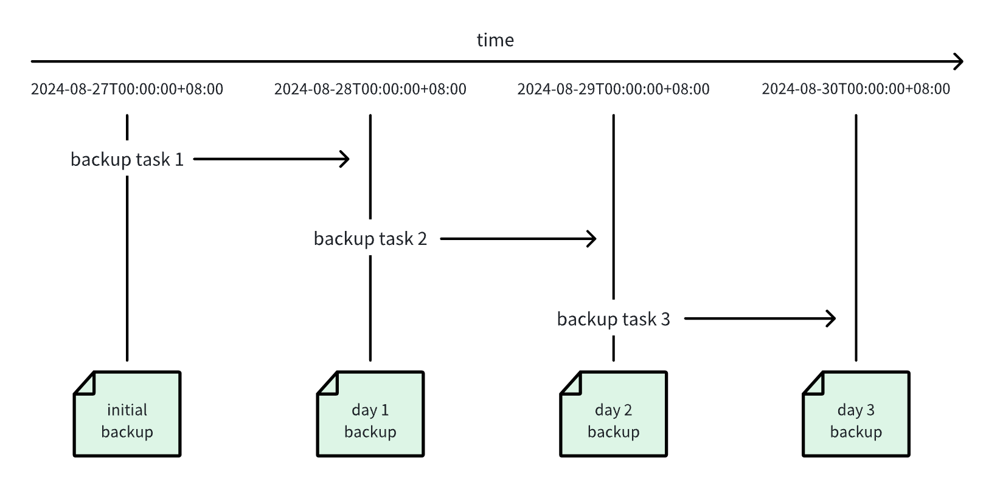

为了防止数据丢失、误删操作，TDengine 提供全面的数据备份、恢复、容错、异地数据实时同步等功能，以保证数据存储的安全。本节简要说明备份和恢复功能。

# 1. 基于 taosdump 进行数据备份恢复

taosdump 是一个开源工具，用于支持从运行中的 TDengine 集群备份数据并将备份的数据恢复到相同或另一个正在运行的 TDengine
集群中。taosdump 可以将数据库作为逻辑数据单元进行备份，也可以对数据库中指定时间段内的数据记录进行备份。在使用taosdump
时，可以指定数据备份的目录路径。如果不指定目录路径，taosdump 将默认将数据备份到当前目录。

以下为 taosdump 执行数据备份的使用示例。

```shell
taosdump -h localhost -P 6030 -D dbname -o /file/path
```

执行上述命令后，taosdump 会连接 localhost:6030 所在的 TDengine 集群，查询数据库 dbname 中的所有数据，并将数据备份到 /f
ile/path 下。

在使用 taosdump 时，如果指定的存储路径已经包含数据文件，taosdump
会提示用户并立即退出，以避免数据被覆盖。这意味着同一存储路径只能用于一次备份。如果你看到相关提示，请谨慎操作，以免误操作导致数据丢失。

要将本地指定文件路径中的数据文件恢复到正在运行的 TDengine 集群中，可以通过指定命令行参数和数据文件所在路径来执行 taosdump
命令。以下为 taosdump 执行数据恢复的示例代码。

```shell
taosdump -i /file/path -h localhost -P 6030
```

执行上述命令后，taosdump 会连接 localhost:6030 所在的 TDengine 集群，并将 /file/path 下的数据文件恢复到 TDengine 集群中。

# 2. 基于 TDengine Enterprise 进行数据备份恢复

## 2.1. 概念

基于 TDengine 的数据订阅功能，TDengine Enterprise 实现了数据的增量备份和恢复。用户可以通过 taosExplorer 对 TDengine
集群进行备份和恢复。

TDengine Enterprise 的备份和恢复功能包括以下几个概念：

1. 备份对象：用户可以对一个数据库，或者一个超级表进行备份。
2. 备份计划：用户可以为某个备份对象创建一个备份计划。备份计划从指定的时间点开始，周期性的执行一次备份任务，并生成一组备份文件。
3. 备份点：每执行一次备份任务，生成一组备份文件，它们对应一个时间点，称为**备份点**。第一个备份点称为**初始备份点**。
4. 备份文件：多个备份点，组成备份计划的备份文件。
5. 恢复任务：用户可以选择备份计划的某个备份点，创建一个恢复任务。恢复任务会从初始备份点开始，逐个应用备份点，恢复到指定的备份点。



以上面的图为例：

1. 用户创建了一个备份计划，从 2024-08-27 00:00:00 开始，每隔 1 天执行一次备份任务。
2. 在 2024-08-27 00:00:00 执行了第一次备份任务，生成了一个备份点。
3. 之后，每隔 1 天执行一次备份任务，生成了多个备份点，组成了备份文件。
4. 用户可以选择某个备份点，创建一个恢复任务，恢复到指定的备份点。
5. 恢复任务会从初始备份点开始，逐个应用备份点，恢复到指定的备份点。

## 2.2. 备份计划

### 2.1.1. 创建

1. 通过浏览器访问 taosExplorer 服务，访问地址通常为 TDengine 集群所在 IP 地址的端口 6060，如 http://localhost:6060。
2. 在 taosExplorer 服务页面中，进入“系统管理 - 备份”页面，点击“创建备份计划”按钮。


3. 在弹出的“创建备份计划”表单中，填写备份计划的相关信息。


需要填写的信息包括：

* 数据库：需要备份的数据库名称。一个备份计划只能备份一个数据库/超级表。
* 超级表：需要备份的超级表名称。如果不填写，则备份整个数据库。
* 下次执行时间：首次执行备份任务的日期时间。
* 备份周期：备份点之间的时间间隔。注意：备份周期必须大于数据库的 WAL_RETENTION_PERIOD 参数值。
* 错误重试次数：对于可通过重试解决的错误，系统会按照此次数进行重试。
* 错误重试间隔：每次重试之间的时间间隔。
* 目录：存储备份文件的目录。
* 备份文件大小：备份文件的大小限制。当备份文件大小达到此限制时，会自动创建新的备份文件。
* 文件压缩等级：备份文件的压缩等级。支持：最快速度、最佳压缩比、兼具速度和压缩比。

创建成功后，备份计划会开始按照配置的参数运行。

### 2.1.2. 查看

在“备份计划”下的列表中，可以查看已创建的备份计划。


点击“操作”中的“查看”按钮，可以查看备份计划的详细信息。


### 2.1.3. 修改

点击“操作”中的“修改”按钮，可以修改备份计划的配置。


修改备份计划的配置后，当前运行的备份任务会先停止，然后按照新的配置重新运行。

### 2.1.4. 复制

点击“操作”中的“复制”按钮，可以复制备份计划。


除了数据库和超级表被置为空外，其他配置项和被复制的计划相同。用户点击“确认”后，创建一个新的备份计划。

### 2.1.5. 删除

在操作中点击关闭按钮，可以停止当前备份计划。点击“操作”中的“删除”按钮，可以删除备份计划。


删除备份计划时，可以选择，是否删除关联的备份文件。

## 2.2. 备份文件

### 2.2.1. 查看

在备份计划列表中，选择要一个备份计划。在“备份文件”列中，点击“查看”按钮。可以查看和备份计划的所有备份点。


在备份文件列表中，可以查看备份文件的详细信息。


## 2.3. 恢复任务

### 2.3.1. 创建

在备份文件列表中，点击“操作”中的“恢复”按钮，可以创建一个恢复任务。


在弹出的对话框中，选择使用哪个备份点开始恢复，默认为最早的备份点。点击“确定”后，创建恢复任务，并跳转至“恢复任务”列表。

### 2.3.2. 查看

在“恢复任务”列表中，可以查看已创建的恢复任务。


恢复任务可以终止。点击“操作”中的开关，可以终止当前恢复任务。

# 3. 常见错误排查

## 3.1. 端口访问异常

如果任务启动失败并报以下错误：

```text
Error: tmq to td task exec error

Caused by:
    [0x000B] Unable to establish connection
```

产生原因是与数据源的端口链接异常，需检查数据源 FQDN 是否联通及端口 6030 是否可正常访问。

## 3.2. 连接异常

如果使用 WebSocket 连接，任务启动失败并报以下错误：

```text
Error: tmq to td task exec error

Caused by:
    0: WebSocket internal error: IO error: failed to lookup address information: Temporary failure in name resolution
    1: IO error: failed to lookup address information: Temporary failure in name resolution
    2: failed to lookup address information: Temporary failure in name resolution
```

使用 WebSocket 连接时可能遇到多种错误类型，错误信息可以在 ”Caused by“ 后查看，以下是几种可能的错误：

- "Temporary failure in name resolution": DNS 解析错误，检查 IP 或 FQDN 是否能够正常访问。
- "IO error: Connection refused (os error 111)": 端口访问失败，检查端口是否配置正确或是否已开启和可访问。
- "IO error: received corrupt message": 消息解析失败，可能是使用了 wss 方式启用了 SSL，但源端口不支持。
- "HTTP error: *": 可能连接到错误的 taosAdapter 端口或 LSB/Nginx/Proxy 配置错误。
- "WebSocket protocol error: Handshake not finished": WebSocket 连接错误，通常是因为配置的端口不正确。

## 3.3. 任务启动失败

如果任务启动失败并报以下错误：

```text
Error: tmq to td task exec error

Caused by:
    [0x038C] WAL retention period is zero
```

是由于源端数据库 WAL 配置错误，无法订阅。

解决方式：
修改数据 WAL 配置：

```sql
alter
database test wal_retention_period 3600;
```