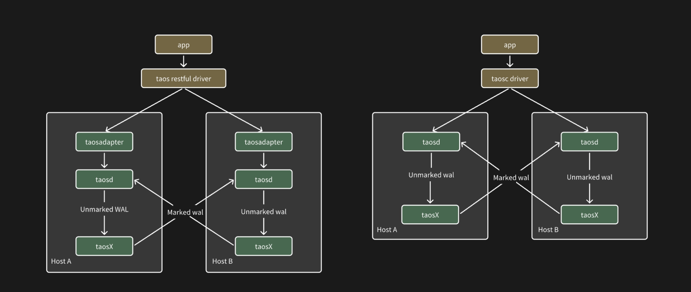

本节介绍 TDengine 双活系统的配置和使用。

1. 部分用户因为部署环境的特殊性只能部署两台服务器，同时希望实现一定的服务高可用和数据高可靠。本文主要描述基于数据复制和客户端 Failover 两项关键技术的 TDengine 双活系统的产品行为，包括双活系统的架构、配置、运维等。TDengine 双活既可以用于前面所述资源受限的环境，也可用于在两套 TDengine 集群（不限资源）之间的灾备场景。双活是 TDengine Enterprise 特有功能，在 3.3.0.0 版本中第一次发布，建议使用最新版本。

2. 双活系统的定义是：业务系统中有且仅有两台服务器，其上分别部署一套服务，在业务层看来这两台机器和两套服务是一个完整的系统，对其中的细节业务层不需要感知。双活中的两个节点通常被称为 Master-Slave，意为”主从“或”主备“，本文档中可能会出现混用的情况。

3. TDengine 双活系统的部署架构图如下, 其中涉及到三个关键点：
1. 由 Client Driver 实现对双系统的 Failover，即主节点宕机时的主从切换
2. 由 taosX 从（当前的）主节点到从节点实现数据复制
3. 由数据订阅的写接口在写入复制过来的数据时在 WAL 中加入特殊标记，由数据订阅的读接口在读取数据时自动过滤掉带有该特殊标记的数据，避免重复复制形成 infinite loop

注：下图中仅以一个单机版 TDengine 作为示例，但在实际部署中图中的一个 Host 也可以被任意节点数量的 TDengine 集群代替。



## 配置

### 集群配置

双活对 TDengine 集群本身的配置没有任何要求，但对要在双活系统之间同步的数据库的 WAL 保留时长有一定要求，WAL 保留时长越大双活系统的容错率越高；如果备节点宕机时长超过主节点上的 WAL 保留时长，必定会导致备节点上有数据缺失；如果备节点宕机时长虽未超过主节点上的 WAL 保留时长，也有一定概率丢失数据，取决于接近的程度以及数据同步的速度。

### 客户端配置

目前只有 Java 连接器在 WebSocket 连接模式下支持双活，其配置示例如下

```java
url = "jdbc:TAOS-RS://" + host + ":6041/?user=root&password=taosdata";
Properties properties = new Properties();
properties.setProperty(TSDBDriver.PROPERTY_KEY_BATCH_LOAD, "true");
properties.setProperty(TSDBDriver.PROPERTY_KEY_SLAVE_CLUSTER_HOST, "192.168.1.11");
properties.setProperty(TSDBDriver.PROPERTY_KEY_SLAVE_CLUSTER_PORT, "6041");
properties.setProperty(TSDBDriver.PROPERTY_KEY_ENABLE_AUTO_RECONNECT, "true");
properties.setProperty(TSDBDriver.PROPERTY_KEY_RECONNECT_INTERVAL_MS, "2000");
properties.setProperty(TSDBDriver.PROPERTY_KEY_RECONNECT_RETRY_COUNT, "3");
connection = DriverManager.getConnection(url, properties);
```

其中的配置属性及含义如下表

| 属性名 | 含义 | 
| ----------------- | ------------------ |
| PROPERTY_KEY_SLAVE_CLUSTER_HOST | 第二节点的主机名或者 ip，默认空 | 
| PROPERTY_KEY_SLAVE_CLUSTER_PORT | 第二节点的端口号，默认空 | 
| PROPERTY_KEY_ENABLE_AUTO_RECONNECT | 是否启用自动重连。仅在使用 Websocket 连接时生效。true: 启用，false: 不启用。默认为 false。双活场景下请设置为 true |
| PROPERTY_KEY_RECONNECT_INTERVAL_MS | 重连的时间间隔，单位毫秒：默认 2000 毫秒，也就是 2 秒；最小值为 0， 表示立即重试；最大值不做限制 |
| PROPERTY_KEY_RECONNECT_RETRY_COUNT | 每节点最多重试次数：默认值为 3；最小值为 0，表示不进行重试；最大值不做限制 |

### 约束条件

1. 应用程序不能使用订阅接口，如果配置了双活参数会导致创建消费者失败。
2. 不建议应用程序使用参数绑定的写入和查询方式，如果使用应用需要自己解决连接切换后的相关对象失效问题。
3. 在双活场景下，不建议用户应用程序显示调用 use database，应该在连接参数中指定 database。
4. 双活的两端集群必须同构（即数据库的命名和所有配置参数以及用户名密码和权限设置等完全相同）
5. 只支持 WebSocket 连接模式

## 运维命令

TDengine 双活系统提供了一些运维工具能够自动化 taosX 的配置、一键启动、重启和停止（单机环境上的）所有双活组件。

### 启动双活任务

```shell
taosx replica start
```

该命令用于启动双活中的数据复制任务，其所指定的两台主机上的 taosd 和 taosX 均为在线状态。

1. 方法一

```shell
    - taosx replica start -f source_endpoint -t sink_endpoint [database...] 
```

在本机器所在的 taosx 服务中建立从 source_endpoint 到 sink_endpoint 的同步任务。运行该命令成功后，将打印 replica ID 到控制台（后续记为 id）。
其中输入参数 source_endpoint 和 sink_endpoiint 为必须，形如 td2:6030 ，示例如下

```shell
taosx replica start -f td1:6030 -t td2:6030 
```
该示例命令会自动创建除 information_schema、performance_schema、log、audit 库之外的同步任务。可以使用 `http://td2:6041` 指定该 endpoint 使用 websocket 接口（默认是原生接口）。也可以指定数据库同步：taosx replica start -f td1:6030 -t td2:6030 db1 仅创建指定的数据库同步任务。

2. 方法二

```shell
taosx replica start -i id [database...]
```

使用上面已经创建的 Replica ID (id) 以在该同步任务中增加其它数据库。

注意：
- 多次使用该命令，不会创建重复任务，仅将所指定的数据库增加到相应任务中。
- replica id 在一个 taosX 实例内是全局唯一的，与 source/sink 的组合无关
- 为便于记忆，replica id 为一个随机常用单词，系统自动将 source/sink 组合对应到一个词库中取得一个唯一可用单词。

### 查看任务状态

```shell
taosx replica status [id...]
```

返回当前机器上创建的双活同步任务列表和状态。可以指定一个或多个 replica id 获取其任务列表和状态。输出示例如下：

```shell
+---------+----------+----------+----------+------+-------------+----------------+
| replica | task | source   | sink     | database | status      | note           |
+---------+----------+----------+----------+------+-------------+----------------+
| a       | 2    | td1:6030 | td2:6030 | opc      | running     |                |
| a       | 3    | td2:6030 | td2:6030 | test     | interrupted | Error reason |
```

### 停止双活任务

```shell
taosx replica stop id [db...]
```

该命令作用如下：
- 停止指定 Replica ID 下所有或指定数据库的双副本同步任务。
- 使用 `taosx replica stop id1 db1` 表示停止 id1 replica 下 db1的同步任务。

### 重启双活任务

```shell
taosx replica restart id [db...]
```

该命令作用如下：
- 重启指定 Replica ID 下所有或指定数据库的双副本同步任务。
- 使用 `taosx replica start id1 db1` 仅重启指定数据库 db1的同步任务。

### 查看同步进度

```shell
taosx replica diff id [db....]
```

该命令能够输出当前双副本同步任务中订阅的 Offset  与最新 WAL 的差值（不代表行数）， 例如：

```shell
+---------+----------+----------+----------+-----------+---------+---------+------+
| replica | database | source   | sink     | vgroup_id | current | latest  | diff |
+---------+----------+----------+----------+-----------+---------+---------+------+
| a       | opc      | td1:6030 | td2:6030 | 2         | 17600   | 17600   | 0    |
| ad       | opc      | td2:6030 | td2:6030 | 3         | 17600   | 17600   | 0    |
``` 

### 删除双活任务

```shell
taosx replica remove id [--force]
```

删除当前所有双活同步任务。正常情况下要想删除同步任务，需要先 stop 该任务；但当 --force 启用时，会强制停止并清除任务。

### 推荐使用步骤

1. 假定在机器 A 上运行，需要首先使用 taosx replica start 来配置 taosX，其输入参数是待同步的源端和目标端服务器地址 ，在完成配置后会自动启动同步服务和任务。此处假定 taosx 服务使用标准端口，同步任务使用原生连接。
2. 在机器 B 上的步骤相同
3. 在完成对两台机器的服务启动后，双活系统即可提供服务
4. 在已经完成配置后，如果想要再次启动双活系统，请使用 restart 子命

## 异常情况

如果宕机恢复时间超出了 WAL 的保存时长，可能会出现丢数据的情况。此时双活系统中自带的 taosX 服务的自动数据同步无法处理。需要人工判断出哪些数据丢失，然后启动额外的 taosX 任务来复制丢失的数据。
