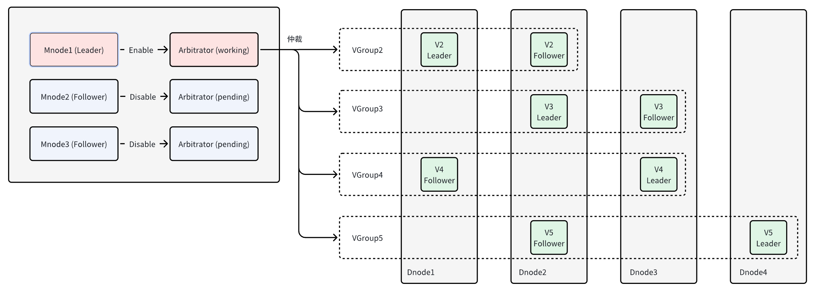

部分用户期望在保证一定可靠性、可用性条件下，尽可能压缩部署成本。为此，TDengine TSDB 提出基于 Arbitrator 的双副本方案，可提供集群中**只有单个服务故障且不出现连续故障**的容错能力。双副本方案是 TDengine TSDB Enterprise 特有功能，在 3.3.0.0 版本中第一次发布，建议使用最新版本。

双副本选主由高可用的 Mnode 提供仲裁服务，不由 Raft 组内决定。

1. Arbitrator：仲裁服务，不存储数据，VGroup 因某一 Vnode 故障而无法提供服务时，Arbitrator 可根据数据同步情况指定 VGroup 内另一 Vnode 成为 Assigned Leader
2. AssignedLeader：被强制设置为 Leader 的 Vnode，无论其他副本 Vnode 是否存活，均可一直响应用户请求



## 集群配置

双副本要求集群至少配置三个节点，基本部署与配置步骤如下：

1. 确定服务器节点数量、主机名或域名，配置好所有节点的域名解析：DNS 或 /etc/hosts
2. 各节点分别安装 TDengine TSDB **企业版**服务端安装包，按需编辑好各节点 taos.cfg
3. 可选择其中一个节点仅提供仲裁服务（部署 Mnode），将 SupportVnodes 参数设置为 0，表示不存储时序数据；该占用资源较少，仅需 1~2 核，且可与其他应用共用
4. 启动各节点 taosd 服务，其他服务可按需启动（taosadapter/taosx/taoskeeper/taos-explorer)

## 约束条件

1. 最小配置的服务器节点数为 2+1 个，其中两个数据节点，一个仲裁节点
2. 双副本为数据库建库参数，不同数据库可按需选择副本数
3. 支持 TDengine TSDB 集群的完整特性，包括：读缓存、数据订阅、流计算等
4. 支持 TDengine TSDB 所有语言连接器以及连接方式
5. 支持单副本与双副本之间切换（前提是节点数量满足需求、各节点可用 Vnode 数量/内存/存储空间足够）
6. 不支持双副本与三副本之间的切换
7. 不支持双副本切换为双活，除非另外部署一套实例与当前实例组成双活方案

## 运维命令

### 创建集群

创建三节点的集群

```sql
CREATE dnode <dnode_ep> port <dnode_port>;
CREATE dnode <dnode_ep> port <dnode_port>;
```

创建三副本的 Mnode，保证 Mnode 高可用，确保仲裁服务的高可用

```sql
CREATE mnode on dnode <dnode_id>;
CREATE mnode on dnode <dnode_id>;
```

### 数据库创建

按需创建双副本数据库

```sql
create database <dbname> replica 2 vgroups xx buffer xx ...
```

### 修改数据库副本数

创建了单副本数据库后，希望改为双副本时，可通过 alter 命令来实现，反之亦然

```sql
alter database <dbname> replica 2|1
```

## 异常情况

| 异常场景 | 集群状态 |
| ------- | ------ |
| 没有 Vnode 发生故障：Arbitrator 故障（Mnode 宕机节点超过一个，导致 Mnode 无法选主）| **持续提供服务** |
| 仅一个 Vnode 故障：VGroup 已经达成同步后，某一个 Vnode 才发生故障的                |  **持续提供服务** |
| 仅一个 Vnode 故障：2 个 Vnode 同时故障，故障前 VGroup 达成同步，但是只有一个 Vnode 从故障中恢复服务，另一个 Vnode 服务故障  |  **通过下面的命令，强制指定 leader, 继续提供服务** |
| 仅一个 Vnode 故障：离线 Vnode 启动后，VGroup 未达成同步前，另一个 Vnode 服务故障的  |  **无法提供服务** |
| 两个 Vnode 都发生故障                                                         |  **无法提供服务** |

```sql
ASSIGN LEADER FORCE;
```

## 常见问题

### 1. 创建双副本数据库或修改为双副本时，报错：DB error: Out of dnodes

- 服务器节点数不足：原因是，数据服务器节点数少于两个。
- 解决方案：增加服务器节点数量，满足最低要求。

### 2. 创建双副本数据库或 split vgroup 时，报错：DB error: Vnodes exhausted

- 服务器可用 Vnodes 不足：原因是某些服务器节点可用 Vnodes 数少于建库或 split vgroup 的需求数。
- 解决方案：调整服务器 CPU 数量、SupportVnodes 数量，满足建库要求。
