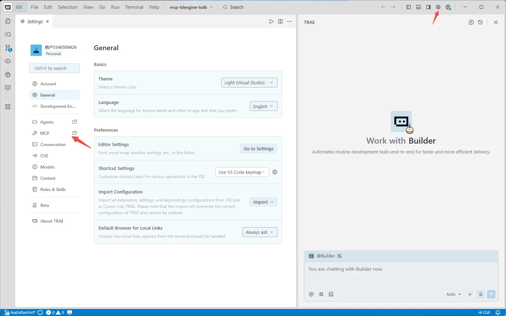
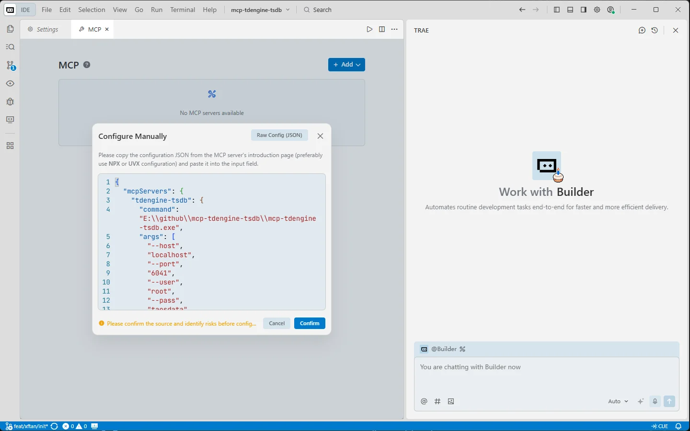
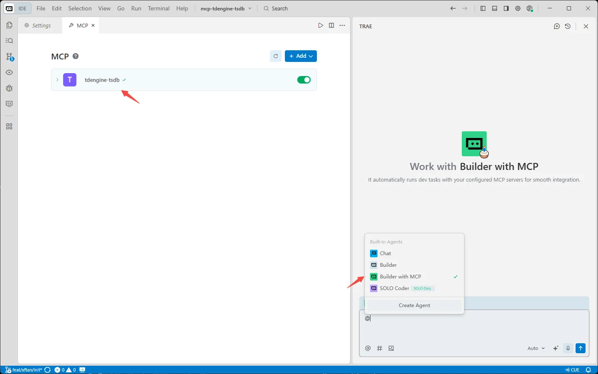
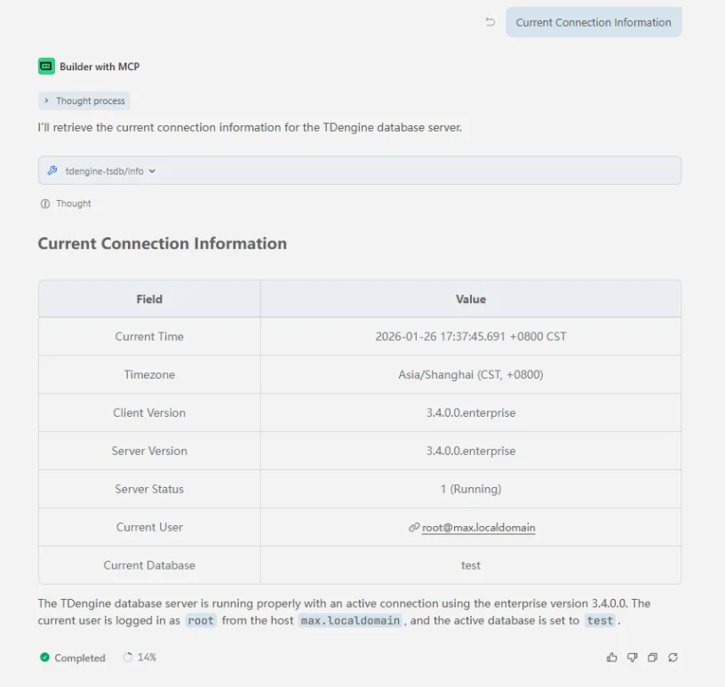
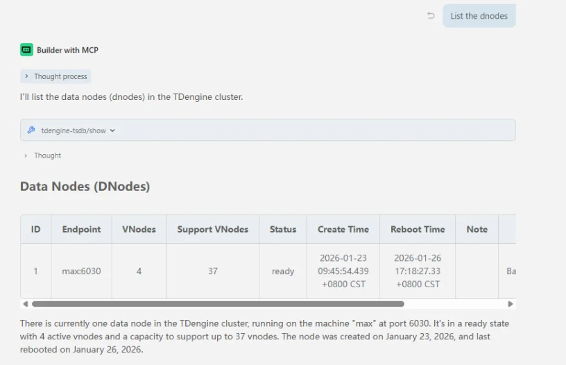
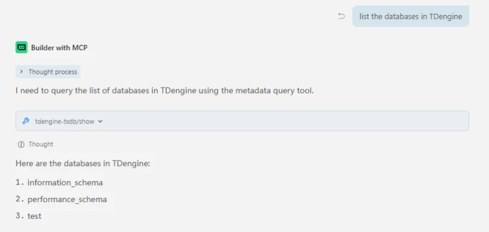
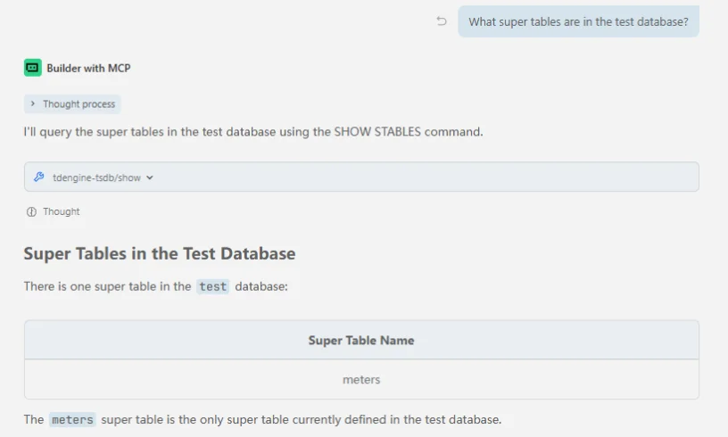
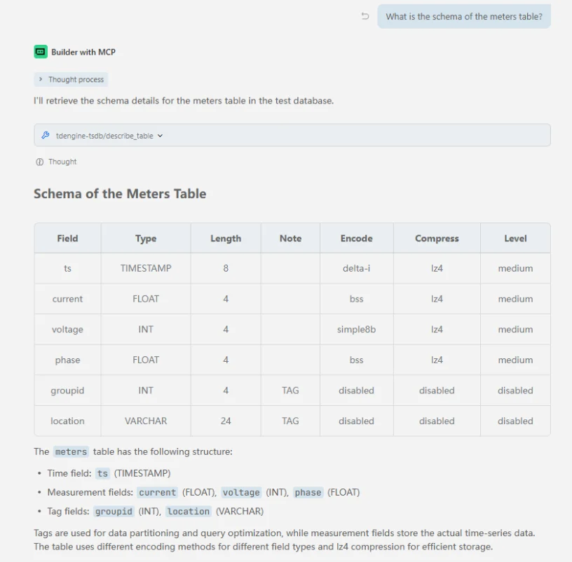
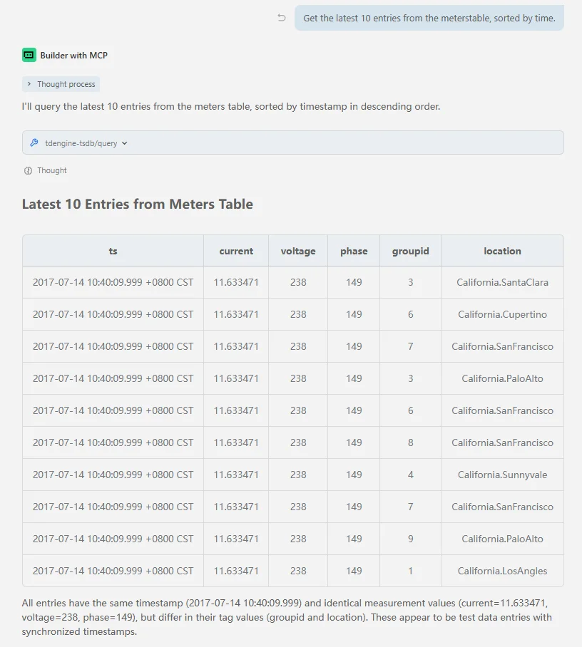

mcp-tdengine-tsdb（MCP Server for TDengine）提供一套只读工具集，用于查询 TDengine 数据、查看元数据与获取服务信息；不能执行数据写入、删除或表结构变更。

mcp-tdengine-tsdb 目前支持 Windows x64、Linux x64/arm64 和 macOS x64/arm64。

连接的 TDengine 服务器建议为 `v3.3.6.0` 及以上；自 `v3.4.1.0` 起，MCP Server 也可随 TSDB 发行包一并提供。

## 功能

mcp-tdengine-tsdb 提供以下工具：

- **查询工具（`query`）**：执行 TDengine `SELECT` 查询并返回结果
- **显示工具（`show`）**：执行各类 `SHOW` 命令查询元数据，支持多种参数选项
- **信息工具（`info`）**：提供 TDengine 服务器信息，包括版本、状态等
- **描述表工具（`describe_table`）**：描述指定表的结构
- **预定义 schema 获取工具（`get_schema_overview`）**：获取数据库结构概览；配置 `schema_overview_file` 后，将读取文件内容并直接返回

## 工具获取

从 [mcp-tdengine-tsdb Releases](https://github.com/taosdata/mcp-tdengine-tsdb/releases) 获取最新 MCP Server，选择对应的系统和架构下载。

## 配置

mcp-tdengine-tsdb 支持通过命令行参数或环境变量配置连接信息，命令行参数优先级高于环境变量。可用参数如下：

| 参数 | 环境变量 | 默认值 | 描述 |
| ------------------------ | --- | --- | --- |
| `--host`                 | `TDENGINE_HOST` | `localhost` | TDengine 主机名 |
| `--port`                 | `TDENGINE_PORT` | `6041` | TDengine 端口（taosAdapter 端口） |
| `--user`                 | `TDENGINE_USER` | `root` | TDengine 用户名 |
| `--pass`                 | `TDENGINE_PASS` | `taosdata` | TDengine 密码 |
| `--db`                   | `TDENGINE_DB` | | TDengine 数据库名 |
| `--dsn`                  | `TDENGINE_DSN` | | TDengine 数据源名称（DSN），优先级高于单独的连接参数 |
| `--schema_overview_file` | `TDENGINE_SCHEMA_OVERVIEW_FILE` | | 预定义数据库 schema 概览文件路径 |

连接云服务时可通过 DSN 配置，例如：

```bash
"--dsn=wss(gw.us-west-2.aws.cloud.tdengine.com:443)/test?readTimeout=1m&token=xxxxxxxx"
```

## 添加 MCP

下载 mcp-tdengine-tsdb 后将其放到任意目录，然后在各个 AI 助手中配置 MCP Server 路径和连接参数。

### 以 Trae 为例添加 MCP

1. 在 Trae AI 对话窗口右上角，点击设置图标 → MCP，打开 MCP 窗口。

   

2. 点击手动添加后填入以下内容：将 `command` 改为 mcp-tdengine-tsdb 所在全路径（Windows 注意路径转义）；`db` 填写要操作的数据库名称。确认后即可通过 MCP Server 进行数据查询等只读操作。

   ```json
   {
     "mcpServers": {
       "tdengine-tsdb": {
         "command": "E:\\github\\mcp-tdengine-tsdb\\mcp-tdengine-tsdb.exe",
         "args": [
           "--host", "localhost",
           "--port", "6041",
           "--user", "root",
           "--pass", "taosdata",
           "--db", "test"
         ]
       }
     }
   }
   ```

   

3. AI 框选择 Builder with MCP，可以看到 tdengine-tsdb MCP 已经启动。

   

### 以 Claude Code 为例添加 MCP

使用 `claude mcp add` 命令添加 MCP Server for TDengine：

```bash
claude mcp add tdengine-tsdb -- /path-to-mcp/mcp-tdengine-tsdb --host localhost --port 6041 --user root --pass taosdata --db test
```

然后使用 `claude mcp list` 查看已添加的 MCP。

## 使用 MCP

以下是一些使用示例：

1. 获取连接信息

   

2. 获取 dnode 列表

   

3. 获取数据库列表

   

4. 获取超级表列表

   

5. 获取表结构

   

6. 执行查询语句

   
