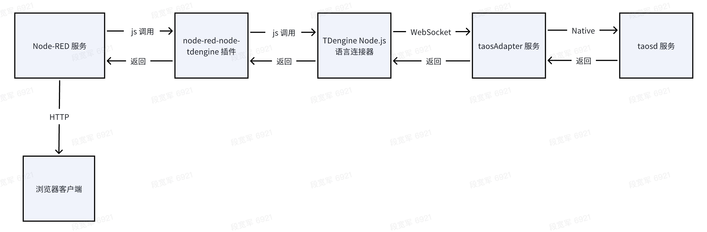
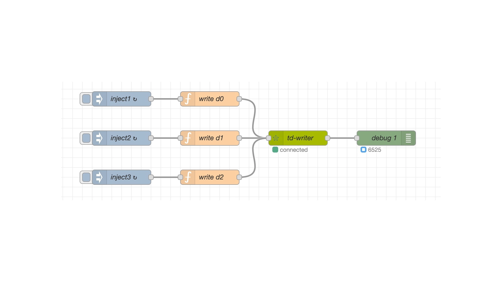
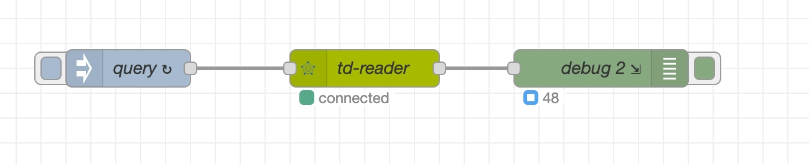
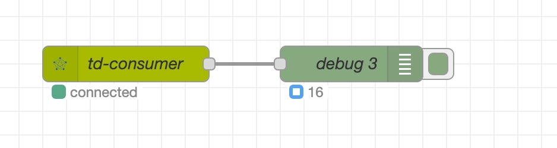
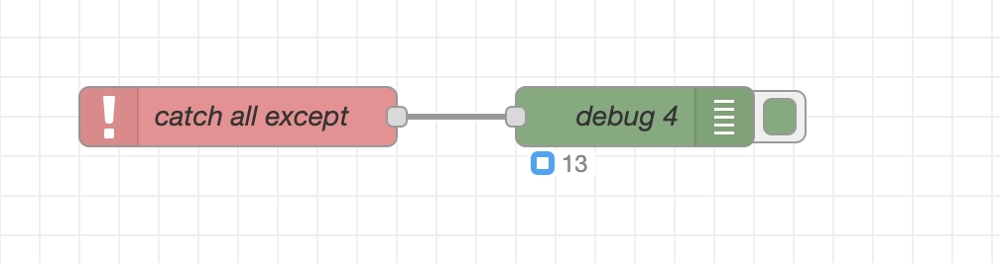
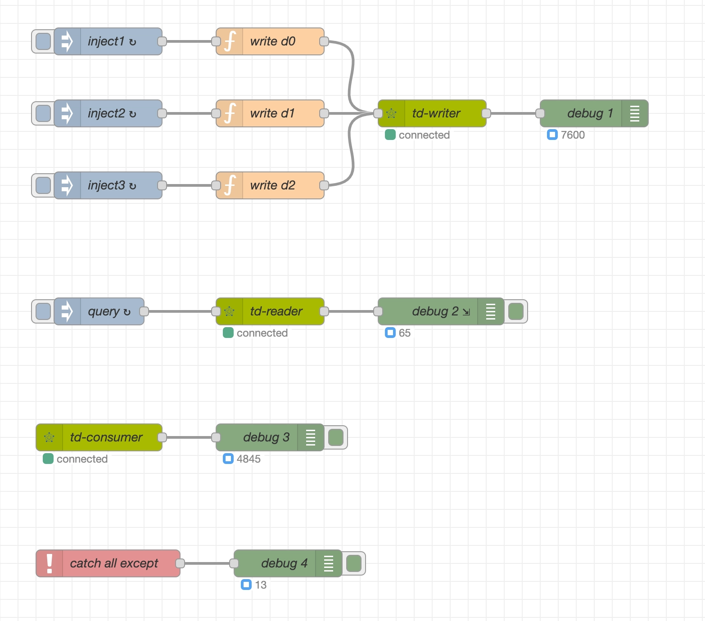

[Node-RED](https://nodered.org/) 是由 IBM 开发的基于 Node.js 的开源可视化编程工具，通过图形化界面组装连接各种节点，实现物联网设备、API 及在线服务的连接，同时支持多协议、跨平台，社区活跃，适用于智能家居、工业自动化等场景的事件驱动应用开发，其主要特点是低代码、可视化。

node-red-node-tdengine 是涛思数据为 Node-RED 开发的官方插件，插件由两个节点组合，tdengine 节点提供 SQL 执行接口，可实现数据写入/查询及元数据管理等功能。tdengine-consumer 节点提供数据订阅功能，可实现从指定订阅服务器消费指定 TOPIC 的功能。

## 前置条件

准备以下环境：

- TDengine 3.3.2.0 及以上版本集群已部署并正常运行（企业/社区/云服务版均可）。
- taosAdapter 能够正常运行，详细参考 [taosAdapter 参考手册](../../../reference/components/taosadapter)。
- Node-RED 3.0.0 及以上版本（ [Node-RED 安装](https://nodered.org/docs/getting-started/)）。
- Node.js 语言连接器 3.1.8 及以上版本。可从 [npmjs.com](https://www.npmjs.com/package/@tdengine/websocket) 下载。
- node-red-node-tdengine 插件 1.0.0 及以上版本，可从 [npmjs.com](https://www.npmjs.com/package/node-red-node-tdengine) 下载。

以上安装各组件调用关系如下：



## 配置数据源
插件通过 Node.js 连接器访问 TDengine 数据源， 数据源连接遵循 [Node.js 语言连接器](../../../reference/connector/node/)规则，配置步骤如下：

1. 启动 Node-RED 服务，使用浏览器进入 Node-RED 主页。

2. 画布左侧节点选择区域内选中 tdengine-operator 或 tdengine-consumer 节点拖至画布。

3. 双击画布中选中节点，弹出属性设置窗口， 填写数据库连接信息：
   - tdengine-operator 节点连接串格式：
     `ws://user:password@host:port`
   - tdengine-consumer 节点连接串格式：  
     `ws://host:port`
  
  更多详细内容请点击画布右侧上方区域中字典图标按钮，显示在线帮助文档内获取。
   
4. 配置完成后，点击右上角“部署”按钮 ，节点状态变为绿色，表示数据源配置正确且连接正常。


## 验证方法
参考下一节“使用示例”方法，在 tdengine-operator 节点前增加一个 inject 节点，配置 msg.topic 为预期写入 SQL，点击 inject 节点 "注入" 按钮触发执行 SQL, 再使用数据库管理工具 taos-CLI 查询预期写入数据是否成功。

## 使用示例


### 场景介绍

某生产车间有多台智能电表， 电表每一秒产生一条数据，数据准备存储在 TDengine 数据库中，并每分钟实时输出最新 1 分钟内各智能电表平均电流、电压及用电量。同时要求对电流超过 25A 或电压超过 230V 的负载过大设备进行报警。

我们使用 Node-RED + TDengine 来实现需求，使用 Inject + function 节点模拟设备每秒产生一条数据，tdengine 节点负责写入数据，实时查询统计使用 tdengine-operator节点查询功能，设备过载报警使用 tdengine-consumer 订阅异常数据。

假设 TDengine 服务器地址： 192.168.2.124 ，WEBSOCKET 端口：6041，使用默认用户名/密码登录，模拟三台设备，分别命名为 d0，d1，d2。

### 数据准备
通过数据库管理工具 taos-CLI , 为采集数据进行手工建模，采用一张设备一张表建模思路，创建超级表 meters 及三台设备对应子表 d0，d1，d2。建模 SQL 语句如下：
``` sql
create database test;
create stable test.meters (ts timestamp , current float , voltage int , phase float ) tags (groupid int, location varchar(24));
create table test.d0 using test.meters tags(1, 'workshop1');
create table test.d1 using test.meters tags(2, 'workshop1');
create table test.d2 using test.meters tags(2, 'workshop2');

```

### 数据采集

使用 tdengine-operator节点, 采集每台设备数据，操作步骤：
- <b>增加写入节点</b> 
  1. 节点选择区域内选中 tdengine-operator节点，拖动至画布中。
  2. 双击节点打开属性设置，名称填写 'td-writer'，数据库项右侧点击“+”号图标。
  3. 弹出窗口中，名称填写 'td124'，连接类型选择使用字符串连接，输入：
   ``` sql
   ws://root:taosdata@192.168.2.124:6041 
   ```   
  4. 点击“添加”并返回。

- <b>模拟设备产生数据</b> 
  1. 节点选择区域内选中 “function” 节点，拖动至画布 'td-writer' 节点前。
  2. 双击节点打开属性设置，名称填写 ‘write d0’， 下面选项卡选择“运行函数”，填写如下内容后保存并返回画布。
   ``` javascript
      // generate rand
      const value2 = Math.floor(Math.random() * (30 - 5 + 1)) + 5; // 5-30
      const value3 = Math.floor(Math.random() * (240 - 198 + 1)) + 198; // 198-240
      const value4 = Math.floor(Math.random() * (3 - 1 + 1)) + 1; // 1-3

      // sql
      msg.topic = `insert into test.d0 values (now, ${value2}, ${value3}, ${value4}) ;`;

      return msg;
   ```
  3. 画布左侧区域“通用”项下选择 “inject” 节点，拖动至画布 ‘write d0’ 前。
   
  4. 双击节点打开属性设置，名称填写 ‘inject1’，重复下拉框选择“周期性执行”，周期选择每隔 1 秒，保存返回画布。
   
  5. 相同方法再制作完成另外两台设备流程。
   
- <b>增加信息输出</b> 
  1. 节点选择区域内选中 “debug” 节点，拖动至画布 ‘td-writer’ 节点后。
  2. 双击节点打开属性设置，名称填写 ‘debug1’，勾选“节点状态”，下拉列表中选择消息数量。


以上节点增加完成后，依次把上面节点按顺序连接起来，形成一条流水线，至此数据采集流程制作完成。

点击右上角 “部署” 按钮发布修改内容，运行成功后可以看到 'td-writer' 节点状态变成绿色（绿色表示工作正常）且 'debug1' 节点数字在不断增加（数字表示写入记录数）。


以下为 'td-writer' 向下游节点输出的写入成功的结果信息，若写入失败，会抛出异常：
``` json
{
  "topic":  "insert into test.d1 values (now, 20, 203, 2);",
  "_msgid": "8f50fe84338387d7",
  "query":  false,
  "payload":{
    "affectRows": 1,
    "totalTime":  2,
    "timing":     "961982"
  }
}
```

### 数据查询

数据查询流程由三个节点（inject/tdengine/debug）组成，完成每隔 1 分钟实时输出最新 1 分钟内各智能电表平均电流、电压及用电量需求。
  1. inject 节点拖动至画布中，双击节点设置属性，名称填写 'query', msg.topic 填写并保存返回画布：
   ``` sql
   select tbname, avg(current), avg(voltage), sum(p) 
     from ( select tbname,current,voltage,current*voltage/60 as p from test.meters  where  ts > now-60s partition by tbname) 
     group by tbname;
   ``` 
  2. tdengine-operator节点拖动至画布中，双击节点设置属性，数据库选择前面已创建好的数据源 'td124'，保存并返回画布。
  3. debug 节点拖动至画布中，双击节点设置属性，勾选“节点状态”，下拉列表中选择“消息数量”，保存并返回画布。
  4. 依次把以上节点按顺序连接起来，点击 “部署” 按钮发布修改内容。

流程启动成功后可以看到 'td-reader' 节点状态变成“绿色” 表示流程工作正常，debug 输出节点的数字每隔一分钟更新一次，表示不断有数据汇总统计输出了。
  


以下为 'td-reader' 向下游节点输出的查询结果，若查询失败，会抛出异常：
``` json
{
  "topic":  "select tbname,avg(current) ...",
  "_msgid": "0d19e9b82ae3841a",
  "query":  true,
  "payload": [
    {
      "tbname":      "d2",
      "avg(current)": 26.7,
      "avg(voltage)": 235,
      "sum(p)":       6329
    },
    {
      "tbname":       "d0",
      "avg(current)": 16.5,
      "avg(voltage)": 222,
      "sum(p)":       121
    },
    {
      "tbname":       "d1",
      "avg(current)": 29,
      "avg(voltage)": 202,
      "sum(p)":       5833
    }
  ]
}
```

### 数据订阅
数据订阅流程由两个节点（/tdengine-consumer/debug）组成，完成设备过载警告提醒功能。
  1. 使用 taos-CLI 手工创建订阅主题 topic_overload ,  SQL 如下：
   ``` sql
   create topic topic_overload as 
        select tbname,* from test.meters 
        where current > 25 or voltage > 230;
   ``` 
  2. tdengine-consumer 节点拖动至画布中，双击节点设置属性，填写如下内容后保存并返回画布。
     - 名称：       td-consumer
     - 订阅服务器：  ws://192.168.2.124:6041
     - 用户名：     root
     - 密码：       taosdata
     - 订阅主题：    topic_overload
     - 消费开始位置：latest
     - 其它项保持默认
   
  3. debug 节点拖动至画布中，双击节点设置属性，勾选“节点状态”，下拉列表中选择“消息数量”，保存并返回画布。
  4. 依次把以上节点按顺序连接起来，点击 “部署” 按钮发布修改内容。
  5. 流程启动成功后可以看到 'td-consumer' 节点状态变成“绿色” 表示流程工作正常，debug 输出节点的数字每隔一分钟更新一次，表示不断有数据汇总统计输出。
  


以下是 'td-consumer' 向下游节点推送的过载设备警告信息：
``` json
{
  "topic": "topic_overload",
  "payload": [
    {
      "tbname":   "d1",
      "ts":       "1750140456777",
      "current":  31,
      "voltage":  217,
      "phase":    2,
      "groupid":  4,
      "location": "California.MountainView"
    }
  ],
  "database":  "test",
  "vgroup_id": 4,
  "precision": 0
}
```

### 异常捕获
在数据采集、查询及订阅流程中，发生的错误都是按抛出异常机制来处理的，需要建立异常监控流程
  1. 节点选择区域内选中 “catch” 节点，拖动至画布中。
  2. 双击节点打开属性设置，名称填写 ‘catch all except’，捕获范围选择“所有节点”。
  3. 节点选择区域内选中 “debug” 节点，拖动至画布 'catch all except' 节点后
  4. 双击节点设置属性，名称填写'debug4'，勾选“节点状态”，下拉列表中选择“消息数量”，保存并返回画布。
  5. 依次把以上节点按顺序连接起来，点击 “部署” 按钮发布修改内容。
流程启动后如果有异常，会在 'debug4' 节点下看到所有流程发生错误的数量，当我们停止 TDengine 服务时，捕获到的错误数量会迅速增长，表明整个系统正在出现问题，可以通过 NODE-RED 日志系统排查问题。


### 运行效果
全部流程制作完成后，点击 “部署” 后， 从“数据采集->实时查询->订阅”整个物联网数据处理系统即建立起来了，运行效果如下：


## 总结
Node-RED + TDengine 让原来需要资深开发人员才能做的物联网数据采集分析处理系统，目前只需在画布上拖拽即能完成，极大降低了开发门槛。  
另外我们在 node-red 软件中也提供了丰富的在线帮助指引，详细介绍了插件的输入输出格式及使用。