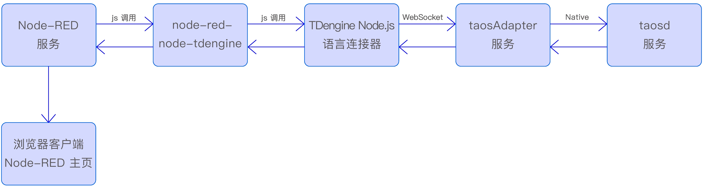
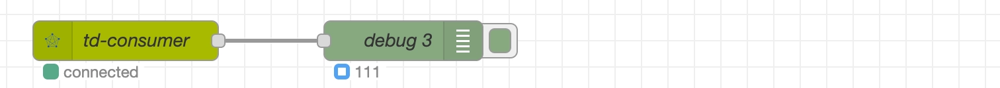

[Node-RED](https://nodered.org/) 是由 IBM 开发的基于 Node.js 的开源可视化编程工具，通过图形化界面组装连接各种节点，实现物联网设备、API 及在线服务的连接，同时支持多协议、跨平台，社区活跃，适用于智能家居、工业自动化等场景的事件驱动应用开发，其主要特点是低代码、可视化。

TDengine 与 Node-RED 深度融合为工业 IoT 场景提供了全栈式解决方案，通过 Node-RED 的 MQTT/OPC UA/Modbus 等协议节点，实现 PLC、传感器等设备的毫秒级数据采集，同时 Node-RED 中基于 TDengine 毫秒级实时查询结果，触发继电器动作、阀门开合等物理控制，联动控制执行更及时。

node-red-node-tdengine 是涛思数据为 Node-RED 开发的官方插件，插件由两个节点组合，tdengine-operator 节点提供 SQL 语句执行能力，可实现数据写入/查询及元数据管理等功能。tdengine-consumer 节点提供数据订阅消费能力，可实现从指定订阅服务器消费指定 TOPIC 的功能。


## 前置条件

准备以下环境：

- TDengine 3.3.2.0 及以上版本集群已部署并正常运行（企业/社区/云服务版均可）。
- taosAdapter 能够正常运行，详细参考 [taosAdapter 参考手册](../../../reference/components/taosadapter)。
- Node-RED 3.0.0 及以上版本（ [Node-RED 安装](https://nodered.org/docs/getting-started/)）。
- Node.js 语言连接器 3.1.8 及以上版本。可从 [npmjs.com](https://www.npmjs.com/package/@tdengine/websocket) 下载。
- node-red-node-tdengine 插件 1.0.0 及以上版本，可从 [npmjs.com](https://www.npmjs.com/package/node-red-node-tdengine) 下载。

以上各安装组件调用关系如下图：



## 配置数据源
插件数据源在节点属性中配置，通过 [Node.js 语言连接器](../../../reference/connector/node/) 连接数据源，配置步骤如下：

1. 启动 Node-RED 服务，使用浏览器进入 Node-RED 主页。

2. 画布左侧节点选择区域内选中 tdengine-operator 或 tdengine-consumer 节点拖至画布。

3. 双击画布中选中节点，弹出属性设置窗口， 填写数据库连接信息：
   - tdengine-operator 节点连接串格式：`ws://user:password@host:port`
   - tdengine-consumer 节点连接串格式：`ws://host:port`
  
    更多详细内容请点击画布右侧上方区域中字典图标按钮，参考在线帮助文档。
 
4. 配置完成后，点击右上角“部署”按钮 ，节点状态变为绿色，表示数据源配置正确且连接正常。


## 验证方法

###  tdengine-operator

参考下一节“使用示例->采集数据” 章节：
1. 配置好 tdengine-operator 节点属性。
2. 在前增加 inject 节点，配置 msg.topic 为预期写入 SQL。
3. 点击 inject 节点 "注入" 按钮触发执行 SQL。
4. 使用 taos-CLI 查询预期写入数据是否存在。

### tdengine-consumer

参考下一节“使用示例->数据订阅” 章节：
1. 配置好 tdengine-consumer 节点属性。
2. 其后增加 debug 节点。
3. 节点属性勾选“节点状态”，下拉列表中选择“消息数量”。
4. 使用 taos-CLI 向 TOPIC 所在表写入一条数据。
5. 观察 debug 节点计数预期会加 1。
6. 验证输出 payload 数据预期与写入数据一致。

## 使用示例


### 场景介绍

某生产车间有多台智能电表， 电表每一秒产生一条数据，数据准备存储在 TDengine 数据库中，并每分钟实时输出最新 1 分钟内各智能电表平均电流、电压及用电量。同时要求对电流超过 25A 或电压超过 230V 负载过大设备进行报警。

我们使用 Node-RED + TDengine 来实现需求，使用 Inject + function 节点模拟设备每秒产生一条数据，tdengine-operator 节点负责写入数据，实时查询统计使用 tdengine-operator 节点查询功能，设备过载报警使用 tdengine-consumer 订阅功能。

假设 TDengine 服务器地址： 192.168.2.124 ，WEBSOCKET 端口：6041，使用默认用户名/密码，模拟三台设备，分别命名为 d0，d1，d2。

### 数据建模

通过数据库管理工具 taos-CLI , 为采集数据进行手工建模，采用一张设备一张表建模思路，创建超级表 meters 及三台设备对应子表 d0，d1，d2。建模 SQL 如下：
``` sql
create database test;
create stable test.meters (ts timestamp, current float, voltage int, phase float ) 
                     tags (groupid int, location varchar(24));
create table test.d0 using test.meters tags(1, 'workshop1');
create table test.d1 using test.meters tags(2, 'workshop1');
create table test.d2 using test.meters tags(2, 'workshop2');

```

### 数据采集
示例使用程序产生随机数方式模拟了真实设备生产数据，通过 tdengine-operator 节点配置了连接 TDengine 数据源，把数据写入 TDengine，同时使用了 debug 节点监控了写入数据的数量及实时显示在节点界面上。

操作步骤如下：
- <b>增加写入节点</b> 
  1. 节点选择区域内选中 tdengine-operator 节点，拖动至画布中。
  2. 双击节点打开属性设置，名称填写 'td-writer'，数据库项右侧点击“+”号图标。
  3. 弹出窗口中，名称填写 'td124'，连接类型选择使用字符串连接，输入：
   ``` sql
   ws://root:taosdata@192.168.2.124:6041 
   ```   
  4. 点击“添加”并返回。

- <b>模拟设备产生数据</b> 
  1. 节点选择区域内选中 “function” 节点，拖动至画布 'td-writer' 节点前。
  2. 双击节点打开属性设置，名称填写 ‘write d0’， 下面选项卡选择“运行函数”，填写如下内容后保存并返回画布。
   ``` javascript
      // generate rand
      const value2 = Math.floor(Math.random() * (30 - 5 + 1)) + 5; // 5-30
      const value3 = Math.floor(Math.random() * (240 - 198 + 1)) + 198; // 198-240
      const value4 = Math.floor(Math.random() * (3 - 1 + 1)) + 1; // 1-3

      // sql
      msg.topic = `insert into test.d0 values (now, ${value2}, ${value3}, ${value4});`;

      return msg;
   ```
  3. 画布左侧区域“通用”项下选择 “inject” 节点，拖动至画布 ‘write d0’ 节点前。
   
  4. 双击节点打开属性设置，名称填写 ‘inject1’，下拉列表中选择“周期性执行”，周期选择每隔 1 秒，保存返回画布。
   
  5. 相同方法再制作完成另外两台设备流程。
   
- <b>增加信息输出</b> 
  1. 节点选择区域内选中 “debug” 节点，拖动至画布 ‘td-writer’ 节点后。
  2. 双击节点打开属性设置，名称填写 ‘debug1’，勾选“节点状态”，下拉列表中选择消息数量。


以上节点增加完成后，依次把上面节点按顺序连接起来，形成一条流水线，数据采集流程制作完成。

点击右上角 “部署” 按钮发布修改内容，运行成功后可以看到 'td-writer' 节点状态变成绿色，表示流程工作正常 'debug1' 节点下数字表示采集次数，如下图：


以下为 'td-writer' 向下游节点输出写入成功结果信息，若写入失败，会抛出异常：
``` json
{
  "topic":  "insert into test.d1 values (now, 20, 203, 2);",
  "_msgid": "8f50fe84338387d7",
  "isQuery":  false,
  "payload":{
    "affectRows": 1,
    "totalTime":  2,
    "timing":     "961982"
  }
}
```

### 数据查询
数据查询流程由三个节点（inject/tdengine-operator/debug）组成，完成每分钟实时输出最新 1 分钟内各智能电表平均电流、电压及用电量需求。
触发每分钟发起一次查询请求由 inject 节点完成，查询结果输出至下游 debug 节点中，在节点上显示计数展示查询执行成功次数。 

操作步骤如下：
  1. inject 节点拖动至画布中，双击节点设置属性，名称填写 'query', msg.topic 填写并保存返回画布：
   ``` sql
   select tbname, avg(current), avg(voltage), sum(p) 
   from ( select tbname,current,voltage,current*voltage/60 as p from test.meters 
          where  ts > now-60s partition by tbname)
   group by tbname;
   ``` 
  2. tdengine-operator 节点拖动至画布中，双击节点设置属性，“数据库”选择前面已创建好的数据源 'td124'，保存并返回画布。
  3. debug 节点拖动至画布中，双击节点设置属性，勾选“节点状态”，下拉列表中选择“消息数量”，保存并返回画布。
  4. 依次把以上节点按顺序连接起来，点击 “部署” 按钮发布修改内容。

流程启动成功后可以看到 'td-reader' 节点状态变成“绿色” ，表示流程工作正常，debug 节点数字表示输出统计结果次数，如下图：
  


以下为 'td-reader' 向下游节点输出查询结果，若查询失败，会抛出异常：
``` json
{
  "topic":  "select tbname,avg(current) ...",
  "_msgid": "0d19e9b82ae3841a",
  "isQuery":  true,
  "payload": [
    {
      "tbname":      "d2",
      "avg(current)": 26.7,
      "avg(voltage)": 235,
      "sum(p)":       6329
    },
    {
      "tbname":       "d0",
      "avg(current)": 16.5,
      "avg(voltage)": 222,
      "sum(p)":       121
    },
    {
      "tbname":       "d1",
      "avg(current)": 29,
      "avg(voltage)": 202,
      "sum(p)":       5833
    }
  ]
}
```

### 数据订阅
数据订阅流程由两个节点（tdengine-consumer/debug）组成，完成设备过载警告提醒功能。  
debug 节点在订阅流程中用于可视化展示订阅节点向下游节点推送订阅数据的数量，生产中可把 debug 节点更换为处理订阅数据的功能节点。

操作步骤如下：
  1. 使用 taos-CLI 手工创建订阅主题 topic_overload,  SQL 如下：
   ``` sql
   create topic topic_overload as 
        select tbname,* from test.meters 
        where current > 25 or voltage > 230;
   ``` 
  2. tdengine-consumer 节点拖动至画布中，双击节点设置属性，填写如下内容后保存并返回画布。
     - 名称：       td-consumer
     - 订阅服务器：  ws://192.168.2.124:6041
     - 用户名：     root
     - 密码：       taosdata
     - 订阅主题：    topic_overload
     - 消费开始位置：latest
     - 其它项保持默认
   
  3. debug 节点拖动至画布中，双击节点设置属性，勾选“节点状态”，下拉列表中选择“消息数量”，保存并返回画布。
  4. 依次把以上节点按顺序连接起来，点击 “部署” 按钮发布修改内容。

流程启动成功后可看到 'td-consumer' 节点状态变成“绿色” 表示流程工作正常，debug 节点数字表示消费次数，如下图：
  


以下是 'td-consumer' 向下游节点推送的过载设备警告信息：
``` json
{
  "topic": "topic_overload",
  "payload": [
    {
      "tbname":   "d1",
      "ts":       "1750140456777",
      "current":  31,
      "voltage":  217,
      "phase":    2,
      "groupid":  4,
      "location": "California.MountainView"
    }
  ],
  "database":  "test",
  "vgroup_id": 4,
  "precision": 0
}
```

### 异常捕获
在数据采集、查询及订阅流程中，发生的错误均按抛出异常机制来处理，需建立异常监控流程：
  1. 节点选择区域内选中 “catch” 节点，拖动至画布中。
  2. 双击节点打开属性设置，名称填写 ‘catch all except’，捕获范围选择“所有节点”。
  3. 节点选择区域内选中 “debug” 节点，拖动至画布 'catch all except' 节点后。
  4. 双击节点设置属性，勾选“节点状态”，下拉列表中选择“消息数量”，保存并返回画布。
  5. 依次把以上节点按顺序连接起来，点击 “部署” 按钮发布修改内容。
流程启动后如有异常，会在 'debug4' 节点下看到所有流程发生错误的数量，可通过 NODE-RED 日志系统查看问题详情，流程如下图：


### 运行效果
以上流程制作完成后，点击 “部署” 发布所有修改， 示例即进行运行状态，如下：


## 总结
我们通过一个具体场景示例，详细介绍了 Node-RED 如何连接 TDengine 数据源及完成数据写入、查询及订阅功能，同时也展示了各节点输入输出数据格式及系统异常捕获等内容。    
本文侧重从示例角度介绍功能，全部功能文档还需在 Node-RED 插件在线文档中获取。  
