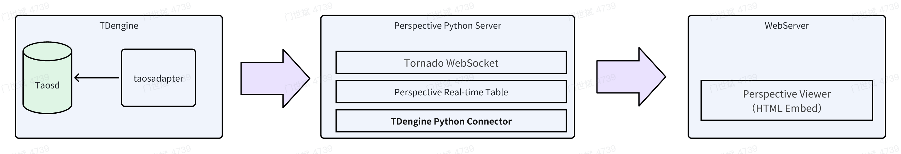
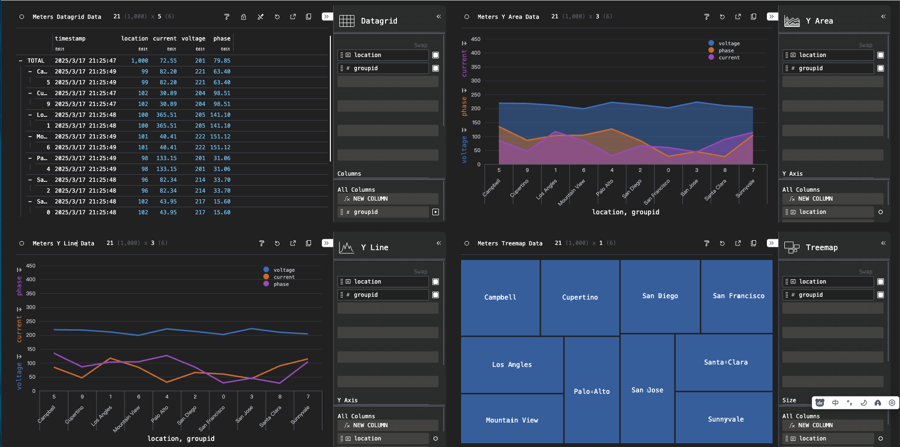

## 概述

Perspective 是一款开源且强大的数据可视化库，由 [Prospective.co](https://www.perspective.co/) 开发，运用 `WebAssembly` 和 `Web Workers` 技术，在 Web 应用中实现交互式实时数据分析，能在浏览器端提供高性能可视化能力。借助它，开发者可构建实时更新的仪表盘、图表等，用户能轻松与数据交互，按需求筛选、排序及挖掘数据。其灵活性高，适配多种数据格式与业务场景；速度快，处理大规模数据也能保障交互流畅；易用性佳，新手和专业开发者都能快速搭建可视化界面。

在数据连接方面，Perspective 通过 TDengine TSDB 的 Python 连接器，完美支持 TDengine TSDB 数据源，可高效获取其中海量时序数据等各类数据，并提供展示复杂图表、深度统计分析和趋势预测等实时功能，助力用户洞察数据价值，为决策提供有力支持，是构建对实时数据可视化和分析要求高的应用的理想选择。



## 前置条件

在 Linux 系统中进行如下安装操作：

- TDengine TSDB 服务已部署并正常运行（企业及社区版均可）。
- taosAdapter 能够正常运行，详细参考 [taosAdapter 使用手册](../../../reference/components/taosadapter)。
- Python 3.10 及以上版本已安装 (如未安装，可参考 [Python 安装](https://docs.python.org/))。
- 下载或克隆 [perspective-connect-demo](https://github.com/taosdata/perspective-connect-demo) 项目，进入项目根目录后运行“install.sh”脚本，以便在本地下载并安装 TDengine TSDB 客户端库以及相关的依赖项。

## 可视化数据

**第 1 步**，运行 [perspective-connect-demo](https://github.com/taosdata/perspective-connect-demo) 项目根目录中的“run.sh”脚本，以此启动 Perspective 服务。该服务会每隔 300 毫秒从 TDengine TSDB 数据库中获取一次数据，并将数据以流的形式传输至基于 Web 的 `Perspective Viewer` 。

```shell
sh run.sh
```

**第 2 步**，启动一个静态 Web 服务，随后在浏览器中访问 `prsp-viewer.html` 资源，便能展示可视化数据。

```python
python -m http.server 8081
```

通过浏览器访问该 Web 页面后所呈现出的效果如下图所示：



## 使用说明

### 写入数据

[perspective-connect-demo](https://github.com/taosdata/perspective-connect-demo) 项目根目录中的 `producer.py` 脚本，借助 TDengine TSDB Python 连接器，可定期向 TDengine TSDB 数据库插入数据。此脚本会生成随机数据并将其插入数据库，以此模拟实时数据的写入过程。具体执行步骤如下：

1. 建立与 TDengine TSDB 的连接。
1. 创建 power 数据库和 meters 表。
1. 每隔 300 毫秒生成一次随机数据，并写入 TDengine TSDB 数据库中。

Python 连接器详细写入说明可参见 [Python 参数绑定](../../../reference/connector/python/#参数绑定)。

### 加载数据

[perspective-connect-demo](https://github.com/taosdata/perspective-connect-demo) 项目根目录中的 `perspective_server.py` 脚本会启动一个 Perspective 服务器，该服务器会从 TDengine TSDB 读取数据，并通过 Tornado WebSocket 将数据流式传输到一个 Perspective 表中。

1. 启动一个 Perspective 服务器
1. 建立与 TDengine TSDB 的连接。
1. 创建一个 Perspective 表 (表结构需要与 TDengine TSDB 数据库中表的类型保持匹配)。
1. 调用 `Tornado.PeriodicCallback` 函数来启动定时任务，进而实现对 Perspective 表数据的更新，示例代码如下：

```python
{{#include docs/examples/perspective/perspective_server.py:perspective_server}}
```

### HTML 页面配置

[perspective-connect-demo](https://github.com/taosdata/perspective-connect-demo) 项目根目录中的 `prsp-viewer.html`文件将 `Perspective Viewer` 嵌入到 HTML 页面中。它通过 WebSocket 连接到 Perspective 服务器，并根据图表配置显示实时数据。

- 配置展示的图表以及数据分析的规则。
- 与 Perspective 服务器建立 Websocket 连接。
- 引入 Perspective 库，通过 WebSocket 连接到 Perspective 服务器，加载 meters_values 表来展示动态数据。

```html
{{#include docs/examples/perspective/prsp-viewer.html:perspective_viewer}}
```

## 参考资料

- [Perspective 文档](https://perspective.finos.org/)
- [TDengine TSDB Python 连接器](../../../reference/connector/python)
- [TDengine TSDB 流计算](../../../advanced/stream/)
