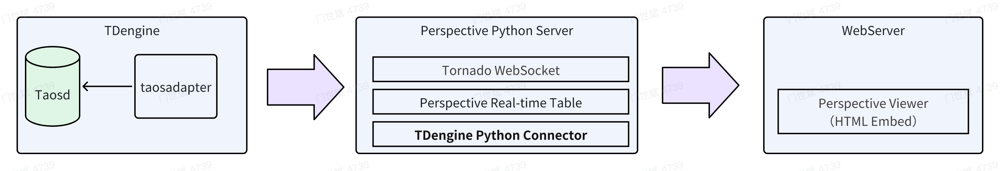

## 概述

Perspective 是一款开源且强大的数据可视化库，由 [Prospective.co](https://www.perspective.co/) 开发，运用 `WebAssembly` 和 `Web Workers` 技术，在 Web 应用中实现交互式实时数据分析，能在浏览器端提供高性能可视化能力。借助它，开发者可构建实时更新的仪表盘、图表等，用户能轻松与数据交互，按需求筛选、排序及挖掘数据。其灵活性高，适配多种数据格式与业务场景；速度快，处理大规模数据也能保障交互流畅；易用性佳，新手和专业开发者都能快速搭建可视化界面。

在数据连接方面，Perspective 通过 TDengine 的 Python 连接器，完美支持 TDengine 数据源，可高效获取其中海量时序数据等各类数据，并提供展示复杂图表、深度统计分析和趋势预测等实时功能，助力用户洞察数据价值，为决策提供有力支持，是构建对实时数据可视化和分析要求高的应用的理想选择。




## 前置条件

在 Linux 系统中进行如下安装操作：

- TDengine 服务已部署并正常运行（企业及社区版均可）。
- taosAdapter 能够正常运行，详细参考 [taosAdapter 使用手册](../../../reference/components/taosadapter)。
- Python 3.10 及以上版本已安装（如未安装，可参考 [Python 安装](https://docs.python.org/)。
- 下载或克隆 [perspective-connect-demo](https://github.com/taosdata/perspective-connect-demo) 项目，进入项目根目录后运行 “install.sh” 脚本，以便在本地下载并安装 TDengine 客户端库以及相关的依赖项。

## 数据分析

**第 1 步**，运行 [perspective-connect-demo](https://github.com/taosdata/perspective-connect-demo) 项目根目录中的 “run.sh” 脚本，以此启动 Perspective 服务。该服务会每隔 300 毫秒从 TDengine 数据库中获取一次数据，并将数据以流的形式传输至基于 Web 的 `Perspective Viewer` 。

```shell
sh run.sh
```

**第 2 步**，启动一个静态 Web 服务，随后在浏览器中访问 `prsp-viewer.html` 资源，便能展示可视化数据。

```python
python -m http.server 8081
```


## 使用说明

### 写入数据

[perspective-connect-demo](https://github.com/taosdata/perspective-connect-demo) 项目根目录中的 `producer.py` 脚本，借助 TDengine Python 连接器，可定期向 TDengine 数据库插入数据。此脚本会生成随机数据并将其插入数据库，以此模拟实时数据的写入过程。具体执行步骤如下：

1. 建立与 TDengine 的连接。
1. 创建 power 数据库和 meters 表。
1. 每隔 300 毫秒生成一次随机数据，并写入 TDengine 数据库中。

Python 连接器详细写入说明可参见 [Python 参数绑定](../../../reference/connector/python/#参数绑定)。

### 加载数据

[perspective-connect-demo](https://github.com/taosdata/perspective-connect-demo) 项目根目录中的 `perspective_server.py` 脚本会启动一个 Perspective 服务器，该服务器会从 TDengine 读取数据，并通过 Tornado WebSocket 将数据流式传输到一个 Perspective 表中。

1. 启动一个 Perspective 服务器
1. 建立与 TDengine 的连接。
1. 创建一个 Perspective 表(表结构需要与 TDengine 数据库中表的类型保持匹配)。
1. 调用 `Tornado.PeriodicCallback` 函数来启动定时任务，进而实现对 Perspective 表数据的更新，示例代码如下：

    ```python
    def perspective_thread(perspective_server: perspective.Server, tdengine_conn: taosws.Connection):
        """
        Create a new Perspective table and update it with new data every 50ms
        """
        # create a new Perspective table
        client = perspective_server.new_local_client()
        schema = {
            "timestamp": datetime,
            "location": str,
            "groupid": int,
            "current": float,
            "voltage": int,
            "phase": float,
        }
        # define the table schema
        table = client.table(
            schema,
            limit=1000,                     # maximum number of rows in the table
            name=PERSPECTIVE_TABLE_NAME,    # table name. Use this with perspective-viewer on the client side
        )
        logger.info("Created new Perspective table")

        # update with new data
        def updater():
            data = read_tdengine(tdengine_conn)
            table.update(data)
            logger.debug(f"Updated Perspective table: {len(data)} rows")

        logger.info(f"Starting tornado ioloop update loop every {PERSPECTIVE_REFRESH_RATE} milliseconds")
        # start the periodic callback to update the table data
        callback = tornado.ioloop.PeriodicCallback(callback=updater, callback_time=PERSPECTIVE_REFRESH_RATE)
        callback.start()
    ```

### HTML 页面配置

[perspective-connect-demo](https://github.com/taosdata/perspective-connect-demo) 项目根目录中的 `prsp-viewer.html`文件将 `Perspective Viewer` 嵌入到 HTML 页面中。它通过 WebSocket 连接到 Perspective 服务器，并根据图表配置显示实时数据。

- 配置展示的图表以及数据分析的规则。
- 与 Perspective 服务器建立 Websocket 连接。
- 引入 Perspective 库，通过 WebSocket 连接到 Perspective 服务器，加载 meters_values 表来展示动态数据。

```html
<script type="module">
    // Import the Perspective library
    import perspective from "https://unpkg.com/@finos/perspective@3.1.3/dist/cdn/perspective.js";

    document.addEventListener("DOMContentLoaded", async function () {
        // An asynchronous function for loading the view
        async function load_viewer(viewerId, config) {
            try {
                const table_name = "meters_values";
                const viewer = document.getElementById(viewerId);
                // connect Perspective WebSocket server
                const websocket = await perspective.websocket("ws://localhost:8085/websocket");
                // open server table
                const server_table = await websocket.open_table(table_name);
                // load the table into the view
                await viewer.load(server_table);
                // use view configuration
                await viewer.restore(config);
            } catch (error) {
                console.error(`Failed to get data from ${table_name}, err: ${error}`);
            }
        }

        // configuration of the view
        const config = {
            "version": "3.3.1",          // Perspective library version (compatibility identifier)
            "plugin": "Datagrid",        // View mode: Datagrid (table) or D3FC (chart)
            "plugin_config": {           // Plugin-specific configuration
                "columns": {
                    "current": {
                        "width": 150       // Column width in pixels
                    }
                },
                "edit_mode": "READ_ONLY",  // Edit mode: READ_ONLY (immutable) or EDIT (editable)
                "scroll_lock": false       // Whether to lock scroll position
            },
            "columns_config": {},        // Custom column configurations (colors, formatting, etc.)
            "settings": true,            // Whether to show settings panel (true/false)
            "theme": "Power Meters",     // Custom theme name (must be pre-defined)
            "title": "Meters list data", // View title
            "group_by": ["location", "groupid"], // Row grouping fields (equivalent to `row_pivots`)
            "split_by": [],              // Column grouping fields (equivalent to `column_pivots`)
            "columns": [                 // Columns to display (in order)
                "timestamp",
                "location",
                "current",
                "voltage",
                "phase"
            ],
            "filter": [],                // Filter conditions (triplet format array)
            "sort": [],                  // Sorting rules (format: [field, direction])
            "expressions": {},           // Custom expressions (e.g., calculated columns)
            "aggregates": {              // Aggregation function configuration
                "timestamp": "last",       // Aggregation: last (takes the latest value)
                "voltage": "last",         // Aggregation: last
                "phase": "last",           // Aggregation: last
                "current": "last"          // Aggregation: last
            }
        };

        // load the first view
        await load_viewer("prsp-viewer-1", config1);
    });
</script>

<!-- Define the HTML Structure of the Dashboard -->
<div id="dashboard">
    <div class="viewer-container">
        <perspective-viewer id="prsp-viewer-1" theme="Pro Dark"></perspective-viewer>
    </div>
</div>
```

## 参考资料

- [Perspective 文档](https://perspective.finos.org/) 
- [TDengine Python 连接器](../../../reference/connector/python)
- [TDengine 流计算](../../../advanced/stream/)


