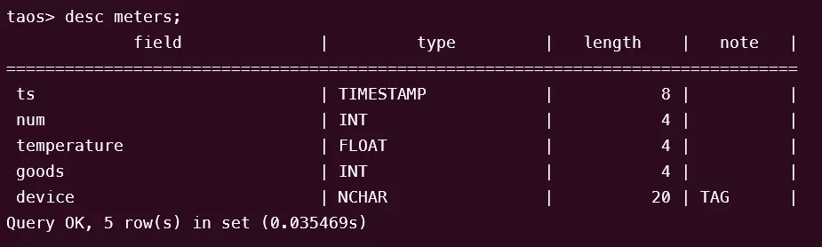
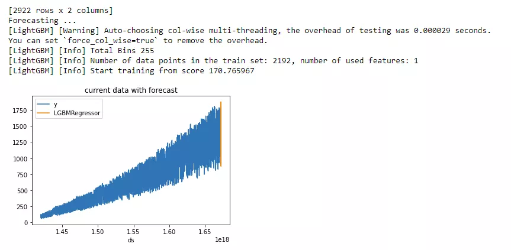

Seeq 是制造业和工业互联网（IIOT）高级分析软件。Seeq 支持在工艺制造组织中使用机器学习创新的新功能。这些功能使组织能够将自己或第三方机器学习算法部署到前线流程工程师和主题专家使用的高级分析应用程序，从而使单个数据科学家的努力扩展到许多前线员工。

通过 `TDengine Java connector`，Seeq 可以轻松支持查询 TDengine TSDB 提供的时序数据，并提供数据展现、分析、预测等功能。

## 前置条件

准备以下环境：

- TDengine TSDB 3.1.0.3 以上版本集群已部署并正常运行（企业及社区版均可）。
- taosAdapter 能够正常运行，详细参考 [taosAdapter 参考手册](../../../reference/components/taosadapter)。
- Seeq 已经安装。从 [Seeq 官网](https://www.seeq.com/customer-download)下载相关软件，例如 `Seeq Server` 和 `Seeq Data Lab` 等。`Seeq Data Lab` 需要安装在和 `Seeq Server` 不同的服务器上，并通过配置和 `Seeq Server` 互联。详细安装配置指令参见 [Seeq 知识库]( https://support.seeq.com/kb/latest/cloud/)。
- 安装 JDBC 驱动。从 `maven.org` 下载 `TDengine TSDB JDBC` 连接器文件 `taos-jdbcdriver-3.2.5-dist.jar` 及以上版本。

## 配置数据源

**第 1 步**，查看 data 存储位置

```shell
sudo seeq config get Folders/Data
```

**第 2 步**，将 `maven.org` 下载 `TDengine Java connector` 包并拷贝至 data 存储位置的 `plugins\lib` 中。

**第 3 步**，重新启动 seeq server

```shell
sudo seeq restart
```

**第 4 步**，输入 License

使用浏览器访问 ip:34216 并按照说明输入 license。

## 数据分析

### 场景介绍

示例场景为一个电力系统，用户每天从电站仪表收集用电量数据，并将其存储在 TDengine TSDB 集群中。现在用户想要预测电力消耗将会如何发展，并购买更多设备来支持它。用户电力消耗随着每月订单变化而不同，另外考虑到季节变化，电力消耗量会有所不同。这个城市位于北半球，所以在夏天会使用更多的电力。我们模拟数据来反映这些假定。

### 数据准备

**第 1 步**，在 TDengine TSDB 中创建表。

```sql
CREATE STABLE meters (ts TIMESTAMP, num INT, temperature FLOAT, goods INT) TAGS (device NCHAR(20));
CREATE TABLE goods (ts1 TIMESTAMP, ts2 TIMESTAMP, goods FLOAT);
```



**第 2 步**，在 TDengine TSDB 中构造数据。

```shell
python mockdata.py
taos -s "insert into power.goods select _wstart, _wstart + 10d, avg(goods) from power.meters interval(10d);"
```

源代码托管在 [GitHub 仓库](https://github.com/sangshuduo/td-forecasting)。

**第 3 步**，使用 Seeq 管理员角色的帐号登录，并新建数据源。

- Power

```json
{
    "QueryDefinitions": [
        {
            "Name": "PowerNum",
            "Type": "SIGNAL",
            "Sql": "SELECT  ts, num FROM meters",
            "Enabled": true,
            "TestMode": false,
            "TestQueriesDuringSync": true,
            "InProgressCapsulesEnabled": false,
            "Variables": null,
            "Properties": [
                {
                    "Name": "Name",
                    "Value": "Num",
                    "Sql": null,
                    "Uom": "string"
                },
                {
                    "Name": "Interpolation Method",
                    "Value": "linear",
                    "Sql": null,
                    "Uom": "string"
                },
                {
                    "Name": "Maximum Interpolation",
                    "Value": "2day",
                    "Sql": null,
                    "Uom": "string"
                }
            ],
            "CapsuleProperties": null
        }
    ],
    "Type": "GENERIC",
    "Hostname": null,
    "Port": 0,
    "DatabaseName": null,
    "Username": "root",
    "Password": "taosdata",
    "InitialSql": null,
    "TimeZone": null,
    "PrintRows": false,
    "UseWindowsAuth": false,
    "SqlFetchBatchSize": 100000,
    "UseSSL": false,
    "JdbcProperties": null,
    "GenericDatabaseConfig": {
        "DatabaseJdbcUrl": "jdbc:TAOS-RS://127.0.0.1:6041/power?user=root&password=taosdata",
        "SqlDriverClassName": "com.taosdata.jdbc.rs.RestfulDriver",
        "ResolutionInNanoseconds": 1000,
        "ZonedColumnTypes": []
    }
}
```

- Goods

```json
{
    "QueryDefinitions": [
        {
            "Name": "PowerGoods",
            "Type": "CONDITION",
            "Sql": "SELECT ts1, ts2, goods FROM power.goods",
            "Enabled": true,
            "TestMode": false,
            "TestQueriesDuringSync": true,
            "InProgressCapsulesEnabled": false,
            "Variables": null,
            "Properties": [
                {
                    "Name": "Name",
                    "Value": "Goods",
                    "Sql": null,
                    "Uom": "string"
                },
                {
                    "Name": "Maximum Duration",
                    "Value": "10days",
                    "Sql": null,
                    "Uom": "string"
                }
            ],
            "CapsuleProperties": [
                {
                    "Name": "goods",
                    "Value": "${columnResult}",
                    "Column": "goods",
                    "Uom": "string"
                }
            ]
        }
    ],
    "Type": "GENERIC",
    "Hostname": null,
    "Port": 0,
    "DatabaseName": null,
    "Username": "root",
    "Password": "taosdata",
    "InitialSql": null,
    "TimeZone": null,
    "PrintRows": false,
    "UseWindowsAuth": false,
    "SqlFetchBatchSize": 100000,
    "UseSSL": false,
    "JdbcProperties": null,
    "GenericDatabaseConfig": {
        "DatabaseJdbcUrl": "jdbc:TAOS-RS://127.0.0.1:6041/power?user=root&password=taosdata",
        "SqlDriverClassName": "com.taosdata.jdbc.rs.RestfulDriver",
        "ResolutionInNanoseconds": 1000,
        "ZonedColumnTypes": []
    }
}
```

- Temperature

```json
{
    "QueryDefinitions": [
        {
            "Name": "PowerNum",
            "Type": "SIGNAL",
            "Sql": "SELECT  ts, temperature FROM meters",
            "Enabled": true,
            "TestMode": false,
            "TestQueriesDuringSync": true,
            "InProgressCapsulesEnabled": false,
            "Variables": null,
            "Properties": [
                {
                    "Name": "Name",
                    "Value": "Temperature",
                    "Sql": null,
                    "Uom": "string"
                },
                {
                    "Name": "Interpolation Method",
                    "Value": "linear",
                    "Sql": null,
                    "Uom": "string"
                },
                {
                    "Name": "Maximum Interpolation",
                    "Value": "2day",
                    "Sql": null,
                    "Uom": "string"
                }
            ],
            "CapsuleProperties": null
        }
    ],
    "Type": "GENERIC",
    "Hostname": null,
    "Port": 0,
    "DatabaseName": null,
    "Username": "root",
    "Password": "taosdata",
    "InitialSql": null,
    "TimeZone": null,
    "PrintRows": false,
    "UseWindowsAuth": false,
    "SqlFetchBatchSize": 100000,
    "UseSSL": false,
    "JdbcProperties": null,
    "GenericDatabaseConfig": {
        "DatabaseJdbcUrl": "jdbc:TAOS-RS://127.0.0.1:6041/power?user=root&password=taosdata",
        "SqlDriverClassName": "com.taosdata.jdbc.rs.RestfulDriver",
        "ResolutionInNanoseconds": 1000,
        "ZonedColumnTypes": []
    }
}
```

### 使用 Seeq Workbench

登录 Seeq 服务页面并新建 Seeq Workbench，通过选择数据源搜索结果和根据需要选择不同的工具，可以进行数据展现或预测，详细使用方法参见 [官方知识库](https://support.seeq.com/space/KB/146440193/Seeq+Workbench)。


### 用 Seeq Data Lab Server 进行进一步的数据分析

登录 Seeq 服务页面并新建 Seeq Data Lab，可以进一步使用 Python 编程或其他机器学习工具进行更复杂的数据挖掘功能。

```Python
from seeq import spy
spy.options.compatibility = 189
import pandas as pd
import matplotlib
import matplotlib.pyplot as plt
import mlforecast
import lightgbm as lgb
from mlforecast.target_transforms import Differences
from sklearn.linear_model import LinearRegression

ds = spy.search({'ID': "8C91A9C7-B6C2-4E18-AAAF-XXXXXXXXX"})
print(ds)

sig = ds.loc[ds['Name'].isin(['Num'])]
print(sig)

data = spy.pull(sig, start='2015-01-01', end='2022-12-31', grid=None)
print("data.info()")
data.info()
print(data)
#data.plot()

print("data[Num].info()")
data['Num'].info()
da = data['Num'].index.tolist()
#print(da)

li = data['Num'].tolist()
#print(li)

data2 = pd.DataFrame()
data2['ds'] = da
print('1st data2 ds info()')
data2['ds'].info()

#data2['ds'] = pd.to_datetime(data2['ds']).to_timestamp()
data2['ds'] = pd.to_datetime(data2['ds']).astype('int64')
data2['y'] = li
print('2nd data2 ds info()')
data2['ds'].info()
print(data2)

data2.insert(0, column = "unique_id", value="unique_id")

print("Forecasting ...")

forecast = mlforecast.MLForecast(
    models = lgb.LGBMRegressor(),
    freq = 1,
    lags=[365],
    target_transforms=[Differences([365])],
)

forecast.fit(data2)
predicts = forecast.predict(365)

pd.concat([data2, predicts]).set_index("ds").plot(title = "current data with forecast")
plt.show()
```

运行程序输出结果：



### 方案总结

通过集成 Seeq 和 TDengine TSDB，可以充分利用 TDengine TSDB 高效的存储和查询性能，同时也可以受益于 Seeq 提供给用户的强大数据可视化和分析功能。

这种集成使用户能够充分利用 TDengine TSDB 的高性能时序数据存储和检索，确保高效处理大量数据。同时，Seeq 提供高级分析功能，如数据可视化、异常检测、相关性分析和预测建模，使用户能够获得有价值的洞察并基于数据进行决策。

综合来看，Seeq 和 TDengine TSDB 共同为制造业、工业物联网和电力系统等各行各业的时序数据分析提供了综合解决方案。高效数据存储和先进的分析相结合，赋予用户充分发挥时序数据潜力的能力，推动运营改进，并支持预测和规划分析应用。
