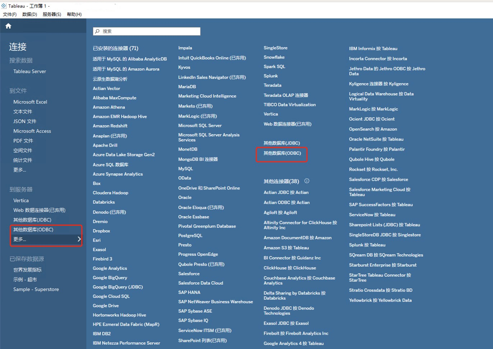
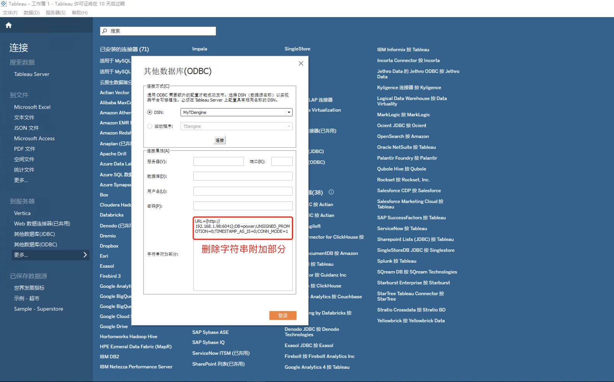
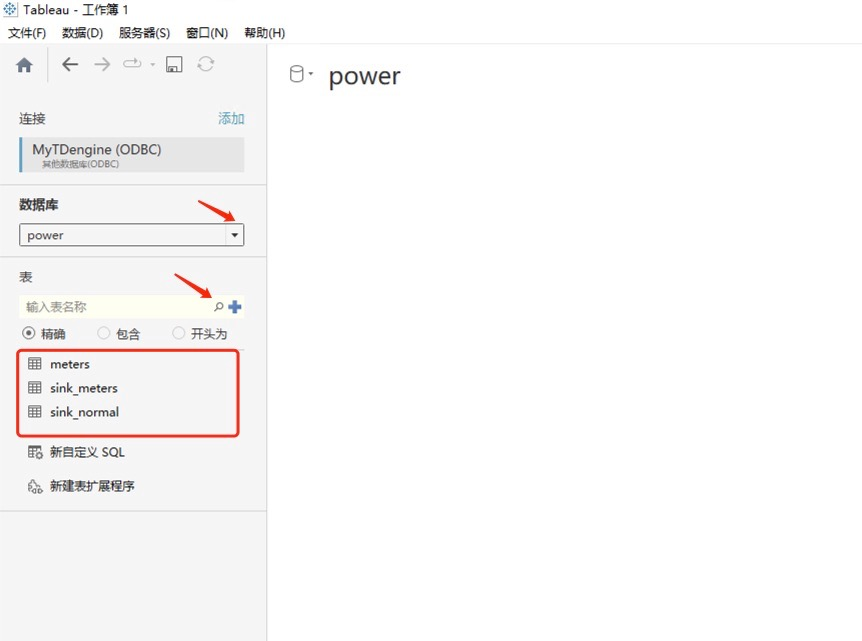
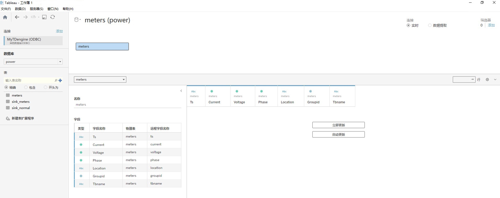
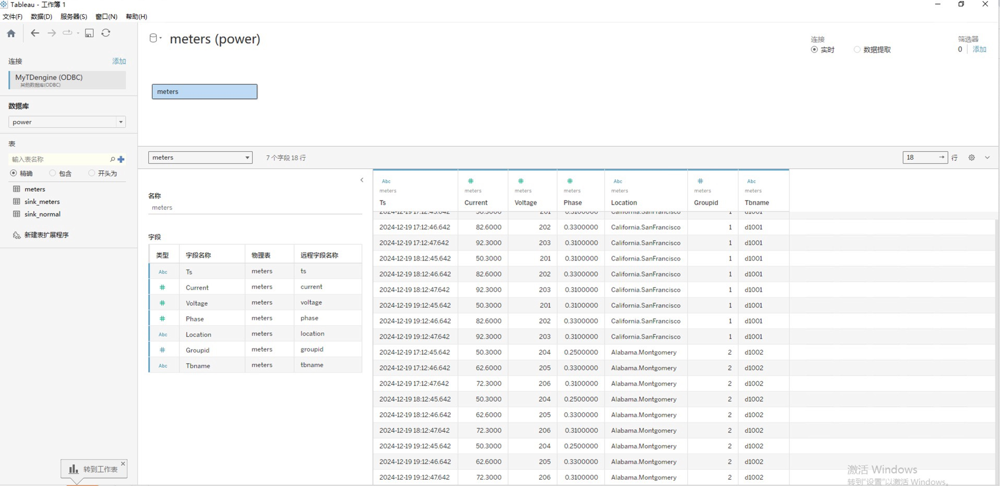
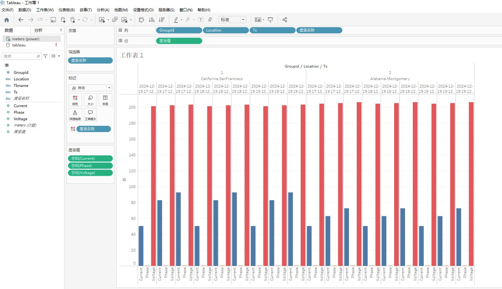

Tableau 是一款知名的商业智能工具，它支持多种数据源，可方便地连接、导入和整合数据。并且可以通过直观的操作界面，让用户创建丰富多样的可视化图表，并具备强大的分析和筛选功能，为数据决策提供有力支持。

## 前置条件

准备以下环境：
- TDengine 3.3.5.4以上版本集群已部署并正常运行（企业及社区版均可）
- taosAdapter 能够正常运行。详细参考 [taosAdapter 使用手册](../../../reference/components/taosadapter)
- Tableau 桌面版安装并运行（如未安装，请下载并安装 Windows 操作系统 32/64 位 [Tableau 桌面版](https://www.tableau.com/products/desktop/download) ）。安装 Tableau 桌面版请参考 [官方文档](https://www.tableau.com)。

## 安装 ODBC 驱动

从 TDengine 官网下载 3.3.5.4 以上版本的 Windows 操作系统 X64 客户端驱动程序，并安装在运行 Tableau 的机器上。安装成功后可在“ODBC数据源（32位）”或者“ODBC数据源（64位）”管理工具中看到 TDengine 驱动程序。

## 配置ODBC数据源

配置ODBC数据源的操作步骤如下。

第1步，在Windows操作系统的开始菜单中搜索并打开“ODBC数据源（32位）”或者“ODBC数据源（64位）”管理工具。  
第2步，点击“用户DSN”选项卡→“添加”按钮，进入“创建新数据源”对话框。  
第3步，在“选择您想为其安装数据源的驱动程序”列表中选择“TDengine”，点击“完成”按钮，进入TDengine ODBC数据源配置页面。填写如下必要信息。
  - DSN：数据源名称，必填，比如“MyTDengine”。
  - 连接类型：勾选“WebSocket”复选框。
  - URL：ODBC 数据源 URL，必填，比如“http://127.0.0.1:6041”。
  - 数据库：表示需要连接的数据库，可选，比如“power”。
  - 用户名：输入用户名，如果不填，默认为“root”。
  - 密码：输入用户密码，如果不填，默认为“taosdata”。  

第4步，点击“测试连接”按钮，测试连接情况，如果成功连接，则会提示“成功连接到http://127.0.0.1:6041”。  
第5步，点击“确定”按钮，即可保存配置并退出。

## 加载和分析 TDengine 数据

**第 1 步**，在 Windows 系统环境中启动 Tableau，并在连接页面中选择 "其他数据库(ODBC)"。

 

**第 2 步**, 点击 DNS 单选框，接着选择已配置好的数据源(MyTDengine)，然后点击连接按钮。待连接成功后，删除字符串附加部分的内容，最后点击登录按钮即可。

 

**第 3 步**, 在弹出的工作簿页面中，会显示已连接的数据源。点击数据库的拉列表，会显示需要进行数据分析的数据库。在此基础上，点击表选项中的查找按钮，即可将此数据库下的所有表显示出来。

 

**第 4 步**, 拖动需要分析的表到右侧区域，即可显示出表结构。

 

**第 5 步**, 点击下方的"立即更新"按钮，即可将表中的数据展示出来。

 

**第 6 步**, 点击窗口下方的"工作表"，弹出数据分析窗口， 并展示分析表的所有字段,将字段拖动到行列即可展示出图表。

 