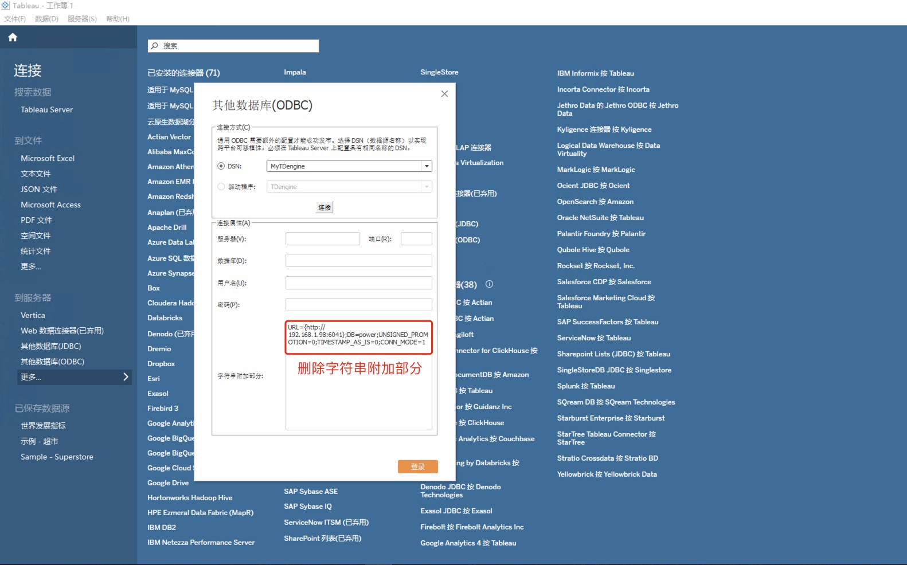
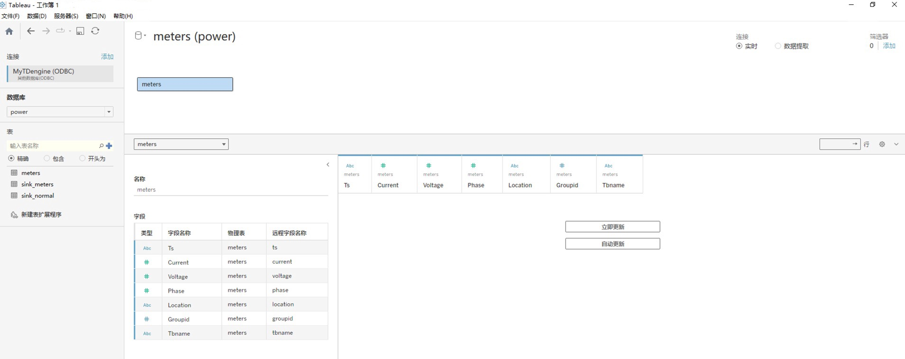
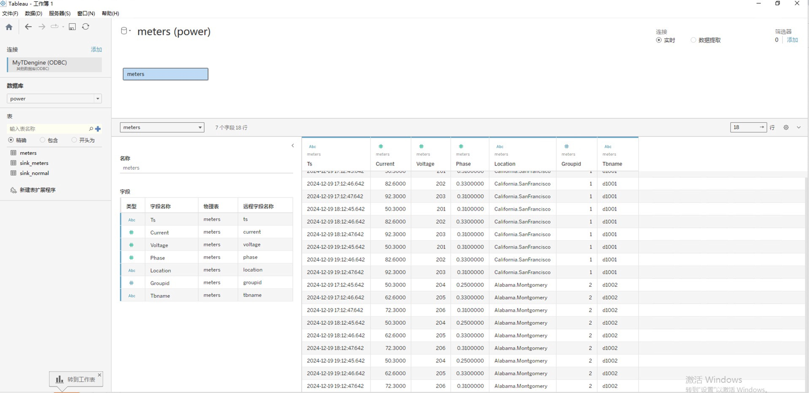
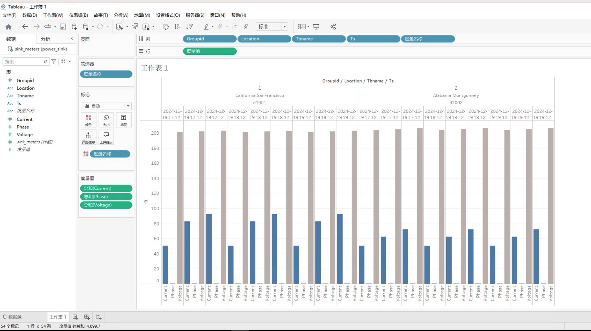

Tableau 是一款知名的商业智能工具，它支持多种数据源，可方便地连接、导入和整合数据。并且可以通过直观的操作界面，让用户创建丰富多样的可视化图表，并具备强大的分析和筛选功能，为数据决策提供有力支持。用户可通过 TDengine TSDB ODBC Connector 将标签数据、原始时序数据或者经时间聚合后的时序数据从 TDengine TSDB 导入到 Tableau，用以制作报表或仪表盘，且整个过程无需编写任何代码。

## 前置条件

准备以下环境：

- TDengine TSDB 3.3.5.8 以上版本集群已部署并正常运行（企业及社区版均可）。
- taosAdapter 能够正常运行。详细参考 [taosAdapter 参考手册](../../../reference/components/taosadapter)。
- Tableau 桌面版安装并运行（如未安装，请下载并安装 Windows 操作系统 64 位 [Tableau 桌面版](https://www.tableau.com/products/desktop/download) ）。安装 Tableau 桌面版请参考 [官方文档](https://www.tableau.com)。
- 从 TDengine TSDB 官网下载最新的 Windows 操作系统 X64 客户端驱动程序，并进行安装。详细参考 [安装 ODBC 驱动](../../../reference/connector/odbc/#安装)。

## 配置数据源

**第 1 步**，在 Windows 操作系统的开始菜单中搜索并打开“ODBC 数据源（64 位）”管理工具并进行配置。详细参考 [配置 ODBC 数据源](../../../reference/connector/odbc/#配置数据源)。

:::tip
需要注意的是，在为 Tableau 配置 ODBC 数据源时，TDengine TSDB ODBC 数据源配置页面中的【数据库】配置项为必填项，需选择一个可成功连接的数据库。
:::

**第 2 步**，在 Windows 系统环境下启动 Tableau，之后在其连接页面中搜索“ODBC”，并选择“其他数据库 (ODBC)”。对于 Tableau 的使用的 ODBC 数据源，在其 TDengine TSDB ODBC 数据源配置页面的【数据库】的配置项为必填，需要选择可以连接的数据库。

**第 3 步**，点击 `DSN` 单选框，接着选择已配置好的数据源`MyTDengine`，然后点击`连接`按钮。待连接成功后，删除字符串附加部分的内容，最后点击`登录`按钮即可。

## 数据分析

**第 1 步**，在工作簿页面中，选择已连接的数据源。点击数据库的下拉列表，会显示需要进行数据分析的数据库。在此基础上，点击表选项中的查找按钮，即可将该数据库下的所有表显示出来。然后，拖动需要分析的表到右侧区域，即可显示出表结构。

**第 2 步**，点击下方的"立即更新"按钮，即可将表中的数据展示出来。

**第 3 步**，点击窗口下方的"工作表"，弹出数据分析窗口，并展示分析表的所有字段，将字段拖动到行列即可展示出图表。

