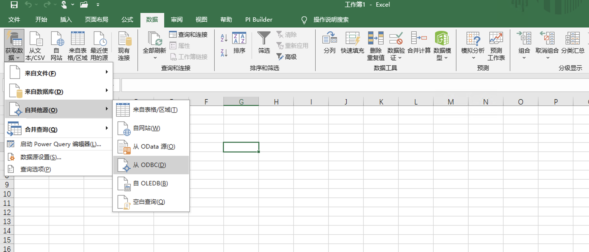
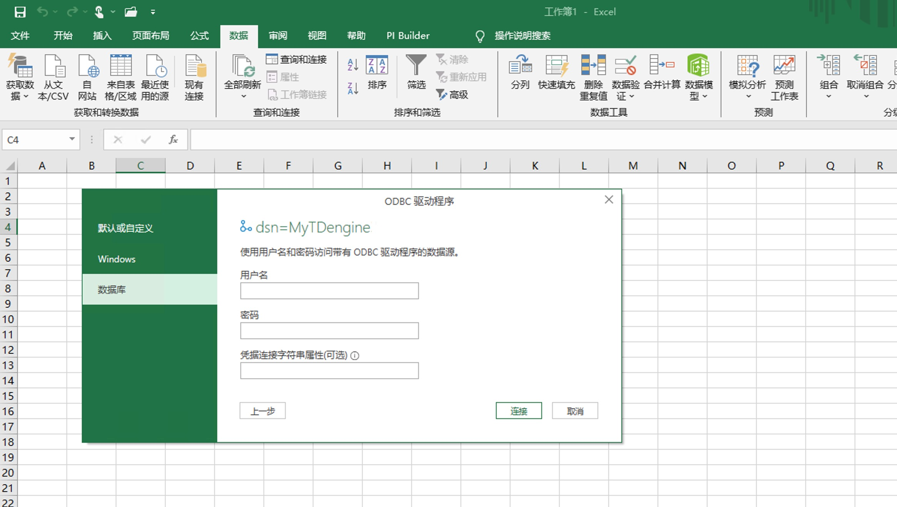
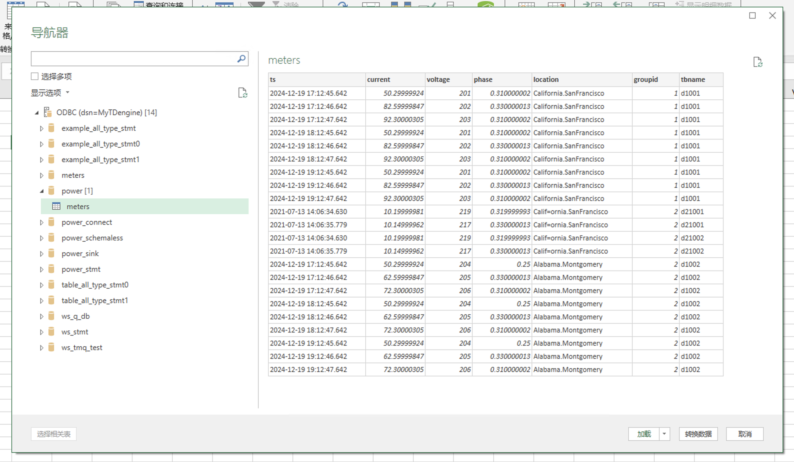
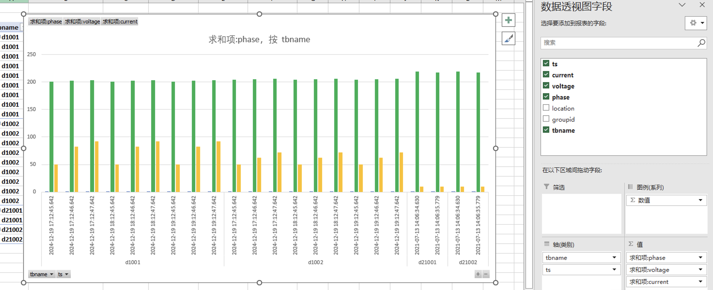

通过配置使用 ODBC 连接器，Excel 可以快速访问 TDengine 的数据。用户可以将标签数据、原始时序数据或按时间聚合后的时序数据从 TDengine 导入到 Excel，用以制作报表整个过程不需要任何代码编写过程。

## 前置条件

准备以下环境：
- TDengine 3.3.5.8 以上版本集群已部署并正常运行（企业及社区版均可）。
- taosAdapter 能够正常运行，详细参考 [taosAdapter 参考手册](../../../reference/components/taosadapter)。
- Excel 安装并运行，如未安装，请下载并安装，具体操作请参考 Microsoft 官方文档。
- 从 TDengine 官网下载最新的 Windows 操作系统 X64 客户端驱动程序并进行安装，详细参考 [安装 ODBC 驱动](../../../reference/connector/odbc/#安装)。

## 配置数据源

**第 1 步**，在 Windows 操作系统的开始菜单中搜索并打开【ODBC 数据源（64 位）】管理工具并进行配置。详细参考 [配置 ODBC 数据源](../../../reference/connector/odbc/#配置数据源)。
   
**第 2 步**，在 Windows 系统环境下启动 Excel，之后选择【数据】->【获取数据】->【自其他源】->【从 ODBC】。 

 

**第 3 步**，在弹出窗口的【数据源名称 (DSN)】下拉列表中选择需要连接的数据源后，点击【确定】按钮。

 

**第 4 步**，输入 TDengine 的用户名密码。

 

**第 5 步**，在弹出的【导航器】对话框中，选择要加载的库表，并点击【加载】完成数据加载。

## 数据分析

选中导入的数据，在【插入】选项卡中选择柱状图，并且在右侧的【数据透视图】中配置数据字段。

