帆软是一家专注于商业智能与数据分析领域的科技企业，凭借自主研发的 FineBI 和 FineReport 两款核心产品在行业内占据重要地位。帆软的 BI 工具广泛应用于各类企业，帮助用户实现数据的可视化分析、报表生成和数据决策支持。

通过使用 `TDengine Java connector` 连接器，FineBI 可以快速访问 TDengine TSDB 的数据。用户可以在 FineBI 中直接连接 TDengine TSDB 数据库，获取时序数据进行分析并制作可视化报表，整个过程不需要任何代码编写过程。

## 前置条件

准备以下环境：

- TDengine TSDB 3.3.4.0 以上版本集群已部署并正常运行（企业及社区版均可）。
- taosAdapter 能够正常运行，详细参考 [taosAdapter 参考手册](../../../reference/components/taosadapter)。
- FineBI 安装（如未安装，请下载并安装 [FineBI 下载](https://www.finebi.com/product/download)）。
- 下载 `fine_conf_entity` 插件用于支持允许添加 JDBC 驱动，[下载地址](https://market.fanruan.com/plugin/1052a471-0239-4cd8-b832-045d53182c5d)。
- 安装 JDBC 驱动。从 `maven.org` 下载 `TDengine JDBC` 连接器文件 `taos-jdbcdriver-3.4.0-dist.jar` 或以上版本。

## 配置数据源

**第 1 步**，在 FineBI 服务端 `db.script` 配置文件中，找到 `SystemConfig.driverUpload` 配置项并将其修改为 `true`。

- Windows 系统：配置文件路径是安装目录下 `webapps/webroot/WEB-INF/embed/finedb/db.script`。
- Liunx/Mac 系统：配置文件路径是 `/usr/local/FineBI6.1/webapps/webroot/WEB-INF/embed/finedb/db.script`。

**第 2 步**，启动 FineBI 服务，在浏览器中输入 `http://ip:37799/webroot/decision`, 其中 ip 是 FineBI 服务端 ip 地址。

**第 3 步**，打开 FineBI Web 页面登录后，点击【管理系统】->【插件管理】，在右侧的【应用商城】中点击【从本地安装】选择已下载的 `fine_conf_entity` 插件进行安装。

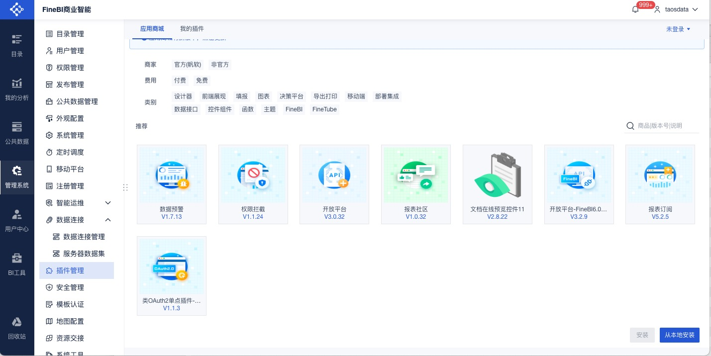

**第 4 步**，点击【管理系统】->【数据连接】->【数据连接管理】，在右侧页面中点击【驱动管理】按钮打开配置页面，点击【新建驱动】按钮并在弹出窗口中输入名称（比如 `tdengine-websocket`），进行 JDBC 驱动配置。

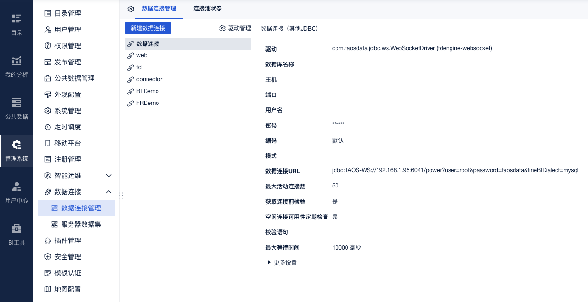

**第 5 步**，在驱动配置页面中点击【上传文件】按钮，选择已下载的 `TDengine Java Connector`（比如 `taos-jdbcdriver-3.4.0-dist.jar`）进行上传，上传完成后在【驱动】的下拉列表中选择 `com.taosdata.jdbc.ws.WebSocketDriver`，并点击【保存】。

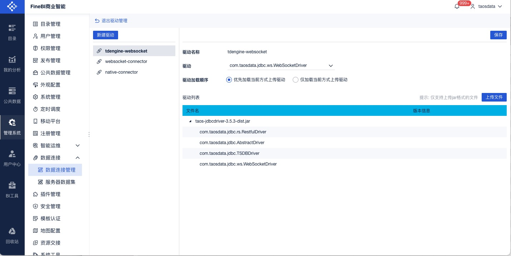

**第 6 步**，在“数据连接管理”页面中，点击【新建数据连接】按钮，随后点击“其他” ，在右侧页面中点击“其他 JDBC”进行连接配置。

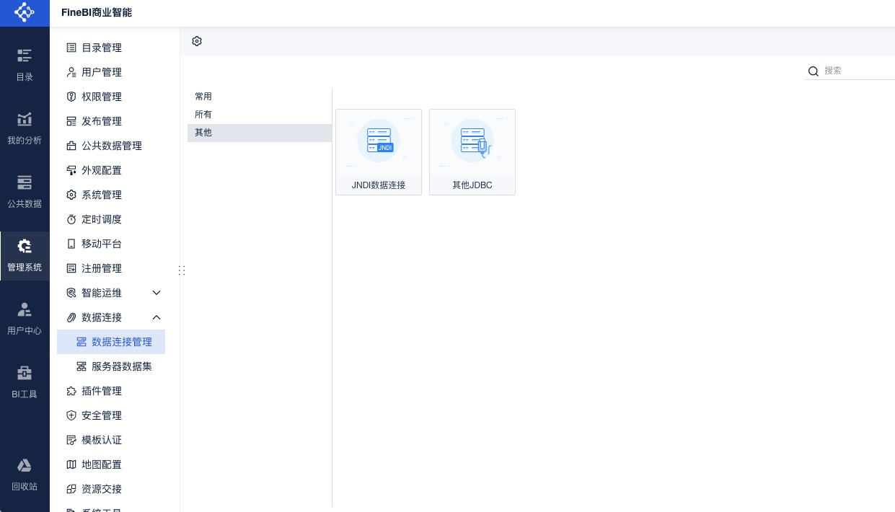

**第 7 步**，在配置页面，先输入数据连接名称，接着在【驱动】选项中选择“自定义”，并从下拉列表里选取已配置的驱动（例如 `com.taosdata.jdbc.ws.WebSocketDriver (tdengine-websocket)`），之后配置“数据连接 URL”（例如 `jdbc:TAOS-WS://localhost:6041/power?user=root&password=taosdata&fineBIDialect=mysql`）。设置完成后，点击右上角的【测试连接】进行连接测试，验证成功后点击【保存】即可完成配置。

:::tip
`fineBIDialect=mysql` 设置的含义是采用 MySQL 数据库的 SQL 方言规则。简单来说，就是告诉 FineBI 按照 MySQL 数据库处理 SQL 语句的特定方式来解析和执行相关的查询与操作。
:::

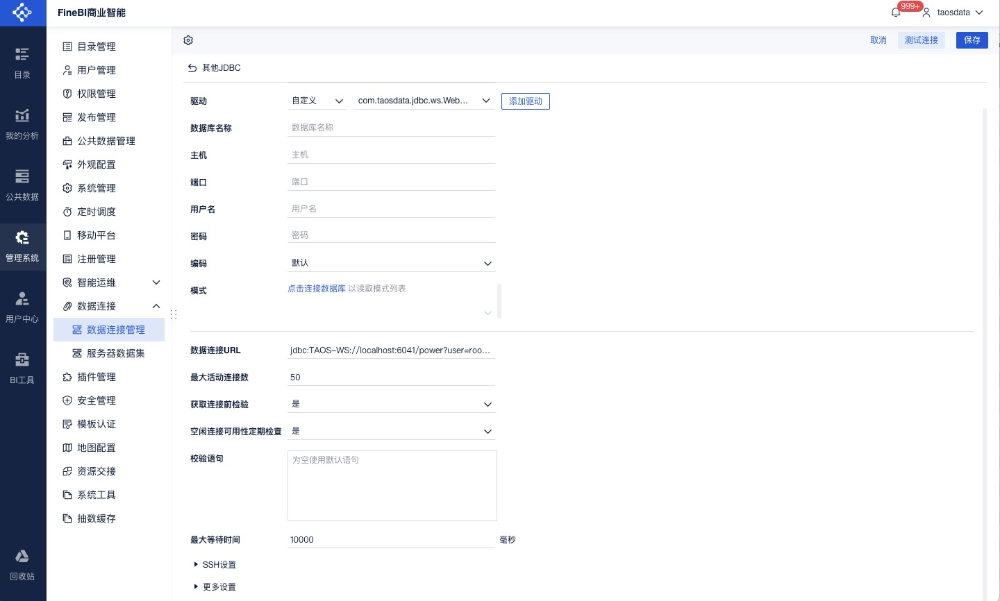

## 数据分析

### 数据准备

**第 1 步**，点击【公共数据】在右侧页面中点击【新建文件夹】即可创建一个文件夹（比如 `TDengine`），接着在文件夹的右侧点击【+】按钮，可创建“数据库表”数据集或“SQL 数据集”。

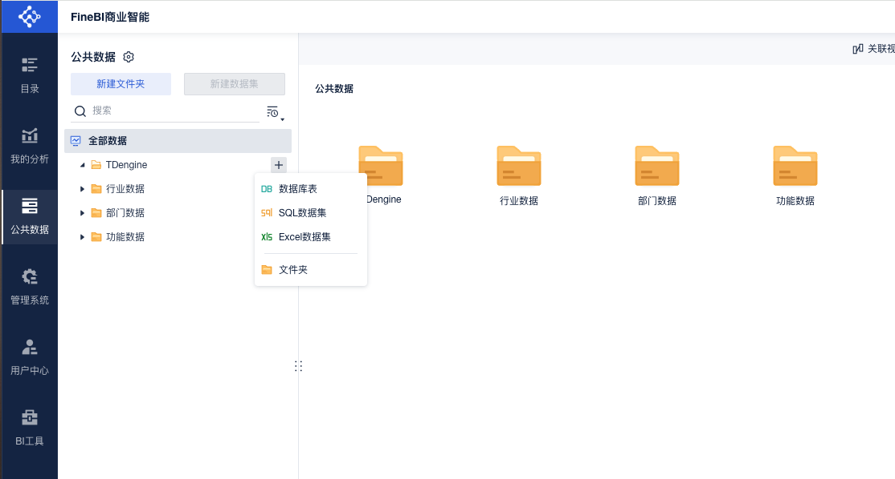

**第 2 步**，点击“数据库表”，打开数据库选表页面，在左侧“数据连接”中选择已创建的连接，则在右侧会显示当前连接的数据库中的所有表，选择需要加载的表（比如 `meters`），点击【确定】即可显示 `meters` 表中的数据。

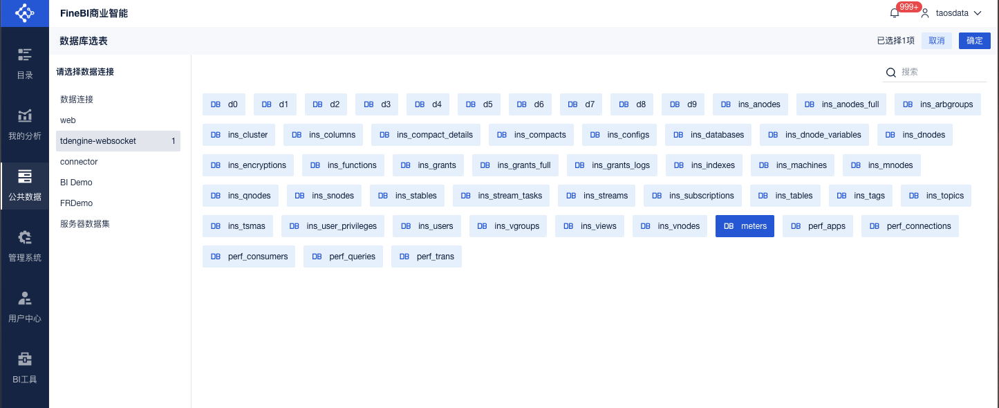

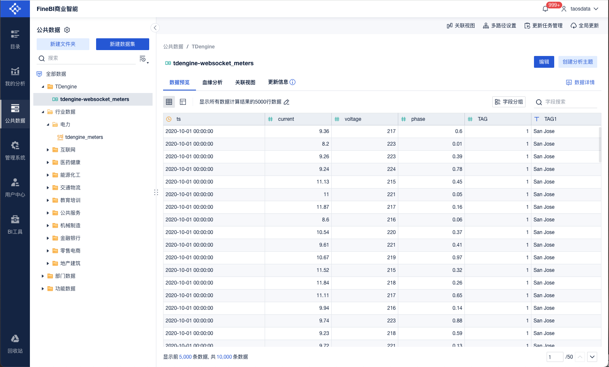

**第 3 步**，点击“SQL 数据集”，打开 SQL 数据集的配置页面，首先输入表名（用于在 FineBI 页面显示），接着在“数据来自数据连接”下拉列表中选择已创建的连接，之后输入 SQL 语句并点击预览即可看到查询结果，最后点击【确定】SQL 数据集即可创建成功。

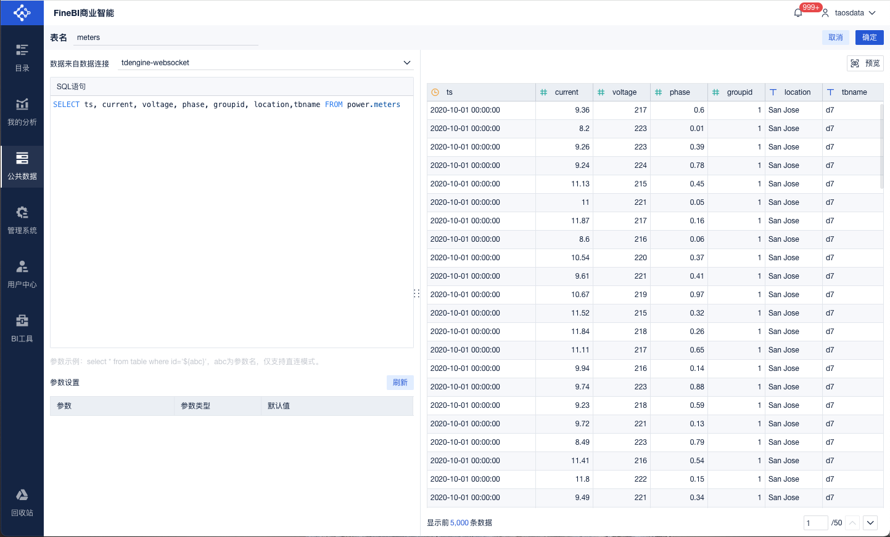

### 智能电表样例

**第 1 步**，点击【我的分析】在右侧页面中点击【新建文件夹】即可创建一个文件夹（比如 `TDengine），` 接着在文件夹的右侧点击【+】按钮，可创建“分析主题”。

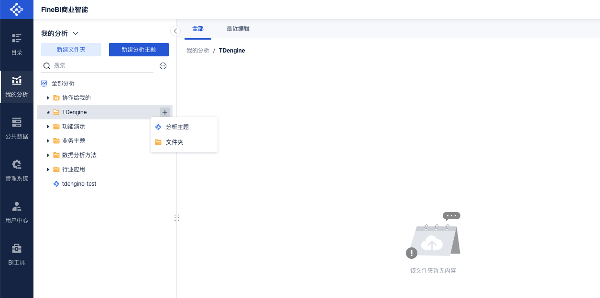

**第 2 步**，在分析主题页面选择数据集（比如 `meters`）后点击【确定】按钮，即可完成数据集关联。

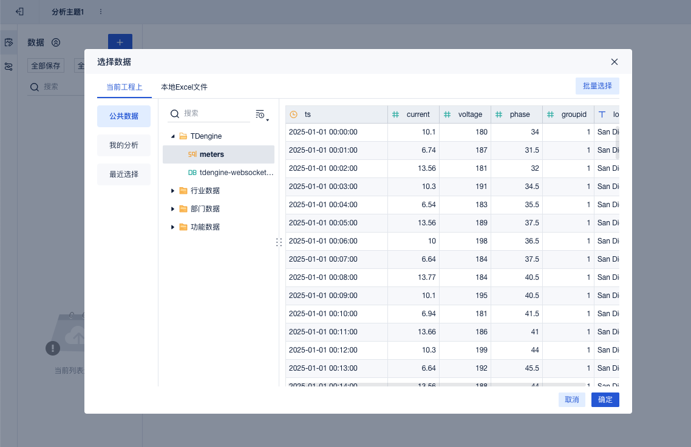

**第 3 步**，点击分析主题页面下方的【组件】标签，打开图表配置页面，拖动字段到横轴或纵轴即可展示出图表。

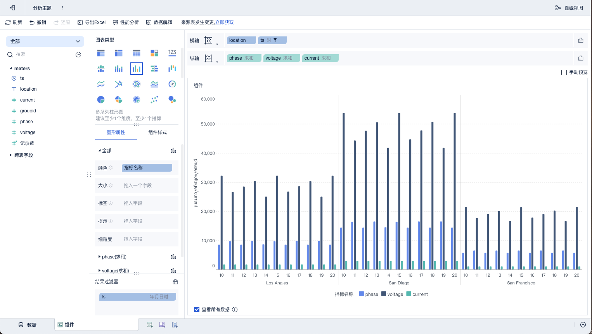
