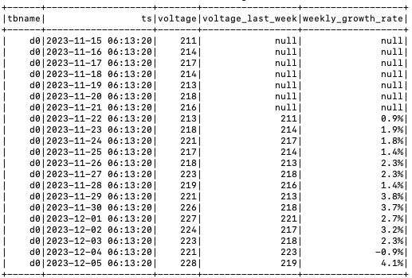

[Apache Spark](https://spark.apache.org/) 是开源大数据处理引擎，它基于内存计算，可用于批、流处理、机器学习、图计算等多种场景，支持 MapReduce 计算模型及丰富计算操作符、函数等，在大超大规模数据上具有强大的分布式处理计算能力。

通过 [TDengine TSDB Java connector](../../../reference/connector/java/)，Spark 可快速读取 TDengine TSDB 数据，利用 Spark 强大引擎，扩展 TDengine TSDB 数据处理计算能力，同时通过它，Spark 亦可把数据写入 TDengine TSDB 及从 TDengine TSDB 订阅数据。

## 前置条件

准备以下环境：

- TDengine TSDB 3.3.6.0 及以上版本集群已部署并正常运行（企业及社区版均可）。
- taosAdapter 能够正常运行，详细参考 [taosAdapter 参考手册](../../../reference/components/taosadapter)。
- Spark 3.3.2 及以上版本（ [Spark 下载](https://spark.apache.org/downloads.html)）。
- JDBC 驱动 3.6.2 及以上版本。可从 [maven.org](https://central.sonatype.com/artifact/com.taosdata.jdbc/taos-jdbcdriver) 下载。

## 配置数据源

使用 JDBC WebSocket 连接至 TDengine TSDB 数据源，连接 URL 格式为：

``` sql
jdbc:TAOS-WS://[host_name]:[port]/[database_name]?[user={user}|&password={password}]
```

详细参数见：[URL 参数介绍](../../../reference/connector/java/#url-规范)。

driverClass 指定为“com.taosdata.jdbc.ws.WebSocketDriver”。

以下示例创建 Spark 实例并连接到本机 TDengine TSDB 服务：

``` java
  // create spark instance
  SparkSession spark = SparkSession.builder()
      .appName("appSparkTest")
      .master("local[*]")
      .getOrCreate();
  
  // connect TDengine TSDB and create reader
  String url     = "jdbc:TAOS-WS://localhost:6041/?user=root&password=taosdata";
  String driver  = "com.taosdata.jdbc.ws.WebSocketDriver";
  DataFrameReader dataFrameReader = spark.read()
      .format("jdbc")
      .option("url", url)
      .option("driver", driver);

```

## 数据交互

数据接入需注册 TDengine TSDB 方言，方言中主要处理反引号，数据类型映射与 JDBC 相同，无需额外处理，参见：[JDBC 数据类型映射](../../../reference/connector/java/#数据类型映射)

下面以 JAVA 语言编写 Spark 任务，通过 `spark-submit` 提交任务执行为例，介绍数据接入，后附完整示例代码。

### 数据写入

数据写入使用参数绑定，分三步完成：

1. 创建连接。

    ``` java
      // create connect
      String url = "jdbc:TAOS-WS://localhost:6041/?user=root&password=taosdata";
      Connection connection = DriverManager.getConnection(url);
    ```

2. 绑定数据并提交。
   下面示例直接写入超级表，并使用了批量绑定方式，提高写入效率。

    ``` java
    int childTb    = 1;
    int insertRows = 21;
    String sql = "INSERT INTO test.meters(tbname, groupid, location, ts, current, voltage, phase) " +
        "VALUES (?,?,?,?,?,?,?)";
    System.out.printf("prepare sql:%s\n", sql);
    // prepare
    PreparedStatement preparedStatement = connection.prepareStatement(sql);

    // write
    for (int i = 0; i < childTb; i++ ) {
        for (int j = 0; j < insertRows; j++) {
            float current = (float)(10  + rand.nextInt(100) * 0.01);
            float phase   = (float)(1   + rand.nextInt(100) * 0.0001);
            int   voltage = (int)  (210 + rand.nextInt(20));

            preparedStatement.setString   (1, String.format("d%d", i));        // tbname
            preparedStatement.setInt      (2, i);                              // groupid
            preparedStatement.setString   (3, String.format("location%d", i)); // location

            preparedStatement.setTimestamp(4, new Timestamp(ts + j));
            preparedStatement.setFloat    (5, current);
            preparedStatement.setInt      (6, voltage);
            preparedStatement.setFloat    (7, phase);
            // add batch
            preparedStatement.addBatch();
        }
    }

    // submit
    preparedStatement.executeBatch();

    // close statement
    preparedStatement.close();

    ```

3. 关闭连接。

    ``` java
    // close
    connection.close();
    ```

[示例源码](https://github.com/taosdata/tdengine-eco/blob/main/spark/src/main/java/com/taosdata/java/DemoWrite.java)

### 数据读取

数据读取通过表映射方式读取，分四步完成：

1. 创建 Spark 交互实例。

    ``` java
    // create connect
    SparkSession spark = SparkSession.builder()
        .appName("appSparkTest")
        .master("local[*]")
        .getOrCreate();
    ```

2. 创建数据读取器。

    ``` java
    // create reader
    String url = "jdbc:TAOS-WS://localhost:6041/?user=root&password=taosdata";
    int    timeout  = 60; // seconds
    DataFrameReader reader = spark.read()
        .format("jdbc") 
        .option("url", url)
        .option("driver", driver)
        .option("queryTimeout", timeout);

    ```

3. 映射表，显示表内数据。

    ``` java
    // map table
    String dbtable = "test.meters";
    Dataset<Row> df = reader.option("dbtable", dbtable).load();
    // show
    df.show(Integer.MAX_VALUE, 40, false);
    df.close()
    ```

4. 关闭交互。

    ``` java
    spark.stop();
    ```

[示例源码](https://github.com/taosdata/tdengine-eco/blob/main/spark/src/main/java/com/taosdata/java/DemoRead.java)

### 数据订阅

数据订阅使用 JDBC 标准数据订阅方法，分四步完成：

1. 创建 spark 交互实例。

    ``` java
    SparkSession spark = SparkSession.builder()
        .appName("appSparkTest")
        .master("local[*]")
        .getOrCreate();
    ```

2. 创建消费者。

    ``` java
    // create consumer
    TaosConsumer<ResultBean> consumer = getConsumer();

    // getConsumer
    public static TaosConsumer<ResultBean> getConsumer() throws Exception {
        // property
        String cls        = "com.taosdata.java.DemoSubscribe$ResultDeserializer";
        Properties config = new Properties();
        config.setProperty("td.connect.type",             "ws");
        config.setProperty("bootstrap.servers",           "localhost:6041");
        config.setProperty("auto.offset.reset",           "earliest");
        config.setProperty("msg.with.table.name",         "true");
        config.setProperty("enable.auto.commit",          "true");
        config.setProperty("auto.commit.interval.ms",     "1000");
        config.setProperty("group.id",                    "group1");
        config.setProperty("client.id",                   "client1");
        config.setProperty("td.connect.user",             "root");
        config.setProperty("td.connect.pass",             "taosdata");
        config.setProperty("value.deserializer",          cls);
        config.setProperty("value.deserializer.encoding", "UTF-8");

        try {
            // new consumer
            TaosConsumer<ResultBean> consumer= new TaosConsumer<>(config);
            System.out.printf("Create consumer successfully, host: %s, groupId: %s, clientId: %s%n",
                    config.getProperty("bootstrap.servers"),
                    config.getProperty("group.id"),
                    config.getProperty("client.id"));
            return consumer;
        } catch (Exception ex) {
            // please refer to the JDBC specifications for detailed exceptions info
            System.out.printf("Failed to create websocket consumer, " + 
                    "host: %s, groupId: %s, clientId: %s, ErrMessage: %s%n",
                    config.getProperty("bootstrap.servers"),
                    config.getProperty("group.id"),
                    config.getProperty("client.id"),
                    ex.getMessage());
            // Print stack trace for context in examples. Use logging in production.
            ex.printStackTrace();
            throw ex;
        }
    }  
    ```

3. 订阅主题，消费数据放至 spark 中并显示。

    ``` java
    // poll
    pollExample(spark, consumer);

    // pollExample
    public static void pollExample(SparkSession spark, TaosConsumer<ResultBean> consumer) 
                                  throws SQLException, JsonProcessingException {
        List<String> topics = Collections.singletonList("topic_meters");
        List<Row> data = new ArrayList<>();

        //
        // obtain data
        //
        try {
            // subscribe  topics
            consumer.subscribe(topics);
            System.out.println("Subscribe topics successfully.");
            for (int i = 0; i < 100; i++) {
                // poll data
                ConsumerRecords<ResultBean> records = consumer.poll(Duration.ofMillis(100));
                for (ConsumerRecord<ResultBean> record : records) {
                    ResultBean bean = record.value();
                    // Add your data processing logic here
                    // covert bean to row
                    data.add(RowFactory.create(
                        bean.getTs(),
                        bean.getCurrent(),
                        bean.getVoltage(),
                        bean.getPhase(),
                        bean.getGroupid(),
                        bean.getLocation()
                    ));
                    
                }
            }

        } catch (Exception ex) {
            // catch except
            System.out.printf("Failed to poll data, topic: %s, ErrMessage: %s%n",
                    topics.get(0),
                    ex.getMessage());
            ex.printStackTrace();
        }

        //
        // put to spark dataframe and show
        //
        StructType schema = generateSchema();
        Dataset<Row> df   = spark.createDataFrame(data, schema);

        // show
        System.out.println("------------- below is subscribe data --------------");
        df.show(Integer.MAX_VALUE, 40, false);
    }
    ```

4. 取消订阅，释放资源。

    ``` java
    // close
    consumer.unsubscribe();
    consumer.close();
    // stop
    spark.stop();
    ```

[示例源码](https://github.com/taosdata/tdengine-eco/blob/main/spark/src/main/java/com/taosdata/java/DemoSubscribe.java)

## 数据分析

### 场景介绍

示例场景为一个家庭使用的智能电表，数据存储在 TDengine TSDB, 分析单台智能电表每周用电的电压变化情况。

### 数据准备

生成一个超级表，一个子表，每天会固定产生一条数据，生成三周数据共 21 条，电压数据在 210 ~ 230 范围内随机变化。

### 分析电压周变化率

LAG() 函数是 Spark 提供获取当前行之前某行数据的函数，示例使用此函数进行电压周变化率分析。

1. 通过 TDengine TSDB SQL 获取数据并创建 Spark View, 详见 createSparkView()。

    ``` sql
    select tbname,* from test.meters where tbname='d0'
    ```

2. 使用 Spark SQL 查询 Spark View 数据，计算电压周变化率，SQL 如下：

    ``` sql
    SELECT tbname, ts, voltage,
          (LAG(voltage, 7) OVER (ORDER BY tbname)) AS voltage_last_week, 
          "CONCAT(ROUND(((voltage - (LAG(voltage, 7) OVER (ORDER BY tbname))) / (LAG(voltage, 7)
          OVER (ORDER BY tbname)) * 100), 1),'%') AS weekly_growth_rate ",
          FROM sparkMeters
    ```

3. 输出分析结果，如图：  
    

Spark 接入 TDengine TSDB 数据源后，可进一步支持跨数据库分析、数据集交 / 并 / 差运算、带 WHERE 子查询过滤、普通列 JOIN 等复杂数据处理功能。

## 示例源码

示例为 JAVA 语言编写，编译运行参考示例源码目录下 README。  
[完整示例源码](https://github.com/taosdata/tdengine-eco/tree/main/spark)
