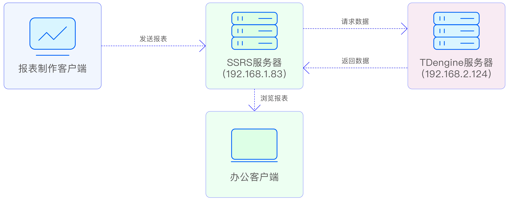
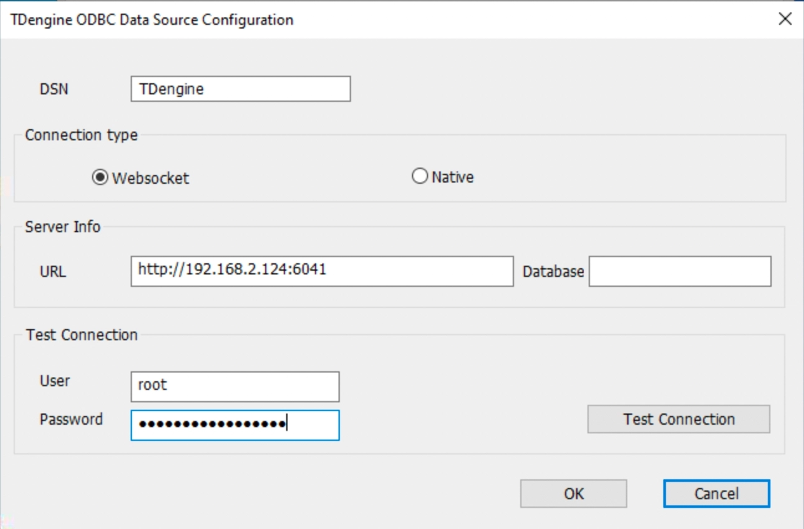
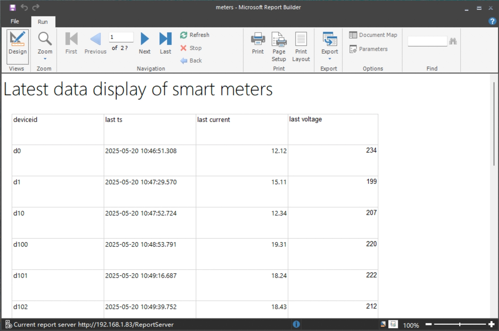
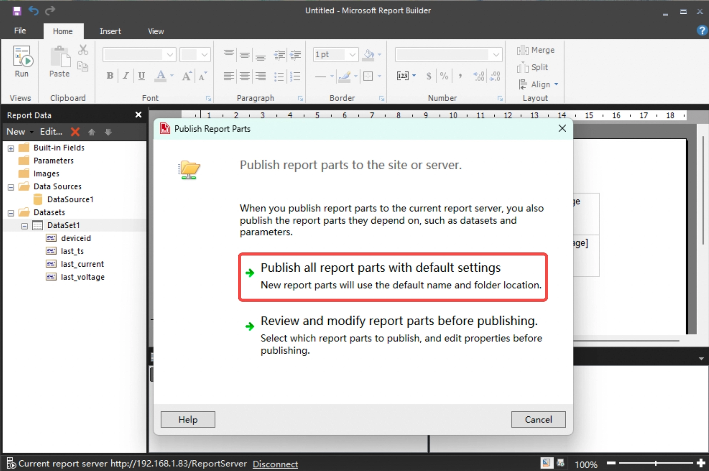
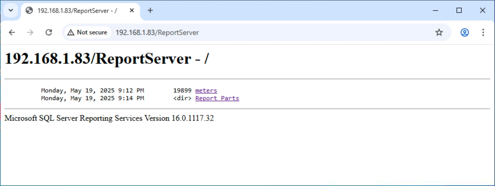

[SQL Server Reporting Services](https://learn.microsoft.com/zh-cn/sql/reporting-services/) (SSRS) 作为微软 SQL Server 数据库平台内置组件，为企业级报表制作、浏览及管理提供强大支持。与微软旗下另一可制作灵活多样报表工具 Power BI 相比，SSRS 更适合于制作传统固定格式报表。

TDengine TSDB 支持标准 ODBC 接口，SSRS 可实现无缝对接 TDengine TSDB。TDengine TSDB 高性能数据存储与查询能力为 SSRS 报表引擎提供实时数据源，SSRS 可视化报表生成功能则将 TDengine TSDB 中的物联网、金融等时序数据转化为直观业务洞察信息，满足了企业对跨平台报表解决方案的需求，同时通过标准化接口保障了数据交互安全与稳定性，为构建现代化数据驱动型组织提供坚实的技术支撑。

## 前置条件
本示例需准备两台服务器两台客户端，搭建 SSRS 示例环境，网络部署图：
  


环境准备如下：
### TDengine TSDB 服务器

- 操作系统不限。
- 安装 TDengine TSDB 3.3.3.0 或以上服务器版（企业及社区版均可）。
- taosAdapter 服务正常运行，检查参考 [taosAdapter 使用手册](../../../reference/components/taosadapter)。
- 服务器 IP：192.168.2.124。
- 提供 WebSocket 服务：端口 6041（默认）。

### SSRS 服务器

- 要求 Windows 操作系统。
- 安装 TDengine TSDB 3.3.3.0 或以上 Windows 客户端版（默认安装 TDengine TSDB ODBC 驱动）。
- 安装 Microsoft SQL Server 2022 且数据库服务正常运行，[下载安装](https://www.microsoft.com/zh-cn/sql-server/sql-server-downloads)。
- 安装 Microsoft SQL Server 2022 Reporting Service 且报表服务正常运行，[下载安装](https://learn.microsoft.com/zh-cn/sql/reporting-services/install-windows/install-reporting-services?view=sql-server-ver16)。
- 配置 Microsoft SQL Server 2022 Reporting Service 使用 IP 地址对外提供服务。
  
  

   记录上图中“Report Server Web Service URLs”址址，会在后面步骤中使用。


### 报表制作客户端

- 要求 Windows 操作系统。
- 安装 TDengine TSDB 3.3.3.0 或以上 Windows 客户端版（默认安装 TDengine TSDB ODBC 驱动）。
- 安装 Microsoft Report Builder（32 位），提供报表开发服务，[下载安装](https://www.microsoft.com/en-us/download/details.aspx?id=53613)。
- 配置 Microsoft Report Builder 上报报表服务器地址，应填写前面记录的“Report Server Web Service URLs”址址。
  
  

### 办公客户端

- 操作系统不限。
- 网络要求可连接至 SSRS 服务器。
- 安装任意一款浏览器软件。


## 配置数据源
SSRS 通过 ODBC 访问 TDengine TSDB 数据源，配置步骤如下：

1. SSRS 服务器配置 ODBC 数据源   
   打开 ODBC 数据源管理器（64 位），选择“System DSN”->“Add...”->“TDengine”->“Finish”, 弹出配置窗口如下：

   

   - DSN：填写“TDengine”。
   - Connect type：选择“WebSocket”。
   - URL：`http://192.168.2.124:6041`。
   - User/Password：填写连接 TDengine TSDB 数据库用户名/密码，不填写使用默认。
   
   点击“Test Connection”，连接成功表示配置正确，点击“OK”保存配置。

2. 报表制作 Window 客户端配置 ODBC 数据源。  
   打开 ODBC 数据源管理器（32 位），选择“System DSN”->“Add...”->“TDengine”->“Finish”, 弹出 ODBC 数据源配置窗口，内容填写请与上一步相同。

   点击“Test Connection”，连接成功表示配置正确，点击“OK”保存配置。

3. Report Builder 创建数据源连接。  
   启动 Report Builder，左侧区域内“Data Source”项上点右键，点击“Add Data Source...”菜单，如图：

   

   - Name：填写数据源名称。
   - 数据源方式：选择第二项“Use a connection embedded in my report”。
   - Select Connection type：选择“ODBC”数据源。
   - Connection string：点击旁边“Build...”按钮，按上图选择填写。
   
   点击“Test Connection”，连接成功表示配置正确，点击“OK”保存配置。


## 数据分析


### 场景介绍
某小区有 500 台智能电表，数据存储在 TDengine TSDB 数据库中，电力公司要求数据运营部门制作一张能够分页浏览此小区每台智能电表最后一次上报电压及电流值的报表，分析居民用电情况，同时要求报表可在公司内任意一台办公电脑上登录后浏览。

开发人员使用微软提供的 SSRS 报表服务完成此项工作，使用 Report Builder 制作好报表，上传至报表服务器后供相关人员浏览。

### 数据准备
创建一张超级表，500 子表，每子表代表一台智能电表，生成电压数据在 198 ~ 235 内波动，电流在 10A ~ 30A 内波动。

### 制作报表
1. 打开 Report Builder 开始制作报表。
2. 创建新数据集。  
   左侧区域内“DataSource”->“DataSource1”->“Add Dataset...”。

   

   - Name：填写数据集名称。
   - 数据集方式：选择第二项“Use a dataset embedded im my report”。
   - Data source：选择前面创建好的“DataSource1”。
   - Query type：选择“text”类型查询，填写如下查询分析 SQL：
    
   ``` sql
   SELECT 
      tbname        as DeviceID, 
      last(ts)      as last_ts, 
      last(current) as last_current, 
      last(voltage) as last_voltage 
   FROM test.meters 
   GROUP BY tbname 
   ORDER BY tbname;
   ```
   
3. 制作报表页面。   
   菜单“Insert”->“Table”->“Insert Table”，插入空表格，用鼠标把左侧“DataSet1”中数据列用拖到右侧报表制作区域内放置到自己想要展示的列上，如图：

   

4. 预览。   
   点击菜单“Home”->“Run”按钮，预览报表效果。

   

5. 退出预览。  
   点击工具栏左侧第一个图标“Design”关闭预览，回到设计界面继续设计。

### 发送报表
1. 保存报表到服务器上。  
   点击“File”菜单->“Save”，如图：
   
   

2. 报表数据源连接组件发布到服务器。  
   点击“File”菜单->“Publish Report Parts”。
   

   选择第一项“Pubsh all report parts with default settings”，会把报表使用数据源配置一起发送至服务器。

### 浏览报表
报表发送至服务器后，报表即被共享出去了，可在任意客户端通过浏览器访问浏览报表数据。
1. 查看报表浏览地址。  
   报表浏览地址在 SSRS 服务器配置中，如下：

   

2. 输入访问授权。  
   客户端第一次访问报表数据时，会弹出授权窗口要求登录，输入报表服务器操作系统登录账号即可。

   

   账号输入成功后，会出现如下页面，可以看到前面保存上传的报表“meters”。

   

3. 分页浏览报表。  
   点击“meters”，会分页展示小区内所有智能电表最新采集数据。

   

### 管理报表
   对 SSRS 服务器上报表进行管理，可参考 [微软官网文档](https://learn.microsoft.com/zh-cn/sql/reporting-services/report-builder/finding-viewing-and-managing-reports-report-builder-and-ssrs?view=sql-server-ver16)。


以上流程，我们使用了 SSRS 开发了基于 TDengine TSDB 数据源的一个简单报表制作、分发、浏览系统，更多丰富的报表还有待您的进一步开发。