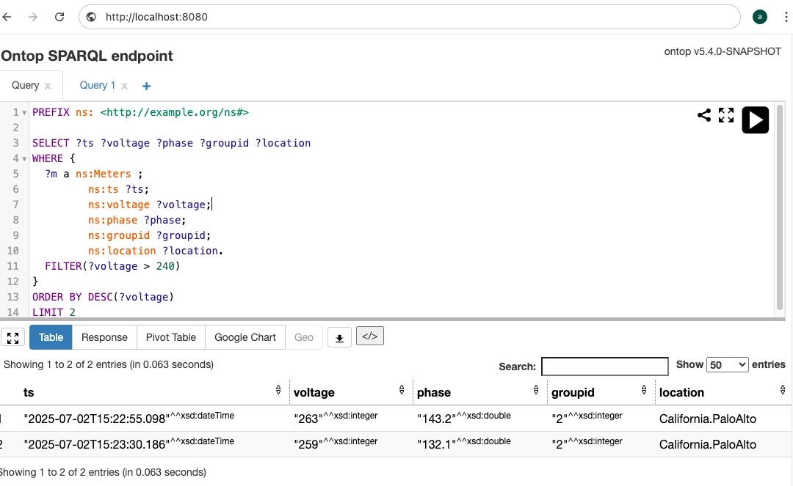

[Ontop](https://ontop-vkg.org/) 是由意大利博尔扎诺自由大学 KRDB 研究小组开发的开源虚拟知识图谱系统，它能够将关系数据库内容动态转化为知识图谱，数据无需从原始数据源中迁移。

通过 SPARQL（W3C 制定的 RDF 查询语言）接口查询数据，并将结果转换为 RDF 格式。

支持包括 MySQL、PostgreSQL、Oracle、SQL Server、SQLite 和 **TDengine TSDB** 在内的多种数据库。

## 前置条件

Ontop 通过 [TDengine TSDB Java Connector](../../../reference/connector/java/) 连接 TDengine TSDB 数据源，需准备以下环境：

- TDengine TSDB 3.3.6.0 及以上版本集群已部署并正常运行（企业及社区版均可）。
- taosAdapter 能够正常运行，详细参考 [taosAdapter 参考手册](../../../reference/components/taosadapter)。
- JDBC 驱动 3.6.0 及以上版本，[下载](https://mvnrepository.com/artifact/com.taosdata.jdbc/taos-jdbcdriver)。
- Ontop 支持 TDengine TSDB 功能已合入 `version5` 分支但未发布，请 [下载源码](https://github.com/ontop/ontop) 并参照 README 构建。

## 配置数据源

在 Ontop 中配置 TDengine TSDB 数据源需以下步骤：

### 安装 JDBC 驱动

下载 JDBC 的 DIST 驱动包（`.jar`文件）置于 Ontop 主程序的 `jdbc/` 目录下。

### 配置 JDBC 驱动

在 Ontop 的 `.properties` 文件中配置 JDBC 连接信息：

``` sql
jdbc.url = jdbc:TAOS-WS://[host]:[port]/[database]
jdbc.user = [用户名]
jdbc.password = [密码]
jdbc.driver = com.taosdata.jdbc.ws.WebSocketDriver
```

URL 参数详情参阅：[TDengine TSDB URL 规范](../../../reference/connector/java/#url-规范)。

### 配置表映射

在 .obda 文件中定义 TDengine TSDB 与 Ontop 的映射关系（以智能电表场景为例）：

``` properties
[PrefixDeclaration]
:   http://example.org/tde
ns: http://example.org/ns#

[MappingDeclaration] @collection [[
  mappingId meters-mapping
  target ns:{ts} a ns:Meters ; ns:ts {ts} ; ns:voltage {voltage}; ns:phase {phase}; ns:groupid {groupid}; ns:location {location}^^xsd:string .
  source SELECT ts, voltage, phase, groupid, location  from test.meters
]]
```

##### 格式说明

| 关键字段  | 说明  |
|:-------  |:----------------------------------- |
| mappingId | 映射 ID，唯一标识该映射关系            |
| source   | TDengine TSDB SQL 查询语句（支持复杂查询）   |  
| target   | 字段映射关系（未指定类型时按默认规则转换） |

##### 转化规则

在 target 中可指定映射数据类型，若未指定则按以下规则转化

| TDengine TSDB JDBC 数据类型 | Ontop 数据类型  |
|:-------------------- |:----------------|
| java.sql.Timestamp   | xsd:datetime    |  
| java.lang.Boolean    | xsd:boolean     |
| java.lang.Byte       | xsd:byte        |
| java.lang.Short      | xsd:short       |
| java.lang.Integer    | xsd:int         |
| java.lang.Long       | xsd:long        |
| java.math.BigInteger | xsd:nonNegativeInteger |
| java.lang.Float      | xsd:float       |
| java.lang.Double     | xsd:double      |
| byte[]               | xsd:base64Binary|
| java.lang.String     | xsd:string      |
| java.math.BigDecimal | xsd:decimal     |

完整 .obda 文件格式介绍请参考 [Ontop OBDA 文档](https://ontop-vkg.org/guide/advanced/mapping-language.html)。

### 测试连接

启动 Ontop 端点服务验证配置：

``` bash
ontop endpoint -p db.properties -m db.obda --port 8080
```

访问 `http://localhost:8080` ，若显示 SPARQL 查询界面，则表示配置成功。

## 数据分析

### 场景介绍

某小区居民的智能电表数据存储在 TDengine TSDB 数据库中，使用 Ontop 将 TDengine TSDB 中的智能电表数据转化为虚拟知识图谱，通过 SPARQL 接口查询出电压超过 240V 的高负载设备。

### 数据准备

通过 taosBenchmark 生成模拟数据：

``` bash
# 生成 100 台设备，每台 1000 条记录
taosBenchmark -t 100 -n 1000 -y
```

### 配置文件

**db.properties**​（连接配置）：

``` sql
jdbc.url=jdbc:TAOS-WS://localhost:6041/test
jdbc.user=root
jdbc.password=taosdata
jdbc.driver=com.taosdata.jdbc.ws.WebSocketDriver   
```

**db.obda** （映射配置）：  
复用 [配置表映射](#配置表映射) 一节中示例内容。

### 分析电表负载

1. 制作 SPARQL 查询语句。  
   查询电压超过 240V 的智能电表设备，按电压倒序排列显示前 2 条：

   ``` sparql
    PREFIX ns: <http://example.org/ns#>

    SELECT ?ts ?voltage ?phase ?groupid ?location
    WHERE {
        ?m a ns:Meters ;
                ns:ts ?ts;
                ns:voltage ?voltage;
                ns:phase ?phase;         
                ns:groupid ?groupid;
                ns:location ?location.
        FILTER(?voltage > 240)
    }
    ORDER BY DESC(?voltage)
    LIMIT 2
   ```

   [SPARQL 语法参考](https://www.w3.org/TR/sparql11-query/)
2. 在 SPARQL 查询界面输入上述语句，点击“运行”按钮，查询结果如下：

   

3. 结果以 SPARQL JSON 格式返回，包含了电表采集时间戳、采集电压、相位、分组 ID 及设备位置等信息。

   ``` json
   {
    "head" : {
        "vars" : [
        "ts",
        "voltage",
        "phase",
        "groupid",
        "location"
        ]
   },
    "results" : {
        "bindings" : [
        {
            "ts" : {
            "datatype" : "http://www.w3.org/2001/XMLSchema#dateTime",
            "type" : "literal",
            "value" : "2025-07-02T15:22:55.098"
            },
            "voltage" : {
            "datatype" : "http://www.w3.org/2001/XMLSchema#integer",
            "type" : "literal",
            "value" : "263"
            },
            "phase" : {
            "datatype" : "http://www.w3.org/2001/XMLSchema#double",
            "type" : "literal",
            "value" : "143.2"
            },
            "groupid" : {
            "datatype" : "http://www.w3.org/2001/XMLSchema#integer",
            "type" : "literal",
            "value" : "2"
            },
            "location" : {
            "type" : "literal",
            "value" : "California.PaloAlto"
            }
        },
        {
            "ts" : {
            "datatype" : "http://www.w3.org/2001/XMLSchema#dateTime",
            "type" : "literal",
            "value" : "2025-07-02T15:23:30.186"
            },
            "voltage" : {
            "datatype" : "http://www.w3.org/2001/XMLSchema#integer",
            "type" : "literal",
            "value" : "259"
            },
            "phase" : {
            "datatype" : "http://www.w3.org/2001/XMLSchema#double",
            "type" : "literal",
            "value" : "132.1"
            },
            "groupid" : {
            "datatype" : "http://www.w3.org/2001/XMLSchema#integer",
            "type" : "literal",
            "value" : "2"
            },
            "location" : {
            "type" : "literal",
            "value" : "California.PaloAlto"
            }
        }
        ]
      }
   }
   ```

## 总结

本文通过 TDengine TSDB 与 Ontop 集成：

- 实现了时序数据到 RDF 自动转换，支持 SPARQL 语义化查询。
- 提供了符合 W3C 标准的统一数据访问接口。
- 解锁了工业 IoT 的知识图谱分析与推理能力。

该集成开创了时序数据库领域的智能新范式，通过结合知识图谱的强逻辑推理和大语言模型的泛化能力，为复杂物联网场景（如设备故障根因分析、能效优化等）提供具备认知能力的智能分析解决方案。
