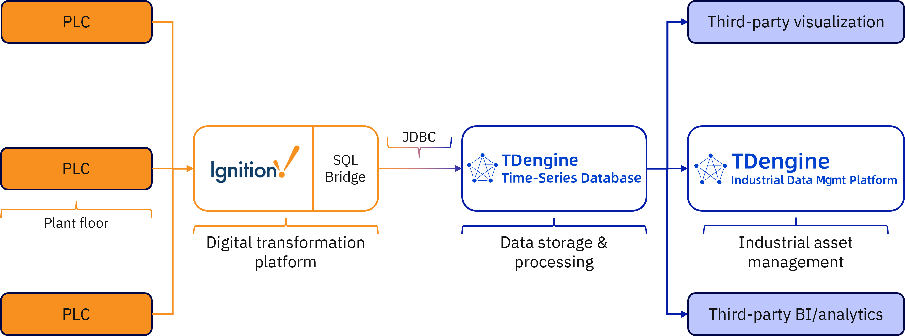

# TDengine 与 Ignition 集成

[Ignition](https://inductiveautomation.com/ignition/) 由 Inductive Automation 出品，是一个强大的工业应用平台，用于构建和部署 SCADA、HMI 以及工业物联网（IIoT）系统。它为工业运营提供了统一的开发环境，实现实时数据采集、可视化、报警、报表和控制。

Ignition 通过其 SQL Bridge 模块支持多种 SQL 数据库，您可以通过 JDBC 在 Ignition 部署中添加数据库连接。

本文介绍如何在 Ignition 中安装 TDengine TSDB 的 JDBC 连接器并集成产品，使您能够在 [TDengine IDMP](https://www.taosdata.com/idmp) 及其他应用中使用来自 Ignition 的数据。

TDengine–Ignition 集成架构

## 前置条件

- 安装 TDengine TSDB，请参考 [快速开始](https://docs.taosdata.com/get-started/)。
- 安装 Ignition，请参考 [官方文档](https://www.docs.inductiveautomation.com/)。

## 配置数据源

1. 从 [Maven](https://central.sonatype.com/artifact/com.taosdata.jdbc/taos-jdbcdriver) 下载 TDengine TSDB JDBC 连接器。
    - 在 **Versions** 标签页，点击最新版本旁的 Browse。
    - 在打开的页面下载 `taos-jdbcdriver-<version>-dist.jar` 文件到本地。

2. 按照 [Ignition 文档](https://www.docs.inductiveautomation.com/docs/8.1/platform/database-connections/connecting-to-databases/jdbc-drivers-and-translators#add-a-new-jdbc-driver) 添加新的 JDBC 驱动，并选择上一步下载的 JAR 文件。

3. 按如下方式配置驱动：
    - **Classname:** 输入 `com.taosdata.jdbc.rs.RestfulDriver`。
    - **URL Format:** 输入 `jdbc:TAOS-RS://<taosAdapter-address:port>/<database-name>`。
    - 其他选项保持默认，无需配置数据库翻译器。

4. 按照 [Ignition 文档](https://www.docs.inductiveautomation.com/docs/8.1/platform/database-connections/connecting-to-databases#add-a-database-connection) 添加新的数据库连接：
    - 选择上一步创建的 JDBC 驱动。
    - 在 **Connect URL** 字段输入 `jdbc:TAOS-RS://<taosAdapter-address:port>/<database-name>`。

## 使用方法

现在，您可以在 Ignition 的 SQL Bridge 模块中使用 TDengine TSDB。Ignition 的数据流入 TDengine TSDB 后，您还可以在 TDengine IDMP 中利用这些数据构建资产模型、进行实时分析和生成 AI 驱动的可视化。
