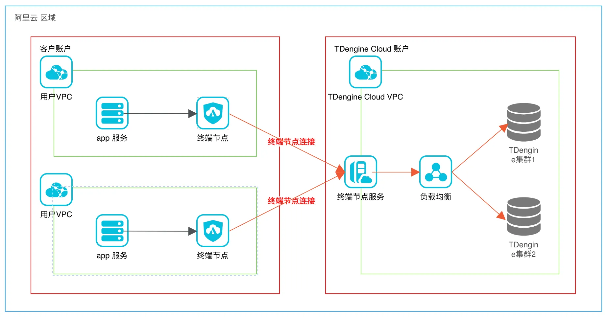
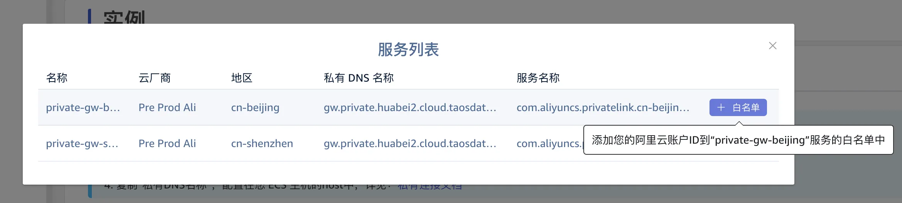
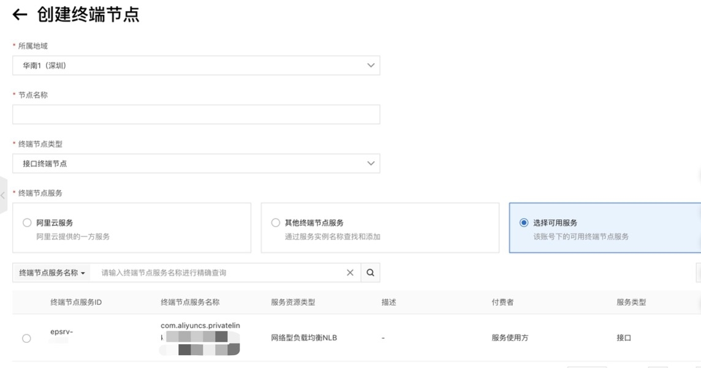
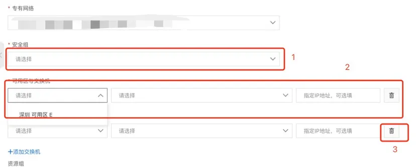
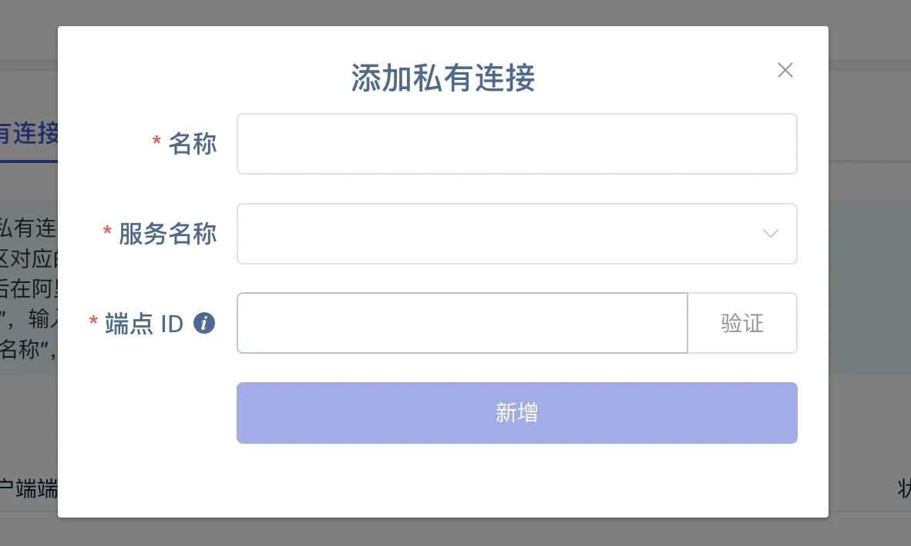
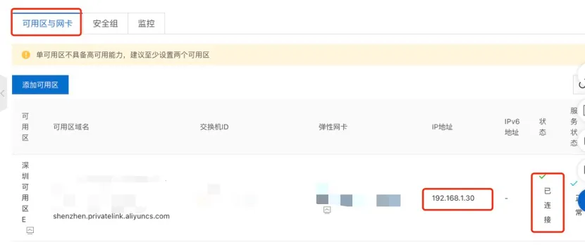

<!-- markdownlint-disable MD033 -->
## 介绍

阿里云 私网连接（PrivateLink）是一种高可用、可扩展的技术，您可以使用它将您的应用程序连接到阿里云同一个地域或者不同地域的 TDengine Cloud 实例。
"私有网络连接"允许您阿里云中的应用程序通过您的私有 IP 地址连接到 TDengine Cloud 实例的私有网关地址，而不是公共互联网网关地址。既节省公共互联网的网络流量开销，又提高了连接 TDengine Cloud 实例的带宽。

PrivateLink 的架构如下：

<figcaption>图 1. TDengine Cloud 私网连接架构</figcaption>

有关 阿里云 私网连接（PrivateLink）概念的更多详细信息，请参阅以下文档：

[什么是私网连接](https://help.aliyun.com/document_detail/161974.html)

[阿里云私网连接概述](https://help.aliyun.com/document_detail/2539840.html)

## 如何使用私网链接

### 步骤 1：在 TDengine Cloud 中选择终端服务并配置白名单

1. 登录 TDengine Cloud 打开 [实例](https://console.cloud.taosdata.com/instances/privateLink) 页面，选择右侧 "私有连接" 页签，在页面上点击 **服务列表** 按钮。
2. 在服务列表里选择和您 VPC 所在可用区的服务，点击操作栏 **添加白名单**按钮，输入您的阿里云账号 ID。
   
   
<figcaption>图 2. 添加白名单</figcaption>

3. 在阿里云创建您的终端节点，此时可以选择到 TDengine Cloud 的终端服务。

### 步骤 2: 在阿里云控制台配置终端节点

使用阿里云管理控制台创建终端节点，请按照以下步骤操作：

1. 登录阿里云控制台 [阿里云控制台](https://home.console.aliyun.com/home)，打开阿里云 VPC 控制台 [专有网络](https://vpc.console.aliyun.com/)。
2. 从区域下拉列表中选择您的 VPC 所在的地域。在左侧导航栏中单击**终端节点**，在右侧页面单击左上角的**创建终端节点**，进入**创建终端节点**页面。

   
   
<figcaption>图 3. 创建终端节点</figcaption>

3. 选择**接口终端节点**。
4. **步骤 1 中添加服务白名单成功，这里就可以看到可用服务，选中可用服务。**
5. 选择业务服务所在的 vpc，添加完专有网络，会出现下面两个选择项。

   
   
<figcaption>图 4. 设置安全组&网络交换机</figcaption>

6. 选择已有安全组或者创建一个，**请开放 443 端口**。不开放 443 将不能访问您的 TDengine Cloud 服务实例。
7. 可用区交换机如果存在要选择在端点服务所在可用区，不存在请创建一个；这里默认要填两个，删掉第二个。
8. 单击创建端点。等待创建成功，在终端节点详情页面您即可得到**VPC 终端节点 ID**。

### 步骤 3: 在 TDengine Cloud 添加私有网络连接

1. 在 TDengine Cloud 左侧导航面板中，选择**实例**，在右侧页面选择**私有连接**选项卡，点击右上角的**添加私有连接**。将显示 **添加私有连接** 页面。如下图：
  
   
   
<figcaption>图 5. 添加私有连接</figcaption>

2. 输入您的连接名称，选择您在阿里云控制台创建终端节点时选择的端点服务，然后输入您在步骤 2 中创建的 **终端节点 ID**。
3. 单击**验证**按钮来验证连接请求是否存在并且可以被接受。
4. 单击“**新增**”按钮创建**端点连接**。
5. 您可以在**私有连接**页面的连接列表中找到连接信息。
6. 等待几分钟，然后刷新页面即可看到连接状态为 **已连接**。
7. 连接有三种状态：**已连接**、**已断开连接** 和 **处理中**。当操作正在进行时，连接状态为 **处理中**。您需要等待几分钟才能完成操作。

### 步骤 4: 在您的 ECS 主机配置私有域名 DNS

1. 从阿里云控制台，进入私网连接控制台，找到您在步骤 2 中创建的终端节点，单击查看。
2. 在右侧终端节点详情页面中选择**可用区与网卡**选项卡，可以看到如下图页面。

   
   
<figcaption>图 6. 查看终端节点 IP</figcaption>

3. 复制图上**IP 地址**栏，在 TDengine Cloud 控制台 **私有连接**列表，复制对应可用区终端服务**私有 DNS 名称**栏（如下图）。
   
   
<figcaption>图 7. 查看私有 DNS</figcaption>

4. **登录您的 ECS 主机，修改 /etc/hosts 文件。格式:\{终端节点 IP} \{私有 DNS}。**
5. 验证：curl -d "show databases;" **https**://\{私有 DNS}/rest/sql?token=$\{token} ，请参看[编程 - REST API](../../programming/connect/rest-api)。

### 步骤 5:使用私有 DNS 调用 TDengine Cloud 服务

现在您可以使用私有 DNS 名称访问 VPC 中的 TDengine Cloud 实例。请参考[实例 - 实例列表](../list)，找到**私有 URL**。

## 如何删除端点连接

1. 点击 TDengine Cloud **私有连接**页面中的**操作**按钮。稍后，连接状态将变为**已断开连接**。

   
   
<figcaption>图 8. 删除私有连接</figcaption>

2. 删除 TDengine Cloud **私有连接**页面中的连接。
3. 在阿里云控制台中删除终端节点。否则，阿里云将继续收费。
   1. 在阿里云专有网络控制台的 **终端节点** 页面中选择端点。
   2. 单击列表“**操作**”栏“**删除**”按钮。
