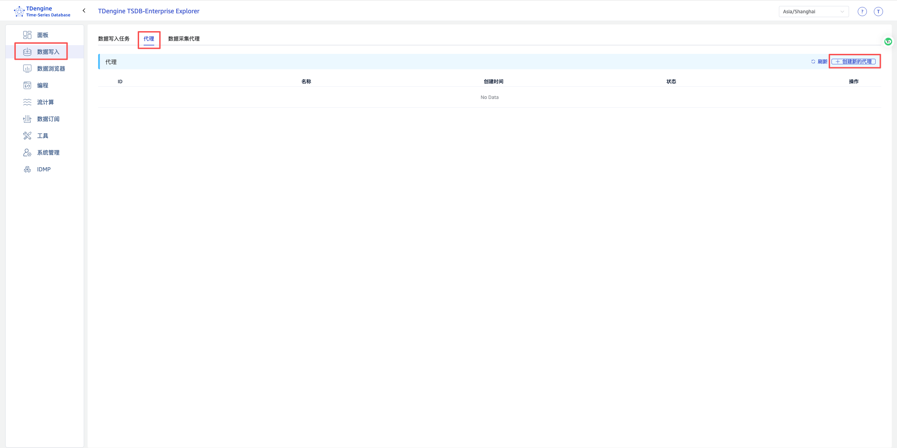
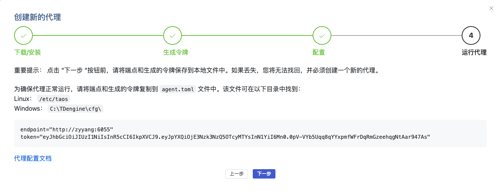
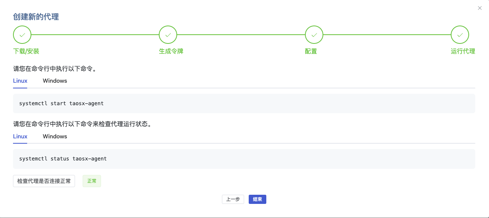

import Tabs from "@theme/Tabs";
import TabItem from "@theme/TabItem";

## 概述

taosX-Agent 是 TDengine TSDB Enterprise 的一个组件，作为 taosX 的代理服务，部署在靠近数据源的环境中，负责从数据源采集数据并转发给 taosX。

当 taosX 无法直接访问数据源时——例如数据源位于隔离的 OT 网络、工控网段或受限的内网环境——可以在数据源所在网络部署 taosX-Agent，由它代理完成数据采集与转发。

典型使用场景：

- **OPC UA/DA 数据接入**：OPC Server 部署在隔离工控网段，taosX 部署在 IT 网络或云端，通过 Agent 代理采集。
- **PI 系统数据接入**：PI 系统部署在 OT 网络，taosX-Agent 部署在可访问 PI 系统的 Windows 主机上，代理数据传输。
- **其他受限网络场景**：任何 taosX 与数据源之间网络不通的场景，均可通过 Agent 代理解决。

### 功能特性

| 功能         | 说明                                                                                                              |
| ------------ | ----------------------------------------------------------------------------------------------------------------- |
| 数据代理采集 | 代理 taosX 从 OPC UA、OPC DA、PI 等数据源采集数据                                                                 |
| 数据压缩传输 | 支持开启 Agent 与 taosX 之间的通信数据压缩，降低带宽消耗                                                          |
| 内存缓存     | 支持配置内存缓存批次数，提升数据传输效率                                                                          |
| 断线重连     | 支持 taosX 服务不可用时保持运行并自动重连                                                                         |
| 存储转发     | 网络中断时将采集数据持久化到本地磁盘，网络恢复后自动补发，确保数据零丢失。详见 [存储转发](./store-and-forward.md) |
| 多实例部署   | 同一台机器可部署多个 Agent 实例，通过 instanceId 区分                                                             |

## 获取 taosX-Agent

请访问 [TDengine 下载中心](https://www.taosdata.com/download-center)，在产品列表中选择 **TDengine taosX-Agent**，然后选择对应的版本、操作系统和架构，下载安装包。

:::note
taosX-Agent 仅在 TDengine TSDB Enterprise（企业版）中提供，社区版不包含此组件。
:::

## 前置条件

### 网络要求

taosX-Agent 需要与 taosX 服务以及数据源分别保持网络连通：

| 方向           | 说明                                                             |
| -------------- | ---------------------------------------------------------------- |
| Agent → taosX  | Agent 需要能够访问 taosX 的 gRPC 服务端口（默认 6055）           |
| Agent → 数据源 | Agent 需要能够访问数据源（如 OPC UA Server、PI Data Archive 等） |

:::tip
部署前建议先验证 Agent 到 taosX 的网络连通性：

```bash
# Linux
nc -zv <taosX_host> 6055

# Windows PowerShell
Test-NetConnection -ComputerName <taosX_host> -Port 6055
```

:::

### 平台要求

- **通用场景**：Linux 或 Windows 均可部署 Agent。
- **PI 数据接入场景**：Agent 必须部署在 Windows 上，因为 PI AF SDK 仅支持 Windows。且 Agent 主机上必须安装 PI AF SDK（PI AF Client 2018+）和 .NET Framework 4.8+。

### 依赖服务

- **taosX**：taosX-Agent 必须连接到一个正在运行的 taosX 实例。
- **taosExplorer**：需要通过 Explorer 界面创建 Agent 并获取 Token。

## 安装

从 [TDengine 下载中心](https://www.taosdata.com/download-center) 下载对应平台的 taosX-Agent 安装包后，按照安装包的引导完成安装。

安装完成后，taosX-Agent 的相关文件位于：

| 项目       | Linux                    | Windows                       |
| ---------- | ------------------------ | ----------------------------- |
| 可执行文件 | `/usr/bin/taosx-agent`   | `C:\TDengine\taosx-agent.exe` |
| 配置文件   | `/etc/taos/agent.toml`   | `C:\TDengine\cfg\agent.toml`  |
| 日志目录   | `/var/log/taos/`         | `C:\TDengine\log\`            |
| 服务名称   | `taosx-agent`（systemd） | `taosx-agent`（Windows 服务） |

## 使用

### 第 1 步：在 Explorer 中创建 Agent

1. 登录 taosExplorer 界面。
2. 在左侧导航栏点击 **数据写入**。
3. 在顶部选择 **代理** 标签页。
4. 点击右上角的 **+创建新的代理** 按钮。



5. 按照创建代理的指引操作，系统会生成 **endpoint** 和 **token**，请将其复制保存到 `agent.toml` 配置文件中。



:::warning
请在点击"下一步"前保存好 endpoint 和 token。如果丢失，将无法找回，必须重新创建代理。
:::

### 第 2 步：修改配置文件

编辑配置文件，填入从 Explorer 获取的信息：

```toml
# taosX 的 gRPC 服务地址（必填）
endpoint = "http://<taosX_host>:6055"

# 在 Explorer 中创建 Agent 时生成的 Token（必填）
token = "<your_token>"
```

完整的配置项说明请参考 [配置参考](./configuration.md)。

### 第 3 步：启动服务

<Tabs>
<TabItem value="linux" label="Linux" default>

```bash
systemctl start taosx-agent
```

设置开机自启动：

```bash
systemctl enable taosx-agent
```

</TabItem>
<TabItem value="windows" label="Windows">

通过 Windows 系统管理工具 **服务（Services）** 找到 `taosx-agent` 服务并启动。

或使用命令行：

```cmd
sc start taosx-agent
```

</TabItem>
</Tabs>

### 第 4 步：验证 Agent 状态

启动后，回到 Explorer 创建代理的向导页面，点击 **检查代理是否连接正常** 按钮，状态显示为 **正常** 即表示 Agent 已成功上线。



也可以通过日志确认启动是否正常：

<Tabs>
<TabItem value="linux" label="Linux" default>

```bash
journalctl -u taosx-agent -f
```

或直接查看日志文件：

```bash
tail -f /var/log/taos/taosx-agent.log
```

</TabItem>
<TabItem value="windows" label="Windows">

查看日志文件：`C:\TDengine\log\taosx-agent.log`

</TabItem>
</Tabs>

### 第 5 步：创建数据接入任务

Agent 上线后，回到 Explorer 的 **数据写入** 页面，在创建数据源任务时，从 **代理** 下拉框中选择已上线的 Agent，即可通过该 Agent 代理采集数据。

## 问题排查

### 查看日志

<Tabs>
<TabItem value="linux" label="Linux" default>

```bash
# 使用 journalctl 查看服务日志
journalctl -u taosx-agent -f

# 或直接查看日志文件
tail -f /var/log/taos/taosx-agent.log
```

</TabItem>
<TabItem value="windows" label="Windows">

查看日志文件 `C:\TDengine\log\taosx-agent.log`。

</TabItem>
</Tabs>

### 常见问题

| 现象               | 可能原因                      | 解决方法                                                  |
| ------------------ | ----------------------------- | --------------------------------------------------------- |
| Agent 无法上线     | `endpoint` 配置错误或网络不通 | 检查 taosX 地址和端口，验证网络连通性                     |
| Agent 无法上线     | `token` 配置错误              | 在 Explorer 中重新创建 Agent 获取新 Token                 |
| Agent 频繁断线重连 | 网络不稳定                    | 检查 Agent 到 taosX 的网络质量；确认 `keep_online = true` |
| 数据采集失败       | Agent 无法访问数据源          | 检查 Agent 到数据源的网络连通性和权限                     |

## 卸载

taosX-Agent 作为独立安装的组件，需要单独卸载。

如需停止 taosX-Agent 服务：

<Tabs>
<TabItem value="linux" label="Linux" default>

```bash
# 停止服务
systemctl stop taosx-agent

# 取消开机自启动
systemctl disable taosx-agent
```

</TabItem>
<TabItem value="windows" label="Windows">

通过 Windows 系统管理工具 **服务（Services）** 停止 `taosx-agent` 服务。

或使用命令行：

```cmd
sc stop taosx-agent
```

</TabItem>
</Tabs>

如需完整卸载 taosX-Agent，请根据操作系统使用对应的卸载方式（如 Linux 下的包管理器卸载、Windows 下的"添加或删除程序"）。
