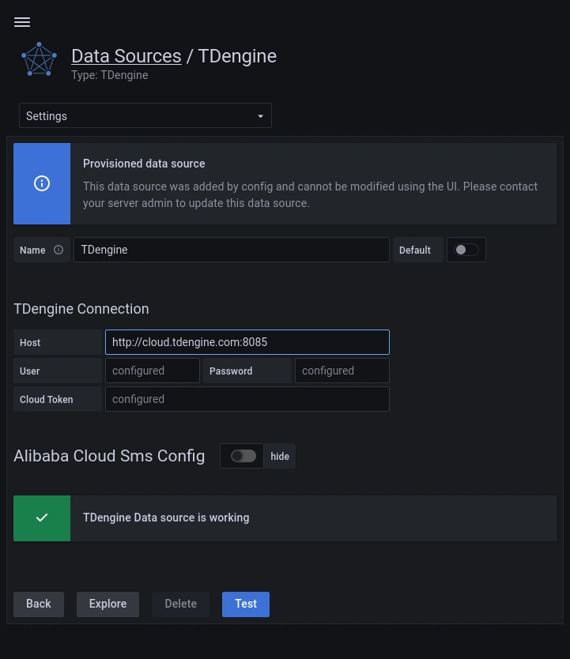

TDengine 能够与开源数据可视化系统 [Grafana](https://www.grafana.com/) 快速集成搭建数据监测报警系统，整个过程无需任何代码开发，TDengine 中数据表的内容可以在仪表盘(DashBoard)上进行可视化展现。关于 TDengine 插件的使用您可以在[GitHub](https://github.com/taosdata/grafanaplugin/blob/master/README.md)中了解更多。

## 安装 Grafana

目前 TDengine 支持 Grafana 7.5 以上的版本。用户可以根据当前的操作系统，到 Grafana 官网下载安装包，并执行安装。下载地址如下：<https://grafana.com/grafana/download>。

## 安装 TDengine 插件

### 通过图形化界面安装

TDengine 数据源插件已经在发布成 Grafana 官方插件，您可以通过 Grafana 配置 GUI 来安装它。在任何已经安装 Grafana 的平台上面，您可以打开链接 `http://localhost:3000`，然后点击左边的插件菜单。


输入关键字 `TDengine` 来搜索：


### 使用安装脚本

请复制下面的脚本命令来为数据源安装设置 `TDENGINE_CLOUD_URL` 和 `TDENGINE_CLOUD_TOKEN` 的环境变量：

```bash
export TDENGINE_CLOUD_TOKEN="<token>"
export TDENGINE_CLOUD_URL="<url>"
```

从 Linux 终端运行下面的脚本来安装 TDengine 数据源插件。

```bash
bash -c "$(curl -fsSL https://raw.githubusercontent.com/taosdata/grafanaplugin/master/install.sh)"
```

安装结束以后，请重启 grafana-server。

```bash
sudo systemctl restart grafana-server.service
```

## 验证插件

用户可以通过 URL `http://localhost:3000`直接登录 Grafana 服务器（初始的用户名和密码是：admin/admin）。在左边点击`Configuration -> Data Sources`。然后点击 `Test` 按钮来验证 TDengine 数据源是否工作。如果测试通过，您应该可以看到成功消息。



## Use Grafana

请创建一个新的仪表盘，或者导入存在的仪表盘来展示 TDengine 里面的数据。同时更多细节请参考[文档](https://docs.tdengine.com/third-party/grafana#create-dashboard)。
