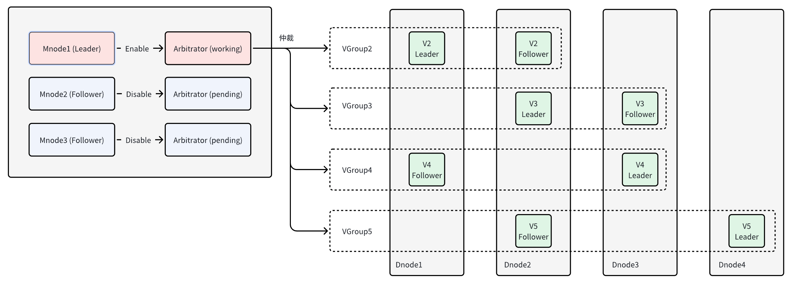

部分用户期望在保证一定可靠性、可用性条件下，尽可能压缩部署成本。为此，TDengine 提出基于 Arbitrator 的双副本方案，可提供集群中 **只有单个服务故障且不出现连续故障** 的容错能力。双副本方案是 TDengine TSDB Enterprise 特有功能，在 3.3.0.0 版本中第一次发布，建议使用最新版本。

双副本选主由高可用的 Mnode 提供仲裁服务，不由 Raft 组内决定。

1. Arbitrator：仲裁服务，不存储数据，VGroup 因某一 Vnode 故障而无法提供服务时，Arbitrator 可根据数据同步情况指定 VGroup 内另一 Vnode 成为 Assigned Leader
2. AssignedLeader：被强制设置为 Leader 的 Vnode，无论其他副本 Vnode 是否存活，均可一直响应用户请求



## 集群配置

双副本要求集群至少配置三个节点，基本部署与配置步骤如下：

1. 确定服务器节点数量、主机名或域名，配置好所有节点的域名解析：DNS 或 /etc/hosts
2. 各节点分别安装 TDengine **企业版** 服务端安装包，按需编辑好各节点 taos.cfg
3. 可选择其中一个节点仅提供仲裁服务（部署 Mnode），将 SupportVnodes 参数设置为 0，表示不存储时序数据；该占用资源较少，仅需 1~2 核，且可与其他应用共用
4. 启动各节点 taosd 服务，其他服务可按需启动（taosAdapter / taosX / taosKeeper / taosExplorer）

## 约束条件

1. 最小配置的服务器节点数为 2+1 个，其中两个数据节点，一个仲裁节点
2. 双副本为数据库建库参数，不同数据库可按需选择副本数
3. 支持 TDengine 集群的完整特性，包括：读缓存、数据订阅、流式计算等
4. 支持 TDengine 所有语言连接器以及连接方式
5. 支持单副本与双副本之间切换（前提是节点数量满足需求、各节点可用 Vnode 数量/内存/存储空间足够）
6. 不支持双副本与三副本之间的切换
7. 不支持双副本切换为双活，除非另外部署一套实例与当前实例组成双活方案

## 运维命令

### 创建集群

创建三节点的集群

```sql
CREATE dnode <dnode_ep> port <dnode_port>;
CREATE dnode <dnode_ep> port <dnode_port>;
```

创建三副本的 Mnode，保证 Mnode 高可用，确保仲裁服务的高可用

```sql
CREATE mnode on dnode <dnode_id>;
CREATE mnode on dnode <dnode_id>;
```

### 数据库创建

按需创建双副本数据库

```sql
create database <dbname> replica 2 vgroups xx buffer xx ...
```

### 修改数据库副本数

创建了单副本数据库后，希望改为双副本时，可通过 alter 命令来实现，反之亦然

```sql
alter database <dbname> replica 2|1
```

### 查看 Vgroups 的状态

通过以下 SQL 命令查看双副本数据库中各 vgroup 的状态：

```sql
show arbgroups;

select * from information_schema.ins_arbgroups;

 db_name | vgroup_id | v1_dnode | v2_dnode | is_sync | assigned_dnode |     assigned_token      |
=================================================================================================
 db      |         2 |        2 |        3 |       0 | NULL           | NULL                    |
 db      |         3 |        1 |        2 |       0 |              1 | d1#g3#1714119404630#663 |
 db      |         4 |        1 |        3 |       1 | NULL           | NULL                    |

```

is_sync 有以下两种取值：

- 0: vgroup 数据未达成同步。在此状态下，如果 vgroup 中的某一 vnode 不可访问，另一个 vnode 无法被指定为 `AssignedLeader` role，该 vgroup 将无法提供服务。
- 1: vgroup 数据达成同步。在此状态下，如果 vgroup 中的某一 vnode 不可访问，另一个 vnode 可以被指定为 `AssignedLeader` role，该 vgroup 可以继续提供服务。

assigned_dnode：

- 标识被指定为 AssignedLeader 的 vnode 的 DnodeId
- 未指定 AssignedLeader 时，该列显示 NULL

assigned_token：

- 标识被指定为 AssignedLeader 的 vnode 的 Token
- 未指定 AssignedLeader 时，该列显示 NULL

## 最佳实践

1. 全新部署

双副本的主要价值在于节省存储成本的同时能够有一定的高可用和高可靠能力。在实践中，推荐配置为：

- N 节点集群（其中 N>=3）
- 其中 N-1 个 dnode 负责存储时序数据
- 第 N 个 dnode 不参与时序数据的存储和读取，即其上不保存副本；可以通过 `supportVnodes` 这个参数为 0 来实现这个目标
- 不存储数据副本的 dnode 对 CPU/Memory 资源的占用也较低，可以使用较低配置服务器

2. 从单副本升级

假定已经有一个单副本集群，其结点数为 N (N>=1)，欲将其升级为双副本集群，升级后需要保证 N>=3，且新加入的某个节点的 `supportVnodes` 参数配置为 0。在集群升级完成后使用 `alter database replica 2` 的命令修改某个特定数据库的副本数。

## 异常情况

| 异常场景 | 集群状态 |
| ------- | ------ |
| 没有 Vnode 发生故障：Arbitrator 故障（Mnode 宕机节点超过一个，导致 Mnode 无法选主）| **持续提供服务** |
| 仅一个 Vnode 故障：VGroup 已经达成同步后，某一个 Vnode 才发生故障的                |  **持续提供服务** |
| 仅一个 Vnode 故障：2 个 Vnode 同时故障，故障前 VGroup 达成同步，但是只有一个 Vnode 从故障中恢复服务，另一个 Vnode 服务故障  |  **通过下面的命令，强制指定 leader, 继续提供服务** |
| 仅一个 Vnode 故障：离线 Vnode 启动后，VGroup 未达成同步前，另一个 Vnode 服务故障的  |  **无法提供服务** |
| 两个 Vnode 都发生故障                                                         |  **无法提供服务** |

```sql
ASSIGN LEADER FORCE;
```

## 常见问题

### 1. 创建双副本数据库或修改为双副本时，报错：DB error: Out of dnodes

- 服务器节点数不足：原因是，数据服务器节点数少于两个。
- 解决方案：增加服务器节点数量，满足最低要求。

### 2. 创建双副本数据库或 split vgroup 时，报错：DB error: Vnodes exhausted

- 服务器可用 Vnodes 不足：原因是某些服务器节点可用 Vnodes 数少于建库或 split vgroup 的需求数。
- 解决方案：调整服务器 CPU 数量、SupportVnodes 数量，满足建库要求。
