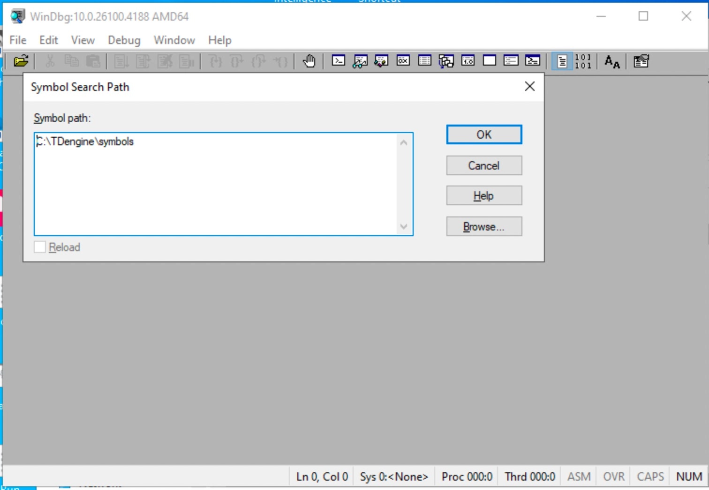

## 目的

本文提供 Windows 下调试定位 TDengine 崩溃问题指引手册，以下内容提供了两种分析方法。

## dmp 文件

### 查找 dmp 文件

`taosd.exe` 进程在崩溃发生时，会捕获崩溃，并在其所在目录下生成 `.dmp` 文件，文件名以 `taosd` 开头，中间为崩溃时间，如`taosd_20260509_124419.dmp`，大小一般在 `10M~200M` 之间。

> **注意：** 若有 `dmp` 文件大小为 0K，可能存在严重堆栈被破坏情况。

### 无法生成 dmp 文件

若上一步中未生成 `dmp`，可能崩溃无法从进程内捕获，需启动进程外捕获 `dmp`。

把以下内容保存为 `.reg` 文件，双击 `.reg` 导入至注册表中，开启进程外捕获 `dmp`：

```Bash
Windows Registry Editor Version 5.00

; Enable WER out-of-process dump for taosd.exe
; Dumps are written by WerFault.exe (a separate process) and are therefore
; immune to stack/heap corruption in taosd.
;
; Usage:
;   1. Double-click this file, or run:
;        reg import wer_localdumps.reg
;   2. Make sure C:\TDengine\core\ exists and is writable by NETWORK SERVICE.

[HKEY_LOCAL_MACHINE\SOFTWARE\Microsoft\Windows\Windows Error Reporting\LocalDumps\taosd.exe]
; Directory where WerFault.exe writes the .dmp files (must exist before crash)
"DumpFolder"="C:\\TDengine\\core\\"
; DumpType 2 = MiniDumpWithFullMemory (full user-mode dump, best for debugging)
"DumpType"=dword:00000002
; Keep at most 10 dumps (oldest is deleted when limit is exceeded)
"DumpCount"=dword:0000000a

; Suppress the "taosd.exe has stopped working" dialog on server environments.
[HKEY_LOCAL_MACHINE\SOFTWARE\Microsoft\Windows\Windows Error Reporting]
"DontShowUI"=dword:00000001
```

配置项说明：

- DumpCount：生成 dmp 文件数上限，超过后会删除最旧的 dmp 文件。
- DumpFolder：存放 dmp 文件的目录。

### 手动生成 dmp 文件

若是 taosd 进程卡死，可手动生成 dmp 文件用于分析，方法是打开 `WINDOW 任务管理器`，在 `进程` 选项卡中找到 `taosd.exe` 进程，点击右键选择 `创建转存文件` 菜单，随后弹出窗口中选择存储文件保存位置即可。

### PDB 文件获取

崩溃栈需结合 PDB 文件方可定位函数名及行号，提供以下方式获取 PDB 文件：

- 企业版用户：暂未提示供下载，需联系 TDengine 技术支持获取。
- 本地编译版本：PDB 文件与编译输出可执行文件在同一目录下。

### dmp + PDB 分析

分析 dmp 需加载与之匹配的 PDB 文件，即可看到崩溃完整堆栈信息，下面介绍分析 dmp 步骤：

1. 获取 WinDbg
   WinDbg 是微软官方提供的用于 dmp 文件分析工具，可到微软网站[下载](https://apps.microsoft.com/detail/9pgjgd53tn86)或安装 Visual Studio 时勾选 `Windows 调试工具` 选项即可获得。
2. 加载 PDB
   启动 WinDbg，打开菜单 File -> Symbol File Path，弹出窗口中点击 `browse...` 按钮选择 pdb 文件所在文件夹，点击 `OK` 按钮保存并关闭。

   

3. 分析 dmp
   选择菜单 File -> Open Crash Dump，弹出窗口中选择 dmp 文件，打开所要分析的 dmp 文件进行分析。

   dmp 文件打开后，在底部命令行输入 `k` 命令显示崩溃栈，成功加载 PDB 时可以看到函数名及源码文件名和行号信息，如下：

   

   此时调用 WinDbg 工具提供的命令行，详细分析崩溃原因。

## 使用 ASAN 版本

若通过 dmp 仍然无法找到问题，可进一步升级分析方法，使用带内存越界访问监控的 ASan 版本继续定位问题。

目前 TDengine 仓库 Debug/Release 均支持编译 ASAN 版本，编译选项与 LINUX 相同。

> **说明：** Windows 下的 ASAN 不支持内存泄露检查功能，但越界访问及 Use-after-free 都支持。

### 版本编译

- 编译选项： `-DBUILD_SANITIZER=true`。
- DEBUG 版本：VS 2022 任意版本都可编译。
- RELEASE 版本：VS 2022 >= 17.14.32。

### 前置条件

在目标机器上运行 ASan 版本的 TDengine，需要把编译机上的 ASan 动态库复制到用户机器上。

动态库在编译机上位置（VS 2022）：

C:\\Program Files\\Microsoft Visual Studio\\2022\\Community\\VC\\Tools\\MSVC\\14.44.35207\\bin\\Hostx64\\x64\\

| 构建类型       | 需随包的 DLL                             | 复制目标位置        |
| ---------------- | ------------------------------------------ | --------------------- |
| Release + ASan | clang_rt.asan_dynamic-x86_64.dll      | 放到 taosd 同目录下 |
| Debug + ASan   | clang_rt.asan_dbg_dynamic-x86_64.dll | 放到 taosd 同目录下 |

### MSVC ASan 报告输出位置

默认输出：stderr

ASan 报告默认写到 stderr。具体去哪取决于运行方式：

| 运行方式                 | 默认输出位置                    |
| -------------------------- | --------------------------------- |
| 命令行直接运行 taosd.exe | 直接打印到当前终端窗口          |
| 双击运行（无控制台）     | 丢失（无窗口，stderr 无处输出） |
| 作为 Windows 服务运行    | 丢失（服务无 stderr 控制台）    |

### 把 ASan 报告输出到文件（避免丢失）

设置环境变量 ASAN_OPTIONS，在启动 taosd 之前：

```Bash
# 加上进程名，便于区分多进程场景
set ASAN_OPTIONS=log_path=C:\TDengine\log\asan_report:log_exe_name=1
taosd.exe
```

生成文件名格式：asan_report.12345（PID 后缀）或 axsan_report.taosd.exe.12345。

### 性能对比

taosBenchmark 创建 1W 子表，每子表 1W 的智能电表数据

> **说明：** DEBUG 版本大量写入数据会崩溃（已知编译的问题），暂无法测试。

|                     | 写入性能 | 对比     |
| --------------------- | ---------- | ---------- |
| Release 版本        | 204 秒   | 基准     |
| Release + ASan 版本 | 324 秒   | 增加 50% |

### ASan 检测效果图

测试代码段：

```C
void test() {
    char buf[4];
    // overflow
    memcpy(buf, "abcdefg01234", 8);
}
```

检测结论：

ASan 成功检测到越界访问，报告如下：

```text
=================================================================
==12345==ERROR: AddressSanitizer: stack-buffer-overflow on address 0x7ffde5c1f8f0 at pc 0x0000000000000 bp 0x7ffde5c1f8a0 sp 0x7ffde5c1f890
READ of size 8 at 0x7ffde5c1f8f0 thread T0
    #0 0x000000000000 in test() (taosd.exe+0x000000000000)
    #1 0x000000000000 in main (taosd.exe+0x000000000000)
Address 0x7ffde5c1f8f0 is located in stack of thread T0 at offset 48 in frame
    #0 0x000000000000 in test() (taosd.exe+0x000000000000)
  This frame has 1 object(s):
    [32, 36) 'buf' <== Memory access at offset 48 overflows this variable
HINT: this may be a false positive if your program uses some custom stack unwind mechanism or swapcontext
      (longjmp and C++ exceptions *are* supported)
SUMMARY: AddressSanitizer: stack-buffer-overflow in test() (taosd.exe+0x000000000000)
```

## 服务崩溃跟踪

TDengine 服务进程 `taosd.exe` 遇到崩溃后会退出，Windows 系统检测到服务退出，会尝试重新启动服务，为避免反复启动崩溃，只启动三次，启动日志可在 `控制面板`->`Windows 事件查看器` 中找到，另外服务被停止日志也记录在此。

## 总结

如果有 DMP 文件优先分析 DMP 文件定位原因，仍然无法定位后上 ASAN 版本查找问题。
