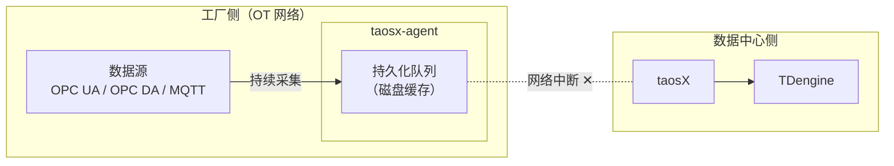
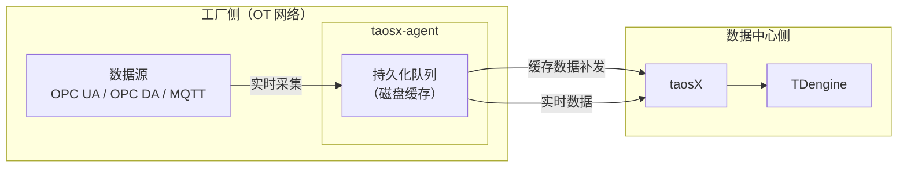
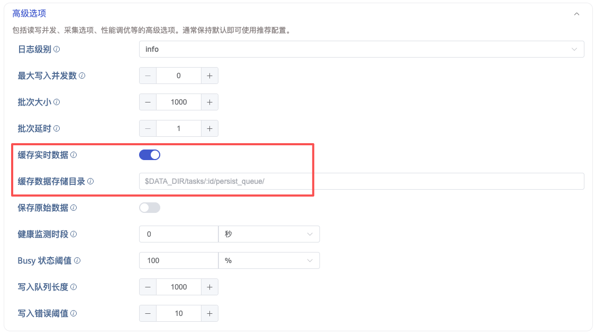

## 功能概述

在工业数据采集场景中，taosX-Agent 通常部署在工厂侧（OT 网络），通过 VPN 或专线与数据中心侧的 taosX 通信。当网络中断时（如 VPN 断开、周末停机等），如果没有缓存机制，中断期间的数据将会丢失。

**存储转发（Store and Forward）** 功能解决了这一问题：当 Agent 与 taosX 之间的网络中断时，Agent 继续从数据源采集数据并持久化到本地磁盘；待网络恢复后，自动将缓存的数据补发给 taosX，确保数据零丢失。

**网络中断期间**：Agent 继续采集数据，写入本地磁盘缓存。

**网络恢复后**：缓存数据自动补发，实时数据同步恢复。

## 适用场景

| 场景           | 说明                                             |
| -------------- | ------------------------------------------------ |
| VPN 网络不稳定 | 工厂与数据中心之间的 VPN 可能周期性中断          |
| 计划性停机     | 周末或维护期间数据中心网络下线，工厂仍需持续采集 |
| 网络质量差     | 远程站点带宽有限，偶发断连                       |

:::note
存储转发功能目前支持 **OPC UA**、**OPC DA** 和 **MQTT** 数据源类型的实时采集任务。
:::

## 启用方式

存储转发通过数据接入任务的高级选项启用，而非 Agent 本身的配置。

在 taosExplorer 中创建或编辑 OPC UA / OPC DA / MQTT 数据接入任务时，在 **高级选项** 中配置以下参数：

| 参数             | DSN 参数名            | 默认值                               | 说明                                   |
| ---------------- | --------------------- | ------------------------------------ | -------------------------------------- |
| 缓存实时数据     | `persist_data_enable` | `false`                              | 是否启用磁盘级别的数据缓存（存储转发） |
| 缓存数据存储目录 | `persist_data_dir`    | `$DATA_DIR/tasks/:id/persist_queue/` | 缓存数据的存储目录                     |

将 **缓存实时数据** 开关打开即可启用存储转发功能。

## 工作原理

启用存储转发后，Agent 内部会创建一个 **persist_queue**（持久化队列），数据流分为写入和读取两条路径：

### 写入路径（数据源 → 本地磁盘）

1. 连接器（如 taosx-opc）从数据源采集数据，通过 IPC 管道传给 Agent。
2. Agent 将数据序列化后写入 persist_queue 的磁盘文件。
3. 写入磁盘完成后，向连接器回复 ACK（确认已落盘）。

### 读取路径（本地磁盘 → taosX）

1. persist_queue 的 reader 从磁盘文件中读取数据。
2. 数据通过 Arrow Flight RPC 发送给 taosX。
3. taosX 写入 TDengine 成功后返回确认。
4. Agent 收到确认后更新断点位置（breakpoint）。

### 断点恢复机制

persist_queue 使用 breakpoint 数据库记录已确认的读取位置。当网络中断恢复或 Agent 重启时，从上次的断点位置继续读取，避免数据重复或丢失。

### 网络中断时的行为

当 Agent 与 taosX 之间的网络中断时：

1. **数据采集不中断**：连接器继续从数据源采集数据，写入本地 persist_queue。
2. **数据传输暂停**：persist_queue 的 reader 检测到网络不可用，暂停向 taosX 发送数据。
3. **网络恢复后自动补发**：Agent 重新连接到 taosX 后，从断点位置继续读取 persist_queue 中缓存的数据并发送。

## 启用前后行为对比

| 行为                 | 未启用（默认）                 | 已启用                                 |
| -------------------- | ------------------------------ | -------------------------------------- |
| 数据缓冲             | 仅内存缓冲（默认 64 批次）     | 磁盘持久化队列（容量仅受磁盘空间限制） |
| Agent ↔ taosX 断链时 | 采集任务终止，断链期间数据丢失 | 采集任务继续运行，数据写入本地磁盘     |
| 重连策略             | 有限次数重试                   | 无限重试（`retry_forever=true`）       |
| 断点恢复             | 不支持                         | 支持（基于 breakpoint 机制）           |
| 数据确认             | 发送到内存缓冲后即确认         | 写入磁盘后才确认                       |
| 写入延迟             | 低（内存直传）                 | 略有增加（需经过磁盘写入和读取）       |

:::warning
启用缓存实时数据后，数据需要先写入本地磁盘、再从磁盘读取后才能上报给 taosX，这会增加从数据源到 TDengine 写入之间的端到端延迟。如果你的场景对写入延迟非常敏感且网络环境稳定，可以不开启此功能。
:::

## 磁盘空间注意事项

启用存储转发后，缓存数据会占用 Agent 所在主机的磁盘空间。请注意：

- **缓存容量仅受磁盘空间限制**：长时间网络中断时，缓存数据会持续增长。
- **建议预留充足的磁盘空间**：根据数据采集量和预期最长断链时长估算所需空间。例如，1000 个 OPC UA 点位、每秒更新一次，每天约产生数百 MB 到数 GB 的缓存数据（具体取决于数据类型和大小）。
- **数据补发完成后**：已确认发送成功的缓存文件会被自动清理。

:::tip
可通过配置 **缓存数据存储目录** 将缓存目录指向一个有充足空间的磁盘分区。
:::
