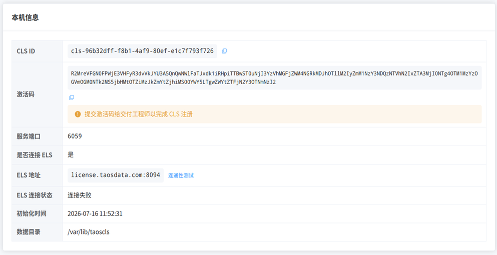
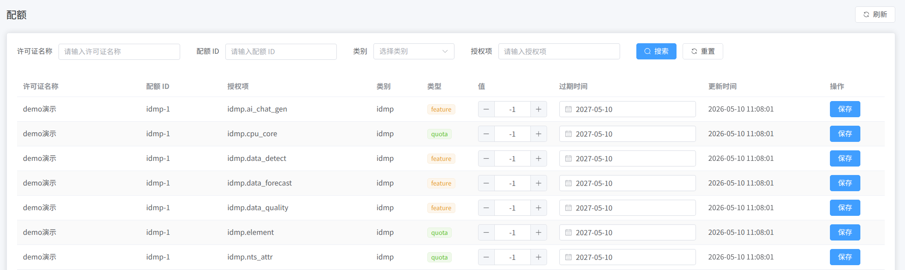
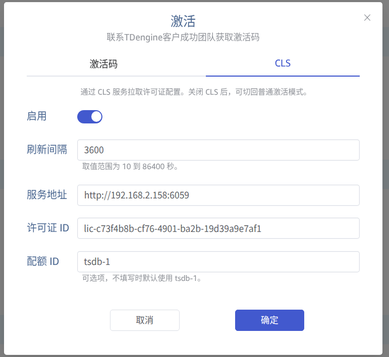
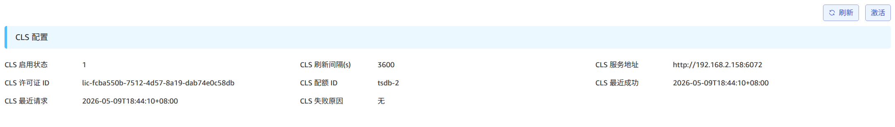

本页说明如何在客户环境部署 CLS，完成在线或离线授权，以及将 TDengine TSDB / IDMP 实例连接到 CLS。架构与配额模型见 [License Center 参考手册](./index.md) 与 [配额与槽位](./02-quota-and-slots.md)。

## 部署安装

安装包示例：

```bash
license-center-cls-1.0.0-linux-amd64.tar.gz
```

解压后可见部署相关脚本：

```bash
scripts/
├── install.sh
├── start.sh
├── status.sh
├── stop.sh
└── uninstall.sh
```

依次执行 `install.sh`、`start.sh` 即可启动服务。

## 配置信息

默认配置文件位于 `/etc/taoscls/taoscls.toml`：

```toml
[local]
# 服务监听的地址，默认 0.0.0.0 表示监听所有网卡地址
listen = "0.0.0.0"
# 开启 HTTP API 服务端口
http_port = 6059

[els]
# ELS 服务的地址
host = "license.taosdata.com"
# ELS 服务的端口
port = 8094
# 是否开启与 ELS 的通信
enable = true

[database]
# 数据存放路径
path = "/var/lib/taoscls"

[log]
# 日志级别
level = "info"
# 日志路径
file = "/var/log/taoscls/taoscls.log"
# 滚动日志单个文件大小
max_size = "1GB"
# 滚动日志个数
max_files = 3
# 可选的日志时区，如果没有设置，回退到系统时区
# timezone = "+08:00"
```

## 本地访问

- 启动 CLS 后，浏览器访问：`http://localhost:6059`（按实际监听地址与端口调整）。
- 本文示例中的本地体验账号均为：
  - 用户名：`root`
  - 密码：`taosdata`

## 服务信息

1. 启动完成后，在浏览器中打开 CLS 管理端并登录。
2. 登录后，可在 **本机信息** 页面查看 **公钥令牌** 等信息：



## 离线授权

### 获取许可证

将 CLS **本机信息** 页面中的 **公钥令牌** 交予 TDengine 服务商，服务商返回许可证文件 `offline-license.key`。

### 导入许可证

在 CLS 的 **许可证** 页面，点击右上角 **离线导入**，选择 `offline-license.key`，然后点击 **导入**。导入成功后，许可证会出现在列表中。

### 查看配额

进入左侧 **配额** 页面，可查看该许可证拆分后的配额与授权项明细，包括许可证 ID、配额 ID、授权项、类别、类型、值和过期时间。



槽位数量与各槽位配额的调整方式见 [配额与槽位](./02-quota-and-slots.md)。

## 在线授权

在线授权与离线授权的整体流程基本一致，区别在于许可证的获取方式：若 CLS 已连接 ELS，ELS 侧授权后许可证将自动同步至 CLS；离线模式则需通过文件等方式手动导入。

## 连接 CLS

TSDB / IDMP 集群可通过配置与 CLS 通信；配置成功后，可在 CLS 的集群相关页面查看实例信息。用量视图说明见 [用量查看与可用性](./03-usage-and-availability.md)。

### TSDB 配置

可通过 taosExplorer 或 SQL 配置。

#### taosExplorer

在 taosExplorer 的 **系统管理 / 许可证** 页面，点击 **激活许可证**，进入如下配置页：



各字段含义与下文 SQL 参数一致。确定后，许可证页面即可看到 CLS 配置信息：



#### SQL

示例：

```sql
ALTER ALL DNODES 'clsEnabled' '1';
ALTER ALL DNODES 'clsRefreshInterval' '15';
ALTER ALL DNODES 'clsUrl' 'http://192.168.2.158:6059';
ALTER ALL DNODES 'clsLicenseId' 'lic-53467044-2dad-4be2-9280-adacb201a644';
ALTER ALL DNODES 'clsQuotaSlotId' 'tsdb-1';
```

| 参数 | 说明 |
| ---- | ---- |
| `clsEnabled` | 是否开启 CLS 许可证功能 |
| `clsRefreshInterval` | 与 CLS 通信间隔 |
| `clsUrl` | CLS 服务地址 |
| `clsLicenseId` | 要使用的许可证 ID |
| `clsQuotaSlotId` | 要使用的配额槽位 ID（Slot） |

最终用户在许可录入时通常需要填写 License Key / ID（必填）与 Slot（可选，按许可证是否拆分槽位而定）。多实例场景下，不同实例应使用不同的 `clsQuotaSlotId`，且各槽位配额之和不超过该许可证的总限额。

### IDMP 配置

当前新版本的页面配置仍在完善中。IDMP 侧同样通过许可证 ID 与配额槽位连接 CLS；具体界面以产品版本为准。

### CLS 集群管理

TSDB / IDMP 完成 CLS 配置后，可在 CLS 的 **集群** 页面看到对应集群：


在 **集群用量** 页面可查看授权项用量：


