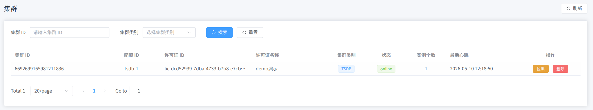
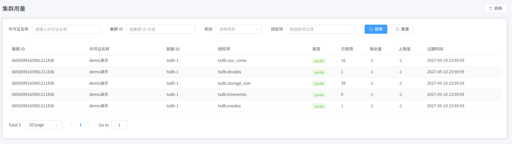

本页说明 CLS 侧的实例用量可见性，以及 CLS 的部署形态。部署与接入见 [部署与授权](./01-deploy-and-activate.md)，槽位模型见 [配额与槽位](./02-quota-and-slots.md)。

## 实例级用量

在 TSDB / IDMP 完成 CLS 配置后，可在 CLS 管理端查看与授权相关的运行信息，包括：

- 哪些 TSDB / IDMP 实例（集群）正在连接 CLS；
- 各授权项的当前用量与限额关系；
- 集群列表与用量明细页面中的汇总信息。

操作入口示例：

- 集群页面：已接入的集群信息

- 集群用量页面：授权项用量

当 CLS 可连接 ELS 时，相关信息可向 ELS 同步，便于服务商侧审计与续期管理。若需按下游业务客户统计占用，通常还需结合自有的客户/租户台账与槽位命名约定；许可系统按许可证与槽位计量。

## CLS 部署形态

当前 CLS 为轻量单点服务，产品内未提供内置高可用或自动故障切换。若生产环境需要进程级冗余，可自行评估主机备份或冷备等运维方案。

实践上可将 CLS 部署在稳定、可监控的主机上，并对进程与磁盘做监控。调整最大槽位数或同步/导入许可证时，宜安排在维护窗口并确认结果。多实例场景下，避免把 CLS 部署在极不稳定的节点上。

CLS 短暂不可用时，已接入的 TSDB / IDMP 能继续运行多久，取决于具体产品版本与许可证类型，以当时版本行为及商务约定为准。接入侧仍应按配置与 CLS 保持通信（参见 `clsRefreshInterval` 等参数）。

## 相关页面

- [License Center 参考手册](./index.md)
- [部署与授权](./01-deploy-and-activate.md)
- [配额与槽位](./02-quota-and-slots.md)
