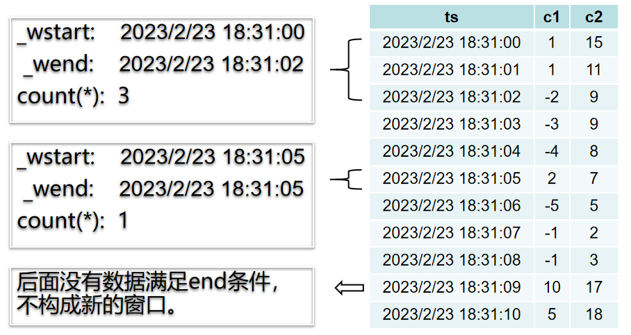

TDengine 在支持标准 SQL 的基础之上，还提供了一系列满足时序业务场景需求的特色查询语法，这些语法能够为时序场景的应用的开发带来极大的便利。

TDengine 提供的特色查询包括数据切分查询和时间窗口切分查询。

## 数据切分查询

当需要按一定的维度对数据进行切分然后在切分出的数据空间内再进行一系列的计算时使用数据切分子句，数据切分语句的语法如下：

```sql
PARTITION BY part_list
```

part_list 可以是任意的标量表达式，包括列、常量、标量函数和它们的组合。例如，将数据按标签 location 进行分组，取每个分组内的电压平均值：
```sql
select location, avg(voltage) from meters partition by location
```


TDengine 按如下方式处理数据切分子句：

- 数据切分子句位于 WHERE 子句之后。
- 数据切分子句将表数据按指定的维度进行切分，每个切分的分片进行指定的计算。计算由之后的子句定义（窗口子句、GROUP BY 子句或 SELECT 子句）。
- 数据切分子句可以和窗口切分子句（或 GROUP BY 子句）一起使用，此时后面的子句作用在每个切分的分片上。例如，将数据按标签 location 进行分组，并对每个组按 10 分钟进行降采样，取其最大值。

```sql
select _wstart, location, max(current) from meters partition by location interval(10m)
```
数据切分子句最常见的用法就是在超级表查询中，按标签将子表数据进行切分，然后分别进行计算。特别是 PARTITION BY TBNAME 用法，它将每个子表的数据独立出来，形成一条条独立的时间序列，极大的方便了各种时序场景的统计分析。例如，统计每个电表每 10 分钟内的电压平均值：
```sql
select _wstart, tbname, avg(voltage) from meters partition by tbname interval(10m)
```


## 窗口切分查询

TDengine 支持按时间窗口切分方式进行聚合结果查询，比如温度传感器每秒采集一次数据，但需查询每隔 10 分钟的温度平均值。这种场景下可以使用窗口子句来获得需要的查询结果。窗口子句用于针对查询的数据集合按照窗口切分成为查询子集并进行聚合，窗口包含时间窗口（time window）、状态窗口（status window）、会话窗口（session window）、事件窗口（event window）四种窗口。其中时间窗口又可划分为滑动时间窗口和翻转时间窗口。

窗口子句语法如下：

```sql
window_clause: {
    SESSION(ts_col, tol_val)
  | STATE_WINDOW(col)
  | INTERVAL(interval_val [, interval_offset]) [SLIDING (sliding_val)] [FILL(fill_mod_and_val)]
  | EVENT_WINDOW START WITH start_trigger_condition END WITH end_trigger_condition
}
```

其中，interval_val 和 sliding_val 都表示时间段, 语法上支持三种方式，举例说明如下:
 - INTERVAL(1s, 500a) SLIDING(1s), 自带时间单位的形式，其中的时间单位是单字符表示, 分别为: a (毫秒), b (纳秒), d (天), h (小时), m (分钟), n (月), s (秒), u (微妙), w (周), y (年).
 - INTERVAL(1000, 500) SLIDING(1000), 不带时间单位的形式，将使用查询库的时间精度作为默认时间单位，当存在多个库时默认采用精度更高的库.
 - INTERVAL('1s', '500a') SLIDING('1s'), 自带时间单位的字符串形式，字符串内部不能有任何空格等其它字符.


### 窗口子句的规则

- 窗口子句位于数据切分子句之后，不可以和 GROUP BY 子句一起使用。
- 窗口子句将数据按窗口进行切分，对每个窗口进行 SELECT 列表中的表达式的计算，SELECT 列表中的表达式只能包含：
  - 常量。
  - _wstart伪列、_wend伪列和_wduration伪列。
  - 聚集函数（包括选择函数和可以由参数确定输出行数的时序特有函数）。
  - 包含上面表达式的表达式。
  - 且至少包含一个聚集函数。
- 窗口子句不可以和 GROUP BY 子句一起使用。
- WHERE 语句可以指定查询的起止时间和其他过滤条件。

### FILL 子句

FILL 语句指定某一窗口区间数据缺失的情况下的填充模式。填充模式包括以下几种：

1. 不进行填充：NONE（默认填充模式）。
2. VALUE 填充：固定值填充，此时需要指定填充的数值。例如：FILL(VALUE, 1.23)。这里需要注意，最终填充的值受由相应列的类型决定，如 FILL(VALUE, 1.23)，相应列为 INT 类型，则填充值为 1。
3. PREV 填充：使用前一个非 NULL 值填充数据。例如：FILL(PREV)。
4. NULL 填充：使用 NULL 填充数据。例如：FILL(NULL)。
5. LINEAR 填充：根据前后距离最近的非 NULL 值做线性插值填充。例如：FILL(LINEAR)。
6. NEXT 填充：使用下一个非 NULL 值填充数据。例如：FILL(NEXT)。

以上填充模式中，除了 NONE 模式默认不填充值之外，其他模式在查询的整个时间范围内如果没有数据 FILL 子句将被忽略，即不产生填充数据，查询结果为空。这种行为在部分模式（PREV、NEXT、LINEAR）下具有合理性，因为在这些模式下没有数据意味着无法产生填充数值。而对另外一些模式（NULL、VALUE）来说，理论上是可以产生填充数值的，至于需不需要输出填充数值，取决于应用的需求。所以为了满足这类需要强制填充数据或 NULL 的应用的需求，同时不破坏现有填充模式的行为兼容性，从 3.0.3.0 版本开始，增加了两种新的填充模式：

7. NULL_F: 强制填充 NULL 值 
8. VALUE_F: 强制填充 VALUE 值

NULL, NULL_F, VALUE, VALUE_F 这几种填充模式针对不同场景区别如下：
- INTERVAL 子句： NULL_F, VALUE_F 为强制填充模式；NULL, VALUE 为非强制模式。在这种模式下下各自的语义与名称相符
- 流计算中的 INTERVAL 子句：NULL_F 与 NULL 行为相同，均为非强制模式；VALUE_F 与 VALUE 行为相同，均为非强制模式。即流计算中的 INTERVAL 没有强制模式
- INTERP 子句：NULL 与 NULL_F 行为相同，均为强制模式；VALUE 与 VALUE_F 行为相同，均为强制模式。即 INTERP 中没有非强制模式。

:::info

1. 使用 FILL 语句的时候可能生成大量的填充输出，务必指定查询的时间区间。针对每次查询，系统可返回不超过 1 千万条具有插值的结果。
2. 在时间维度聚合中，返回的结果中时间序列严格单调递增。
3. 如果查询对象是超级表，则聚合函数会作用于该超级表下满足值过滤条件的所有表的数据。如果查询中没有使用 PARTITION BY 语句，则返回的结果按照时间序列严格单调递增；如果查询中使用了 PARTITION BY 语句分组，则返回结果中每个 PARTITION 内按照时间序列严格单调递增。

:::

### 时间窗口

时间窗口又可分为滑动时间窗口和翻转时间窗口。

INTERVAL 子句用于产生相等时间周期的窗口，SLIDING 用以指定窗口向前滑动的时间。每次执行的查询是一个时间窗口，时间窗口随着时间流动向前滑动。在定义连续查询的时候需要指定时间窗口（time window ）大小和每次前向增量时间（forward sliding times）。如图，[t0s, t0e] ，[t1s , t1e]， [t2s, t2e] 是分别是执行三次连续查询的时间窗口范围，窗口的前向滑动的时间范围 sliding time 标识 。查询过滤、聚合等操作按照每个时间窗口为独立的单位执行。当 SLIDING 与 INTERVAL 相等的时候，滑动窗口即为翻转窗口。


INTERVAL 和 SLIDING 子句需要配合聚合和选择函数来使用。以下 SQL 语句非法：

```
SELECT * FROM temp_tb_1 INTERVAL(1m);
```

SLIDING 的向前滑动的时间不能超过一个窗口的时间范围。以下语句非法：

```
SELECT COUNT(*) FROM temp_tb_1 INTERVAL(1m) SLIDING(2m);
```

使用时间窗口需要注意：

- 聚合时间段的窗口宽度由关键词 INTERVAL 指定，最短时间间隔 10 毫秒（10a）；并且支持偏移 offset（偏移必须小于间隔），也即时间窗口划分与“UTC 时刻 0”相比的偏移量。SLIDING 语句用于指定聚合时间段的前向增量，也即每次窗口向前滑动的时长。
- 使用 INTERVAL 语句时，除非极特殊的情况，都要求把客户端和服务端的 taos.cfg 配置文件中的 timezone 参数配置为相同的取值，以避免时间处理函数频繁进行跨时区转换而导致的严重性能影响。
- 返回的结果中时间序列严格单调递增。

### 状态窗口

使用整数（布尔值）或字符串来标识产生记录时候设备的状态量。产生的记录如果具有相同的状态量数值则归属于同一个状态窗口，数值改变后该窗口关闭。如下图所示，根据状态量确定的状态窗口分别是[2019-04-28 14:22:07，2019-04-28 14:22:10]和[2019-04-28 14:22:11，2019-04-28 14:22:12]两个。


使用 STATE_WINDOW 来确定状态窗口划分的列。例如：

```
SELECT COUNT(*), FIRST(ts), status FROM temp_tb_1 STATE_WINDOW(status);
```

仅关心 status 为 2 时的状态窗口的信息。例如：

```
SELECT * FROM (SELECT COUNT(*) AS cnt, FIRST(ts) AS fst, status FROM temp_tb_1 STATE_WINDOW(status)) t WHERE status = 2;
```

TDengine 还支持将 CASE 表达式用在状态量，可以表达某个状态的开始是由满足某个条件而触发，这个状态的结束是由另外一个条件满足而触发的语义。例如，智能电表的电压正常范围是 205V 到 235V，那么可以通过监控电压来判断电路是否正常。

```
SELECT tbname, _wstart, CASE WHEN voltage >= 205 and voltage <= 235 THEN 1 ELSE 0 END status FROM meters PARTITION BY tbname STATE_WINDOW(CASE WHEN voltage >= 205 and voltage <= 235 THEN 1 ELSE 0 END);
```

### 会话窗口

会话窗口根据记录的时间戳主键的值来确定是否属于同一个会话。如下图所示，如果设置时间戳的连续的间隔小于等于 12 秒，则以下 6 条记录构成 2 个会话窗口，分别是：[2019-04-28 14:22:10，2019-04-28 14:22:30]和[2019-04-28 14:23:10，2019-04-28 14:23:30]。因为 2019-04-28 14:22:30 与 2019-04-28 14:23:10 之间的时间间隔是 40 秒，超过了连续时间间隔（12 秒）。


在 tol_value 时间间隔范围内的结果都认为归属于同一个窗口，如果连续的两条记录的时间超过 tol_val，则自动开启下一个窗口。

```

SELECT COUNT(*), FIRST(ts) FROM temp_tb_1 SESSION(ts, tol_val);
```

### 事件窗口

事件窗口根据开始条件和结束条件来划定窗口，当start_trigger_condition满足时则窗口开始，直到end_trigger_condition满足时窗口关闭。start_trigger_condition和end_trigger_condition可以是任意 TDengine 支持的条件表达式，且可以包含不同的列。

事件窗口可以仅包含一条数据。即当一条数据同时满足start_trigger_condition和end_trigger_condition，且当前不在一个窗口内时，这条数据自己构成了一个窗口。

事件窗口无法关闭时，不构成一个窗口，不会被输出。即有数据满足start_trigger_condition，此时窗口打开，但后续数据都不能满足end_trigger_condition，这个窗口无法被关闭，这部分数据不够成一个窗口，不会被输出。

如果直接在超级表上进行事件窗口查询，TDengine 会将超级表的数据汇总成一条时间线，然后进行事件窗口的计算。
如果需要对子查询的结果集进行事件窗口查询，那么子查询的结果集需要满足按时间线输出的要求，且可以输出有效的时间戳列。

以下面的 SQL 语句为例，事件窗口切分如图所示：
```sql
select _wstart, _wend, count(*) from t event_window start with c1 > 0 end with c2 < 10 
```



### 时间戳伪列

窗口聚合查询结果中，如果 SQL 语句中没有指定输出查询结果中的时间戳列，那么最终结果中不会自动包含窗口的时间列信息。如果需要在结果中输出聚合结果所对应的时间窗口信息，需要在 SELECT 子句中使用时间戳相关的伪列: 时间窗口起始时间 (\_WSTART), 时间窗口结束时间 (\_WEND), 时间窗口持续时间 (\_WDURATION), 以及查询整体窗口相关的伪列: 查询窗口起始时间(\_QSTART) 和查询窗口结束时间(\_QEND)。需要注意的是时间窗口起始时间和结束时间均是闭区间，时间窗口持续时间是数据当前时间分辨率下的数值。例如，如果当前数据库的时间分辨率是毫秒，那么结果中 500 就表示当前时间窗口的持续时间是 500毫秒 (500 ms)。

### 示例

智能电表的建表语句如下：

```
CREATE TABLE meters (ts TIMESTAMP, current FLOAT, voltage INT, phase FLOAT) TAGS (location BINARY(64), groupId INT);
```

针对智能电表采集的数据，以 10 分钟为一个阶段，计算过去 24 小时的电流数据的平均值、最大值、电流的中位数。如果没有计算值，用前一个非 NULL 值填充。使用的查询语句如下：

```
SELECT _WSTART, _WEND, AVG(current), MAX(current), APERCENTILE(current, 50) FROM meters
  WHERE ts>=NOW-1d and ts<=now
  INTERVAL(10m)
  FILL(PREV);
```


