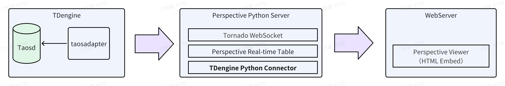
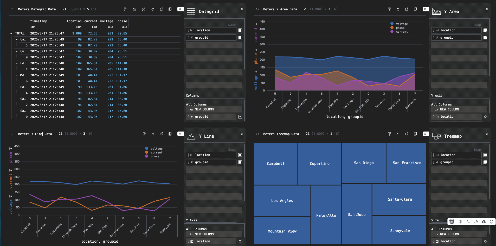

## 概述

Perspective 是一款开源且强大的数据可视化库，由 [Prospective.co](https://www.perspective.co/) 开发，运用 `WebAssembly` 和 `Web Workers` 技术，在 Web 应用中实现交互式实时数据分析，能在浏览器端提供高性能可视化能力。借助它，开发者可构建实时更新的仪表盘、图表等，用户能轻松与数据交互，按需求筛选、排序及挖掘数据。其灵活性高，适配多种数据格式与业务场景；速度快，处理大规模数据也能保障交互流畅；易用性佳，新手和专业开发者都能快速搭建可视化界面。

在数据连接方面，Perspective 通过 TDengine 的 Python 连接器，完美支持 TDengine 数据源，可高效获取其中海量时序数据等各类数据，并提供展示复杂图表、深度统计分析和趋势预测等实时功能，助力用户洞察数据价值，为决策提供有力支持，是构建对实时数据可视化和分析要求高的应用的理想选择。



Perspective 可以通过 TDengine 的 Node.js 或 Python 连接器读取数据。以下分别介绍两种集成方式。

## 使用 Node.js 连接 Perspective

### 前置条件

- TDengine 和 taosAdapter 已安装并正常运行。
- 已安装 [Node.js](https://nodejs.org/)。
- 已安装 [TDengine Node.js 连接器](../../10-developer-guide/08-connectors-reference/06-node.mdx)。
- 已安装 Perspective，具体说明参见 Perspective 文档中的 [JavaScript 指南](https://perspective.finos.org/guide/how_to/javascript.html)。

### 创建 Perspective 服务

1. 导入 Perspective 和 TDengine Node.js 连接器：

   ```js
   import perspective from "@finos/perspective";
   import * as taos from "@tdengine/websocket";
   ```

1. 配置 TDengine 和 Perspective：

   ```js
   const TAOS_CONNECTION_URL = "<taosadapter-url>";
   const TAOS_USER = "<tdengine-username>";
   const TAOS_PASSWORD = "<tdengine-password>";
   const TAOS_DATABASE = "<tdengine-database>";
   const TAOS_TABLENAME = "<tdengine-table>";

   const PRSP_TABLE_NAME = TAOS_TABLENAME;
   const PRSP_TABLE_LIMIT = <perspective-row-limit>;
   const PRSP_TABLE_REFRESH_INTERVAL = <perspective-refresh-interval>;
   ```

   `TAOS_CONNECTION_URL` 是包含 taosAdapter 地址和端口的 WebSocket URL，例如 `ws://localhost:6041`。刷新间隔的单位为毫秒。

1. 建立 TDengine 连接：

   ```js
   async function createConnection() {
       const config = new taos.WSConfig(TAOS_CONNECTION_URL);
       config.setUser(TAOS_USER);
       config.setPwd(TAOS_PASSWORD);
       return taos.sqlConnect(config);
   }
   ```

1. 查询 TDengine 表，并将时间戳转换为 Node.js `Date` 对象：

   ```js
   async function queryData(conn) {
       const sql = `
           SELECT ts, current, voltage, phase, location, groupid
           FROM ${TAOS_DATABASE}.${TAOS_TABLENAME}
           ORDER BY ts DESC
           LIMIT ${PRSP_TABLE_LIMIT}
       `;
       const rows = await conn.query(sql);
       const data = [];
       while (await rows.next()) {
           const row = rows.getData();
           data.push({
               ts: new Date(Number(row[0])),
               current: row[1],
               voltage: row[2],
               phase: row[3],
               location: row[4],
               groupid: row[5],
           });
       }
       return data;
   }
   ```

1. 创建 Perspective 表。各字段类型需要与查询结果匹配，类型映射参见 [Node.js 连接器数据类型映射](../../10-developer-guide/08-connectors-reference/06-node.mdx#数据类型映射)。

   ```js
   async function createPerspectiveTable() {
       const schema = {
           ts: "datetime",
           current: "float",
           voltage: "int",
           phase: "float",
           location: "string",
           groupid: "int",
       };
       return perspective.table(schema, {
           name: PRSP_TABLE_NAME,
           limit: PRSP_TABLE_LIMIT,
           format: "json",
       });
   }
   ```

1. 启动 Perspective WebSocket 服务并定期更新表：

   ```js
   async function main() {
       const conn = await createConnection();
       new perspective.WebSocketServer({ port: 8080 });
       const table = await createPerspectiveTable();

       setInterval(async () => {
           try {
               await table.update(await queryData(conn));
           } catch (err) {
               console.error(`更新 Perspective 表失败：${err.message}`);
           }
       }, PRSP_TABLE_REFRESH_INTERVAL);
   }

   main();
   ```

   Perspective WebSocket 端点为 `ws://localhost:8080/websocket`。

### 创建 Perspective Viewer

在 HTML 页面中加载 `perspective-viewer`，连接 WebSocket 服务并打开 Perspective 表：

```html
<perspective-viewer id="viewer" theme="Pro Dark"></perspective-viewer>

<script type="module">
    import "https://cdn.jsdelivr.net/npm/@finos/perspective-viewer@3.4.3/dist/cdn/perspective-viewer.js";
    import "https://cdn.jsdelivr.net/npm/@finos/perspective-viewer-datagrid@3.4.3/dist/cdn/perspective-viewer-datagrid.js";
    import "https://cdn.jsdelivr.net/npm/@finos/perspective-viewer-d3fc@3.4.3/dist/cdn/perspective-viewer-d3fc.js";
    import perspective from "https://cdn.jsdelivr.net/npm/@finos/perspective@3.4.3/dist/cdn/perspective.js";

    const websocket = await perspective.websocket("ws://localhost:8080/websocket");
    const table = await websocket.open_table("meters");
    document.getElementById("viewer").load(table);
</script>
```

将该 HTML 文件托管在 Web 服务器上后，即可使用 Perspective 的可视化功能。配置选项参见 [`<perspective-viewer>` 文档](https://perspective.finos.org/guide/how_to/javascript/viewer.html)。

### Node.js 演示

可以使用 Perspective 官方示例快速搭建演示环境：

```bash
git clone https://github.com/ProspectiveCo/perspective-examples
cd perspective-examples/examples/tdengine/node
./docker.sh
npm install
```

随后分别运行数据生成程序、Perspective 服务和前端：

```bash
node src/producer.js
node src/server.js
npm run dev
```

在浏览器中打开 Vite 输出的地址，默认地址为 `http://localhost:3000`。

## 使用 Python 连接 Perspective

### 前置条件

在 Linux 系统中进行如下安装操作：

- TDengine 服务已部署并正常运行（企业及社区版均可）。
- taosAdapter 能够正常运行，详细参考 [taosAdapter 使用手册](../../12-operations-and-tooling/03-components/03-taosadapter.md)。
- Python 3.10 及以上版本已安装 (如未安装，可参考 [Python 安装](https://docs.python.org/))。
- 下载或克隆 [perspective-connect-demo](https://github.com/taosdata/perspective-connect-demo) 项目，进入项目根目录后运行“install.sh”脚本，以便在本地下载并安装 TDengine 客户端库以及相关的依赖项。

### 可视化数据

**第 1 步**，运行 [perspective-connect-demo](https://github.com/taosdata/perspective-connect-demo) 项目根目录中的“run.sh”脚本，以此启动 Perspective 服务。该服务会每隔 300 毫秒从 TDengine 数据库中获取一次数据，并将数据以流的形式传输至基于 Web 的 `Perspective Viewer` 。

```shell
sh run.sh
```

**第 2 步**，启动一个静态 Web 服务，随后在浏览器中访问 `prsp-viewer.html` 资源，便能展示可视化数据。

```python
python -m http.server 8081
```

通过浏览器访问该 Web 页面后所呈现出的效果如下图所示：



### 使用说明

#### 写入数据

[perspective-connect-demo](https://github.com/taosdata/perspective-connect-demo) 项目根目录中的 `producer.py` 脚本，借助 TDengine Python 连接器，可定期向 TDengine 数据库插入数据。此脚本会生成随机数据并将其插入数据库，以此模拟实时数据的写入过程。具体执行步骤如下：

1. 建立与 TDengine 的连接。
1. 创建 power 数据库和 meters 表。
1. 每隔 300 毫秒生成一次随机数据，并写入 TDengine 数据库中。

Python 连接器详细写入说明可参见 [Python 参数绑定](../../10-developer-guide/08-connectors-reference/05-python.mdx#参数绑定)。

#### 加载数据

[perspective-connect-demo](https://github.com/taosdata/perspective-connect-demo) 项目根目录中的 `perspective_server.py` 脚本会启动一个 Perspective 服务器，该服务器会从 TDengine 读取数据，并通过 Tornado WebSocket 将数据流式传输到一个 Perspective 表中。

1. 启动一个 Perspective 服务器
1. 建立与 TDengine 的连接。
1. 创建一个 Perspective 表 (表结构需要与 TDengine 数据库中表的类型保持匹配)。
1. 调用 `Tornado.PeriodicCallback` 函数来启动定时任务，进而实现对 Perspective 表数据的更新，示例代码如下：

```python
{{#include docs/examples/perspective/perspective_server.py:perspective_server}}
```

#### HTML 页面配置

[perspective-connect-demo](https://github.com/taosdata/perspective-connect-demo) 项目根目录中的 `prsp-viewer.html`文件将 `Perspective Viewer` 嵌入到 HTML 页面中。它通过 WebSocket 连接到 Perspective 服务器，并根据图表配置显示实时数据。

- 配置展示的图表以及数据分析的规则。
- 与 Perspective 服务器建立 Websocket 连接。
- 引入 Perspective 库，通过 WebSocket 连接到 Perspective 服务器，加载 meters_values 表来展示动态数据。

```html
{{#include docs/examples/perspective/prsp-viewer.html:perspective_viewer}}
```

## 参考资料

- [Perspective 文档](https://perspective.finos.org/)
- [TDengine Python 连接器](../../10-developer-guide/08-connectors-reference/05-python.mdx)
- [TDengine 流式计算](../../07-stream-processing/index.md)
