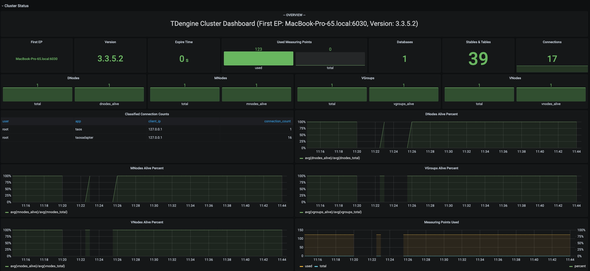
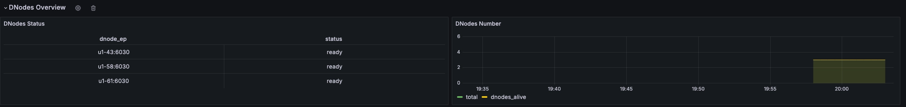
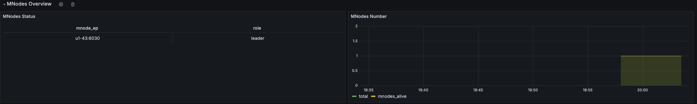
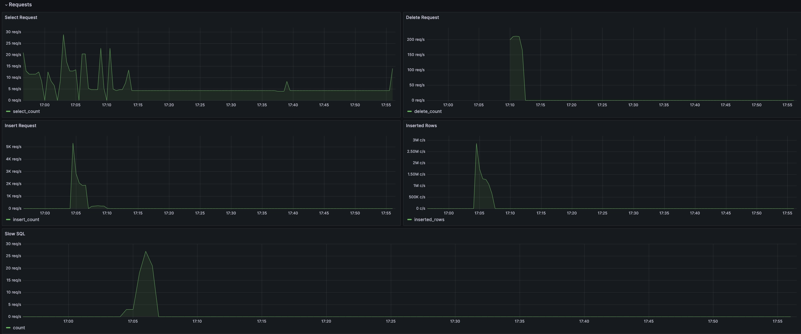
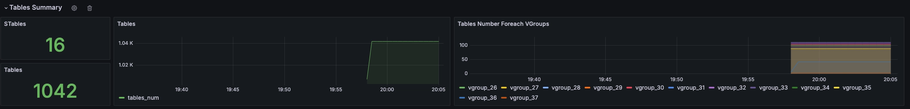
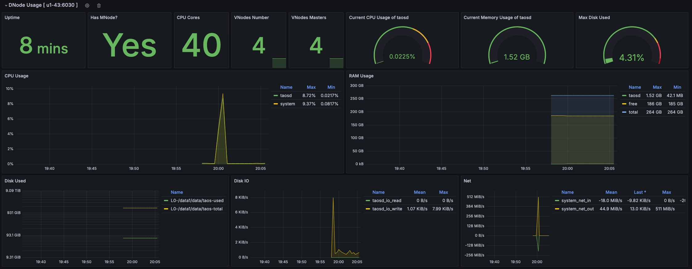
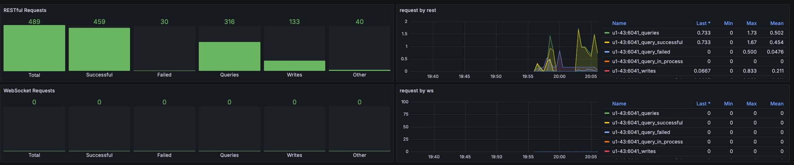

import Tabs from '@theme/Tabs'
import TabItem from '@theme/TabItem'

TDinsight 是使用 [Grafana] 对 TDengine 进行监控的解决方案。

TDengine 通过 taosKeeper 将服务器的 CPU、内存、硬盘空间、带宽、请求数、磁盘读写速度、慢查询等信息定时写入指定数据库。通过 Grafana 和 TDengine 数据源插件，TDinsight 将集群状态、节点信息、插入及查询请求、资源使用情况等进行可视化展示，为开发者实时监控 TDengine 集群运行状态提供了便利。本文将指导用户安装 TDengine 数据源插件及部署 TDinsight 可视化面板。

## 前置要求

首先检查下面服务：
- TDengine 已经安装并正常运行，此仪表盘需要 TDengine 3.0.0.0 及以上，并开启监控上报配置，具体配置请参考：[TDengine 监控配置](../taosd/#监控相关)。
- taosAdapter 已经安装并正常运行。具体细节请参考：[taosAdapter 使用手册](../taosadapter)
- taosKeeper 已安装并正常运行。具体细节请参考：[taosKeeper 使用手册](../taoskeeper)

然后记录以下信息：

- taosAdapter 集群 REST API 地址，如：`http://localhost:6041`。
- taosAdapter 集群认证信息，可使用用户名及密码。
- taosKeeper 记录监控指标的数据库名称。

## 安装和启动 Grafana

我们建议您使用最新的 Grafana 版本，TDInsight 支持 Grafana 7.5 及以上版本。您可以在任何[支持的操作系统](https://grafana.com/docs/grafana/latest/installation/requirements/#supported-operating-systems)中，按照 [Grafana 官方文档安装说明](https://grafana.com/docs/grafana/latest/installation/) 安装 Grafana。
安装后请参考 [启动 Grafana](https://grafana.com/docs/grafana/latest/setup-grafana/start-restart-grafana/) 启动 Grafana 服务。  

安装完成后就可以在 Web 浏览器中打开 Grafana 网址，默认是：`http://localhost:3000`。 默认用户名/密码都是 `admin`。Grafana 会要求在首次登录后更改密码。  

:::info

下文介绍中，都以 Grafana v11.0.0 版本为例，其他版本功能可能有差异，请参考 [Grafana 官网](https://grafana.com/docs/grafana/latest/)。

:::

## 安装 TDengine 数据源插件

TDInsight 支持图形界面安装、手动安装和脚本安装三种安装方式，一般建议图形界面安装。对于 Grafana 8.5 以下版本可以使用手动安装和脚本安装方式。

<Tabs defaultValue="manual" groupId="deploy">
<TabItem value="gui" label="图形界面安装">

使用 Grafana 最新版本（8.5+），您可以在 Grafana 中[浏览和管理插件](https://grafana.com/docs/grafana/next/administration/plugin-management/#plugin-catalog)。在 Grafana 管理界面中的 **Configurations > Plugins** 页面直接搜索 `TDengine` 并按照提示安装。

</TabItem>
<TabItem value="manual" label="手动安装">

从 GitHub 安装 TDengine 最新版数据源插件。

```bash
get_latest_release() {
  curl --silent "https://api.github.com/repos/taosdata/grafanaplugin/releases/latest" |
    grep '"tag_name":' |
    sed -E 's/.*"v([^"]+)".*/\1/'
}
TDENGINE_PLUGIN_VERSION=$(get_latest_release)
sudo grafana-cli \
  --pluginUrl https://github.com/taosdata/grafanaplugin/releases/download/v$TDENGINE_PLUGIN_VERSION/tdengine-datasource-$TDENGINE_PLUGIN_VERSION.zip \
  plugins install tdengine-datasource
```

:::note
3.1.6 和更早版本插件需要在配置文件 `/etc/grafana/grafana.ini` 中添加如下设置，以启用未签名插件。

```ini
[plugins]
allow_loading_unsigned_plugins = tdengine-datasource
```

:::

</TabItem>

<TabItem value="auto" label="脚本安装">

我们提供了一个自动化安装脚本 [TDinsight.sh](https://github.com/taosdata/grafanaplugin/releases/latest/download/TDinsight.sh) 脚本以便用户快速进行安装配置。

您可以通过 `wget` 或其他工具下载该脚本：

```bash
wget https://github.com/taosdata/grafanaplugin/releases/latest/download/TDinsight.sh
chmod +x TDinsight.sh
./TDinsight.sh
```

这个脚本会自动下载最新的[Grafana TDengine 数据源插件](https://github.com/taosdata/grafanaplugin/releases/latest) 和 [TDinsight 仪表盘](https://github.com/taosdata/grafanaplugin/blob/master/dashboards/TDinsightV3.json) ，将命令行选项中的可配置参数转为 [Grafana Provisioning](https://grafana.com/docs/grafana/latest/administration/provisioning/) 配置文件，以进行自动化部署及更新等操作。

1. 假设您在同一台主机上使用 TDengine 和 Grafana 服务。 运行 `./TDinsight.sh` 并打开 Grafana 页面就可以看到 TDinsight 仪表盘了。
2. 假设您在主机 `tdengine` 上启动 TDengine 数据库，taosAdapter 的 HTTP 监听端口为 `6041`，用户为 `root1`，密码为 `pass5ord`。执行脚本：`./TDinsight.sh -a http://tdengine:6041 -u root1 -p pass5ord`

详细的使用方法请参考 [TDinsight.sh 详细说明](./#附录)

</TabItem>
</Tabs>


## 添加 TDengine 数据源

安装完毕后， 点击 “Connections” -> “Data sources“， 然后选择 ”tdengine-datasource“，输入 TDengine 相关配置：
- Host： TDengine 集群中提供 REST 服务的 IP 地址与端口号，默认 `http://localhost:6041`
- User：TDengine 用户名。
- Password：TDengine 用户密码。

点击 `Save & Test` 进行测试，成功会提示：`TDengine Data source is working`。  


## 导入 TDengine V3 仪表盘

在配置 TDengine 数据源界面，点击 “Dashboards” tab，再点击 ”import” 导入 ”TDengine for 3.x” 仪表盘。
导入成功后可以进入这个 dashboard，在左上角 ”Log from“ 选项中选择 taosKeeper 中设置的记录监控指标的数据库就可以看到监控结果。


##  TDengine V3 仪表盘详情

TDinsight 仪表盘旨在提供 TDengine 相关资源的使用情况和状态，比如 dnodes、 mnodes、 vnodes 和数据库等。
主要分为集群状态、DNodes 概述、MNode 概述、请求、数据库、DNode 资源使用情况和 taosAdapter 监控信息。下面我们分别详细介绍。  

### 集群状态
这部分指标包括集群当前信息和状态。



指标详情（从上到下，从左到右）：

- **First EP**：当前 TDengine 集群中的`firstEp`设置。
- **Version**：TDengine 服务器版本（master mnode）。
- **Expire Time** - 企业版过期时间。
- **Used Measuring Points** - 企业版已使用的测点数。
- **Databases** - 数据库个数。
- **Connections** - 当前连接个数。
- **DNodes/MNodes/VGroups/VNodes**：每种资源的总数和存活数。
- **DNodes/MNodes/VGroups/VNodes Alive Percent**：每种资源的存活数/总数的比例，启用告警规则，并在资源存活率（1 分钟内平均健康资源比例）不足 100%时触发。
- **Measuring Points Used**：启用告警规则的测点数用量（社区版无数据，默认情况下是健康的）。

### DNodes 概述
这部分指标包括集群 dnode 基本信息。


指标详情：
- **DNodes Status**：`show dnodes` 的简单表格视图。
- **DNodes Number**：DNodes 数量变化。

### MNode 概述
这部分指标包括集群 mnode 基本信息。


指标详情：
1. **MNodes Status**：`show mnodes` 的简单表格视图。
2. **MNodes Number**：类似于`DNodes Number`，MNodes 数量变化。

### 请求统计
这部分指标包括集群执行 sql 的统计指标。



指标详情：
1. **Select Request**：select 请求数。
2. **Delete Request**：delete 请求数。
3. **Insert Request**：insert 请求数。
4. **Inserted Rows**：实际插入行数。
5. **Slow Sql**：慢查询数，可以在顶部分时长段过滤。

### 表统计
这部分指标包括集群中表的统计指标。



指标详情：
1. **STables**：超级表数量。
2. **Total Tables**：所有表数量。
3. **Tables**：所有普通表数量随时间变化图。
4. **Tables Number Foreach VGroups**：每个 VGroups 包含的表数量。

### DNode 资源使用情况
这部分指标包括集群所有数据节点资源使用情况展示，每个数据节点为一个 Row 进行展示。。



指标详情（从上到下，从左到右）：

1. **Uptime**：从创建 dnode 开始经过的时间。
2. **Has MNodes?**：当前 dnode 是否为 mnode。
3. **CPU Cores**：CPU 核数。
4. **VNodes Number**：当前 dnode 的 VNodes 数量。
5. **VNodes Masters**：处于 master 角色的 vnode 数量。
6. **Current CPU Usage of taosd**：taosd 进程的 CPU 使用率。
7. **Current Memory Usage of taosd**：taosd 进程的内存使用情况。
8. **Max Disk Used**：taosd 所有数据目录对应的最大磁盘使用率。
9. **CPU Usage**：进程和系统 CPU 使用率。
10. **RAM Usage**：RAM 使用指标时间序列视图。
11. **Disk Used**：多级存储下每个级别使用的磁盘（默认为 level0 级）。
12. **Disk IO**：磁盘 IO 速率。
13. **Net IO**：网络 IO，除本机网络之外的总合网络 IO 速率。


### taosAdapter 监控
这部分指标包括 taosAdapter rest 和 websocket 请求统计详情。



指标详情：

1. **Total**：总请求数
2. **Successful**：总成功数
3. **Failed**：总失败数
4. **Queries**：总查询数
5. **Writes**：总写入数
6. **Other**：总其他请求数

还有上述分类的细分维度折线图。

## 升级
下面三种方式都可以进行升级：
- 用图形界面，若有新版本，可以在 ”TDengine Datasource“ 插件页面点击 update 升级。
- 按照手动安装步骤自行安装新的 Grafana 插件和 Dashboard。
- 通过重新运行 `TDinsight.sh` 脚本升级到最新的 Grafana 插件和 TDinsight Dashboard。  

## 卸载
针对不同的安装方式，卸载时：
- 用图形界面，在 ”TDengine Datasource“ 插件页面点击 ”Uninstall“ 卸载。
- 通过 `TDinsight.sh` 脚本安装的 TDinsight，可以使用命令行 `TDinsight.sh -R` 清理相关资源。
- 手动安装的 TDinsight，要完全卸载，需要清理以下内容：
  1. Grafana 中的 TDinsight Dashboard。
  2. Grafana 中的 Data Source 数据源。
  3. 从插件安装目录删除 `tdengine-datasource` 插件。

## 附录

### TDinsight.sh 详细说明
下面是 TDinsight.sh 的用法详细说明：

```text
Usage:
   ./TDinsight.sh
   ./TDinsight.sh -h|--help
   ./TDinsight.sh -n <ds-name> -a <api-url> -u <user> -p <password>

Install and configure TDinsight dashboard in Grafana on Ubuntu 18.04/20.04 system.

-h, -help,          --help                  Display help

-V, -verbose,       --verbose               Run script in verbose mode. Will print out each step of execution.

-v, --plugin-version <version>              TDengine datasource plugin version, [default: latest]

-P, --grafana-provisioning-dir <dir>        Grafana provisioning directory, [default: /etc/grafana/provisioning/]
-G, --grafana-plugins-dir <dir>             Grafana plugins directory, [default: /var/lib/grafana/plugins]
-O, --grafana-org-id <number>               Grafana organization id. [default: 1]

-n, --tdengine-ds-name <string>             TDengine datasource name, no space. [default: TDengine]
-a, --tdengine-api <url>                    TDengine REST API endpoint. [default: http://127.0.0.1:6041]
-u, --tdengine-user <string>                TDengine user name. [default: root]
-p, --tdengine-password <string>            TDengine password. [default: taosdata]

-i, --tdinsight-uid <string>                Replace with a non-space ASCII code as the dashboard id. [default: tdinsight]
-t, --tdinsight-title <string>              Dashboard title. [default: TDinsight]
-e, --tdinsight-editable                    If the provisioning dashboard could be editable. [default: false]
```

大多数命令行选项都可以通过环境变量获得同样的效果。

| 短选项 | 长选项                     | 环境变量                     | 说明                                                    |
| ------ | -------------------------- | ---------------------------- | ------------------------------------------------------- |
| -v     | --plugin-version           | TDENGINE_PLUGIN_VERSION      | TDengine 数据源插件版本，默认使用最新版。               |
| -P     | --grafana-provisioning-dir | GF_PROVISIONING_DIR          | Grafana 配置目录，默认为`/etc/grafana/provisioning/`    |
| -G     | --grafana-plugins-dir      | GF_PLUGINS_DIR               | Grafana 插件目录，默认为`/var/lib/grafana/plugins`。    |
| -O     | --grafana-org-id           | GF_ORG_ID                    | Grafana 组织 ID，默认为 1。                             |
| -n     | --tdengine-ds-name         | TDENGINE_DS_NAME             | TDengine 数据源名称，默认为 TDengine。                  |
| -a     | --tdengine-api             | TDENGINE_API                 | TDengine REST API 端点。默认为`http://127.0.0.1:6041`。 |
| -u     | --tdengine-user            | TDENGINE_USER                | TDengine 用户名。 [默认值：root]                        |
| -p     | --tdengine-password        | TDENGINE_PASSWORD            | TDengine 密码。 [默认：taosdata]                        |
| -i     | --tdinsight-uid            | TDINSIGHT_DASHBOARD_UID      | TDinsight 仪表盘`uid`。 [默认值：tdinsight]             |
| -t     | --tdinsight-title          | TDINSIGHT_DASHBOARD_TITLE    | TDinsight 仪表盘标题。 [默认：TDinsight]                |
| -e     | --tdinsight-editable       | TDINSIGHT_DASHBOARD_EDITABLE | 如果配置仪表盘可以编辑。 [默认值：false]                |

:::note
新版本插件使用 Grafana unified alerting 功能，`-E` 选项不再支持。
:::

假设您在主机 `tdengine` 上启动 TDengine 数据库，HTTP API 端口为 `6041`，用户为 `root1`，密码为 `pass5ord`。执行脚本：

```bash
./TDinsight.sh -a http://tdengine:6041 -u root1 -p pass5ord
```

如果要监控多个 TDengine 集群，则需要设置多个 TDinsight 仪表盘。设置非默认 TDinsight 需要进行一些更改： `-n` `-i` `-t` 选项需要更改为非默认名称，如果使用 内置短信告警功能，`-N` 和 `-L` 也应该改变。

```bash
sudo ./TDengine.sh -n TDengine-Env1 -a http://another:6041 -u root -p taosdata -i tdinsight-env1 -t 'TDinsight Env1'
```

请注意，配置数据源、通知 Channel 和仪表盘在前端是不可更改的。您应该再次通过此脚本更新配置或手动更改 `/etc/grafana/provisioning` 目录（这是 Grafana 的默认目录，根据需要使用`-P`选项更改）中的配置文件。

特别地，当您使用 Grafana Cloud 或其他组织时，`-O` 可用于设置组织 ID。 `-G` 可指定 Grafana 插件安装目录。 `-e` 参数将仪表盘设置为可编辑。
