License Center 是一个用于管理 TDengine TSDB / IDMP 授权的 Web 服务，包含中心侧的 ELS 管理端和本地侧的 CLS 管理端。本文以当前本地已部署的 CLS 为例，介绍离线授权的完整操作流程。

## 前置条件

### 部署安装

解压安装包：

```bash
license-center-cls-0.1.0-linux-amd64.tar.gz
```

解压后即可看到部署相关脚本：

```bash
scripts/
├── install.sh
├── start.sh
├── status.sh
├── stop.sh
└── uninstall.sh
```

执行 install.sh，start.sh 后即可启动服务。

### 配置信息

默认配置文件在 `/etc/taoscls/taoscls.toml`:

```toml
[local]
listen = "0.0.0.0"
http_port = 6072
rpc_port = 6073

[els]
host = "192.168.2.158"
port = 8094
enable = true

[database]
path = "/var/lib/taoscls"

[log]
level = "info"
file = "/var/log/taoscls/taoscls.log"
```

参数说明：

- `local.listen`: 表示服务监听的地址，默认 0.0.0.0 表示监听所有网卡地址
- `local.http_port`: 表示开启的 http api 服务端口
- `local.rpc_port`: 表示与 ELS 服务通信端口
- `els.host`: 表示 ELS 服务的地址
- `els.port`: 表示 ELS 服务的端口
- `els.enable`: 表是否开启与 ELS 的通信
- `database.path`: 表示数据存放路径
- `log.level`: 表示日志级别
- `log.file`：表示日志路径

### 服务信息

- 已在本地启动 CLS 服务，默认情况下会在本机管理端显示 `CLS ID` 和公钥令牌。
- 浏览器可正常访问：
  - CLS：`http://localhost:6072`
- 本文示例中的本地体验账号均为：
  - 用户名：`root`
  - 密码：`taosdata`

## 本地体验部署与访问

启动完成后，在浏览器中分别打开 CLS 管理端并登录。

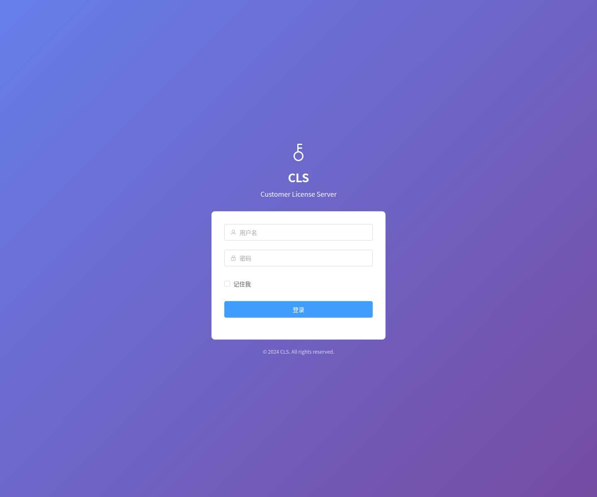

## 离线授权操作流程

### 1. 在 ELS 中创建客户

登录 ELS 后，进入左侧 **客户管理**，点击右上角 **创建客户**。填写客户名称、邮箱、公司等信息后提交。

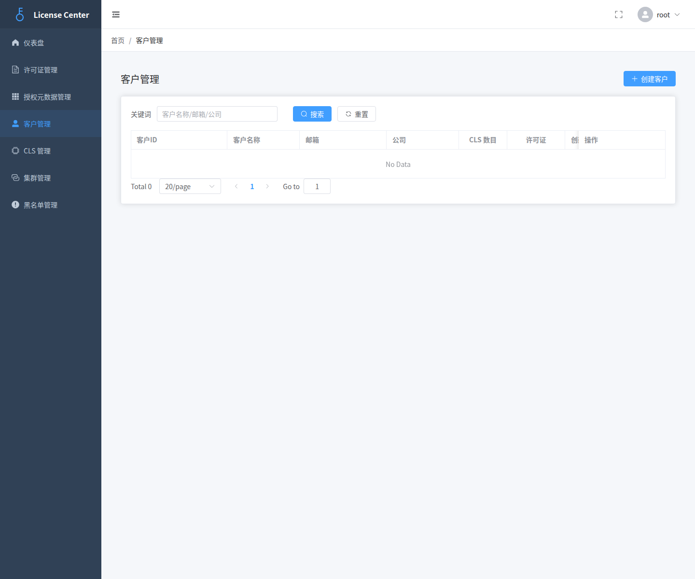

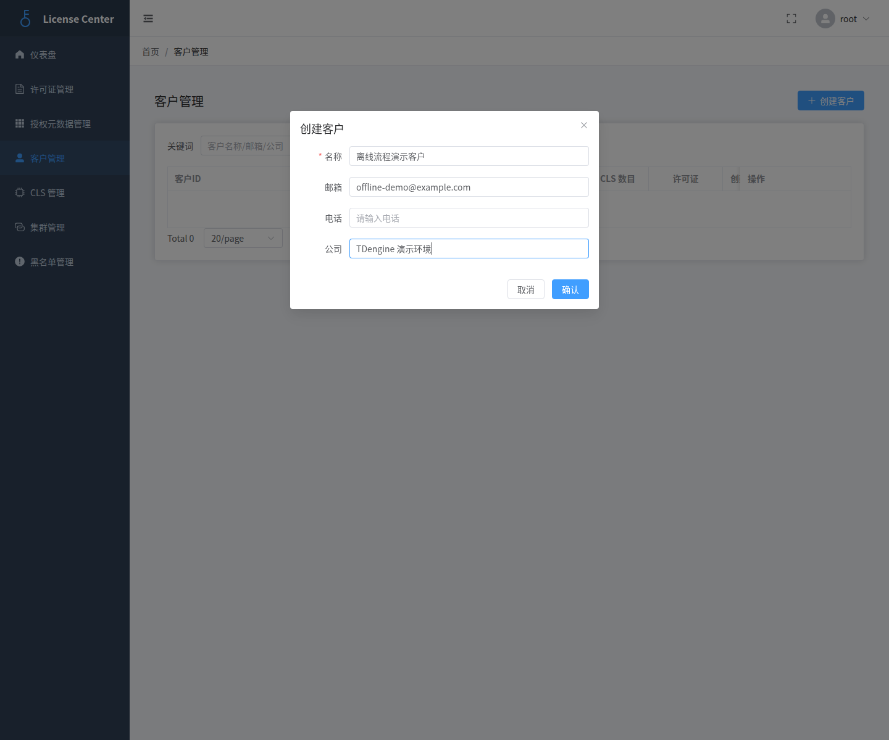

创建成功后，客户会出现在列表中。

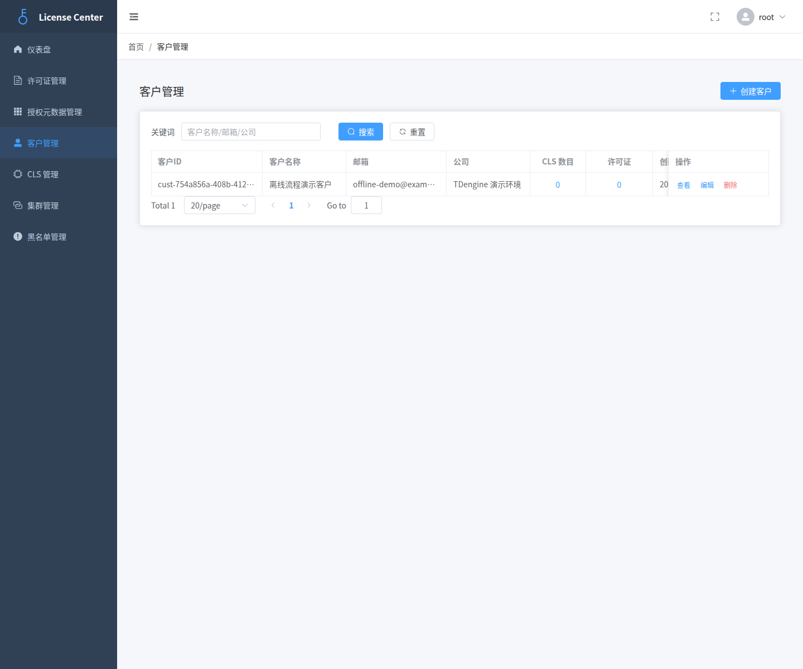

### 2. 在 ELS 中注册 CLS

登录 CLS 后，可以在左侧 **本机信息** 页面查看并复制当前设备的 `CLS ID` 与 **公钥令牌 (Base64)**。拿到公钥令牌后，回到 ELS 的 **CLS 管理** 页面，点击 **创建 CLS**，选择刚创建的客户并粘贴公钥令牌，完成注册。

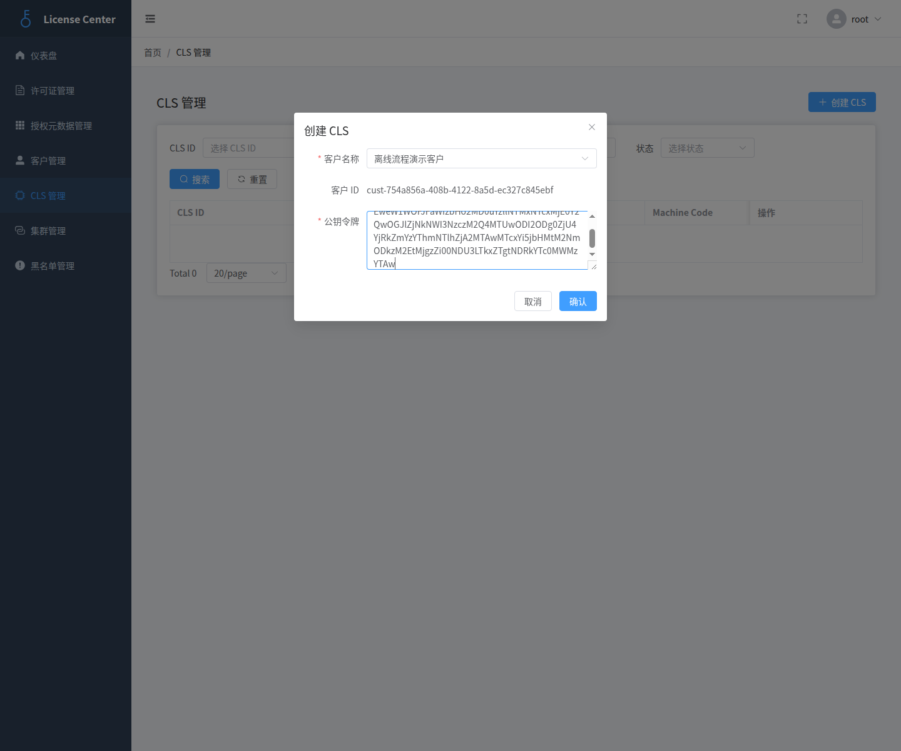

注册成功后，可以在 CLS 列表中看到新建记录以及对应的 `CLS ID`。

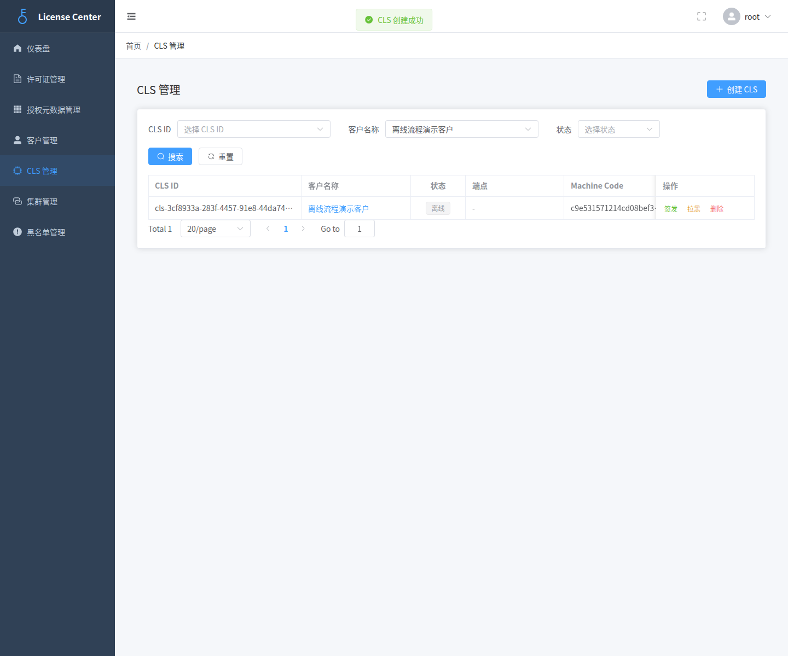

### 3. 在 ELS 中签发许可证

在 **CLS 管理** 或 **许可证管理** 中为目标 CLS 发起签发。当前界面会要求选择许可证类型、有效期、TSDB 配额数量和 IDMP 配额数量，并自动带出授权项。

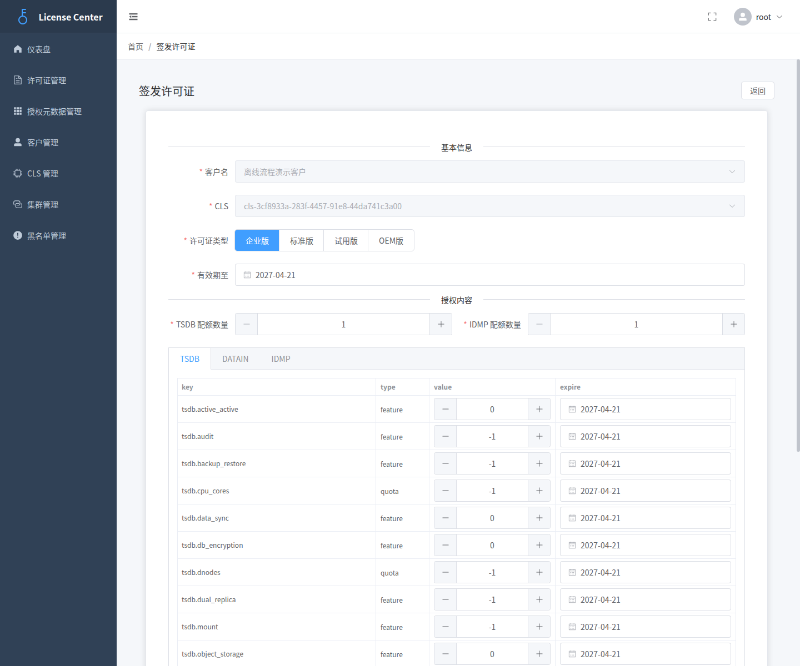

签发完成后，许可证会出现在 **许可证管理** 列表中。

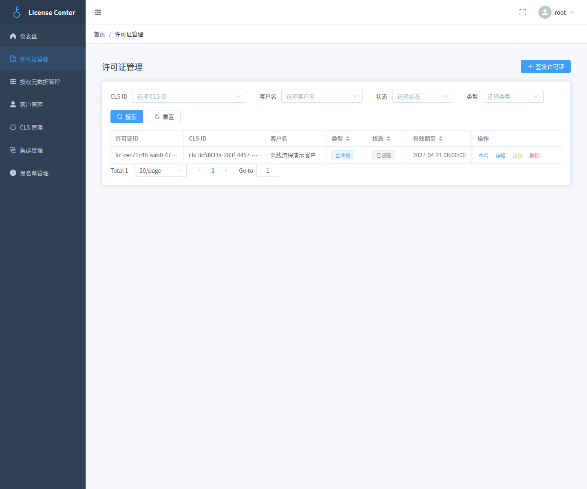

### 4. 在 ELS 中导出离线令牌

打开刚签发的许可证详情页，在右侧 **离线令牌** 区域点击 **下载令牌**，浏览器会下载文件 `offline-license.token`。

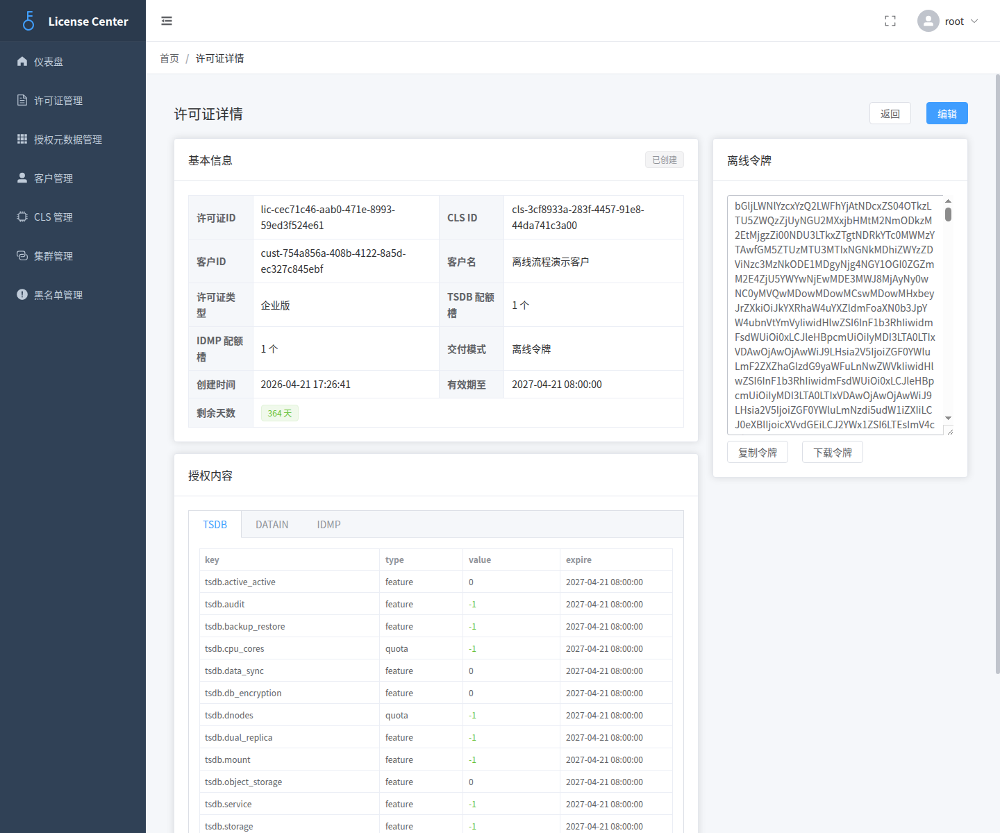

### 5. 在 CLS 中导入 `offline-license.token`

回到 CLS 的 **许可证管理** 页面，点击右上角 **离线导入**，选择刚从 ELS 下载的 `offline-license.token`，然后点击 **导入**。

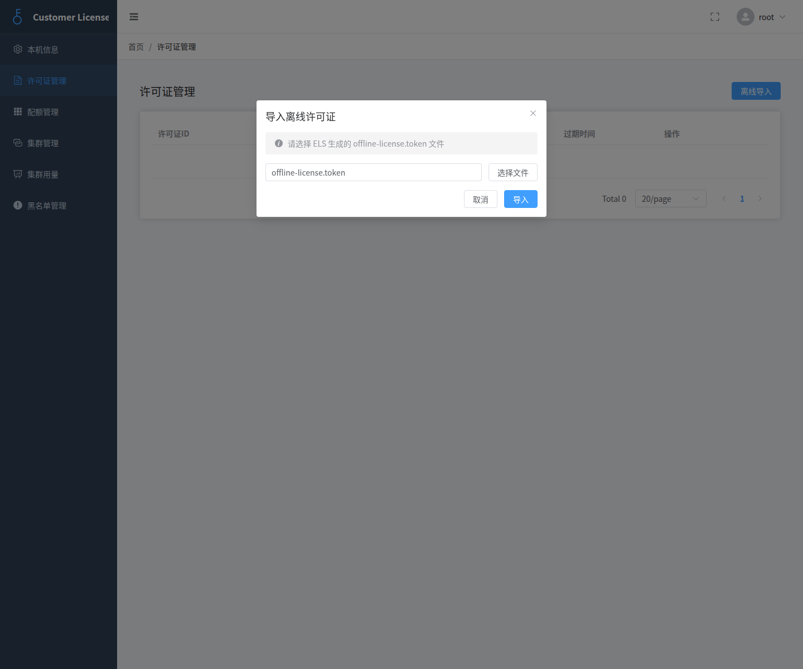

导入成功后，许可证会出现在 CLS 的许可证列表中。

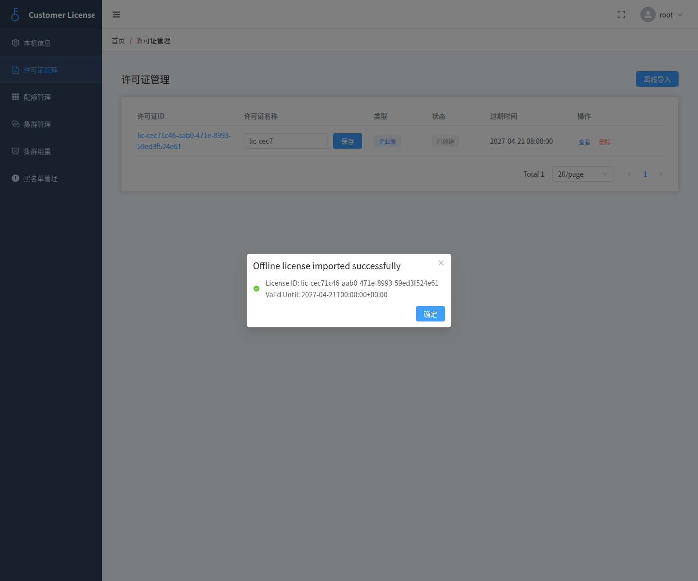

### 6. 在 CLS 中查看配额管理

进入左侧 **配额管理** 页面，可以查看该许可证拆分后的配额和授权项明细，包括许可证 ID、配额 ID、授权项、类别、类型、值和过期时间。

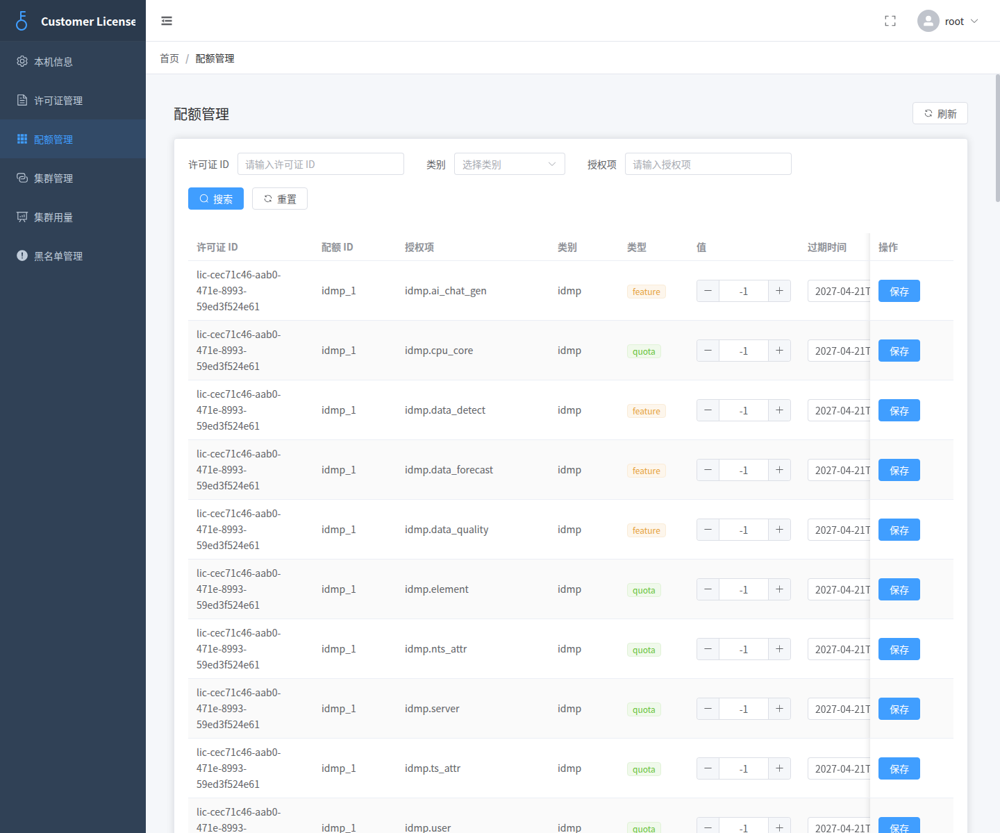

## 后续说明

完成离线授权后，启动 IDMP / TSDB 并开始正常上报心跳，相关集群与使用量信息会逐步出现在 ELS 和 CLS 的 **集群管理** 页面中，便于后续持续查看授权使用情况。

## TSDB 集群配置

### 使用 SQL 配置

TSDB 配置可以使用如下 4 个 SQL 指令配置 CLS 服务相关信息，示例如下：

```bash
ALTER ALL DNODES 'clsEnabled' '1';
ALTER ALL DNODES 'clsRefreshInterval' '15';
ALTER ALL DNODES 'clsUrl' 'http://192.168.2.158:6072';
ALTER ALL DNODES 'clsLicenseId' 'lic-53467044-2dad-4be2-9280-adacb201a644';
```

说明：

`clsEnabled`: 表示是否开启 CLS 许可证功能

`clsRefreshInterval`: 表示与 CLS 服务通信间隔

`clsUrl`: 表示 CLS 服务地址

`clsLicenseId`: 表示要获取的许可证 ID

### 使用 taos-explorer 配置

在 taos-explorer 组件的 系统管理/许可证 页面，点击激活许可证按钮后，可以看到如下配置页面：

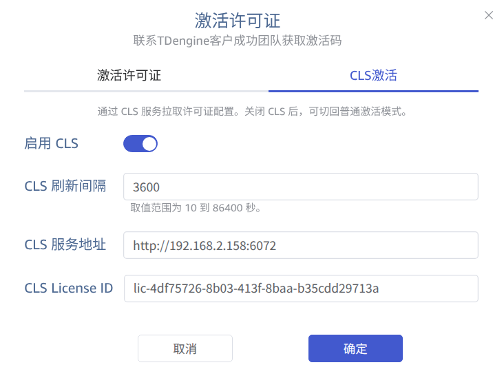

配置字段含义和 SQL 配置一致。

