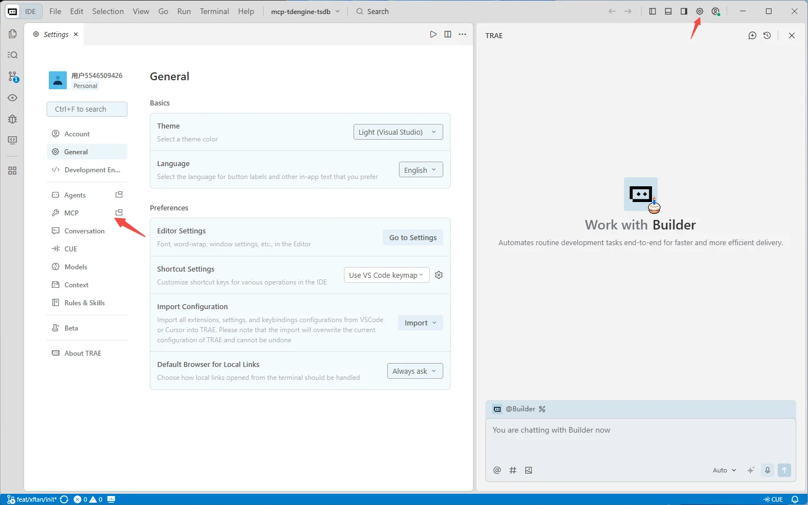
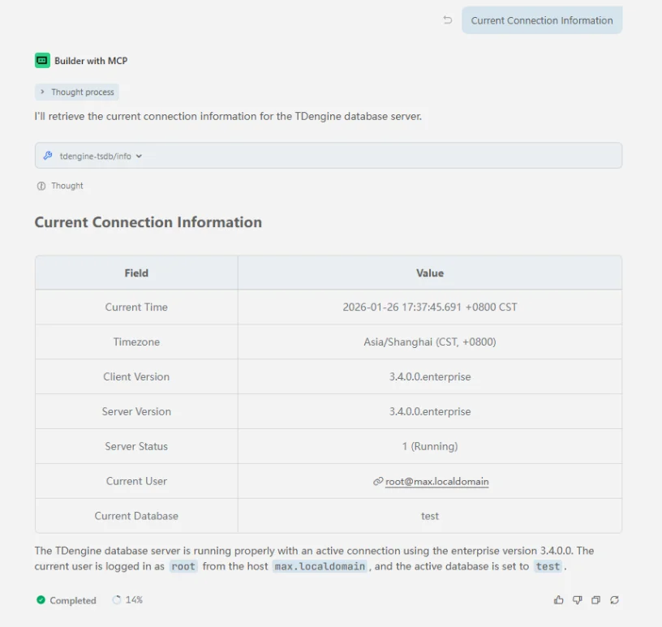
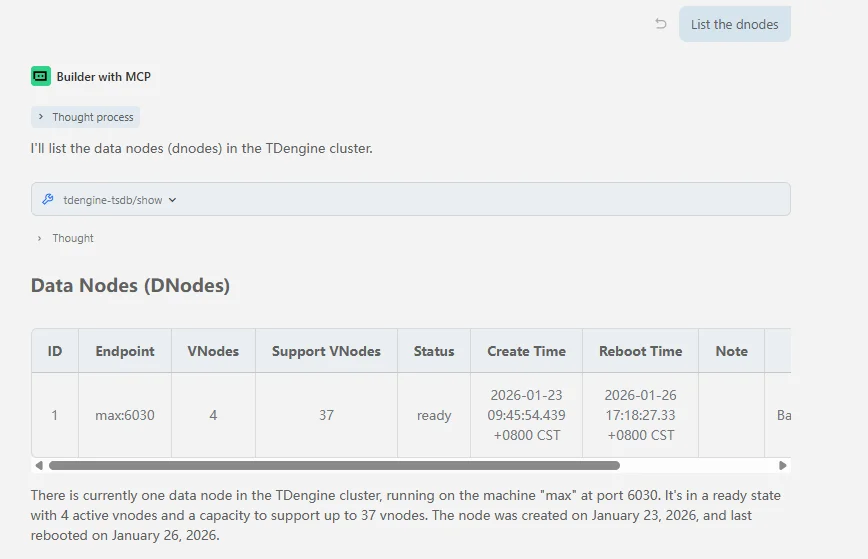
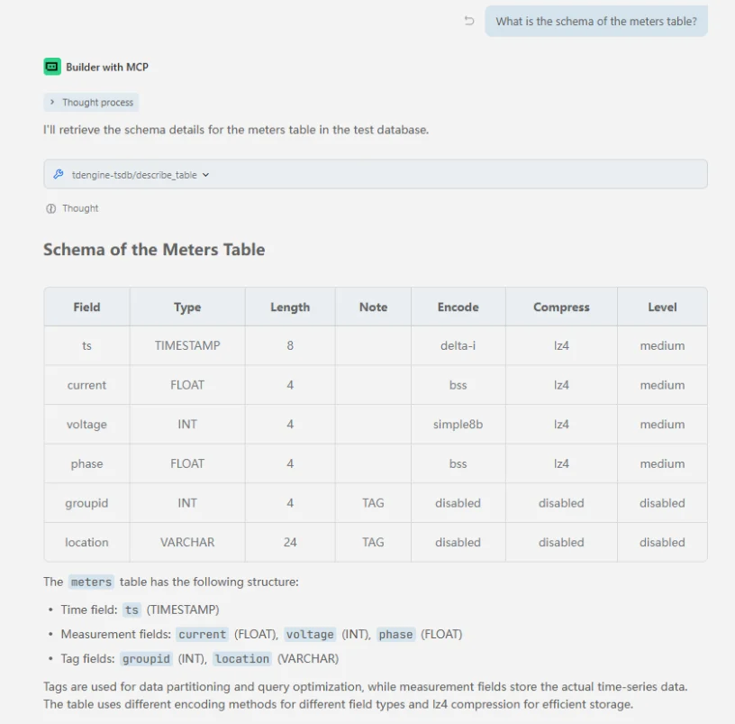

mcp-tdengine-tsdb（MCP Server for TDengine TSDB），提供了一套完整的工具集，用于查询、管理和监控 TDengine 时序数据库。

mcp-tdengine-tsdb 目前支持 Windows x64、Linux x64/arm64 和 macOS x64/arm64 系统。

## 功能

mcp-tdengine-tsdb 提供了一系列工具用于操作 TDengine TSDB：

- **查询工具 (query)** - 执行 TDengine SELECT 查询并返回结果
- **显示工具 (show)** - 执行各种 SHOW 命令查询元数据，支持多种参数选项
- **信息工具 (info)** - 提供 TDengine 服务器信息，包括版本、状态等
- **描述表工具 (describe_table)** - 描述指定表的结构
- **预定义 schema 获取工具 (get_schema_overview)** - 获取数据库结构概览信息，`schema_overview_file` 参数配置后生效，将读取文件内容直接返回。

mcp-tdengine-tsdb 不能执行数据写入、删除、表结构变更等操作，仅支持只读查询。

## 工具获取

从 [mcp-tdengine-tsdb](https://github.com/taosdata/mcp-tdengine-tsdb/releases) 获取最新 MCP Server，选择对应的系统和架构进行下载。

## 配置

mcp-tdengine-tsdb 支持通过命令行参数或环境变量配置连接 TDengine 所需的信息，命令行参数优先级大于环境变量。以下为可用的参数列表：

| 参数                       | 环境变量                            | 默认值         | 描述                                |
|:-------------------------|:--------------------------------|:------------|:----------------------------------|
| `--host`                 | `TDENGINE_HOST`                 | `localhost` | TDengine 主机名                      |
| `--port`                 | `TDENGINE_PORT`                 | `6041`      | TDengine 端口（taosAdapter 端口）       |
| `--user`                 | `TDENGINE_USER`                 | `root`      | TDengine 用户名                      |
| `--pass`                 | `TDENGINE_PASS`                 | `taosdata`  | TDengine 密码                       |
| `--db`                   | `TDENGINE_DB`                   |             | TDengine 数据库名                     |
| `--dsn`                  | `TDENGINE_DSN`                  |             | TDengine 数据源名称 (DSN)，优先级高于单独的连接参数 |
| `--schema_overview_file` | `TDENGINE_SCHEMA_OVERVIEW_FILE` |             | 预定义数据库 schema 概览文件路径              |

连接云服务时可通过配置 DSN 连接参数，例如：

```bash
--dsn=wss(gw.us-west-2.aws.cloud.tdengine.com:443)/test?readTimeout=1m&token=xxxxxxxx
```

## 添加 MCP

下载 mcp-tdengine-tsdb 后将其放到任意目录，然后在各个 AI 助手中配置 MCP Server 路径和连接参数。

### 以 Trae 为例添加 MCP

1. 在 Trae AI 对话窗口右上角，点击设置图标->MCP，会打开 MCP 窗口

   

2. 点击手动添加后填入以下内容 command 改为 mcp-tdengine-tsdb 所在全路径，Windows 系统注意要路径转义。db 参数填写你要操作的数据库名称，点击确认后即可使用 MCP Server for TDengine TSDB 进行数据查询和管理操作。

   ```json
   {
     "mcpServers": {
       "tdengine-tsdb": {
         "command": "E:\\github\\mcp-tdengine-tsdb\\mcp-tdengine-tsdb.exe",
         "args": [
           "--host", "localhost",
           "--port", "6041",
           "--user", "root",
           "--pass", "taosdata",
           "--db", "test"
         ]
       }
     }
   }
   ```

   

3. AI 框选择 Builder with MCP，可以看到 tdengine-tsdb mcp 已经启动。

   

### 以 Claude Code 为例添加 MCP

使用 `claude mcp add` 命令添加 MCP Server for TDengine TSDB：

```bash
claude mcp add tdengine-tsdb -- /path-to-mcp/mcp-tdengine-tsdb --host localhost --port 6041 --user root --pass taosdata --db test
```

然后使用 `claude mcp list` 命令查看已添加的 MCP

## 使用 MCP

以下是一些使用示例：

1. 获取连接信息
   
2. 获取 dnode 列表
   
3. 获取数据库列表
   
4. 获取超级表列表
   
5. 获取表结构
   
6. 执行查询语句
   
