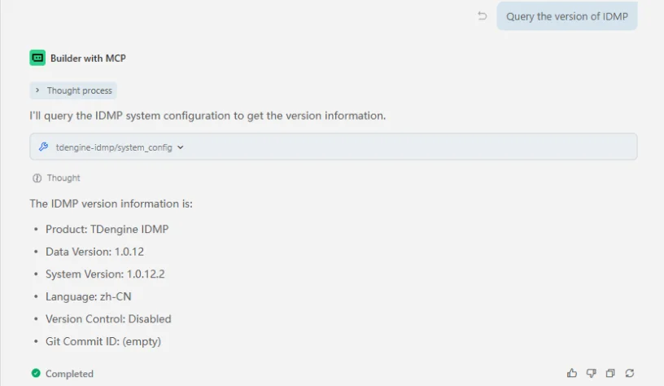

mcp-tdengine-idmp（MCP Server for TDengine IDMP），提供了一套完整的工具集，用于查询和读取 IDMP 平台信息。

mcp-tdengine-idmp 目前支持 Windows x64、Linux x64/arm64 和 macOS x64/arm64 系统。

## 功能

mcp-tdengine-idmp 提供了一系列工具用于操作 TDengine IDMP：

- **对话工具 (chat)** - 使用 `prompt` 调用 IDMP AI Chat Stream 接口并返回文本结果
- **系统配置工具 (system_config)** - 获取 IDMP 系统配置并返回 JSON 结果

mcp-tdengine-idmp 仅支持只读查询，不提供写入、删除或配置变更类操作。

## 工具获取

从 [mcp-tdengine-idmp](https://github.com/taosdata/mcp-tdengine-idmp/releases) 获取最新 MCP Server，选择对应的系统和架构进行下载。

Linux 和 macOS 系统从 Release 下载后，可能需要先添加可执行权限：

```bash
chmod +x /path-to-mcp/mcp-tdengine-idmp
```

## 配置

mcp-tdengine-idmp 支持通过命令行参数或环境变量配置连接 IDMP 所需的信息，命令行参数优先级大于环境变量。以下为可用参数列表：

| 参数           | 环境变量        | 默认值 | 描述          |
|:-------------|:--------------|:-----|:------------|
| `--base_url` | `IDMP_BASE_URL` |      | IDMP 服务基础地址 |
| `--user`     | `IDMP_USER`     |      | IDMP 登录用户名  |
| `--pass`     | `IDMP_PASS`     |      | IDMP 登录密码   |

> 注意：如果 IDMP 开启了验证码登录，服务将无法启动，请先关闭验证码功能。

## 添加 MCP

下载 mcp-tdengine-idmp 后将其放到任意目录，然后在各个 AI 助手中配置 MCP Server 路径和连接参数。

### 以 Trae 为例添加 MCP

在 Trae 的 MCP 配置中填入如下内容（`command` 改为你的可执行文件绝对路径）：

```json
{
  "mcpServers": {
    "tdengine-idmp": {
      "command": "E:\\github\\mcp-tdengine-idmp\\mcp-tdengine-idmp.exe",
      "args": [
        "--base_url", "http://127.0.0.1:6042",
        "--user", "your_user",
        "--pass", "your_pass"
      ]
    }
  }
}
```

### 以 Claude Code 为例添加 MCP

使用 `claude mcp add` 命令添加 MCP Server for TDengine IDMP：

```bash
claude mcp add tdengine-idmp -- /path-to-mcp/mcp-tdengine-idmp --base_url http://127.0.0.1:6042 --user your_user --pass your_pass
```

然后使用 `claude mcp list` 命令查看已添加的 MCP。

## 使用 MCP

以下是一些使用示例：

1. 获取系统配置

   

2. 使用 AI 对话获取信息

   

## 机制说明

- MCP Server 启动时会先执行登录配置检查，再进行账号登录。
- 当调用接口出现会话失效（4xx）时，服务会自动重登录并重试一次。
- 传输方式为 stdio，适合在本地 MCP Host（如 Trae、Claude Code）中直接集成。
