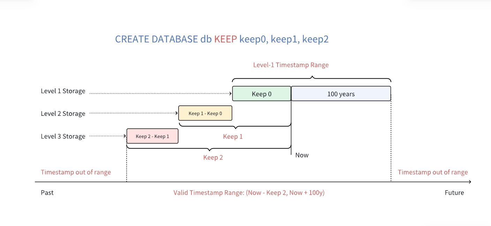

## 写入语法

写入记录支持两种语法，正常语法和超级表语法。正常语法下，紧跟 INSERT INTO 后名的表名是子表名或者普通表名。超级表语法下，紧跟 INSERT INTO 后名的表名是超级表名。

### 正常语法

```sql
INSERT INTO
    tb_name
        [USING stb_name [(tag1_name, ...)] TAGS (tag1_value, ...)]
        [(field1_name, ...)]
        VALUES (field1_value, ...) [(field1_value2, ...) ...] | FILE csv_file_path
    [tb2_name
        [USING stb_name [(tag1_name, ...)] TAGS (tag1_value, ...)]
        [(field1_name, ...)]
        VALUES (field1_value, ...) [(field1_value2, ...) ...] | FILE csv_file_path
    ...];

INSERT INTO tb_name [(field1_name, ...)] subquery
```

### 超级表语法

```sql
INSERT INTO
    stb1_name [(field1_name, ...)]
        VALUES (field1_value, ...) [(field1_value2, ...) ...] | FILE csv_file_path
    [stb2_name [(field1_name, ...)]
        VALUES (field1_value, ...) [(field1_value2, ...) ...] | FILE csv_file_path
    ...];

INSERT INTO stb_name (tbname, field1_name, ...) subquery
```

#### 关于主键时间戳

TDengine TSDB 要求插入的数据必须要有时间戳，插入数据的时间戳要注意以下几点：

1. 不同的时间戳格式有不同的精度影响。字符串格式的时间戳写法不受所在 DATABASE 的时间精度影响；而长整形格式的时间戳写法会受到所在 DATABASE 的时间精度影响。例如，时间戳 "2021-07-13 16:16:48" 的 UNIX 秒数为 1626164208。其在毫秒精度下需要写作 1626164208000，微秒精度下需要写为 1626164208000000，纳秒精度下需要写为 1626164208000000000。

2. 一次插入多行数据时，不要把首列的时间戳的值都写 NOW。否则会导致语句中的多条记录使用相同的时间戳，可能出现相互覆盖以致这些数据行无法全部被正确保存。其原因在于，NOW 函数在执行中会被解析为所在 SQL 语句的客户端执行时间，在同一语句中的多个 NOW 标记会被替换为完全相同的时间戳。

3. 允许插入的最大时间戳为当前时间加上 100 年，比如当前时间为 `2024-11-11 12:00:00`，允许插入的最大时间戳为`2124-11-11 12:00:00`。允许插入的最小时间戳取决于数据库的 KEEP 设置。企业版支持三级存储，可以设置多个 KEEP 时间，如下图所示，如果数据库的 KEEP 配置为 `100h,100d,3650d`，允许的最小时间戳为当前时间减去 3650 天。那么，时间戳在 `[Now - 100h, Now + 100y)` 内的会保存在一级存储，时间戳在 `[Now - 100d, Now - 100h)` 内的会保存在二级存储，时间戳在 `[Now - 3650d, Now - 100d)` 内的会保存在三级存储。社区版不支持多级存储功能，只能配置一个 KEEP 值，如果配置多个，则取其最大者。如果时间戳不在有效时间范围内，TDengine TSDB 将返回错误 "Timestamp out of range"。


#### 语法说明

1. 可以指定要插入值的列，未指定的列将自动填充为 NULL。

2. VALUES 语法表示了要插入的一行或多行数据。

3. FILE 语法表示数据来自于 CSV 文件（英文逗号分隔、英文单引号括住每个值），CSV 文件无需表头。如仅需创建子表，请参考 [表](../table/#批量创建子表) 章节。

4. `INSERT ... VALUES` 语句和 `INSERT ... FILE` 语句均可以在一条 INSERT 语句中同时向多个表插入数据。

5. INSERT 语句是完整解析后再执行的，对如下语句，不会再出现数据错误但建表成功的情况：

```sql
INSERT INTO d1001 USING meters TAGS('Beijing.Chaoyang', 2) VALUES('a');
```

6. 向多个子表插入数据时，会有部分数据写入失败，部分数据写入成功的情况。这是因为多个子表可能分布在不同的 VNODE 上，客户端将 INSERT 语句完整解析后，将数据发往各个涉及的 VNODE 上，每个 VNODE 独立进行写入操作。如果某个 VNODE 因为某些原因（比如网络问题或磁盘故障）导致写入失败，并不会影响其他 VNODE 节点的写入。

7. 主键列值必须指定且不能为 NULL。

#### 正常语法说明

1. USING 子句是自动建表语法。用户在写数据时如不确定表是否存在，可以在写入数据时使用自动建表语法来创建不存在的表。若该表已存在，不会建立新表，也不会触发标签值的修改。自动建表时，必须以超级表为模板，写明数据表的 TAGS 取值。可以指定部分 TAGS 列的取值，未被指定的 TAGS 列将置为 NULL。

2. 可以使用 `INSERT ... subquery` 语句将 TDengine TSDB 中的数据插入到指定表中。subquery 可以是任意的查询语句。

#### 超级表语法说明

1. 在 field_name 列表中必须指定 tbname 列，否则报错。tbname 列是子表名，类型是字符串。字符不用转义，不能包含点‘.‘。

2. 在 field_name 列表中支持标签列，当子表已经存在时，指定标签值不会触发标签值的修改；当子表不存在时，会使用所指定的标签值建立子表；如果没有指定任何标签列，则把所有标签列的值设置为 NULL。

3. 不支持参数绑定写入。

4. 使用`INSERT ... subquery` 语句将 TDengine TSDB 中的数据插入到指定超级表中。field_name 必须指定，并且的第一个 field_name 必须是 tbname，否则报错。支持自动建表。

## 插入一条记录

指定已经创建好的数据子表的表名，并通过 VALUES 关键字提供一行或多行数据，即可向数据库写入这些数据。例如，执行如下语句可以写入一行记录：

```sql
INSERT INTO d1001 VALUES (NOW, 10.2, 219, 0.32);
```

## 插入多条记录

或者，可以通过如下语句写入两行记录：

```sql
INSERT INTO d1001 VALUES ('2021-07-13 14:06:32.272', 10.2, 219, 0.32) (1626164208000, 10.15, 217, 0.33);
```

## 指定列插入

向数据子表中插入记录时，无论插入一行还是多行，都可以让数据对应到指定的列。对于 SQL 语句中没有出现的列，数据库将自动填充为 NULL。主键（时间戳）不能为 NULL。例如：

```sql
INSERT INTO d1001 (ts, current, phase) VALUES ('2021-07-13 14:06:33.196', 10.27, 0.31);
```

## 向多个表插入记录

可以在一条语句中，分别向多个表插入一条或多条记录，也可以在插入过程中指定列。例如：

```sql
INSERT INTO d1001 VALUES ('2021-07-13 14:06:34.630', 10.2, 219, 0.32) ('2021-07-13 14:06:35.779', 10.15, 217, 0.33)
            d1002 (ts, current, phase) VALUES ('2021-07-13 14:06:34.255', 10.27, 0.31);
```

## 插入记录时自动建表

如果用户在写数据时并不确定某个表是否存在，可以在写入数据时使用自动建表语法来创建不存在的表；若该表已存在，不会建立新表，也不会触发标签值的修改。自动建表时，要求必须以超级表为模板，并写明数据表的 TAGS 取值。例如：

```sql
INSERT INTO d21001 USING meters TAGS ('California.SanFrancisco', 2) VALUES ('2021-07-13 14:06:32.272', 10.2, 219, 0.32);
```

可以在自动建表时，只指定部分 TAGS 列的取值，未被指定的 TAGS 列将置为 NULL。例如：

```sql
INSERT INTO d21001 USING meters (groupId) TAGS (2) VALUES ('2021-07-13 14:06:33.196', 10.15, 217, 0.33);
```

自动建表语法支持在一条语句中向多个表插入记录。例如：

```sql
INSERT INTO d21001 USING meters TAGS ('California.SanFrancisco', 2) VALUES ('2021-07-13 14:06:34.630', 10.2, 219, 0.32) ('2021-07-13 14:06:35.779', 10.15, 217, 0.33)
            d21002 USING meters (groupId) TAGS (2) VALUES ('2021-07-13 14:06:34.255', 10.15, 217, 0.33)
            d21003 USING meters (groupId) TAGS (2) (ts, current, phase) VALUES ('2021-07-13 14:06:34.255', 10.27, 0.31);
```

## 插入来自文件的数据记录

除了使用 VALUES 关键字插入一行或多行数据外，可以把要写入的数据放在 CSV 文件中（英文逗号分隔、时间戳和字符串类型的值需要用英文单引号括住），供 SQL 指令读取。其中 CSV 文件无需表头。例如，如果 /tmp/csvfile.csv 文件的内容为：

```csv
'2021-07-13 14:07:34.630', 10.2, 219, 0.32
'2021-07-13 14:07:35.779', 10.15, 217, 0.33
```

通过如下指令可以把该文件中的数据写入子表中：

```sql
INSERT INTO d1001 FILE '/tmp/csvfile.csv';
```

## 插入来自文件的数据记录，并自动建表

```sql
INSERT INTO d21001 USING meters TAGS ('California.SanFrancisco', 2) FILE '/tmp/csvfile.csv';
```

可以在一条语句中向多个表以自动建表的方式插入记录（表已经存在时，不会触发标签值的修改）。例如：

```sql
INSERT INTO d21001 USING meters TAGS ('California.SanFrancisco', 2) FILE '/tmp/csvfile_21001.csv'
            d21002 USING meters (groupId) TAGS (2) FILE '/tmp/csvfile_21002.csv';
```

## 向超级表插入数据并自动创建子表

自动建表，表名通过 tbname 列指定

```sql
INSERT INTO meters(tbname, location, groupId, ts, current, voltage, phase)
                VALUES ('d31001', 'California.SanFrancisco', 2, '2021-07-13 14:06:34.630', 10.2, 219, 0.32)
                ('d31001', 'California.SanFrancisco', 2, '2021-07-13 14:06:35.779', 10.15, 217, 0.33)
                ('d31002', NULL, 2, '2021-07-13 14:06:34.255', 10.15, 217, 0.33)
```

## 通过 CSV 文件向超级表插入数据并自动创建子表

根据 csv 文件内容，为超级表创建子表，并填充相应 column 与 tag

```sql
INSERT INTO meters(tbname, location, groupId, ts, current, voltage, phase)
                FILE '/tmp/csvfile_21002.csv'
```
