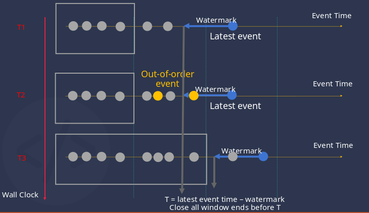

## 创建流式计算

```sql
CREATE STREAM [IF NOT EXISTS] stream_name [stream_options] INTO stb_name[(field1_name, field2_name [COMPOSITE KEY], ...)] [TAGS (create_definition [, create_definition] ...)] SUBTABLE(expression) AS subquery [notification_definition]
stream_options: {
 TRIGGER        [AT_ONCE | WINDOW_CLOSE | MAX_DELAY time | FORCE_WINDOW_CLOSE| CONTINUOUS_WINDOW_CLOSE [recalculate rec_time_val] ]
 WATERMARK      time
 IGNORE EXPIRED [0|1]
 DELETE_MARK    time
 FILL_HISTORY   [0|1] [ASYNC]
 IGNORE UPDATE  [0|1]
}

```

其中 subquery 是 select 普通查询语法的子集。

```sql
subquery: SELECT select_list
    from_clause
    [WHERE condition]
    [PARTITION BY tag_list]
    window_clause
```

支持会话窗口、状态窗口、滑动窗口、事件窗口和计数窗口。其中，状态窗口、事件窗口和计数窗口搭配超级表时必须与 partition by tbname 一起使用。对于数据源表是复合主键的流，不支持状态窗口、事件窗口、计数窗口的计算。

stb_name 是保存计算结果的超级表的表名，如果该超级表不存在，会自动创建；如果已存在，则检查列的 schema 信息。详见 [写入已存在的超级表](#写入已存在的超级表)。

TAGS 子句定义了流计算中创建 TAG 的规则，可以为每个 partition 对应的子表生成自定义的 TAG 值，详见 [自定义 TAG](#自定义-tag)
```sql
create_definition:
    col_name column_definition
column_definition:
    type_name [COMMENT 'string_value']
```

subtable 子句定义了流式计算中创建的子表的命名规则，详见 [流式计算的 partition](#流式计算的-partition)。

```sql
window_clause: {
    SESSION(ts_col, tol_val)
  | STATE_WINDOW(col)
  | INTERVAL(interval_val [, interval_offset]) [SLIDING (sliding_val)]
  | EVENT_WINDOW START WITH start_trigger_condition END WITH end_trigger_condition
  | COUNT_WINDOW(count_val[, sliding_val])
}
```

其中：

- SESSION 是会话窗口，tol_val 是时间间隔的最大范围。在 tol_val 时间间隔范围内的数据都属于同一个窗口，如果连续的两条数据的时间超过 tol_val，则自动开启下一个窗口。该窗口的 _wend 等于最后一条数据的时间加上 tol_val。

- STATE_WINDOW 是状态窗口，col 用来标识状态量，相同的状态量数值则归属于同一个状态窗口，col 数值改变后则当前窗口结束，自动开启下一个窗口。

- INTERVAL 是时间窗口，又可分为滑动时间窗口和翻转时间窗口。INTERVAL 子句用于指定窗口相等时间周期，SLIDING 字句用于指定窗口向前滑动的时间。当 interval_val 与 sliding_val 相等的时候，时间窗口即为翻转时间窗口，否则为滑动时间窗口，注意：sliding_val 必须小于等于 interval_val。

- EVENT_WINDOW 是事件窗口，根据开始条件和结束条件来划定窗口。当 start_trigger_condition 满足时则窗口开始，直到 end_trigger_condition 满足时窗口关闭。start_trigger_condition 和 end_trigger_condition 可以是任意 TDengine 支持的条件表达式，且可以包含不同的列。

- COUNT_WINDOW 是计数窗口，按固定的数据行数来划分窗口。count_val 是常量，是正整数，必须大于等于 2，小于 2147483648。count_val 表示每个 COUNT_WINDOW 包含的最大数据行数，总数据行数不能整除 count_val 时，最后一个窗口的行数会小于 count_val。sliding_val 是常量，表示窗口滑动的数量，类似于 INTERVAL 的 SLIDING。

窗口的定义与时序数据特色查询中的定义完全相同，详见 [TDengine 特色查询](../distinguished)

例如，如下语句创建流式计算。第一个流计算，自动创建名为 avg_vol 的超级表，以一分钟为时间窗口、30 秒为前向增量统计这些电表的平均电压，并将来自 meters 表的数据的计算结果写入 avg_vol 表，不同 partition 的数据会分别创建子表并写入不同子表。

第二个流计算，自动创建名为 streamt0 的超级表，将数据按时间戳的顺序，以 voltage < 0 作为窗口的开始条件，voltage > 9 作为窗口的结束条件，划分窗口做聚合运算，并将来自 meters 表的数据的计算结果写入 streamt0 表，不同 partition 的数据会分别创建子表并写入不同子表。

第三个流计算，自动创建名为 streamt1 的超级表，将数据按时间戳的顺序，以 10 条数据为一组，划分窗口做聚合运算，并将来自 meters 表的数据的计算结果写入 streamt1 表，不同 partition 的数据会分别创建子表并写入不同子表。

```sql
CREATE STREAM avg_vol_s INTO avg_vol AS
SELECT _wstart, count(*), avg(voltage) FROM meters PARTITION BY tbname INTERVAL(1m) SLIDING(30s);

CREATE STREAM streams0 INTO streamt0 AS
SELECT _wstart, count(*), avg(voltage) from meters PARTITION BY tbname EVENT_WINDOW START WITH voltage < 0 END WITH voltage > 9;

CREATE STREAM streams1 IGNORE EXPIRED 1 WATERMARK 100s INTO streamt1 AS
SELECT _wstart, count(*), avg(voltage) from meters PARTITION BY tbname COUNT_WINDOW(10);
```

notification_definition 子句定义了窗口计算过程中，在窗口打开/关闭等指定事件发生时，需要向哪些地址发送通知。详见 [流式计算的事件通知](#流式计算的事件通知)

## 流式计算的 partition

可以使用 PARTITION BY TBNAME，tag，普通列或者表达式，对一个流进行多分区的计算，每个分区的时间线与时间窗口是独立的，会各自聚合，并写入到目的表中的不同子表。

不带 PARTITION BY 子句时，所有的数据将写入到一张子表。

在创建流时不使用 SUBTABLE 子句时，流式计算创建的超级表有唯一的 tag 列 groupId，每个 partition 会被分配唯一 groupId。与 schemaless 写入一致，我们通过 MD5 计算子表名，并自动创建它。

若创建流的语句中包含 SUBTABLE 子句，用户可以为每个 partition 对应的子表生成自定义的表名，例如：

```sql
CREATE STREAM avg_vol_s INTO avg_vol SUBTABLE(CONCAT('new-', tname)) AS SELECT _wstart, count(*), avg(voltage) FROM meters PARTITION BY tbname tname INTERVAL(1m);
```

PARTITION 子句中，为 tbname 定义了一个别名 tname, 在 PARTITION 子句中的别名可以用于 SUBTABLE 子句中的表达式计算，在上述示例中，流新创建的子表将以前缀 'new-' 连接原表名作为表名（从 v3.2.3.0 开始，为了避免 SUBTABLE 中的表达式无法区分各个子表，即误将多个相同时间线写入一个子表，在指定的子表名后面加上 _stableName_groupId）。

注意，子表名的长度若超过 TDengine 的限制，将被截断。若要生成的子表名已经存在于另一超级表，由于 TDengine 的子表名是唯一的，因此对应新子表的创建以及数据的写入将会失败。

## 流式计算读取历史数据

正常情况下，流式计算不会处理创建前已经写入源表中的数据，若要处理已经写入的数据，可以在创建流时设置 fill_history 1 选项，这样创建的流式计算会自动处理创建前、创建中、创建后写入的数据。流计算处理历史数据的最大窗口数是 2000 万，超过限制会报错。例如：

```sql
create stream if not exists s1 fill_history 1 into st1  as select count(*) from t1 interval(10s)
```

结合 fill_history 1 选项，可以实现只处理特定历史时间范围的数据，例如：只处理某历史时刻（2020 年 1 月 30 日）之后的数据

```sql
create stream if not exists s1 fill_history 1 into st1  as select count(*) from t1 where ts > '2020-01-30' interval(10s)
```

再如，仅处理某时间段内的数据，结束时间可以是未来时间

```sql
create stream if not exists s1 fill_history 1 into st1  as select count(*) from t1 where ts > '2020-01-30' and ts < '2023-01-01' interval(10s)
```

如果该流任务已经彻底过期，并且您不再想让它检测或处理数据，您可以手动删除它，被计算出的数据仍会被保留。

注意：
- 开启 fill_history 时，创建流需要找到历史数据的分界点，如果历史数据很多，可能会导致创建流任务耗时较长，此时可以通过 fill_history 1 async（v3.3.6.0 开始支持）语法将创建流的任务放在后台处理，创建流的语句可立即返回，不阻塞后面的操作。async 只对 fill_history 1 起效，fill_history 0 时建流很快，不需要异步处理。

- 通过 show streams 可查看后台建流的进度（ready 状态表示成功，init 状态表示正在建流，failed 状态表示建流失败，失败时 message 列可以查看原因。对于建流失败的情况可以删除流重新建立）。

- 另外，不要同时异步创建多个流，可能由于事务冲突导致后面创建的流失败。

## 删除流式计算

```sql
DROP STREAM [IF EXISTS] stream_name;
```

仅删除流式计算任务，由流式计算写入的数据不会被删除。

## 展示流式计算

```sql
SHOW STREAMS;
```

若要展示更详细的信息，可以使用：

```sql
SELECT * from information_schema.`ins_streams`;
```

## 流式计算的触发模式

在创建流时，可以通过 TRIGGER 指令指定流式计算的触发模式。

对于非窗口计算，流式计算的触发是实时的；对于窗口计算，目前提供 4 种触发模式，默认为 WINDOW_CLOSE。

1. AT_ONCE：写入立即触发

2. WINDOW_CLOSE：窗口关闭时触发（窗口关闭由事件时间决定，可配合 watermark 使用）

3. MAX_DELAY time：若窗口关闭，则触发计算。若窗口未关闭，且未关闭时长超过 max delay 指定的时间，则触发计算。

4. FORCE_WINDOW_CLOSE：以操作系统当前时间为准，只计算当前关闭窗口的结果，并推送出去。窗口只会在被关闭的时刻计算一次，后续不会再重复计算。该模式当前只支持 INTERVAL 窗口（不支持滑动）；FILL_HISTORY 必须为 0，IGNORE EXPIRED 必须为 1，IGNORE UPDATE 必须为 1；FILL 只支持 PREV、NULL、NONE、VALUE。

5. CONTINUOUS_WINDOW_CLOSE：窗口关闭时输出结果。修改、删除数据，并不会立即触发重算，每等待 rec_time_val 时长，会进行周期性重算。如果不指定 rec_time_val，那么重算周期是 60 分钟。如果重算的时间长度超过 rec_time_val，在本次重算后，自动开启下一次重算。该模式当前只支持 INTERVAL 窗口。如果使用 FILL，需要配置 adapter 的相关信息：adapterFqdn、adapterPort、adapterToken。adapterToken 为 `{username}:{password}` 经过 Base64 编码之后的字符串，例如 `root:taosdata` 编码后为 `cm9vdDp0YW9zZGF0YQ==`

由于窗口关闭是由事件时间决定的，如事件流中断、或持续延迟，则事件时间无法更新，可能导致无法得到最新的计算结果。

因此，流式计算提供了以事件时间结合处理时间计算的 MAX_DELAY 触发模式。MAX_DELAY 最小时间是 5s，如果低于 5s，创建流计算时会报错。

MAX_DELAY 模式在窗口关闭时会立即触发计算。此外，当数据写入后，计算触发的时间超过 max delay 指定的时间，则立即触发计算

## 流式计算的窗口关闭

流式计算以事件时间（插入记录中的时间戳主键）为基准计算窗口关闭，而非以 TDengine 服务器的时间，以事件时间为基准，可以避免客户端与服务器时间不一致带来的问题，能够解决乱序数据写入等等问题。流式计算还提供了 watermark 来定义容忍的乱序程度。

在创建流时，可以在 stream_option 中指定 watermark，它定义了数据乱序的容忍上界。

流式计算通过 watermark 来度量对乱序数据的容忍程度，watermark 默认为 0。

T = 最新事件时间 - watermark

每次写入的数据都会以上述公式更新窗口关闭时间，并将窗口结束时间 < T 的所有打开的窗口关闭，若触发模式为 WINDOW_CLOSE 或 MAX_DELAY，则推送窗口聚合结果。





图中，纵轴表示不同时刻，对于不同时刻，我们画出其对应的 TDengine 收到的数据，即为横轴。

横轴上的数据点表示已经收到的数据，其中蓝色的点表示事件时间 (即数据中的时间戳主键) 最后的数据，该数据点减去定义的 watermark 时间，得到乱序容忍的上界 T。

所有结束时间小于 T 的窗口都将被关闭（图中以灰色方框标记）。

T2 时刻，乱序数据（黄色的点）到达 TDengine，由于有 watermark 的存在，这些数据进入的窗口并未被关闭，因此可以被正确处理。

T3 时刻，最新事件到达，T 向后推移超过了第二个窗口关闭的时间，该窗口被关闭，乱序数据被正确处理。

在 window_close 或 max_delay 模式下，窗口关闭直接影响推送结果。在 at_once 模式下，窗口关闭只与内存占用有关。


## 流式计算对于过期数据的处理策略

对于已关闭的窗口，再次落入该窗口中的数据被标记为过期数据。

TDengine 对于过期数据提供两种处理方式，由 IGNORE EXPIRED 选项指定：

1. 增量计算，即 IGNORE EXPIRED 0。

2. 直接丢弃，即 IGNORE EXPIRED 1：默认配置，忽略过期数据


无论在哪种模式下，watermark 都应该被妥善设置，来得到正确结果（直接丢弃模式）或避免频繁触发重算带来的性能开销（重新计算模式）。

## 流式计算对于修改数据的处理策略

TDengine 对于修改数据提供两种处理方式，由 IGNORE UPDATE 选项指定：

1. 检查数据是否被修改，即 IGNORE UPDATE 0，如果数据被修改，则重新计算对应窗口。

2. 不检查数据是否被修改，全部按增量数据计算，即 IGNORE UPDATE 1，默认配置。


## 写入已存在的超级表
```sql
[field1_name, ...]
```
在本页文档顶部的 [field1_name, ...] 是用来指定 stb_name 的列与 subquery 输出结果的对应关系的。如果 stb_name 的列与 subquery 输出结果的位置、数量全部匹配，则不需要显示指定对应关系。如果 stb_name 的列与 subquery 输出结果的数据类型不匹配，会把 subquery 输出结果的类型转换成对应的 stb_name 的列的类型。创建流计算时不能指定 stb_name 的列和 TAG 的数据类型，否则会报错。

对于已经存在的超级表，检查列的 schema 信息
1. 检查列的 schema 信息是否匹配，对于不匹配的，则自动进行类型转换，当前只有数据长度大于 4096byte 时才报错，其余场景都能进行类型转换。
2. 检查列的个数是否相同，如果不同，需要显示的指定超级表与 subquery 的列的对应关系，否则报错；如果相同，可以指定对应关系，也可以不指定，不指定则按位置顺序对应。

## 自定义 TAG

用户可以为每个 partition 对应的子表生成自定义的 TAG 值。
```sql
CREATE STREAM streams2 trigger at_once INTO st1 TAGS(cc varchar(100)) as select _wstart, count(*) c1 from st partition by concat("tag-", tbname) as cc interval(10s);
```

PARTITION 子句中，为 concat("tag-", tbname) 定义了一个别名 cc，对应超级表 st1 的自定义 TAG 的名字。在上述示例中，流新创建的子表的 TAG 将以前缀 'new-' 连接原表名作为 TAG 的值。

会对 TAG 信息进行如下检查
1. 检查 tag 的 schema 信息是否匹配，对于不匹配的，则自动进行数据类型转换，当前只有数据长度大于 4096byte 时才报错，其余场景都能进行类型转换。
2. 检查 tag 的个数是否相同，如果不同，需要显示的指定超级表与 subquery 的 tag 的对应关系，否则报错；如果相同，可以指定对应关系，也可以不指定，不指定则按位置顺序对应。

## 清理中间状态

```
DELETE_MARK time
```
DELETE_MARK 用于删除缓存的窗口状态，也就是删除流计算的中间结果。如果不设置，默认值是 10 年
T = 最新事件时间 - DELETE_MARK

## 流式计算支持的函数

1. 所有的 [单行函数](../function/#单行函数) 均可用于流计算。
2. 以下 19 个聚合/选择函数 <b>不能</b> 应用在创建流计算的 SQL 语句。此外的其他类型的函数均可用于流计算。

- [leastsquares](../function/#leastsquares)
- [percentile](../function/#percentile)
- [top](../function/#top)
- [bottom](../function/#bottom)
- [elapsed](../function/#elapsed)
- [interp](../function/#interp)
- [derivative](../function/#derivative)
- [irate](../function/#irate)
- [twa](../function/#twa)
- [histogram](../function/#histogram)
- [diff](../function/#diff)
- [statecount](../function/#statecount)
- [stateduration](../function/#stateduration)
- [csum](../function/#csum)
- [mavg](../function/#mavg)
- [sample](../function/#sample)
- [tail](../function/#tail)
- [unique](../function/#unique)
- [mode](../function/#mode)

## 暂停、恢复流计算
1.流计算暂停计算任务
PAUSE STREAM [IF EXISTS] stream_name;
没有指定 IF EXISTS，如果该 stream 不存在，则报错；如果存在，则暂停流计算。指定了 IF EXISTS，如果该 stream 不存在，则返回成功；如果存在，则暂停流计算。

2.流计算恢复计算任务
RESUME STREAM [IF EXISTS] [IGNORE UNTREATED] stream_name;
没有指定 IF EXISTS，如果该 stream 不存在，则报错，如果存在，则恢复流计算；指定了 IF EXISTS，如果 stream 不存在，则返回成功；如果存在，则恢复流计算。如果指定 IGNORE UNTREATED，则恢复流计算时，忽略流计算暂停期间写入的数据。

## 状态数据备份与同步
流计算的中间结果成为计算的状态数据，需要在流计算整个生命周期中进行持久化保存。为了确保流计算中间状态能够在集群环境下在不同的节点间可靠地同步和迁移，从 v3.3.2.1 开始，需要在运行环境中部署 rsync 软件，还需要增加以下的步骤：
1. 在配置文件中配置 snode 的地址（IP + 端口）和状态数据备份目录（该目录系 snode 所在的物理节点的目录）。
2. 然后创建 snode。
完成上述两个步骤以后才能创建流。
如果没有创建 snode 并正确配置 snode 的地址，流计算过程中将无法生成检查点（checkpoint），并可能导致后续的计算结果产生错误。

> snodeAddress           127.0.0.1:873
> 
> checkpointBackupDir    /home/user/stream/backup/checkpoint/


## 创建 snode 的方式
使用以下命令创建 snode（stream node），snode 是流计算中有状态的计算节点，可用于部署聚合任务，同时负责备份不同的流计算任务生成的检查点数据。
```sql
CREATE SNODE ON DNODE [id]
```
其中的 id 是集群中的 dnode 的序号。请注意选择的 dnode，流计算的中间状态将自动在其上进行备份。
从 v3.3.4.0 开始，在多副本环境中创建流会进行 snode 的**存在性检查**，要求首先创建 snode。如果 snode 不存在，无法创建流。

## 流式计算的事件通知

### 使用说明

流式计算支持在窗口打开/关闭时，向外部系统发送相关的事件通知。用户通过 `notification_definition` 来指定需要通知的事件，以及用于接收通知消息的目标地址。

```sql
notification_definition:
    NOTIFY (url [, url] ...) ON (event_type [, event_type] ...) [notification_options]

event_type:
    'WINDOW_OPEN'
  | 'WINDOW_CLOSE'

notification_options: {
    NOTIFY_HISTORY [0|1]
    ON_FAILURE [DROP|PAUSE]
}
```

上述语法中的相关规则含义如下：
1. `url`：指定通知的目标地址，必须包括协议、IP 或域名、端口号，并允许包含路径、参数。目前仅支持 websocket 协议。例如：`ws://localhost:8080`、`ws://localhost:8080/notify`、`wss://localhost:8080/notify?key=foo`。
1. `event_type`：定义需要通知的事件，支持的事件类型有：
    1. WINDOW_OPEN：窗口打开事件，所有类型的窗口打开时都会触发。
    1. WINDOW_CLOSE：窗口关闭事件，所有类型的窗口关闭时都会触发。
1. `NOTIFY_HISTORY`：控制是否在计算历史数据时触发通知，默认值为 0，即不触发。
1. `ON_FAILURE`：向通知地址发送通知失败时 (比如网络不佳场景) 是否允许丢弃部分事件，默认值为 `PAUSE`。
    1. PAUSE 表示发送通知失败时暂停流计算任务。taosd 会重试发送通知，直到发送成功后，任务自动恢复运行。
    1. DROP 表示发送通知失败时直接丢弃事件信息，流计算任务继续运行，不受影响。

比如，以下示例创建一个流，计算电表电流的每分钟平均值，并在窗口打开、关闭时向两个通知地址发送通知，计算历史数据时不发送通知，不允许在通知发送失败时丢弃通知：

```sql
CREATE STREAM avg_current_stream FILL_HISTORY 1
    AS SELECT _wstart, _wend, AVG(current) FROM meters
    INTERVAL (1m)
    NOTIFY ('ws://localhost:8080/notify', 'wss://192.168.1.1:8080/notify?key=foo')
    ON ('WINDOW_OPEN', 'WINDOW_CLOSE');
    NOTIFY_HISTORY 0
    ON_FAILURE PAUSE;
```

当触发指定的事件时，taosd 会向指定的 URL 发送 POST 请求，消息体为 JSON 格式。一个请求可能包含若干个流的若干个事件，且事件类型不一定相同。
事件信息视窗口类型而定：

1. 时间窗口：开始时发送起始时间；结束时发送起始时间、结束时间、计算结果。
1. 状态窗口：开始时发送起始时间、前一个窗口的状态值、当前窗口的状态值；结束时发送起始时间、结束时间、计算结果、当前窗口的状态值、下一个窗口的状态值。
1. 会话窗口：开始时发送起始时间；结束时发送起始时间、结束时间、计算结果。
1. 事件窗口：开始时发送起始时间，触发窗口打开的数据值和对应条件编号；结束时发送起始时间、结束时间、计算结果、触发窗口关闭的数据值和对应条件编号。
1. 计数窗口：开始时发送起始时间；结束时发送起始时间、结束时间、计算结果。

通知消息的结构示例如下：

```json
{
  "messageId": "unique-message-id-12345",
  "timestamp": 1733284887203,
  "streams": [
    {
      "streamName": "avg_current_stream",
      "events": [
        {
          "tableName": "t_a667a16127d3b5a18988e32f3e76cd30",
          "eventType": "WINDOW_OPEN",
          "eventTime": 1733284887097,
          "windowId": "window-id-67890",
          "windowType": "Time",
          "groupId": "2650968222368530754",
          "windowStart": 1733284800000
        },
        {
          "tableName": "t_a667a16127d3b5a18988e32f3e76cd30",
          "eventType": "WINDOW_CLOSE",
          "eventTime": 1733284887197,
          "windowId": "window-id-67890",
          "windowType": "Time",
          "groupId": "2650968222368530754",
          "windowStart": 1733284800000,
          "windowEnd": 1733284860000,
          "result": {
            "_wstart": 1733284800000,
            "avg(current)": 1.3
          }
        }
      ]
    },
    {
      "streamName": "max_voltage_stream",
      "events": [
        {
          "tableName": "t_96f62b752f36e9b16dc969fe45363748",
          "eventType": "WINDOW_OPEN",
          "eventTime": 1733284887231,
          "windowId": "window-id-13579",
          "windowType": "Event",
          "groupId": "7533998559487590581",
          "windowStart": 1733284800000,
          "triggerCondition": {
            "conditionIndex": 0,
            "fieldValue": {
              "c1": 10,
              "c2": 15
            }
          },
        },
        {
          "tableName": "t_96f62b752f36e9b16dc969fe45363748",
          "eventType": "WINDOW_CLOSE",
          "eventTime": 1733284887231,
          "windowId": "window-id-13579",
          "windowType": "Event",
          "groupId": "7533998559487590581",
          "windowStart": 1733284800000,
          "windowEnd": 1733284810000,
          "triggerCondition": {
            "conditionIndex": 1,
            "fieldValue": {
              "c1": 20,
              "c2": 3
            }
          },
          "result": {
            "_wstart": 1733284800000,
            "max(voltage)": 220
          }
        }
      ]
    }
  ]
}
```

后续小节是通知消息中各个字段的说明。

### 根级字段说明

1. messageId：字符串类型，是通知消息的唯一标识符，确保整条消息可以被追踪和去重。
1. timestamp：长整型时间戳，表示通知消息生成的时间，精确到毫秒，即：'00:00, Jan 1 1970 UTC' 以来的毫秒数。
1. streams：对象数组，包含多个流任务的事件信息。(详细信息见下节)

### stream 对象的字段说明

1. streamName：字符串类型，流任务的名称，用于标识事件所属的流。
1. events：对象数组，该流任务下的事件列表，包含一个或多个事件对象。(详细信息见下节)

### event 对象的字段说明

#### 通用字段

这部分是所有 event 对象所共有的字段。
1. tableName：字符串类型，是对应目标子表的表名。
1. eventType：字符串类型，表示事件类型，支持 WINDOW_OPEN、WINDOW_CLOSE、WINDOW_INVALIDATION 三种类型。
1. eventTime：长整型时间戳，表示事件生成时间，精确到毫秒，即：'00:00, Jan 1 1970 UTC' 以来的毫秒数。
1. windowId：字符串类型，窗口的唯一标识符，确保打开和关闭事件的 ID 一致，便于外部系统将两者关联。如果 taosd 发生故障重启，部分事件可能会重复发送，会保证同一窗口的 windowId 保持不变。
1. windowType：字符串类型，表示窗口类型，支持 Time、State、Session、Event、Count 五种类型。
1. groupId: 字符串类型，是对应分组的唯一标识符，如果是按表分组，则与对应表的 uid 一致。

#### 时间窗口相关字段

这部分是 windowType 为 Time 时 event 对象才有的字段。
1. 如果 eventType 为 WINDOW_OPEN，则包含如下字段：
    1. windowStart：长整型时间戳，表示窗口的开始时间，精度与结果表的时间精度一致。
1. 如果 eventType 为 WINDOW_CLOSE，则包含如下字段：
    1. windowStart：长整型时间戳，表示窗口的开始时间，精度与结果表的时间精度一致。
    1. windowEnd：长整型时间戳，表示窗口的结束时间，精度与结果表的时间精度一致。
    1. result：计算结果，为键值对形式，包含窗口计算的结果列列名及其对应的值。

#### 状态窗口相关字段

这部分是 windowType 为 State 时 event 对象才有的字段。
1. 如果 eventType 为 WINDOW_OPEN，则包含如下字段：
    1. windowStart：长整型时间戳，表示窗口的开始时间，精度与结果表的时间精度一致。
    1. prevState：与状态列的类型相同，表示上一个窗口的状态值。如果没有上一个窗口 (即：现在是第一个窗口)，则为 NULL。
    1. curState：与状态列的类型相同，表示当前窗口的状态值。
1. 如果 eventType 为 WINDOW_CLOSE，则包含如下字段：
    1. windowStart：长整型时间戳，表示窗口的开始时间，精度与结果表的时间精度一致。
    1. windowEnd：长整型时间戳，表示窗口的结束时间，精度与结果表的时间精度一致。
    1. curState：与状态列的类型相同，表示当前窗口的状态值。
    1. nextState：与状态列的类型相同，表示下一个窗口的状态值。
    1. result：计算结果，为键值对形式，包含窗口计算的结果列列名及其对应的值。

#### 会话窗口相关字段

这部分是 windowType 为 Session 时 event 对象才有的字段。
1. 如果 eventType 为 WINDOW_OPEN，则包含如下字段：
    1. windowStart：长整型时间戳，表示窗口的开始时间，精度与结果表的时间精度一致。
1. 如果 eventType 为 WINDOW_CLOSE，则包含如下字段：
    1. windowStart：长整型时间戳，表示窗口的开始时间，精度与结果表的时间精度一致。
    1. windowEnd：长整型时间戳，表示窗口的结束时间，精度与结果表的时间精度一致。
    1. result：计算结果，为键值对形式，包含窗口计算的结果列列名及其对应的值。

#### 事件窗口相关字段

这部分是 windowType 为 Event 时 event 对象才有的字段。
1. 如果 eventType 为 WINDOW_OPEN，则包含如下字段：
  1. windowStart：长整型时间戳，表示窗口的开始时间，精度与结果表的时间精度一致。
  1. triggerCondition：触发窗口开始的条件信息，包括以下字段：
    1. conditionIndex：整型，表示满足的触发窗口开始的条件的索引，从 0 开始编号。
    1. fieldValue：键值对形式，包含条件列列名及其对应的值。
1. 如果 eventType 为 WINDOW_CLOSE，则包含如下字段：
    1. windowStart：长整型时间戳，表示窗口的开始时间，精度与结果表的时间精度一致。
    1. windowEnd：长整型时间戳，表示窗口的结束时间，精度与结果表的时间精度一致。
    1. triggerCondition：触发窗口关闭的条件信息，包括以下字段：
        1. conditionIndex：整型，表示满足的触发窗口关闭的条件的索引，从 0 开始编号。
        1. fieldValue：键值对形式，包含条件列列名及其对应的值。
    1. result：计算结果，为键值对形式，包含窗口计算的结果列列名及其对应的值。

#### 计数窗口相关字段

这部分是 windowType 为 Count 时 event 对象才有的字段。
1. 如果 eventType 为 WINDOW_OPEN，则包含如下字段：
    1. windowStart：长整型时间戳，表示窗口的开始时间，精度与结果表的时间精度一致。
1. 如果 eventType 为 WINDOW_CLOSE，则包含如下字段：
    1. windowStart：长整型时间戳，表示窗口的开始时间，精度与结果表的时间精度一致。
    1. windowEnd：长整型时间戳，表示窗口的结束时间，精度与结果表的时间精度一致。
    1. result：计算结果，为键值对形式，包含窗口计算的结果列列名及其对应的值。

#### 窗口失效相关字段

因为流计算过程中会遇到数据乱序、更新、删除等情况，可能造成已生成的窗口被删除，或者结果需要重新计算。此时会向通知地址发送一条 WINDOW_INVALIDATION 的通知，说明哪些窗口已经被删除。

这部分是 eventType 为 WINDOW_INVALIDATION 时，event 对象才有的字段。
1. windowStart：长整型时间戳，表示窗口的开始时间，精度与结果表的时间精度一致。
1. windowEnd: 长整型时间戳，表示窗口的结束时间，精度与结果表的时间精度一致。

## 流式计算对虚拟表的支持

从 v3.3.6.0 开始，流计算能够使用虚拟表（包括虚拟普通表、虚拟子表、虚拟超级表）作为数据源进行计算，语法和非虚拟表完全一致。

但是虚拟表的行为与非虚拟表存在差异，所以目前在使用流计算对虚拟表进行计算时存在以下限制：

1. 流计算中涉及的虚拟普通表/虚拟子表的 schema 不允许更改。
1. 流计算过程中，如果修改虚拟表某一列对应的数据源，对流计算来说不生效。即：流计算仍只读取老的数据源。
1. 流计算过程中，如果虚拟表某一列对应的原始表被删除，之后新建了同名的表和同名的列，流计算不会读取新表的数据。
1. 流计算的 watermark 只能是 0，否则创建时就报错。
1. 如果流计算的数据源是虚拟超级表，流计算任务启动后新增的子表不参与计算。
1. 虚拟表的不同原始表的时间戳不完全一致，数据合并后可能会产生空值，暂不支持插值处理。
1. 不处理数据的乱序、更新或删除。即：流创建时不能指定 `ignore update 0` 或者 `ignore expired 0`，否则报错。
1. 不支持历史数据计算，即：流创建时不能指定 `fill_history 1`，否则报错。
1. 不支持触发模式：MAX_DELAY, FORCE_WINDOW_CLOSE, CONTINUOUS_WINDOW_CLOSE。
1. 不支持窗口类型：COUNT_WINDOW。
