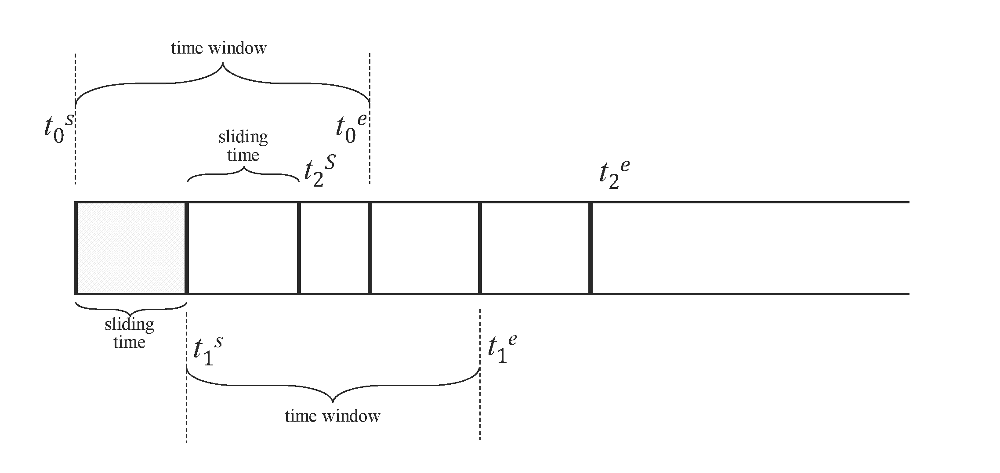
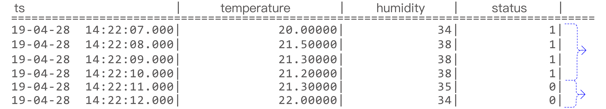
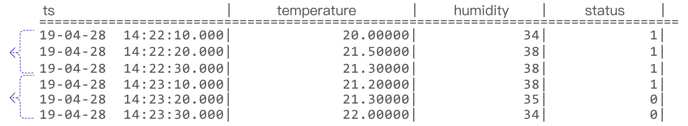
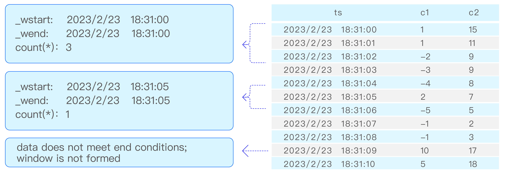

TDengine TSDB 在支持标准 SQL 的基础之上，还提供了一系列满足时序业务场景需求的特色查询语法，这些语法能够为时序场景的应用的开发带来极大的便利。

TDengine TSDB 提供的特色查询包括数据切分查询和时间窗口切分查询。

## 数据切分查询

当需要按一定的维度对数据进行切分然后在切分出的数据空间内再进行一系列的计算时使用数据切分子句，数据切分语句的语法如下：

```sql
PARTITION BY part_list
```

part_list 可以是任意的标量表达式，包括列、常量、标量函数和它们的组合。例如，将数据按标签 location 进行分组，取每个分组内的电压平均值：

```sql
select location, avg(voltage) from meters partition by location
```

TDengine TSDB 按如下方式处理数据切分子句：

- 数据切分子句位于 WHERE 子句之后。
- 数据切分子句将表数据按指定的维度进行切分，每个切分的分片进行指定的计算。计算由之后的子句定义（窗口子句、GROUP BY 子句或 SELECT 子句）。
- 数据切分子句可以和窗口切分子句（或 GROUP BY 子句）一起使用，此时后面的子句作用在每个切分的分片上。例如，将数据按标签 location 进行分组，并对每个组按 10 分钟进行降采样，取其最大值。

```sql
select _wstart, location, max(current) from meters partition by location interval(10m)
```

数据切分子句最常见的用法就是在超级表查询中，按标签将子表数据进行切分，然后分别进行计算。特别是 PARTITION BY TBNAME 用法，它将每个子表的数据独立出来，形成一条条独立的时间序列，极大的方便了各种时序场景的统计分析。例如，统计每个电表每 10 分钟内的电压平均值：

```sql
select _wstart, tbname, avg(voltage) from meters partition by tbname interval(10m)
```

## 窗口切分查询

TDengine TSDB 支持按时间窗口切分方式进行聚合结果查询，比如温度传感器每秒采集一次数据，但需查询每隔 10 分钟的温度平均值。这种场景下可以使用窗口子句来获得需要的查询结果。窗口子句用于针对查询的数据集合按照窗口切分成为查询子集并进行聚合，窗口包含时间窗口（time window）、状态窗口（state window）、会话窗口（session window）、事件窗口（event window）、计数窗口（count window）、外部窗口（external window）六种窗口。其中时间窗口又可划分为滑动时间窗口和翻转时间窗口。

窗口子句语法如下：

```sql
window_clause: {
    SESSION(ts_col, tol_val)
  | STATE_WINDOW(expr[, extend[, zeroth_state]]) [TRUE_FOR(true_for_expr)]
  | INTERVAL(interval_val [, interval_offset]) [SLIDING (sliding_val)] [fill_clause]
  | EVENT_WINDOW START WITH start_trigger_condition END WITH end_trigger_condition [TRUE_FOR(true_for_expr)]
  | COUNT_WINDOW(count_val[, sliding_val][, col_name ...])
  | EXTERNAL_WINDOW ((subquery) window_alias)
}
```

其中，interval_val 和 sliding_val 都表示时间段，interval_offset 表示窗口偏移量，interval_offset 必须小于 interval_val，语法上支持三种方式，举例说明如下：

- `INTERVAL(1s, 500a) SLIDING(1s)` 自带时间单位的形式，其中的时间单位是单字符表示，分别为：a (毫秒)、b (纳秒)、d (天)、h (小时)、m (分钟)、n (月)、s (秒)、u (微秒)、w (周)、y (年)。
- `INTERVAL(1000, 500) SLIDING(1000)` 不带时间单位的形式，将使用查询库的时间精度作为默认时间单位，当存在多个库时默认采用精度更高的库。
- `INTERVAL('1s', '500a') SLIDING('1s')` 自带时间单位的字符串形式，字符串内部不能有任何空格等其它字符。

### 窗口子句的规则

以下规则适用于 SESSION、STATE_WINDOW、INTERVAL、EVENT_WINDOW、COUNT_WINDOW 五种窗口。EXTERNAL_WINDOW 的规则与其他窗口有差异，详见[外部窗口](#外部窗口)章节。

- 窗口子句位于数据切分子句之后，不可以和 GROUP BY 子句一起使用。
- 窗口子句将数据按窗口进行切分，对每个窗口进行 SELECT 列表中的表达式的计算，SELECT 列表中的表达式只能包含：
  - 常量。
  - _wstart 伪列、_wend 伪列和_wduration 伪列。
  - 聚集函数（包括选择函数和可以由参数确定输出行数的时序特有函数）。
  - 包含上面表达式的表达式。
  - 且至少包含一个聚集函数 (3.4.0.0 之后不再有该限制)。
- 窗口子句不可以和 GROUP BY 子句一起使用。
- WHERE 语句可以指定查询的起止时间和其他过滤条件。

### 时间窗口

时间窗口又可分为滑动时间窗口和翻转时间窗口。

INTERVAL 子句用于产生相等时间周期的窗口，SLIDING 用以指定窗口向前滑动的时间。每次执行的查询是一个时间窗口，时间窗口随着时间流动向前滑动。在定义连续查询的时候需要指定时间窗口（time window）大小和每次前向增量时间（forward sliding times）。如图，[t0s, t0e] ，[t1s , t1e]，[t2s, t2e] 是分别是执行三次连续查询的时间窗口范围，窗口的前向滑动的时间范围 sliding time 标识。查询过滤、聚合等操作按照每个时间窗口为独立的单位执行。当 SLIDING 与 INTERVAL 相等的时候，滑动窗口即为翻转窗口。默认情况下，窗口是从 Unix time 0（1970-01-01 00:00:00 UTC）开始划分的；如果设置了 interval_offset，那么窗口的划分将从“Unix time 0 + interval_offset”开始。

查询对象是超级表时，聚合函数会作用于该超级表下满足过滤条件的所有表的数据，返回的结果按照窗口起始时间严格单调递增；如果使用 PARTITION BY 语句分组，则返回结果中每个 PARTITION 内按照窗口起始时间严格单调递增。



INTERVAL 和 SLIDING 子句需要配合聚合和选择函数来使用。以下 SQL 语句非法：

```sql
SELECT * FROM temp_tb_1 INTERVAL(1m);
```

SLIDING 的向前滑动的时间不能超过一个窗口的时间范围。以下语句非法：

```sql
SELECT COUNT(*) FROM temp_tb_1 INTERVAL(1m) SLIDING(2m);
```

INTERVAL 子句允许使用 AUTO 关键字来指定窗口偏移量 (3.3.5.0 版本开始支持)，此时如果 WHERE 条件给定了明确可应用的起始时间限制，则会自动计算所需偏移量，使得从该时间点切分时间窗口；否则不生效，即：仍以 0 作为偏移量。以下是简单示例说明：

```sql
-- 有起始时间限制，从 '2018-10-03 14:38:05' 切分时间窗口
SELECT COUNT(*) FROM meters WHERE _rowts >= '2018-10-03 14:38:05' INTERVAL (1m, AUTO);

-- 无起始时间限制，不生效，仍以 0 为偏移量
SELECT COUNT(*) FROM meters WHERE _rowts < '2018-10-03 15:00:00' INTERVAL (1m, AUTO);

-- 起始时间限制不明确，不生效，仍以 0 为偏移量
SELECT COUNT(*) FROM meters WHERE _rowts - voltage > 1000000;
```

INTERVAL 子句支持使用 FILL 子句来指定数据缺失时的数据填充方法，支持除 NEAR 填充模式外的所有填充模式。关于 FILL 子句如何使用请参考 [FILL 子句](./20-select.md#fill-子句)。

使用时间窗口需要注意：

- 聚合时间段的窗口宽度由关键词 INTERVAL 指定，最短时间间隔 10 毫秒（10a）；并且支持偏移 offset（偏移必须小于间隔），也即时间窗口划分与“UTC 时刻 0”相比的偏移量。SLIDING 语句用于指定聚合时间段的前向增量，也即每次窗口向前滑动的时长。
- 使用 INTERVAL 语句时，除非极特殊的情况，都要求把客户端和服务端的 taos.cfg 配置文件中的 timezone 参数配置为相同的取值，以避免时间处理函数频繁进行跨时区转换而导致的严重性能影响。
- 返回的结果中时间序列严格单调递增。
- 使用 AUTO 作为窗口偏移量时，如果 WHERE 时间条件比较复杂，比如多个 AND/OR/IN 互相组合，那么 AUTO 可能不生效，这种情况可以通过手动指定窗口偏移量进行解决。
- 使用 AUTO 作为窗口偏移量时，如果窗口宽度的单位是 d (天)、n (月)、w (周)、y (年)，比如 `INTERVAL(1d, AUTO)`、`INTERVAL(3w, AUTO)`，此时 TSMA 优化无法生效。如果目标表上手动创建了 TSMA，语句会报错退出；这种情况下，可以显式指定 Hint SKIP_TSMA 或者不使用 AUTO 作为窗口偏移量。

### 状态窗口

使用整数（布尔值）或字符串来标识产生记录时候设备的状态量。产生的记录如果具有相同的状态量数值则归属于同一个状态窗口，数值改变后该窗口关闭，NULL 不会触发窗口关闭。如下图所示，根据状态量确定的状态窗口分别是 [2019-04-28 14:22:07，2019-04-28 14:22:10] 和 [2019-04-28 14:22:11，2019-04-28 14:22:12] 两个。



使用 STATE_WINDOW 来确定状态窗口划分的列。例如

```sql
SELECT COUNT(*), FIRST(ts), status FROM temp_tb_1 STATE_WINDOW(status);
```

仅关心 status 为 2 时的状态窗口的信息。例如

```sql
SELECT * FROM (SELECT COUNT(*) AS cnt, FIRST(ts) AS fst, status FROM temp_tb_1 STATE_WINDOW(status)) t WHERE status = 2;
```

TDengine TSDB 还支持将 CASE 表达式用在状态量，可以表达某个状态的开始是由满足某个条件而触发，这个状态的结束是由另外一个条件满足而触发的语义。例如，智能电表的电压正常范围是 205V 到 235V，那么可以通过监控电压来判断电路是否正常。

```sql
SELECT tbname, _wstart, CASE WHEN voltage >= 205 and voltage <= 235 THEN 1 ELSE 0 END status FROM meters PARTITION BY tbname STATE_WINDOW(CASE WHEN voltage >= 205 and voltage <= 235 THEN 1 ELSE 0 END);
```

在超级表查询或包含 tag 列的子查询中，状态表达式也可以引用当前查询上下文中可见的 tag 列，只要最终表达式结果类型仍为整型、布尔型或字符串类型。例如，可以根据 tag `groupId` 动态调整阈值：

```sql
SELECT tbname, _wstart, _wend,
       CASE WHEN voltage >= 220 + groupId THEN 'high' ELSE 'normal' END AS status
FROM meters
PARTITION BY tbname
STATE_WINDOW(CASE WHEN voltage >= 220 + groupId THEN 'high' ELSE 'normal' END);
```

需要注意，`STATE_WINDOW(groupId)` 这种直接将 tag 列作为状态表达式的写法仍然不支持；如果要使用 tag 列，需要让它参与到状态表达式中。

Extend 参数可以设置窗口开始结束时的扩展策略，可选值为 0（默认值）、1、2。

- 默认情况下，窗口开始、结束时间为该状态的第一条和最后一条数据对应的时间戳；
- extend 值为 1 时，窗口开始时间不变，窗口结束时间向后扩展至下一个窗口开始之前；
- extend 值为 2 值窗口开始时间向前扩展至上一个窗口结束之后，窗口结束时间不变。

全部查询数据起始位置状态值为 NULL 的数据将被包含在第一个窗口中，同样全部查询数据尾部状态值为 NULL 的数据将被包含在最后一个窗口中。以如下数据为例

```sql
taos> select * from state_window_example;
           ts            |   status    |
========================================
 2025-01-01 00:00:00.000 | NULL        |
 2025-01-01 00:00:01.000 |           1 |
 2025-01-01 00:00:02.000 | NULL        |
 2025-01-01 00:00:03.000 |           1 |
 2025-01-01 00:00:04.000 | NULL        |
 2025-01-01 00:00:05.000 |           2 |
 2025-01-01 00:00:06.000 |           2 |
 2025-01-01 00:00:07.000 |           1 |
 2025-01-01 00:00:08.000 | NULL        |
```

当 `extend` 值为 0 时

```sql
taos> select _wstart, _wduration, _wend, count(*) from state_window_example state_window(status, 0);
         _wstart         |      _wduration       |          _wend          |       count(*)        |
====================================================================================================
 2025-01-01 00:00:00.000 |                  3000 | 2025-01-01 00:00:03.000 |                     4 |
 2025-01-01 00:00:05.000 |                  1000 | 2025-01-01 00:00:06.000 |                     2 |
 2025-01-01 00:00:07.000 |                  1000 | 2025-01-01 00:00:08.000 |                     2 |
```

当 `extend` 值为 1 时

```sql
taos> select _wstart, _wduration, _wend, count(*) from state_window_example state_window(status, 1);
         _wstart         |      _wduration       |          _wend          |       count(*)        |
====================================================================================================
 2025-01-01 00:00:00.000 |                  4999 | 2025-01-01 00:00:04.999 |                     5 |
 2025-01-01 00:00:05.000 |                  1999 | 2025-01-01 00:00:06.999 |                     2 |
 2025-01-01 00:00:07.000 |                  1000 | 2025-01-01 00:00:08.000 |                     2 |
```

当 `extend` 值为 2 时

```sql
select _wstart, _wduration, _wend, count(*) from state_window_test state_window(status, 2);
         _wstart         |      _wduration       |          _wend          |       count(*)        |
====================================================================================================
 2025-01-01 00:00:00.000 |                  3000 | 2025-01-01 00:00:03.000 |                     4 |
 2025-01-01 00:00:03.001 |                  2999 | 2025-01-01 00:00:06.000 |                     3 |
 2025-01-01 00:00:06.001 |                  1999 | 2025-01-01 00:00:08.000 |                     2 |
```

Zeroth_state 指定“零状态”，状态表达式结果为此状态的窗口将不会被计算和输出，输入必须是整型、布尔型或字符串常量。当设置 `zeroth_state` 时，`extend` 值为强制输入项，不允许留空或省略。
仍以相同数据为例

当 `zeroth_state` 值为 `2` 时

```sql
taos> select _wstart, _wduration, _wend, count(*) from state_window_example state_window(status, 0, 2);
         _wstart         |      _wduration       |          _wend          |       count(*)        |
====================================================================================================
 2025-01-01 00:00:00.000 |                  3000 | 2025-01-01 00:00:03.000 |                     4 |
 2025-01-01 00:00:07.000 |                  1000 | 2025-01-01 00:00:08.000 |                     2 |
```

状态窗口支持使用 TRUE_FOR 参数来设定窗口的过滤条件。只有满足条件的窗口才会返回计算结果。支持以下四种模式：

- `TRUE_FOR(duration_time)`：仅基于持续时长过滤，窗口持续时长必须大于等于 `duration_time`。
- `TRUE_FOR(COUNT n)`：仅基于数据行数过滤，窗口数据行数必须大于等于 `n`。
- `TRUE_FOR(duration_time AND COUNT n)`：同时满足持续时长和数据行数条件。
- `TRUE_FOR(duration_time OR COUNT n)`：满足持续时长或数据行数条件之一即可。

例如，设置最短持续时长为 3s：

```sql
SELECT COUNT(*), FIRST(ts), status FROM temp_tb_1 STATE_WINDOW(status) TRUE_FOR (3s);
```

或者设置最少行数为 100 行：

```sql
SELECT COUNT(*), FIRST(ts), status FROM temp_tb_1 STATE_WINDOW(status) TRUE_FOR (COUNT 100);
```

或者同时满足持续时长和行数条件：

```sql
SELECT COUNT(*), FIRST(ts), status FROM temp_tb_1 STATE_WINDOW(status) TRUE_FOR (3s AND COUNT 50);
```

### 会话窗口

会话窗口根据记录的时间戳主键的值来确定是否属于同一个会话。如下图所示，如果设置时间戳的连续的间隔小于等于 12 秒，则以下 6 条记录构成 2 个会话窗口，分别是 [2019-04-28 14:22:10，2019-04-28 14:22:30] 和 [2019-04-28 14:23:10，2019-04-28 14:23:30]。因为 2019-04-28 14:22:30 与 2019-04-28 14:23:10 之间的时间间隔是 40 秒，超过了连续时间间隔（12 秒）。



在 tol_value 时间间隔范围内的结果都认为归属于同一个窗口，如果连续的两条记录的时间超过 tol_val，则自动开启下一个窗口。

```sql
SELECT COUNT(*), FIRST(ts) FROM temp_tb_1 SESSION(ts, tol_val);
```

### 事件窗口

事件窗口根据开始条件和结束条件来划定窗口，当 start_trigger_condition 满足时则窗口开始，直到 end_trigger_condition 满足时窗口关闭。start_trigger_condition 和 end_trigger_condition 可以是任意 TDengine TSDB 支持的条件表达式，且可以包含不同的列。

在超级表查询或包含 tag 列的子查询中，开始/结束条件表达式同样可以引用 tag 列。例如，可以根据 tag `groupId` 使用不同的电压阈值：

```sql
SELECT tbname, _wstart, _wend, count(*)
FROM meters
PARTITION BY tbname
EVENT_WINDOW START WITH voltage >= 220 + groupId END WITH voltage < 220 + groupId;
```

事件窗口可以仅包含一条数据。即当一条数据同时满足 start_trigger_condition 和 end_trigger_condition，且当前不在一个窗口内时，这条数据自己构成了一个窗口。

事件窗口无法关闭时，不构成一个窗口，不会被输出。即有数据满足 start_trigger_condition，此时窗口打开，但后续数据都不能满足 end_trigger_condition，这个窗口无法被关闭，这部分数据不构成一个窗口，不会被输出。

如果直接在超级表上进行事件窗口查询，TDengine TSDB 会将超级表的数据汇总成一条时间线，然后进行事件窗口的计算。
如果需要对子查询的结果集进行事件窗口查询，那么子查询的结果集需要满足按时间线输出的要求，且可以输出有效的时间戳列。

以下面的 SQL 语句为例，事件窗口切分如图所示：

```sql
select _wstart, _wend, count(*) from t event_window start with c1 > 0 end with c2 < 10 
```



事件窗口支持使用 TRUE_FOR 参数来设定窗口的过滤条件。只有满足条件的窗口才会返回计算结果。支持以下四种模式：

- `TRUE_FOR(duration_time)`：仅基于持续时长过滤，窗口持续时长必须大于等于 `duration_time`。
- `TRUE_FOR(COUNT n)`：仅基于数据行数过滤，窗口数据行数必须大于等于 `n`。
- `TRUE_FOR(duration_time AND COUNT n)`：同时满足持续时长和数据行数条件。
- `TRUE_FOR(duration_time OR COUNT n)`：满足持续时长或数据行数条件之一即可。

例如，设置最短持续时长为 3s：

```sql
select _wstart, _wend, count(*) from t event_window start with c1 > 0 end with c2 < 10 true_for (3s);
```

或者设置最少行数为 100 行：

```sql
select _wstart, _wend, count(*) from t event_window start with c1 > 0 end with c2 < 10 true_for (COUNT 100);
```

或者同时满足持续时长和行数条件：

```sql
select _wstart, _wend, count(*) from t event_window start with c1 > 0 end with c2 < 10 true_for (3s AND COUNT 50);
```

### 计数窗口

计数窗口按固定的数据行数来划分窗口。默认将数据按时间戳排序，再按照 count_val 的值，将数据划分为多个窗口，然后做聚合计算。count_val 表示每个 count window 包含的最大数据行数，总数据行数不能整除 count_val 时，最后一个窗口的行数会小于 count_val。sliding_val 是常量，表示窗口滑动的数量，类似于 interval 的 SLIDING。col_name 参数，在 v3.3.7.0 之后开始支持，col_name, 指定一列或者多列，在 count_window 窗口计数时，窗口中的每行数据，指定列中至少有一列非空，否则该行数据不包含在计数窗口内。如果没有指定 col_name，表示没有非空限制。

以下面的 SQL 语句为例，计数窗口切分如图所示：

```sql
select _wstart, _wend, count(*) from t count_window(4);
```


### 外部窗口

外部窗口（External Window）用于"先定义窗口，再在窗口内计算"。与 INTERVAL、EVENT_WINDOW 等内建窗口不同，外部窗口的时间范围由子查询显式给出，适合做跨事件关联、窗口复用、分层过滤等复杂分析。

外部窗口的语法：

```sql
SELECT ...
FROM table_name
[PARTITION BY expr_list]
EXTERNAL_WINDOW (
    (subquery_that_defines_windows) window_alias
)
[HAVING condition]
[ORDER BY ...]
```

其中：

- 子查询的前两列必须是 timestamp 类型，分别表示窗口开始时间和窗口结束时间。
- 子查询第 3 列及之后的列会成为"窗口属性列"。
- 外部查询会在每个窗口范围内独立计算。

#### 核心特性

1. **子查询生成窗口的灵活性：** 定义窗口的子查询本身支持多种写法，包括普通子查询、INTERVAL、EVENT_WINDOW、SESSION 等方式，用户可以灵活地生成所需的窗口范围。

2. **窗口内聚合和计算：** 外部查询在每个窗口范围内独立计算，支持聚合和标量运算。

3. **伪列支持：** `_wstart`（窗口开始时间）、`_wend`（窗口结束时间）、`_wduration`（窗口时长）可在 SELECT、HAVING、ORDER BY 子句中使用。

4. **分组和对齐：**
    - 子查询可以使用 `PARTITION BY` 或 `GROUP BY` 进行分组，外部查询只能使用 `PARTITION BY` 进行分组。
    - 当子查询与外部查询都使用了分组时，按分组键对齐：同组数据只匹配同组窗口。
    - 若某个分组在某个窗口内没有匹配数据，则该分组在该窗口下不会产出结果行（会被自然忽略）。
    - 当子查询未使用分组时，内部子查询只生成一组共享窗口；若外部查询使用了分组，则每个外部分组都会在这同一组窗口上分别进行计算。
    - 当子查询使用了分组，但外部查询未使用分组时，语法禁止。
    - **当前限制与注意事项**：当内外查询都使用了分组，且窗口子查询中再使用 `ORDER BY` 时，排序可能打乱各分组窗口流的原有组织方式；外部查询可能作用于合并后的窗口流，表现为内部分组语义失效（等同未分组），不再按内外分组一一对齐。

5. **嵌套调用支持：** 支持多层外部窗口嵌套，即外部窗口的子查询本身也可以使用 EXTERNAL_WINDOW，从而实现分层聚合。例如：先用第一层外部窗口按事件划定时间范围并聚合出中间指标，再用第二层外部窗口在新的时间范围内对这些中间指标做二次聚合。

#### 窗口属性列引用规则

子查询中前两列之后的列（例如 `groupid`、`location`）会作为窗口属性列。引用规则如下：

1. 必须使用窗口别名按 `别名.列名` 的方式逐列引用：`window_alias.column_name`，例如 `w.groupid`、`w.location`。
2. 窗口属性列只能以 `w.column_name` 这种形式出现在外层查询的 SELECT、HAVING、ORDER BY 子句中。
3. **不能在 WHERE 子句中引用**（WHERE 用于过滤外部表记录，此时窗口尚未生成；窗口属性只有在窗口定义后才可用，应该在 HAVING 中使用）。
4. 当前实现中，窗口别名并不是一张完整的"虚拟表"，**不支持使用 `w.*` 通配符展开全部窗口属性列**，也不能在 FROM/JOIN 中单独把 `w` 当作表来引用，如有需要请在子查询中显式选择并在外层逐列引用。

#### 使用示例

**示例 1** - 以 INTERVAL 子查询生成窗口，统计窗口内的聚合值：

```sql
SELECT _wstart, _wend, COUNT(*), AVG(voltage)
FROM meters
EXTERNAL_WINDOW (
    (SELECT _wstart, _wend FROM meters INTERVAL(10m)) w
);
```

上面的 SQL，先通过内部子查询按 10 分钟时间窗口划分出窗口范围，再由外部查询在每个窗口范围内独立统计 `meters` 表中的记录总数和电压平均值。

**示例 2** - 以事件驱动方式生成窗口，跨表统计告警信息：

智能电表的建表语句如下：

```sql
CREATE TABLE meters (ts TIMESTAMP, current FLOAT, voltage INT, phase FLOAT) TAGS (location BINARY(64), groupId INT);
```

假设还有一张告警事件表 `alerts`（超级表），包含列 `ts`、`alert_code`、`alert_value`，标签为 `groupid` 和 `location`。

目标：以每组电表的电压异常事件为时间窗口（电压 >= 225V 的时刻起 60 秒内），统计该窗口内的告警情况。输出应包含：分组信息、窗口内告警数量和最大告警值，并过滤出"有告警产生"的窗口，按分组和时间排序。

```sql
SELECT
    w.groupid,
    w.location,
    _wstart                AS event_start_time,
    COUNT(*)               AS alert_count,
    MAX(a.alert_value)     AS max_alert_value,
    AVG(a.alert_value)     AS avg_alert_value
FROM alerts a
PARTITION BY a.groupid
EXTERNAL_WINDOW (
    (SELECT ts, ts + 60s, groupid, location
     FROM meters
     WHERE voltage >= 225
     PARTITION BY groupid
    ) w
)
HAVING COUNT(*) > 0
ORDER BY w.groupid, event_start_time;
```

**结果说明：**

- 每行代表一个电压异常事件窗口（由 `meters` 中 `voltage >= 225` 的记录驱动），窗口时长为事件发生后 60 秒。
- `alert_count`、`max_alert_value`、`avg_alert_value`：该窗口内来自 `alerts` 的统计指标。
- `w.groupid`、`w.location`：窗口属性列，来自子查询中的标签列，用于展示分组信息。
- `HAVING` 条件使用聚合函数 (`COUNT`) 过滤出至少有一条告警的窗口。
- `PARTITION BY` 对齐：内外查询均按 `groupid` 分组，确保每组电表的告警只与该组的异常窗口匹配。

#### 空窗口的 FILL

EXTERNAL_WINDOW 支持使用 `FILL` 控制空窗口的输出行为。默认情况下，如果某个窗口在外层查询表中没有匹配到任何数据行，该窗口不会产出结果行。增加 `FILL` 后，可以保留该窗口，并按指定模式填充聚合列。

EXTERNAL_WINDOW 支持的模式如下：

| 模式 | 行为 |
|:----:|:-----|
| `NONE` | 默认行为，空窗口不产出结果行 |
| `NULL` | 空窗口产出一行，聚合列填充为 `NULL`；若整个查询范围内都没有数据，则不产出 |
| `NULL_F` | 与 `NULL` 类似，但即使整个查询范围内都没有数据，也会产出空窗口行 |
| `VALUE` | 空窗口产出一行，聚合列填充为用户指定值；若整个查询范围内都没有数据，则不产出 |
| `VALUE_F` | 与 `VALUE` 类似，但即使整个查询范围内都没有数据，也会产出空窗口行 |
| `PREV` | 空窗口使用前一个非空窗口的聚合结果填充；若无前值则填充为 `NULL` |
| `NEXT` | 空窗口使用后一个非空窗口的聚合结果填充；若无后值则填充为 `NULL` |

EXTERNAL_WINDOW 暂不支持 `LINEAR`、`NEAR`、`SURROUND`。

`FILL` 的执行先于 `HAVING`，因此填充生成的结果行也会参与 `HAVING` 过滤。

关于 FILL 子句的通用语法请参考 [FILL 子句](./20-select.md#fill-子句)。

示例：

```sql
SELECT _wstart, AVG(voltage) AS avg_vol, COUNT(*) AS cnt
FROM meters
EXTERNAL_WINDOW (
    (SELECT '2022-01-01 00:00:00'::TIMESTAMP,
       '2022-01-01 00:01:00'::TIMESTAMP
     UNION ALL
     SELECT '2022-01-01 00:01:00'::TIMESTAMP,
       '2022-01-01 00:02:00'::TIMESTAMP
     UNION ALL
     SELECT '2022-01-01 00:02:00'::TIMESTAMP,
       '2022-01-01 00:03:00'::TIMESTAMP
    ) w
)
FILL(VALUE, 0, 0)
ORDER BY _wstart;
```

上面的 SQL 定义了 3 个一分钟的外部窗口。如果某个窗口内没有 `meters` 表的数据，则 `avg_vol` 和 `cnt` 都会被填充为 `0`。

#### 约束与限制

- 暂时不支持在流计算和订阅中使用。
- 窗口子查询的前两列必须为 timestamp 类型，分别表示窗口开始和结束时间。
- 子查询返回的窗口行需要保持有序：未分组场景按窗口开始时间（即第一列）升序；分组场景在各分组内按窗口开始时间升序；如果不满足条件执行时报错。
- 若外部窗口（内部子查询）使用了分组，则外部查询必须同时使用 PARTITION BY；否则语法报错。
- 不支持窗口作用域内的不定行函数（如 DIFF、INTERP）。

### 时间戳伪列

窗口聚合查询结果中，如果 SQL 语句中没有指定输出查询结果中的时间戳列，那么最终结果中不会自动包含窗口的时间列信息。如果需要在结果中输出聚合结果所对应的时间窗口信息，需要在 SELECT 子句中使用时间戳相关的伪列：时间窗口起始时间 (\_WSTART)，时间窗口结束时间 (\_WEND)，时间窗口持续时间 (\_WDURATION)，以及查询整体窗口相关的伪列：查询窗口起始时间 (\_QSTART) 和查询窗口结束时间 (\_QEND)。需要注意的是，除 INTERVAL 窗口的结束时间为开区间外，其他时间窗口起始时间和结束时间均是闭区间，时间窗口持续时间是数据当前时间分辨率下的数值。例如，如果当前数据库的时间分辨率是毫秒，那么结果中 500 就表示当前时间窗口的持续时间是 500 毫秒 (500 ms)。

### 示例

智能电表的建表语句如下：

```sql
CREATE TABLE meters (ts TIMESTAMP, current FLOAT, voltage INT, phase FLOAT) TAGS (location BINARY(64), groupId INT);
```

针对智能电表采集的数据，以 10 分钟为一个阶段，计算过去 24 小时的电流数据的平均值、最大值、电流的中位数。如果没有计算值，用前一个非 NULL 值填充。使用的查询语句如下：

```sql
SELECT _WSTART, _WEND, AVG(current), MAX(current), APERCENTILE(current, 50) FROM meters
  WHERE ts>=NOW-1d and ts<=now
  INTERVAL(10m)
  FILL(PREV);
```
