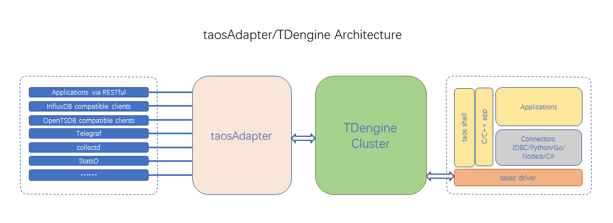

import Prometheus from "./_prometheus.mdx"
import CollectD from "./_collectd.mdx"
import StatsD from "./_statsd.mdx"
import Icinga2 from "./_icinga2.mdx"
import TCollector from "./_tcollector.mdx"

taosAdapter 是一个 TDengine 的配套工具，是 TDengine 集群和应用程序之间的桥梁和适配器。它提供了一种易于使用和高效的方式来直接从数据收集代理软件（如 Telegraf、StatsD、collectd 等）摄取数据。它还提供了 InfluxDB/OpenTSDB 兼容的数据摄取接口，允许 InfluxDB/OpenTSDB 应用程序无缝移植到 TDengine。

taosAdapter 提供以下功能：

- RESTful 接口
- 兼容 InfluxDB v1 写接口
- 兼容 OpenTSDB JSON 和 telnet 格式写入
- 无缝连接到 Telegraf
- 无缝连接到 collectd
- 无缝连接到 StatsD
- 支持 Prometheus remote_read 和 remote_write
- 获取 table 所在的虚拟节点组（VGroup）的 VGroup ID

## taosAdapter 架构图



## taosAdapter 部署方法

### 安装 taosAdapter

taosAdapter 是 TDengine 服务端软件 的一部分，如果您使用 TDengine server 您不需要任何额外的步骤来安装 taosAdapter。您可以从[涛思数据官方网站](https://taosdata.com/cn/all-downloads/)下载 TDengine server 安装包。如果需要将 taosAdapter 分离部署在 TDengine server 之外的服务器上，则应该在该服务器上安装完整的 TDengine 来安装 taosAdapter。如果您需要使用源代码编译生成 taosAdapter，您可以参考[构建 taosAdapter](https://github.com/taosdata/taosadapter/blob/3.0/BUILD-CN.md)文档。

### 启动/停止 taosAdapter

在 Linux 系统上 taosAdapter 服务默认由 systemd 管理。使用命令 `systemctl start taosadapter` 可以启动 taosAdapter 服务。使用命令 `systemctl stop taosadapter` 可以停止 taosAdapter 服务。

### 移除 taosAdapter

使用命令 rmtaos 可以移除包括 taosAdapter 在内的 TDengine server 软件。

### 升级 taosAdapter

taosAdapter 和 TDengine server 需要使用相同版本。请通过升级 TDengine server 来升级 taosAdapter。
与 taosd 分离部署的 taosAdapter 必须通过升级其所在服务器的 TDengine server 才能得到升级。

## taosAdapter 参数列表

taosAdapter 支持通过命令行参数、环境变量和配置文件来进行配置。默认配置文件是 /etc/taos/taosadapter.toml。

命令行参数优先于环境变量优先于配置文件，命令行用法是 arg=val，如 taosadapter -p=30000 --debug=true，详细列表如下：

```shell
Usage of taosAdapter:
      --collectd.db string                               collectd db name. Env "TAOS_ADAPTER_COLLECTD_DB" (default "collectd")
      --collectd.enable                                  enable collectd. Env "TAOS_ADAPTER_COLLECTD_ENABLE" (default true)
      --collectd.password string                         collectd password. Env "TAOS_ADAPTER_COLLECTD_PASSWORD" (default "taosdata")
      --collectd.port int                                collectd server port. Env "TAOS_ADAPTER_COLLECTD_PORT" (default 6045)
      --collectd.ttl int                                 collectd data ttl. Env "TAOS_ADAPTER_COLLECTD_TTL"
      --collectd.user string                             collectd user. Env "TAOS_ADAPTER_COLLECTD_USER" (default "root")
      --collectd.worker int                              collectd write worker. Env "TAOS_ADAPTER_COLLECTD_WORKER" (default 10)
  -c, --config string                                    config path default /etc/taos/taosadapter.toml
      --cors.allowAllOrigins                             cors allow all origins. Env "TAOS_ADAPTER_CORS_ALLOW_ALL_ORIGINS" (default true)
      --cors.allowCredentials                            cors allow credentials. Env "TAOS_ADAPTER_CORS_ALLOW_Credentials"
      --cors.allowHeaders stringArray                    cors allow HEADERS. Env "TAOS_ADAPTER_ALLOW_HEADERS"
      --cors.allowOrigins stringArray                    cors allow origins. Env "TAOS_ADAPTER_ALLOW_ORIGINS"
      --cors.allowWebSockets                             cors allow WebSockets. Env "TAOS_ADAPTER_CORS_ALLOW_WebSockets"      --cors.exposeHeaders stringArray                   cors expose headers. Env "TAOS_ADAPTER_Expose_Headers"
      --debug                                            enable debug mode. Env "TAOS_ADAPTER_DEBUG" (default true)
      --help                                             Print this help message and exit
      --httpCodeServerError                              Use a non-200 http status code when server returns an error. Env "TAOS_ADAPTER_HTTP_CODE_SERVER_ERROR"
      --influxdb.enable                                  enable influxdb. Env "TAOS_ADAPTER_INFLUXDB_ENABLE" (default true)
      --log.enableRecordHttpSql                          whether to record http sql. Env "TAOS_ADAPTER_LOG_ENABLE_RECORD_HTTP_SQL"
      --log.path string                                  log path. Env "TAOS_ADAPTER_LOG_PATH" (default "/var/log/taos")      --log.rotationCount uint                           log rotation count. Env "TAOS_ADAPTER_LOG_ROTATION_COUNT" (default 30)
      --log.rotationSize string                          log rotation size(KB MB GB), must be a positive integer. Env "TAOS_ADAPTER_LOG_ROTATION_SIZE" (default "1GB")
      --log.rotationTime duration                        log rotation time. Env "TAOS_ADAPTER_LOG_ROTATION_TIME" (default 24h0m0s)
      --log.sqlRotationCount uint                        record sql log rotation count. Env "TAOS_ADAPTER_LOG_SQL_ROTATION_COUNT" (default 2)
      --log.sqlRotationSize string                       record sql log rotation size(KB MB GB), must be a positive integer. Env "TAOS_ADAPTER_LOG_SQL_ROTATION_SIZE" (default "1GB")
      --log.sqlRotationTime duration                     record sql log rotation time. Env "TAOS_ADAPTER_LOG_SQL_ROTATION_TIME" (default 24h0m0s)
      --logLevel string                                  log level (panic fatal error warn warning info debug trace). Env "TAOS_ADAPTER_LOG_LEVEL" (default "info")
      --monitor.collectDuration duration                 Set monitor duration. Env "TAOS_ADAPTER_MONITOR_COLLECT_DURATION" (default 3s)
      --monitor.disable                                  Whether to disable monitoring. Env "TAOS_ADAPTER_MONITOR_DISABLE"
      --monitor.disableCollectClientIP                   Whether to disable collecting clientIP. Env "TAOS_ADAPTER_MONITOR_DISABLE_COLLECT_CLIENT_IP"
      --monitor.identity string                          The identity of the current instance, or 'hostname:port' if it is empty. Env "TAOS_ADAPTER_MONITOR_IDENTITY"
      --monitor.incgroup                                 Whether running in cgroup. Env "TAOS_ADAPTER_MONITOR_INCGROUP"
      --monitor.password string                          TDengine password. Env "TAOS_ADAPTER_MONITOR_PASSWORD" (default "taosdata")
      --monitor.pauseAllMemoryThreshold float            Memory percentage threshold for pause all. Env "TAOS_ADAPTER_MONITOR_PAUSE_ALL_MEMORY_THRESHOLD" (default 80)
      --monitor.pauseQueryMemoryThreshold float          Memory percentage threshold for pause query. Env "TAOS_ADAPTER_MONITOR_PAUSE_QUERY_MEMORY_THRESHOLD" (default 70)
      --monitor.user string                              TDengine user. Env "TAOS_ADAPTER_MONITOR_USER" (default "root")      --monitor.writeInterval duration                   Set write to TDengine interval. Env "TAOS_ADAPTER_MONITOR_WRITE_INTERVAL" (default 30s)
      --monitor.writeToTD                                Whether write metrics to TDengine. Env "TAOS_ADAPTER_MONITOR_WRITE_TO_TD"
      --node_exporter.caCertFile string                  node_exporter ca cert file path. Env "TAOS_ADAPTER_NODE_EXPORTER_CA_CERT_FILE"
      --node_exporter.certFile string                    node_exporter cert file path. Env "TAOS_ADAPTER_NODE_EXPORTER_CERT_FILE"
      --node_exporter.db string                          node_exporter db name. Env "TAOS_ADAPTER_NODE_EXPORTER_DB" (default "node_exporter")
      --node_exporter.enable                             enable node_exporter. Env "TAOS_ADAPTER_NODE_EXPORTER_ENABLE"
      --node_exporter.gatherDuration duration            node_exporter gather duration. Env "TAOS_ADAPTER_NODE_EXPORTER_GATHER_DURATION" (default 5s)
      --node_exporter.httpBearerTokenString string       node_exporter http bearer token. Env "TAOS_ADAPTER_NODE_EXPORTER_HTTP_BEARER_TOKEN_STRING"
      --node_exporter.httpPassword string                node_exporter http password. Env "TAOS_ADAPTER_NODE_EXPORTER_HTTP_PASSWORD"
      --node_exporter.httpUsername string                node_exporter http username. Env "TAOS_ADAPTER_NODE_EXPORTER_HTTP_USERNAME"
      --node_exporter.insecureSkipVerify                 node_exporter skip ssl check. Env "TAOS_ADAPTER_NODE_EXPORTER_INSECURE_SKIP_VERIFY" (default true)
      --node_exporter.keyFile string                     node_exporter cert key file path. Env "TAOS_ADAPTER_NODE_EXPORTER_KEY_FILE"
      --node_exporter.password string                    node_exporter password. Env "TAOS_ADAPTER_NODE_EXPORTER_PASSWORD" (default "taosdata")
      --node_exporter.responseTimeout duration           node_exporter response timeout. Env "TAOS_ADAPTER_NODE_EXPORTER_RESPONSE_TIMEOUT" (default 5s)
      --node_exporter.ttl int                            node_exporter data ttl. Env "TAOS_ADAPTER_NODE_EXPORTER_TTL"
      --node_exporter.urls strings                       node_exporter urls. Env "TAOS_ADAPTER_NODE_EXPORTER_URLS" (default [http://localhost:9100])
      --node_exporter.user string                        node_exporter user. Env "TAOS_ADAPTER_NODE_EXPORTER_USER" (default "root")
      --opentsdb.enable                                  enable opentsdb. Env "TAOS_ADAPTER_OPENTSDB_ENABLE" (default true)
      --opentsdb_telnet.batchSize int                    opentsdb_telnet batch size. Env "TAOS_ADAPTER_OPENTSDB_TELNET_BATCH_SIZE" (default 1)
      --opentsdb_telnet.dbs strings                      opentsdb_telnet db names. Env "TAOS_ADAPTER_OPENTSDB_TELNET_DBS" (default [opentsdb_telnet,collectd_tsdb,icinga2_tsdb,tcollector_tsdb])
      --opentsdb_telnet.enable                           enable opentsdb telnet,warning: without auth info(default false). Env "TAOS_ADAPTER_OPENTSDB_TELNET_ENABLE"
      --opentsdb_telnet.flushInterval duration           opentsdb_telnet flush interval (0s means not valid) . Env "TAOS_ADAPTER_OPENTSDB_TELNET_FLUSH_INTERVAL"
      --opentsdb_telnet.maxTCPConnections int            max tcp connections. Env "TAOS_ADAPTER_OPENTSDB_TELNET_MAX_TCP_CONNECTIONS" (default 250)
      --opentsdb_telnet.password string                  opentsdb_telnet password. Env "TAOS_ADAPTER_OPENTSDB_TELNET_PASSWORD" (default "taosdata")
      --opentsdb_telnet.ports ints                       opentsdb telnet tcp port. Env "TAOS_ADAPTER_OPENTSDB_TELNET_PORTS" (default [6046,6047,6048,6049])
      --opentsdb_telnet.tcpKeepAlive                     enable tcp keep alive. Env "TAOS_ADAPTER_OPENTSDB_TELNET_TCP_KEEP_ALIVE"
      --opentsdb_telnet.ttl int                          opentsdb_telnet data ttl. Env "TAOS_ADAPTER_OPENTSDB_TELNET_TTL"
      --opentsdb_telnet.user string                      opentsdb_telnet user. Env "TAOS_ADAPTER_OPENTSDB_TELNET_USER" (default "root")
      --pool.idleTimeout duration                        Set idle connection timeout. Env "TAOS_ADAPTER_POOL_IDLE_TIMEOUT"
      --pool.maxConnect int                              max connections to server. Env "TAOS_ADAPTER_POOL_MAX_CONNECT"
      --pool.maxIdle int                                 max idle connections to server. Env "TAOS_ADAPTER_POOL_MAX_IDLE"
  -P, --port int                                         http port. Env "TAOS_ADAPTER_PORT" (default 6041)
      --prometheus.enable                                enable prometheus. Env "TAOS_ADAPTER_PROMETHEUS_ENABLE" (default true)
      --restfulRowLimit int                              restful returns the maximum number of rows (-1 means no limit). Env "TAOS_ADAPTER_RESTFUL_ROW_LIMIT" (default -1)
      --smlAutoCreateDB                                  Whether to automatically create db when writing with schemaless. Env "TAOS_ADAPTER_SML_AUTO_CREATE_DB"
      --statsd.allowPendingMessages int                  statsd allow pending messages. Env "TAOS_ADAPTER_STATSD_ALLOW_PENDING_MESSAGES" (default 50000)
      --statsd.db string                                 statsd db name. Env "TAOS_ADAPTER_STATSD_DB" (default "statsd")      --statsd.deleteCounters                            statsd delete counter cache after gather. Env "TAOS_ADAPTER_STATSD_DELETE_COUNTERS" (default true)
      --statsd.deleteGauges                              statsd delete gauge cache after gather. Env "TAOS_ADAPTER_STATSD_DELETE_GAUGES" (default true)
      --statsd.deleteSets                                statsd delete set cache after gather. Env "TAOS_ADAPTER_STATSD_DELETE_SETS" (default true)
      --statsd.deleteTimings                             statsd delete timing cache after gather. Env "TAOS_ADAPTER_STATSD_DELETE_TIMINGS" (default true)
      --statsd.enable                                    enable statsd. Env "TAOS_ADAPTER_STATSD_ENABLE" (default true)
      --statsd.gatherInterval duration                   statsd gather interval. Env "TAOS_ADAPTER_STATSD_GATHER_INTERVAL" (default 5s)
      --statsd.maxTCPConnections int                     statsd max tcp connections. Env "TAOS_ADAPTER_STATSD_MAX_TCP_CONNECTIONS" (default 250)
      --statsd.password string                           statsd password. Env "TAOS_ADAPTER_STATSD_PASSWORD" (default "taosdata")
      --statsd.port int                                  statsd server port. Env "TAOS_ADAPTER_STATSD_PORT" (default 6044)
      --statsd.protocol string                           statsd protocol [tcp or udp]. Env "TAOS_ADAPTER_STATSD_PROTOCOL" (default "udp")
      --statsd.tcpKeepAlive                              enable tcp keep alive. Env "TAOS_ADAPTER_STATSD_TCP_KEEP_ALIVE"      --statsd.ttl int                                   statsd data ttl. Env "TAOS_ADAPTER_STATSD_TTL"
      --statsd.user string                               statsd user. Env "TAOS_ADAPTER_STATSD_USER" (default "root")
      --statsd.worker int                                statsd write worker. Env "TAOS_ADAPTER_STATSD_WORKER" (default 10)
      --taosConfigDir string                             load taos client config path. Env "TAOS_ADAPTER_TAOS_CONFIG_FILE"
      --tmq.releaseIntervalMultiplierForAutocommit int   When set to autocommit, the interval for message release is a multiple of the autocommit interval, with a default value of 2 and a minimum value of 1 and a maximum value of 10. Env "TAOS_ADAPTER_TMQ_RELEASE_INTERVAL_MULTIPLIER_FOR_AUTOCOMMIT" (default 2)
      --version                                          Print the version and exit
```

备注：
使用浏览器进行接口调用请根据实际情况设置如下跨源资源共享（CORS）参数：

```text
AllowAllOrigins
AllowOrigins
AllowHeaders
ExposeHeaders
AllowCredentials
AllowWebSockets
```

如果不通过浏览器进行接口调用无需关心这几项配置。

关于 CORS 协议细节请参考：[https://www.w3.org/wiki/CORS_Enabled](https://www.w3.org/wiki/CORS_Enabled) 或 [https://developer.mozilla.org/zh-CN/docs/Web/HTTP/CORS](https://developer.mozilla.org/zh-CN/docs/Web/HTTP/CORS)。

示例配置文件参见 [example/config/taosadapter.toml](https://github.com/taosdata/taosadapter/blob/3.0/example/config/taosadapter.toml)。

## 功能列表

- RESTful 接口
  [RESTful API](../../connector/rest-api)
- 兼容 InfluxDB v1 写接口
  [https://docs.influxdata.com/influxdb/v2.0/reference/api/influxdb-1x/write/](https://docs.influxdata.com/influxdb/v2.0/reference/api/influxdb-1x/write/)
- 兼容 OpenTSDB JSON 和 telnet 格式写入
  - <http://opentsdb.net/docs/build/html/api_http/put.html>
  - <http://opentsdb.net/docs/build/html/api_telnet/put.html>
- 与 collectd 无缝连接
  collectd 是一个系统统计收集守护程序，请访问 [https://collectd.org/](https://collectd.org/) 了解更多信息。
- Seamless connection with StatsD
  StatsD 是一个简单而强大的统计信息汇总的守护程序。请访问 [https://github.com/statsd/statsd](https://github.com/statsd/statsd) 了解更多信息。
- 与 icinga2 的无缝连接
  icinga2 是一个收集检查结果指标和性能数据的软件。请访问 [https://icinga.com/docs/icinga-2/latest/doc/14-features/#opentsdb-writer](https://icinga.com/docs/icinga-2/latest/doc/14-features/#opentsdb-writer) 了解更多信息。
- 与 tcollector 无缝连接
  TCollector是一个客户端进程，从本地收集器收集数据，并将数据推送到 OpenTSDB。请访问 [http://opentsdb.net/docs/build/html/user_guide/utilities/tcollector.html](http://opentsdb.net/docs/build/html/user_guide/utilities/tcollector.html) 了解更多信息。
- 无缝连接 node_exporter
  node_export 是一个机器指标的导出器。请访问 [https://github.com/prometheus/node_exporter](https://github.com/prometheus/node_exporter) 了解更多信息。
- 支持 Prometheus remote_read 和 remote_write
  remote_read 和 remote_write 是 Prometheus 数据读写分离的集群方案。请访问[https://prometheus.io/blog/2019/10/10/remote-read-meets-streaming/#remote-apis](https://prometheus.io/blog/2019/10/10/remote-read-meets-streaming/#remote-apis) 了解更多信息。
- 获取 table 所在的虚拟节点组（VGroup）的 VGroup ID。

## 接口

### TDengine RESTful 接口

您可以使用任何支持 http 协议的客户端通过访问 RESTful 接口地址 `http://<fqdn>:6041/rest/sql` 来写入数据到 TDengine 或从 TDengine 中查询数据。细节请参考[官方文档](../../connector/rest-api/)。

### InfluxDB

您可以使用任何支持 http 协议的客户端访问 Restful 接口地址 `http://<fqdn>:6041/<APIEndPoint>` 来写入 InfluxDB 兼容格式的数据到 TDengine。EndPoint 如下：

```text
/influxdb/v1/write
```

支持 InfluxDB 参数如下：

- `db` 指定 TDengine 使用的数据库名
- `precision` TDengine 使用的时间精度
- `u` TDengine 用户名
- `p` TDengine 密码
- `ttl` 自动创建的子表生命周期，以子表的第一条数据的 TTL 参数为准，不可更新。更多信息请参考[创建表文档](taos-sql/table/#创建表)的 TTL 参数。

注意： 目前不支持 InfluxDB 的 token 验证方式，仅支持 Basic 验证和查询参数验证。
示例： curl --request POST http://127.0.0.1:6041/influxdb/v1/write?db=test --user "root:taosdata" --data-binary "measurement,host=host1 field1=2i,field2=2.0 1577836800000000000"
### OpenTSDB

您可以使用任何支持 http 协议的客户端访问 Restful 接口地址 `http://<fqdn>:6041/<APIEndPoint>` 来写入 OpenTSDB 兼容格式的数据到 TDengine。EndPoint 如下：

```text
/opentsdb/v1/put/json/<db>
/opentsdb/v1/put/telnet/<db>
```

### collectd

<CollectD />

### StatsD

<StatsD />

### icinga2 OpenTSDB writer

<Icinga2 />

### TCollector

<TCollector />

### node_exporter

Prometheus 使用的由 \*NIX 内核暴露的硬件和操作系统指标的输出器

- 启用 taosAdapter 的配置 node_exporter.enable
- 设置 node_exporter 的相关配置
- 重新启动 taosAdapter

### prometheus

<Prometheus />

### 获取 table 的 VGroup ID

可以访问 http 接口 `http://<fqdn>:6041/rest/vgid?db=<db>&table=<table>` 获取 table 的 VGroup ID。

## 内存使用优化方法

taosAdapter 将监测自身运行过程中内存使用率并通过两个阈值进行调节。有效值范围为 -1 到 100 的整数，单位为系统物理内存的百分比。

- pauseQueryMemoryThreshold
- pauseAllMemoryThreshold

当超过 pauseQueryMemoryThreshold 阈值时时停止处理查询请求。

http 返回内容：

- code 503
- body "query memory exceeds threshold"

当超过 pauseAllMemoryThreshold 阈值时停止处理所有写入和查询请求。

http 返回内容：

- code 503
- body "memory exceeds threshold"

当内存回落到阈值之下时恢复对应功能。

状态检查接口 `http://<fqdn>:6041/-/ping`

- 正常返回 `code 200`
- 无参数 如果内存超过 pauseAllMemoryThreshold 将返回 `code 503`
- 请求参数 `action=query` 如果内存超过 pauseQueryMemoryThreshold 或 pauseAllMemoryThreshold 将返回 `code 503`

对应配置参数

```text
  monitor.collectDuration              监测间隔                                    环境变量 "TAOS_MONITOR_COLLECT_DURATION" (默认值 3s)
  monitor.incgroup                     是否是cgroup中运行(容器中运行设置为 true)      环境变量 "TAOS_MONITOR_INCGROUP"
  monitor.pauseAllMemoryThreshold      不再进行插入和查询的内存阈值                   环境变量 "TAOS_MONITOR_PAUSE_ALL_MEMORY_THRESHOLD" (默认值 80)
  monitor.pauseQueryMemoryThreshold    不再进行查询的内存阈值                        环境变量 "TAOS_MONITOR_PAUSE_QUERY_MEMORY_THRESHOLD" (默认值 70)
```

您可以根据具体项目应用场景和运营策略进行相应调整，并建议使用运营监控软件及时进行系统内存状态监控。负载均衡器也可以通过这个接口检查 taosAdapter 运行状态。

## taosAdapter 监控指标

taosAdapter 采集 http 相关指标、CPU 百分比和内存百分比。

### http 接口

提供符合 [OpenMetrics](https://github.com/OpenObservability/OpenMetrics/blob/main/specification/OpenMetrics.md) 接口：

```text
http://<fqdn>:6041/metrics
```

### 写入 TDengine

taosAdapter 支持将 http 监控、CPU 百分比和内存百分比写入 TDengine。

有关配置参数

| **配置项**                 | **描述**                                     | **默认值**  |
|-------------------------|--------------------------------------------|----------|
| monitor.collectDuration | CPU 和内存采集间隔                                | 3s       |
| monitor.identity        | 当前taosadapter 的标识符如果不设置将使用 'hostname:port' |          |
| monitor.incgroup        | 是否是 cgroup 中运行(容器中运行设置为 true)              | false    |
| monitor.writeToTD       | 是否写入到 TDengine                             | false    |
| monitor.user            | TDengine 连接用户名                             | root     |
| monitor.password        | TDengine 连接密码                              | taosdata |
| monitor.writeInterval   | 写入TDengine 间隔                              | 30s      |

## 结果返回条数限制

taosAdapter 通过参数 `restfulRowLimit` 来控制结果的返回条数，-1 代表无限制，默认无限制。

该参数控制以下接口返回

- `http://<fqdn>:6041/rest/sql`
- `http://<fqdn>:6041/prometheus/v1/remote_read/:db`

## 配置 http 返回码

taosAdapter 通过参数 `httpCodeServerError` 来设置当 C 接口返回错误时是否返回非 200 的 http 状态码。当设置为 true 时将根据 C 返回的错误码返回不同 http 状态码。具体见 [HTTP 响应码](../../connector/rest-api/#http-响应码)。

## 配置 schemaless 写入是否自动创建 DB

taosAdapter 从 3.0.4.0 版本开始，提供参数 `smlAutoCreateDB` 来控制在 schemaless 协议写入时是否自动创建 DB。默认值为 false 不自动创建 DB，需要用户手动创建 DB 后进行 schemaless 写入。

## 故障解决

您可以通过命令 `systemctl status taosadapter` 来检查 taosAdapter 运行状态。

您也可以通过设置 --logLevel 参数或者环境变量 TAOS_ADAPTER_LOG_LEVEL 来调节 taosAdapter 日志输出详细程度。有效值包括： panic、fatal、error、warn、warning、info、debug 以及 trace。

## 如何从旧版本 TDengine 迁移到 taosAdapter

在 TDengine server 2.2.x.x 或更早期版本中，taosd 进程包含一个内嵌的 http 服务。如前面所述，taosAdapter 是一个使用 systemd 管理的独立软件，拥有自己的进程。并且两者有一些配置参数和行为是不同的，请见下表：

| **#** | **embedded httpd**  | **taosAdapter**               | **comment**                                                                                    |
|-------|---------------------|-------------------------------|------------------------------------------------------------------------------------------------|
| 1     | httpEnableRecordSql | --logLevel=debug              |                                                                                                |
| 2     | httpMaxThreads      | n/a                           | taosAdapter 自动管理线程池，无需此参数                                                                      |
| 3     | telegrafUseFieldNum | 请参考 taosAdapter telegraf 配置方法 |
| 4     | restfulRowLimit     | restfulRowLimit               | 内嵌 httpd 默认输出 10240 行数据，最大允许值为 102400。taosAdapter 也提供 restfulRowLimit 但是默认不做限制。您可以根据实际场景需求进行配置 |
| 5     | httpDebugFlag       | 不适用                           | httpdDebugFlag 对 taosAdapter 不起作用                                                              |
| 6     | httpDBNameMandatory | 不适用                           | taosAdapter 要求 URL 中必须指定数据库名                                                                   |
