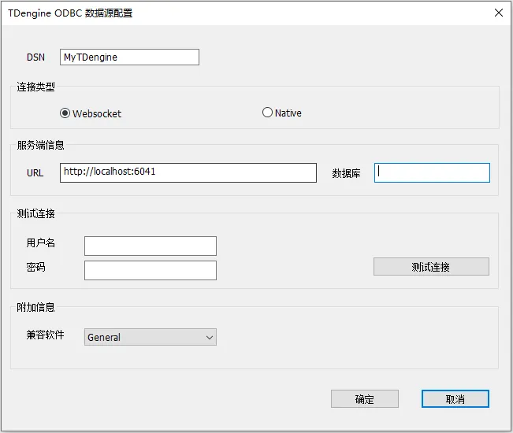
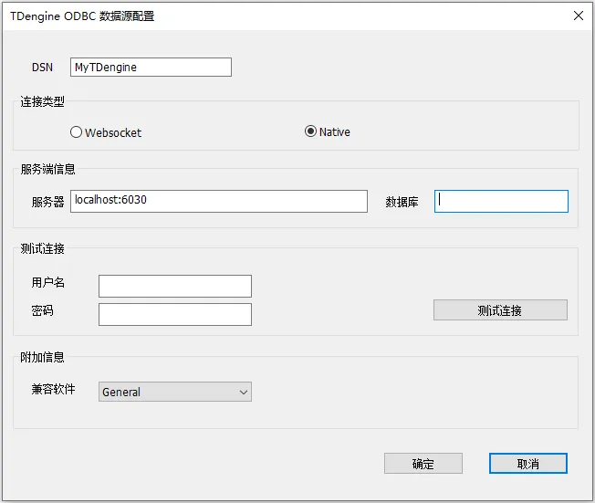

TDengine ODBC  是为 TDengine 实现的 ODBC 驱动程序，支持 Windows 系统的应用（如 [PowerBI](https://powerbi.microsoft.com/zh-cn/) 等）通过 ODBC 标准接口访问本地、远程和云服务的 TDengine 数据库的数据表/视图。

TDengine ODBC  提供基于 WebSocket（推荐）和 原生连接两种方式连接 TDengine 数据库，使用时可以为 TDengine 数据源设置不同的连接方式。访问云服务时必须使用 WebSocket 连接方式。

注意：TDengine ODBC 支持 32/64 位 Windows 系统，调用 TDengine ODBC 需要通过相应位数的 ODBC 驱动管理器进行。在 32 位 Windows 系统或者 64 位 Windows 系统的 32 位应用程序中，仅支持使用 WebSocket 连接方式访问 TDengine 数据库。

想更多了解 TDengine 时序时序数据库的使用，可访问 [TDengine官方文档](https://docs.taosdata.com/intro/)。

## ODBC 版本兼容性
- 支持 ODBC 3.8 及以前所有版本。

## 安装

1. 仅支持 Windows 平台。Windows 上需要安装过 VC 运行时库，可在此下载安装 [VC运行时库](https://learn.microsoft.com/en-us/cpp/windows/latest-supported-vc-redist?view=msvc-170) 如果已经安装VS开发工具可忽略。  

2. 安装 TDengine Windows 客户端。版本在 3.2.1.0 或以上，包含 TDengine 的 ODBC 64 位驱动；版本在 3.3.3.0 或以上，包含 TDengine 的 ODBC 32/64 位驱动。

## 配置数据源

### 数据源连接类型与区别

TDengine ODBC 支持两种连接 TDengine 数据库方式：Websocket 连接与 Native 连接，其区别如下：

1. 访问云服务仅支持使用 Websocket 连接方式。

2. 32 位应用程序仅支持使用 WebSocket 连接方式。

3. Websocket 连接的兼容性更好，一般不需要随着 TDengine 数据库服务端升级而升级客户端的库。

4. Native 连接通常性能更好一点，但是必须与 TDengine 数据库服务端的版本保持一致。

5. 对于一般用户，建议使用 **Websocket** 连接方式，性能与 Native 差别不大，兼容性更好。

### WebSocket 连接

1. 【开始】菜单搜索打开【ODBC 数据源(32 位)】或者【ODBC 数据源(64 位)】管理工具 

2. 选中【用户 DSN】标签页，通过【添加(D)】按钮进入"创建数据源"界面 

3. 选择想要添加的数据源，这里我们选择【TDengine】 

4. 点击完成，进入 TDengine ODBC 数据源配置页面，填写如下必要信息 

    

    4.1 【DSN】:Data Source Name 必填，为新添加的 ODBC 数据源命名

    4.2【连接类型】 : 必选，选择连接类型，这里选择 【Websocket】

    4.3【URL】必填，ODBC 数据源 URL，示例: `http://localhost:6041`， 云服务的 url 示例: `https://gw.cloud.taosdata.com?token=your_token`

    4.4【数据库】选填，需要连接的默认数据库

    4.5【用户名】仅供第5步测试连接使用，选填，数据库用户名，如果不填，TDengine 默认 root

    4.6【密码】仅供第5步测试连接使用，选填，数据库用户密码，如果不填，TDengine 默认 taosdata

    4.7【兼容软件】支持对工业软件 KingSCADA、Kepware 等的兼容性适配，通常情况下，选择默认值 General 即可

5. 点【测试连接】测试连接情况，如果成功，提示"成功连接到URL"

6. 点【确定】，即可保存配置并退出

7. 也可以在第2步选择已经配置好的数据源名通过【配置】按钮进入配置页面，修改已有配置

### 原生连接（不支持云服务和 32 位应用程序）

1. 【开始】菜单搜索打开【ODBC 数据源(64 位)】管理工具（注意不要选择ODBC 数据源(32 位)）

2. 选中【用户 DSN】标签页，通过【添加(D)】按钮进入"创建数据源"界面

3. 选择想要添加的数据源，这里我们选择【TDengine】

4. 点击完成，进入 TDengine ODBC 数据源配置页面，填写如下必要信息

    

    4.1 【DSN】:Data Source Name 必填，为新添加的 ODBC 数据源命名

    4.2 【连接类型】 : 必选，选择连接类型，这里选择 【Native】 原生连接；

    4.3 【服务器】必填，ODBC 数据源 服务器 地址，示例: `localhost:6030`

    4.4 【数据库】选填，需要连接的默认数据库
    
    4.5 【用户名】仅供第5步测试连接使用，选填，数据库用户名，如果不填，TDengine 默认 root

    4.6 【密码】仅供第5步测试连接使用，选填，数据库用户密码，如果不填，TDengine 默认 taosdata

    4.7【兼容软件】支持对工业软件 KingSCADA、Kepware 等的兼容性适配，通常情况下，选择默认值 General 即可

5. 点【测试连接】测试连接情况，如果成功，提示"连接成功"

6. 点【确定】，即可保存配置并退出

7. 也可以在第2步选择已经配置好的数据源名通过【配置】按钮进入配置页面，修改已有配置

## 支持的平台

原生连接方式支持的平台和 TDengine Windows X64版 客户端驱动支持的平台一致。
WebSocket 连接方式除此之外还支持 Windows X64系统上运行的 32 位应用程序上使用。

## 版本历史

| taos_odbc版本 | 主要变化                                                                                              |   TDengine 版本    |
| :-----------  | :--------------------------------------------------------------------------------------------------  | :----------------  |
|      v1.0.2   | 支持CP1252字符编码；                                                                                 | 3.2.3.0及更高版本 |
|      v1.0.1   | 1. 支持DSN设置BI模式，在BI模式下Tdengine数据库不返回系统数据库和超级表子表信息； 2. 重构字符集转换模块，提升读写性能； 3. Tdengine ODBC数据源配置对话框中默认修改默认连接方式为"WebSocket"； 4. Tdengine ODBC数据源配置对话框增加"测试连接"控件； 5. Tdengine ODBC数据源配置支持中文/英文界面； |         -          |
|    v1.0.0.0   | 发布初始版本，支持与Tdengine数据库交互以读写数据，具体请参考"API 参考"一节                                | 3.2.2.0及更高版本 |

## 数据类型映射

下表说明了 ODBC 连接器如何将服务器数据类型映射到默认的 SQL 和 C 数据类型。

| TDengine Type      | SQL Type          | C Type            |
|--------------------|-------------------|-------------------|
| TIMESTAMP          | SQL_TYPE_TIMESTAMP| SQL_C_TIMESTAMP   |
| INT                | SQL_INTEGER       | SQL_C_SLONG       |
| INT UNSIGNED       | SQL_INTEGER       | SQL_C_ULONG       |
| BIGINT             | SQL_BIGINT        | SQL_C_SBIGINT     |
| BIGINT UNSIGNED    | SQL_BIGINT        | SQL_C_UBIGINT     |
| FLOAT              | SQL_REAL          | SQL_C_FLOAT       |
| DOUBLE             | SQL_REAL          | SQL_C_DOUBLE      |
| BINARY             | SQL_BINARY        | SQL_C_BINARY      |
| SMALLINT           | SQL_SMALLINT      | SQL_C_SSHORT      |
| SMALLINT UNSIGNED  | SQL_SMALLINT      | SQL_C_USHORT      |
| TINYINT            | SQL_TINYINT       | SQL_C_STINYINT    |
| TINYINT UNSIGNED   | SQL_TINYINT       | SQL_C_UTINYINT    |
| BOOL               | SQL_BIT           | SQL_C_BIT         |
| NCHAR              | SQL_VARCHAR       | SQL_C_CHAR        |
| JSON               | SQL_VARCHAR       | SQL_C_CHAR        |
| VARCHAR            | SQL_VARCHAR       | SQL_C_CHAR        |
| GEOMETRY           | SQL_VARBINARY     | SQL_C_BINARY      |
| VARBINARY          | SQL_VARBINARY     | SQL_C_BINARY      |

## API 参考

本节按功能分类汇总了 ODBC API，关于完整的 ODBC API 参考，请访问 http://msdn.microsoft.com/en-us/library/ms714177.aspx 的ODBC程序员参考页面。

### 数据源和驱动程序管理

- API: ConfigDSN
  - **是否支持**: 支持
  - **标准**: ODBC
  - **作用**: 配置数据源
  
- API: ConfigDriver
  - **是否支持**: 支持
  - **标准**: ODBC
  - **作用**: 用于执行与特定驱动程序相关的安装和配置任务
  
- API: ConfigTranslator
  - **是否支持**: 支持
  - **标准**: ODBC
  - **作用**: 用于解析DSN的配置，在DSN配置和实际数据库驱动程序配置之间进行翻译或转换

### 连接到数据源

- API: SQLAllocHandle
  - **是否支持**: 支持
  - **标准**: ISO 92
  - **作用**: 分配环境、连接、语句或描述符句柄

- API: SQLConnect
  - **是否支持**: 支持
  - **标准**: ISO 92
  - **作用**: 通过数据源名称、用户 ID 和密码连接到特定驱动程序

- API: SQLDriverConnect
  - **是否支持**: 支持
  - **标准**: ODBC
  - **作用**: 通过连接字符串连接到特定驱动程序，支持更多连接信息

- API: SQLBrowseConnect
  - **是否支持**: 不支持
  - **标准**: ODBC
  - **作用**: 用于发现和枚举连接到数据源所需的特性和属性值。每次调用 SQLBrowseConnect 都会返回属性和属性值的连续级别

- API: SQLAllocEnv
  - **是否支持**: 不支持
  - **标准**: 弃用
  - **作用**: 在 ODBC 3.x 中，ODBC 2.x 函数 SQLAllocEnv 已替换为 SQLAllocHandle

- API: SQLAllocConnect
  - **是否支持**: 不支持
  - **标准**: 弃用
  - **作用**: 在 ODBC 3.x 中，ODBC 2.x 函数 SQLAllocConnect 已替换为 SQLAllocHandle

### 获取有关驱动程序和数据源的信息

- API: SQLDataSources
  - **是否支持**: 不支持
  - **标准**: ISO 92
  - **作用**: 返回可用数据源的列表，由驱动程序管理器处理

- API: SQLDrivers
  - **是否支持**: 不支持
  - **标准**: ISO 92
  - **作用**: 返回由驱动程序管理器处理的已安装驱动程序及其属性的列表

- API: SQLGetInfo
  - **是否支持**: 支持
  - **标准**: ISO 92
  - **作用**: 返回有关数据库环境的详细信息，如数据库产品名称、驱动程序名、数据库的SQL语法特性、连接能力等等

- API: SQLGetFunctions
  - **是否支持**: 不支持
  - **标准**: ISO 92
  - **作用**: 用于查询驱动程序支持的函数

- API: SQLGetTypeInfo
  - **是否支持**: 支持
  - **标准**: ISO 92
  - **作用**: 返回有关支持的数据类型的信息

### 设置和检索驱动程序属性

- API: SQLSetConnectAttr
  - **是否支持**: 支持
  - **标准**: ISO 92
  - **作用**: 设置连接属性，当设置SQL_ATTR_AUTOCOMMIT属性时，用于控制自动提交模式

- API: SQLGetConnectAttr
  - **是否支持**: 支持
  - **标准**: ISO 92
  - **作用**: 返回连接属性的值

- API: SQLSetConnectOption
  - **是否支持**: 不支持
  - **标准**: 弃用
  - **作用**: 在 ODBC 3.x 中，ODBC 2.0 函数 SQLSetConnectOption 已替换为 SQLSetConnectAttr

- API: SQLGetConnectOption
  - **是否支持**: 不支持
  - **标准**: 弃用
  - **作用**: 在 ODBC 3.x 中，ODBC 2.0 函数 SQLSetConnectOption 已替换为 SQLGetConnectAttr

- API: SQLSetEnvAttr
  - **是否支持**: 支持
  - **标准**: ISO 92
  - **作用**: 设置控制环境的属性

- API: SQLGetEnvAttr
  - **是否支持**: 支持
  - **标准**: ISO 92
  - **作用**: 返回环境属性的当前设置

- API: SQLSetStmtAttr
  - **是否支持**: 支持
  - **标准**: ISO 92
  - **作用**: 设置与语句相关的属性

- API: SQLGetStmtAttr
  - **是否支持**: 支持
  - **标准**: ISO 92
  - **作用**: 返回语句属性的当前设置

- API: SQLSetStmtOption
  - **是否支持**: 不支持
  - **标准**: 弃用
  - **作用**: 在 ODBC 3.x 中，ODBC 2.0 函数 SQLSetStmtOption 已替换为 SQLSetStmtAttr

- API: SQLGetStmtOption
  - **是否支持**: 不支持
  - **标准**: 弃用
  - **作用**: 在 ODBC 3.x 中，ODBC 2.0 函数 SQLSetStmtOption 已替换为 SQLGetStmtAttr

### 准备SQL请求

- API: SQLAllocStmt
  - **是否支持**: 不支持
  - **标准**: 弃用
  - **作用**: 在 ODBC 3.x 中，ODBC 2.x 函数 SQLAllocStmt 已替换为 SQLAllocHandle

- API: SQLPrepare
  - **是否支持**: 支持
  - **标准**: ISO 92
  - **作用**: 用于预处理SQL语句，这通常是SQLExecute之前的一个步骤

- API: SQLBindCol
  - **是否支持**: 支持
  - **标准**: ODBC
  - **作用**: 用于将结果集中的列绑定到应用程序缓冲区

- API: SQLBindParameter
  - **是否支持**: 支持
  - **标准**: ODBC
  - **作用**: 用于将SQL语句的参数绑定到应用程序缓冲区

- API: SQLGetCursorName
  - **是否支持**: 不支持
  - **标准**: ISO 92
  - **作用**: 返回与指定语句关联的游标名称

- API: SQLSetCursorName
  - **是否支持**: 不支持
  - **标准**: ISO 92
  - **作用**: 设置游标名称，允许在查询中使用命名游标

- API: SQLSetScrollOptions
  - **是否支持**: 不支持
  - **标准**: ODBC
  - **作用**: 设置控制光标行为的选项

### 提交请求

- API: SQLExecute
  - **是否支持**: 支持
  - **标准**: ISO 92
  - **作用**: 用于执行之前通过 SQLPrepare 准备好的SQL语句

- API: SQLExecDirect
  - **是否支持**: 支持
  - **标准**: ISO 92
  - **作用**: 用于执行包含SQL语句的字符串

- API: SQLNativeSql
  - **是否支持**: 不支持
  - **标准**: ODBC
  - **作用**: 用于将应用程序提供的SQL语句转换为数据库驱动程序的本机SQL语法

- API: SQLDescribeParam
  - **是否支持**: 支持
  - **标准**: ODBC
  - **作用**: 返回语句中特定参数的描述

- API: SQLNumParams
  - **是否支持**: 支持
  - **标准**: ISO 92
  - **作用**: 用于查询预编译SQL语句中的参数数量

- API: SQLParamData
  - **是否支持**: 不支持
  - **标准**: ISO 92
  - **作用**: 用于从参数数据流中获取下一个参数值

- API: SQLPutData
  - **是否支持**: 不支持
  - **标准**: ISO 92
  - **作用**: 当使用流输入方式时，可以用于向输出参数发送数据块

### 检索结果和关于结果的信息

- API: SQLRowCount
  - **是否支持**: 支持
  - **标准**: ISO 92
  - **作用**: 返回受插入或删除请求影响的行数

- API: SQLNumResultCols
  - **是否支持**: 支持
  - **标准**: ISO 92
  - **作用**: 返回结果集中的列数

- API: SQLDescribeCol
  - **是否支持**: 支持
  - **标准**: ISO 92
  - **作用**: 用于描述结果集中列的属性。它提供了关于列的数据类型、列名、列的最大宽度、小数位数和是否可为空等信息

- API: SQLColAttribute
  - **是否支持**: 支持
  - **标准**: ISO 92
  - **作用**: 返回结果集中列的描述符信息，如标题、排序规则等

- API: SQLColAttributes
  - **是否支持**: 不支持
  - **标准**: 弃用
  - **作用**: 在 ODBC 3.x 中，ODBC 2.0 函数 SQLColAttributes 已替换为 SQLColAttribute

- API: SQLGetData
  - **是否支持**: 支持
  - **标准**: ODBC
  - **作用**: 用于从结果集中的当前行获取特定列的数据

- API: SQLMoreResults
  - **是否支持**: 支持
  - **标准**: ODBC
  - **作用**: 多个结果集的 SQL 语句执行后（例如：一个批处理或存储过程），移动到下一个结果集

- API: SQLFetch
  - **是否支持**: 支持
  - **标准**: ISO 92
  - **作用**: 用于从结果集中提取下一行数据，并返回所有绑定列的数据

- API: SQLFetchScroll
  - **是否支持**: 支持
  - **标准**: ISO 92
  - **作用**: 用于从结果集中提取指定的数据行集，并返回所有绑定列的数据

- API: SQLExtendedFetch
  - **是否支持**: 不支持
  - **标准**: 弃用
  - **作用**: 在 ODBC 3.x 中，SQLExtendedFetch 已替换为 SQLFetchScroll

- API: SQLSetPos
  - **是否支持**: 支持
  - **标准**: ODBC
  - **作用**: 设置行集中的游标位置，并允许应用程序更新数据集中的行

- API: SQLBulkOperations
  - **是否支持**: 不支持
  - **标准**: ODBC
  - **作用**: 执行批量插入和批量书签操作，包括更新、删除和按书签提取

### 检索错误或诊断信息

- API: SQLError
  - **是否支持**: 不支持
  - **标准**: 弃用
  - **作用**: 在 ODBC 3.x 中，ODBC 2.x 函数 SQLError 已替换为 SQLGetDiagRec

- API: SQLGetDiagField
  - **是否支持**: 支持
  - **标准**: ISO 92
  - **作用**: 返回附加诊断信息（单条诊断结果）

- API: SQLGetDiagRec
  - **是否支持**: 支持
  - **标准**: ISO 92
  - **作用**: 返回附加诊断信息（多条诊断结果）

### 获取有关数据源的系统表项的信息

- API: SQLColumnPrivileges
  - **是否支持**: 不支持
  - **标准**: ODBC
  - **作用**: 用于检索指定表中列的权限信息，如哪些用户或角色拥有对特定列的读取、插入、更新或删除权限

- API: SQLColumns
  - **是否支持**: 支持
  - **标准**: X/Open
  - **作用**: 返回指定表中的列名列表

- API: SQLForeignKeys
  - **是否支持**: 不支持
  - **标准**: ODBC
  - **作用**: 检索外键关系的详细信息

- API: SQLPrimaryKeys
  - **是否支持**: 支持
  - **标准**: ODBC
  - **作用**: 返回构成表主键的列名列表

- API: SQLSpecialColumns
  - **是否支持**: 不支持
  - **标准**: X/Open
  - **作用**: 返回数据库中特殊列的信息，如唯一键或索引列

- API: SQLStatistics
  - **是否支持**: 不支持
  - **标准**: ISO 92
  - **作用**: 返回关于表的统计信息，如行数、列数、平均行宽等

- API: SQLTablePrivileges
  - **是否支持**: 不支持
  - **标准**: ODBC
  - **作用**: 返回用户在特定表上的权限，如SELECT、INSERT、UPDATE等

- API: SQLTables
  - **是否支持**: 支持
  - **标准**: X/Open
  - **作用**: 返回存储在数据源的当前数据库中的表信息

- API: SQLProcedures
  - **是否支持**: 不支持
  - **标准**: ODBC
  - **作用**: 返回数据库中可用的存储过程信息，包括名称和类型

- API: SQLProcedureColumns
  - **是否支持**: 不支持
  - **标准**: ODBC
  - **作用**: 返回存储过程的列信息，包括输入输出参数的详细信息

### 执行事务

- API: SQLTransact
  - **是否支持**: 不支持
  - **标准**: 弃用
  - **作用**: 在 ODBC 3.x 中，ODBC 2.x 函数 SQLTransact 已替换为 SQLEndTran

- API: SQLEndTran
  - **是否支持**: 支持
  - **标准**: ISO 92
  - **作用**: 用于提交或回滚事务，TDengine 不支持事务，因此不支持回滚操作

### 终止连接

- API: SQLDisconnect
  - **是否支持**: 支持
  - **标准**: ISO 92
  - **作用**: 断开数据库连接

- API: SQLFreeHandle
  - **是否支持**: 支持
  - **标准**: ISO 92
  - **作用**: 释放与特定环境、连接、语句或描述符句柄关联的资源

- API: SQLFreeConnect
  - **是否支持**: 不支持
  - **标准**: 弃用
  - **作用**: 在 ODBC 3.x 中，ODBC 2.0 函数 SQLFreeConnect 已替换为 SQLFreeHandle

- API: SQLFreeEnv
  - **是否支持**: 不支持
  - **标准**: 弃用
  - **作用**: 在 ODBC 3.x 中，ODBC 2.0 函数 SQLFreeEnv 已替换为 SQLFreeHandle

- API: SQLFreeStmt
  - **是否支持**: 支持
  - **标准**: ODBC
  - **作用**: 结束语句处理，丢弃挂起的结果，并且可以选择释放与语句句柄关联的所有资源

- API: SQLCloseCursor
  - **是否支持**: 支持
  - **标准**: ODBC
  - **作用**: 关闭与当前语句句柄关联的游标，并释放游标所使用的所有资源

## 与第三方集成

作为使用 TDengine ODBC driver 的一个示例，你可以使用 Power BI 与 TDengine 分析时序数据。更多细节请参考 [Power BI](../../../third-party/bi/powerbi)
