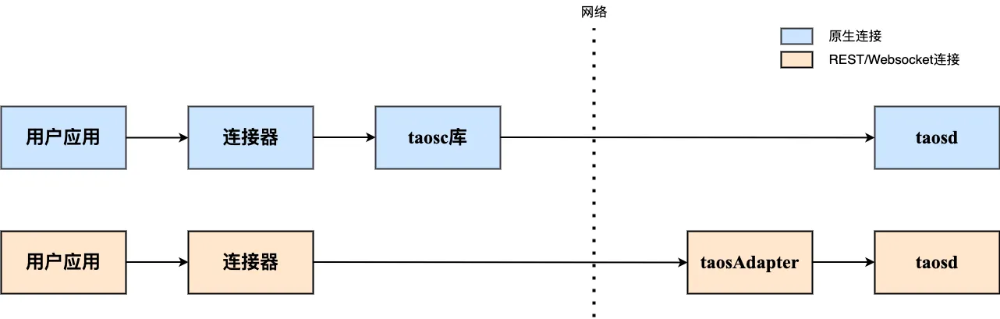

TDengine TSDB 提供了丰富的应用程序开发接口。为便于用户快速开发应用，它支持多种编程语言的连接器，其中官方连接器包括 C/C++、Java、Python、Go、Node.js、C# 和 Rust；社区开发者也贡献了多个非官方连接器，例如 ADO.NET、Lua 和 PHP 连接器。这些连接器支持通过原生接口（taosc）、WebSocket 和 REST 接口（部分语言暂不支持）连接 TDengine TSDB 集群。另外，用户还可以直接调用 taosAdapter 提供的 REST API 接口访问 TDengine TSDB，进行数据写入和查询操作。

## 连接方式

连接器建立连接的方式，TDengine TSDB 提供三种：

1. 通过客户端驱动程序 taosc 直接与服务端程序 taosd 建立连接，这种连接方式下文中简称“原生连接”。
2. 通过 taosAdapter 组件提供的 REST API 建立与 taosd 的连接，这种连接方式下文中简称“REST 连接”
3. 通过 taosAdapter 组件提供的 WebSocket API 建立与 taosd 的连接，这种连接方式下文中简称“WebSocket 连接”

无论使用何种方式建立连接，连接器都提供了相同或相似的 API 操作数据库，都可以执行 SQL 语句，只是初始化连接的方式稍有不同，用户在使用上不会感到什么差别。
各种连接方式和各语言连接器支持情况请参考 [连接器功能特性](../../reference/connector/#功能特性)

关键不同点在于：

1. 使用 原生连接，需要保证客户端的驱动程序 taosc 和服务端的 TDengine TSDB 版本保持一致。
2. 使用 REST 连接，用户无需安装客户端驱动程序 taosc，具有跨平台易用的优势，但是无法体验数据订阅和二进制数据类型等功能。另外与 原生连接 和 WebSocket 连接相比，REST 连接的性能最低。REST 接口是无状态的。在使用 REST 连接时，需要在 SQL 中指定表、超级表的数据库名称。  
3. 使用 WebSocket 连接，除 C/C++ 连接器外，用户也无需安装客户端驱动程序 taosc。
4. 连接云服务实例，必须使用 REST 连接 或 WebSocket 连接。

**推荐使用 WebSocket 连接**
