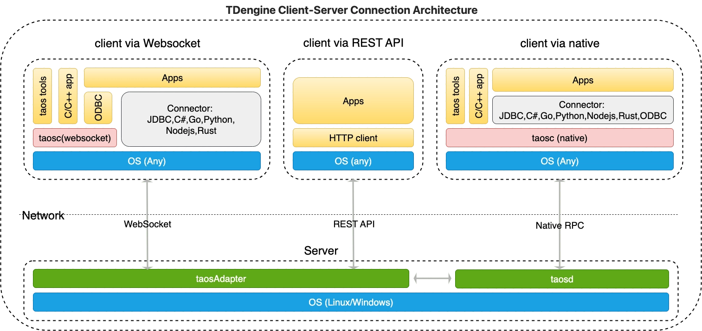

TDengine TSDB 提供了丰富的应用程序开发接口。为便于用户快速开发应用，它支持多种编程语言的连接器，其中官方连接器包括 C/C++、Java、Python、Go、Node.js、C# 和 Rust；社区开发者也贡献了多个非官方连接器，例如 ADO.NET、Lua 和 PHP 连接器。这些连接器支持通过原生接口和 WebSocket 接口连接 TDengine TSDB 集群。另外，用户还可以直接调用 taosAdapter 提供的 REST API 接口访问 TDengine TSDB，进行数据写入和查询操作。

## 连接方式

下图为 TDengine TSDB 客户端和服务端连接方式的架构图：

如上面的架构图所示，我们有三种方式来访问 TDengine TSDB：

1. WebSocket 连接：通过连接器使用 taosAdapter 组件提供的 WebSocket API 建立与 taosd 的连接，这种连接方式下文中简称“WebSocket 连接”。 **推荐使用 WebSocket 连接**。
2. 原生连接：通过连接器使用客户端驱动程序 taosc 直接与服务端程序 taosd 建立连接，这种连接方式下文中简称“原生连接”。
3. REST API：不使用连接器，通过 HTTP 客户端直接调用 taosAdapter 组件提供的 REST API 建立与 taosd 的连接，这种连接方式下文中简称“REST API”。

**备注**：客户端驱动程序 taosc 包含了 C 原生和 WebSocket 连接器，使用 C/C++ 语言开发的应用都需要依赖客户端驱动程序 taosc。

对于 WebSocket 连接和原生连接，连接器都提供了相同或相似的 API 操作数据库，只是初始化连接的方式稍有不同，用户在使用上不会感到什么差别。
各种连接方式和各语言连接器支持情况请参考 [连接器功能特性](../../reference/connector/#功能特性)。

关键不同点在于：

1. 使用 原生连接，需要保证客户端的驱动程序 taosc 和服务端的 TDengine TSDB 版本保持一致。
2. 使用 WebSocket 连接，除 C/C++ 和 ODBC 连接器外，用户无需安装客户端驱动程序 taosc。即使依赖客户端驱动程序 taosc，也无需保证其和服务端的 TDengine TSDB 版本保持一致。
3. 连接云服务实例，必须使用 WebSocket 连接。
4. REST API 仅提供执行 SQL 功能，不支持参数绑定和数据订阅。
