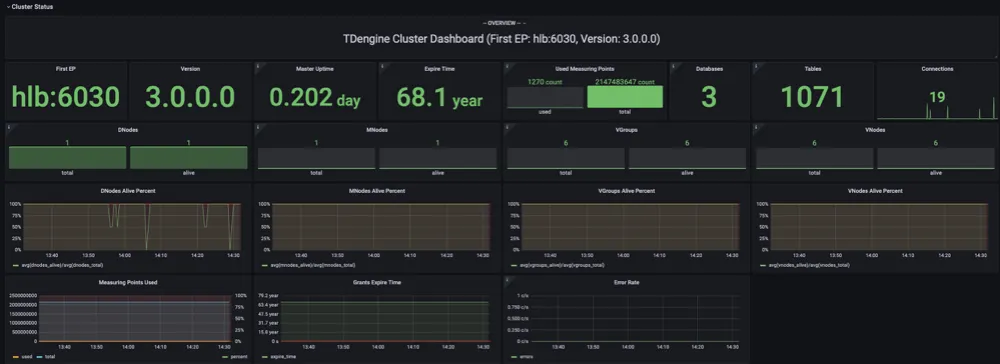
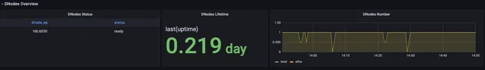

import Tabs from '@theme/Tabs'
import TabItem from '@theme/TabItem'

TDinsight 是使用监控数据库和 [Grafana] 对 TDengine 进行监控的解决方案。

TDengine 通过 [taosKeeper](../taosKeeper) 将服务器的 CPU、内存、硬盘空间、带宽、请求数、磁盘读写速度、慢查询等信息定时写入指定数据库，并对重要的系统操作（比如登录、创建、删除数据库等）以及各种错误报警信息进行记录。通过 [Grafana] 和 [TDengine 数据源插件](https://github.com/taosdata/grafanaplugin/releases)，TDinsight 将集群状态、节点信息、插入及查询请求、资源使用情况等进行可视化展示，同时还支持 vnode、dnode、mnode 节点状态异常告警，为开发者实时监控 TDengine 集群运行状态提供了便利。本文将指导用户安装 Grafana 服务器并通过 `TDinsight.sh` 安装脚本自动安装 TDengine 数据源插件及部署 TDinsight 可视化面板。

## 系统要求

- 单节点的 TDengine 服务器或多节点的 [TDengine] 集群，以及一个[Grafana]服务器。此仪表盘需要 TDengine 3.0.0.0 及以上，并开启监控服务，具体配置请参考：[TDengine 监控配置](../config/#监控相关)。
- taosAdapter 已经安装并正常运行。具体细节请参考：[taosAdapter 使用手册](../taosadapter)
- taosKeeper 已安装并正常运行。注意需要 taos.cfg 文件中打开 monitor 相关配置项，具体细节请参考：[taosKeeper 使用手册](../taosKeeper)

记录以下信息：

- taosAdapter 集群 REST API 地址，如：`http://tdengine.local:6041`。
- taosAdapter 集群认证信息，可使用用户名及密码。
- taosKeeper 记录监控指标的数据库名称。

## 安装 Grafana

我们建议在此处使用最新的[Grafana] 8 或 9 版本。您可以在任何[支持的操作系统](https://grafana.com/docs/grafana/latest/installation/requirements/#supported-operating-systems)中，按照 [Grafana 官方文档安装说明](https://grafana.com/docs/grafana/latest/installation/) 安装 [Grafana]。

<Tabs defaultValue="debian" groupId="install">
<TabItem value="debian" label="基于 Debian 或 Ubuntu 系统">

对于 Debian 或 Ubuntu 操作系统，建议使用 Grafana 镜像仓库。使用如下命令从零开始安装：

```bash
sudo apt-get install -y apt-transport-https
sudo apt-get install -y software-properties-common wget
wget -q -O - https://packages.grafana.com/gpg.key |\
  sudo apt-key add -
echo "deb https://packages.grafana.com/oss/deb stable main" |\
  sudo tee -a /etc/apt/sources.list.d/grafana.list
sudo apt-get update
sudo apt-get install grafana
```

</TabItem>
<TabItem value="redhat" label="基于 CentOS / RHEL 系统">

您可以从官方 YUM 镜像仓库安装。

```bash
sudo tee /etc/yum.repos.d/grafana.repo << EOF
[grafana]
name=grafana
baseurl=https://packages.grafana.com/oss/rpm
repo_gpgcheck=1
enabled=1
gpgcheck=1
gpgkey=https://packages.grafana.com/gpg.key
sslverify=1
sslcacert=/etc/pki/tls/certs/ca-bundle.crt
EOF
sudo yum install grafana
```

或者用 RPM 安装：

```bash
wget https://dl.grafana.com/oss/release/grafana-7.5.11-1.x86_64.rpm
sudo yum install grafana-7.5.11-1.x86_64.rpm
# or
sudo yum install \
  https://dl.grafana.com/oss/release/grafana-7.5.11-1.x86_64.rpm
```

</TabItem>

</Tabs>

### 安装 TDengine 数据源插件

<Tabs defaultValue="manual" groupId="deploy">
<TabItem value="manual" label="手动设置 TDinsight">

从 GitHub 安装 TDengine 最新版数据源插件。

```bash
get_latest_release() {
  curl --silent "https://api.github.com/repos/taosdata/grafanaplugin/releases/latest" |
    grep '"tag_name":' |
    sed -E 's/.*"v([^"]+)".*/\1/'
}
TDENGINE_PLUGIN_VERSION=$(get_latest_release)
sudo grafana-cli \
  --pluginUrl https://github.com/taosdata/grafanaplugin/releases/download/v$TDENGINE_PLUGIN_VERSION/tdengine-datasource-$TDENGINE_PLUGIN_VERSION.zip \
  plugins install tdengine-datasource
```

:::note
3.1.6 和更早版本插件需要在配置文件 `/etc/grafana/grafana.ini` 中添加如下设置，以启用未签名插件。

```ini
[plugins]
allow_loading_unsigned_plugins = tdengine-datasource
```

:::

</TabItem>

<TabItem value="auto" label="自动部署 TDinsight">

我们提供了一个自动化安装脚本 [`TDinsight.sh`](https://github.com/taosdata/grafanaplugin/releases/latest/download/TDinsight.sh) 脚本以便用户快速进行安装配置。

您可以通过 `wget` 或其他工具下载该脚本：

```bash
wget https://github.com/taosdata/grafanaplugin/releases/latest/download/TDinsight.sh
chmod +x TDinsight.sh
./TDinsight.sh
```

这个脚本会自动下载最新的[Grafana TDengine 数据源插件](https://github.com/taosdata/grafanaplugin/releases/latest) 和 [TDinsight 仪表盘](https://github.com/taosdata/grafanaplugin/blob/master/dashboards/TDinsightV3.json) ，将命令行选项中的可配置参数转为 [Grafana Provisioning](https://grafana.com/docs/grafana/latest/administration/provisioning/) 配置文件，以进行自动化部署及更新等操作。

假设您在同一台主机上使用 TDengine 和 Grafana 的默认服务。运行 `./TDinsight.sh` 并打开 Grafana 浏览器窗口就可以看到 TDinsight 仪表盘了。

下面是 TDinsight.sh 的用法说明：

```text
Usage:
   ./TDinsight.sh
   ./TDinsight.sh -h|--help
   ./TDinsight.sh -n <ds-name> -a <api-url> -u <user> -p <password>

Install and configure TDinsight dashboard in Grafana on Ubuntu 18.04/20.04 system.

-h, -help,          --help                  Display help

-V, -verbose,       --verbose               Run script in verbose mode. Will print out each step of execution.

-v, --plugin-version <version>              TDengine datasource plugin version, [default: latest]

-P, --grafana-provisioning-dir <dir>        Grafana provisioning directory, [default: /etc/grafana/provisioning/]
-G, --grafana-plugins-dir <dir>             Grafana plugins directory, [default: /var/lib/grafana/plugins]
-O, --grafana-org-id <number>               Grafana organization id. [default: 1]

-n, --tdengine-ds-name <string>             TDengine datasource name, no space. [default: TDengine]
-a, --tdengine-api <url>                    TDengine REST API endpoint. [default: http://127.0.0.1:6041]
-u, --tdengine-user <string>                TDengine user name. [default: root]
-p, --tdengine-password <string>            TDengine password. [default: taosdata]

-i, --tdinsight-uid <string>                Replace with a non-space ASCII code as the dashboard id. [default: tdinsight]
-t, --tdinsight-title <string>              Dashboard title. [default: TDinsight]
-e, --tdinsight-editable                    If the provisioning dashboard could be editable. [default: false]
```

大多数命令行选项都可以通过环境变量获得同样的效果。

| 短选项 | 长选项                     | 环境变量                     | 说明                                                    |
| ------ | -------------------------- | ---------------------------- | ------------------------------------------------------- |
| -v     | --plugin-version           | TDENGINE_PLUGIN_VERSION      | TDengine 数据源插件版本，默认使用最新版。               |
| -P     | --grafana-provisioning-dir | GF_PROVISIONING_DIR          | Grafana 配置目录，默认为`/etc/grafana/provisioning/`    |
| -G     | --grafana-plugins-dir      | GF_PLUGINS_DIR               | Grafana 插件目录，默认为`/var/lib/grafana/plugins`。    |
| -O     | --grafana-org-id           | GF_ORG_ID                    | Grafana 组织 ID，默认为 1。                             |
| -n     | --tdengine-ds-name         | TDENGINE_DS_NAME             | TDengine 数据源名称，默认为 TDengine。                  |
| -a     | --tdengine-api             | TDENGINE_API                 | TDengine REST API 端点。默认为`http://127.0.0.1:6041`。 |
| -u     | --tdengine-user            | TDENGINE_USER                | TDengine 用户名。 [默认值：root]                        |
| -p     | --tdengine-password        | TDENGINE_PASSWORD            | TDengine 密码。 [默认：taosdata]                        |
| -i     | --tdinsight-uid            | TDINSIGHT_DASHBOARD_UID      | TDinsight 仪表盘`uid`。 [默认值：tdinsight]             |
| -t     | --tdinsight-title          | TDINSIGHT_DASHBOARD_TITLE    | TDinsight 仪表盘标题。 [默认：TDinsight]                |
| -e     | --tdinsight-editable       | TDINSIGHT_DASHBOARD_EDITABLE | 如果配置仪表盘可以编辑。 [默认值：false]                |

:::note
新版本插件使用 Grafana unified alerting 功能，`-E` 选项不再支持。
:::

假设您在主机 `tdengine` 上启动 TDengine 数据库，HTTP API 端口为 `6041`，用户为 `root1`，密码为 `pass5ord`。执行脚本：

```bash
./TDinsight.sh -a http://tdengine:6041 -u root1 -p pass5ord
```

如果要监控多个 TDengine 集群，则需要设置多个 TDinsight 仪表盘。设置非默认 TDinsight 需要进行一些更改： `-n` `-i` `-t` 选项需要更改为非默认名称，如果使用 内置短信告警功能，`-N` 和 `-L` 也应该改变。

```bash
sudo ./TDengine.sh -n TDengine-Env1 -a http://another:6041 -u root -p taosdata -i tdinsight-env1 -t 'TDinsight Env1'
```

请注意，配置数据源、通知 Channel 和仪表盘在前端是不可更改的。您应该再次通过此脚本更新配置或手动更改 `/etc/grafana/provisioning` 目录（这是 Grafana 的默认目录，根据需要使用`-P`选项更改）中的配置文件。

特别地，当您使用 Grafana Cloud 或其他组织时，`-O` 可用于设置组织 ID。 `-G` 可指定 Grafana 插件安装目录。 `-e` 参数将仪表盘设置为可编辑。

</TabItem>
</Tabs>

### 启动 Grafana 服务

```bash
sudo systemctl start grafana-server
sudo systemctl enable grafana-server
```

### 登录到 Grafana

在 Web 浏览器中打开默认的 Grafana 网址：`http://localhost:3000`。
默认用户名/密码都是 `admin`。Grafana 会要求在首次登录后更改密码。

### 添加 TDengine 数据源

指向 **Configurations** -> **Data Sources** 菜单，然后点击 **Add data source** 按钮。


搜索并选择**TDengine**。


配置 TDengine 数据源。


保存并测试，正常情况下会报告 'TDengine Data source is working'。


### 导入仪表盘

在配置 TDengine 数据源界面，点击 **Dashboards** tab。


选择 `TDengine for 3.x`，并点击 `import`。

导入完成后，在搜索界面已经出现了 **TDinsight for 3.x** dashboard。


进入 TDinsight for 3.x dashboard 后，选择 taosKeeper 中设置的记录监控指标的数据库。


然后可以看到监控结果。

## TDinsight 仪表盘详细信息

TDinsight 仪表盘旨在提供 TDengine 相关资源的使用情况和状态，比如 dnodes、 mnodes、 vnodes 和数据库等。

指标详情如下：

### 集群状态



这部分包括集群当前信息和状态，告警信息也在此处（从左到右，从上到下）。

- **First EP**：当前 TDengine 集群中的`firstEp`设置。
- **Version**：TDengine 服务器版本（master mnode）。
- **Master Uptime**: 当前 Master MNode 被选举为 Master 后经过的时间。
- **Expire Time** - 企业版过期时间。
- **Used Measuring Points** - 企业版已使用的测点数。
- **Databases** - 数据库个数。
- **Connections** - 当前连接个数。
- **DNodes/MNodes/VGroups/VNodes**：每种资源的总数和存活数。
- **DNodes/MNodes/VGroups/VNodes Alive Percent**：每种资源的存活数/总数的比例，启用告警规则，并在资源存活率（1 分钟内平均健康资源比例）不足 100%时触发。
- **Measuring Points Used**：启用告警规则的测点数用量（社区版无数据，默认情况下是健康的）。
- **Grants Expire Time**：启用告警规则的企业版过期时间（社区版无数据，默认情况是健康的）。
- **Error Rate**：启用警报的集群总合错误率（每秒平均错误数）。

### DNodes 状态



- **DNodes Status**：`show dnodes` 的简单表格视图。
- **DNodes Lifetime**：从创建 dnode 开始经过的时间。
- **DNodes Number**：DNodes 数量变化。

### MNode 概述


1. **MNodes Status**：`show mnodes` 的简单表格视图。
2. **MNodes Number**：类似于`DNodes Number`，MNodes 数量变化。

### 请求


1. **Requests Rate(Inserts per Second)**：平均每秒插入次数。
2. **Requests (Selects)**：查询请求数及变化率（count of second）。

### 数据库


数据库使用情况，对变量 `$database` 的每个值即每个数据库进行重复多行展示。

1. **STables**：超级表数量。
2. **Total Tables**：所有表数量。
3. **Tables**：所有普通表数量随时间变化图。
4. **Tables Number Foreach VGroups**：每个 VGroups 包含的表数量。

### DNode 资源使用情况


数据节点资源使用情况展示，对变量 `$fqdn` 即每个数据节点进行重复多行展示。包括：

1. **Uptime**：从创建 dnode 开始经过的时间。
2. **Has MNodes?**：当前 dnode 是否为 mnode。
3. **CPU Cores**：CPU 核数。
4. **VNodes Number**：当前 dnode 的 VNodes 数量。
5. **VNodes Masters**：处于 master 角色的 vnode 数量。
6. **Current CPU Usage of taosd**：taosd 进程的 CPU 使用率。
7. **Current Memory Usage of taosd**：taosd 进程的内存使用情况。
8. **Disk Used**：taosd 数据目录的总磁盘使用百分比。
9. **CPU Usage**：进程和系统 CPU 使用率。
10. **RAM Usage**：RAM 使用指标时间序列视图。
11. **Disk Used**：多级存储下每个级别使用的磁盘（默认为 level0 级）。
12. **Disk Increasing Rate per Minute**：每分钟磁盘用量增加或减少的百分比。
13. **Disk IO**：磁盘 IO 速率。
14. **Net IO**：网络 IO，除本机网络之外的总合网络 IO 速率。

### 登录历史


目前只报告每分钟登录次数。

### 监控 taosAdapter


支持监控 taosAdapter 请求统计和状态详情。包括：

1. **Http Request Total**: 请求总数。
2. **Http Request Fail**: 请求总数。
3. **CPU Used**: taosAdapter CPU 使用情况。
4. **Memory Used**: taosAdapter 内存使用情况。
5. **Http Request Inflight**: 即时处理请求数。
6. **Http Status Code**: taosAdapter http 状态码。

## 升级

通过 `TDinsight.sh` 脚本安装的 TDinsight，可以通过重新运行该脚本就可以升级到最新的 Grafana 插件和 TDinsight Dashboard。

手动安装的情况下，可按照上述步骤自行安装新的 Grafana 插件和 Dashboard。

## 卸载

通过 `TDinsight.sh` 脚本安装的 TDinsight，可以使用命令行 `TDinsight.sh -R` 清理相关资源。

手动安装时，要完全卸载 TDinsight，需要清理以下内容：

1. Grafana 中的 TDinsight Dashboard。
2. Grafana 中的 Data Source 数据源。
3. 从插件安装目录删除 `tdengine-datasource` 插件。

## 整合的 Docker 示例

```bash
git clone --depth 1 https://github.com/taosdata/grafanaplugin.git
cd grafanaplugin
```

根据需要在 `docker-compose.yml` 文件中修改：

```yaml
version: '3.7'

services:
  grafana:
    image: grafana/grafana:7.5.10
    volumes:
      - ./dist:/var/lib/grafana/plugins/tdengine-datasource
      - ./grafana/grafana.ini:/etc/grafana/grafana.ini
      - ./grafana/provisioning/:/etc/grafana/provisioning/
      - grafana-data:/var/lib/grafana
    environment:
      TDENGINE_API: ${TDENGINE_API}
      TDENGINE_USER: ${TDENGINE_USER}
      TDENGINE_PASS: ${TDENGINE_PASS}
    ports:
      - 3000:3000
volumes:
  grafana-data:
```

替换`docker-compose.yml`中的环境变量或保存环境变量到`.env`文件，然后用`docker-compose up`启动 Grafana。`docker-compose` 工具的具体用法参见 [Docker Compose Reference](https://docs.docker.com/compose/)

```bash
docker-compose up -d
```

TDinsight 已经通过 Provisioning 部署完毕，请到 http://localhost:3000/d/tdinsight/ 查看仪表盘。

[grafana]: https://grafana.com
[tdengine]: https://www.taosdata.com
