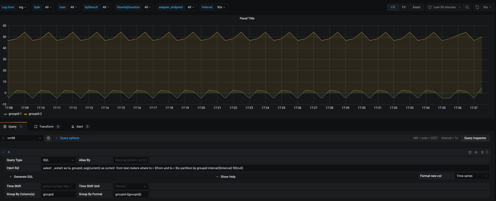

import Tabs from "@theme/Tabs";
import TabItem from "@theme/TabItem";

TDengine 能够与开源数据可视化系统 [Grafana](https://www.grafana.com/) 快速集成搭建数据监测报警系统，整个过程无需任何代码开发，TDengine 中数据表的内容可以在仪表盘(DashBoard)上进行可视化展现。关于 TDengine 插件的使用您可以在[GitHub](https://github.com/taosdata/grafanaplugin/blob/master/README.md)中了解更多。

## 前置条件

要让 Grafana 能正常添加 TDengine 数据源，需要以下几方面的准备工作。

- TDengine 集群已经部署并正常运行
- taosAdapter 已经安装并正常运行。具体细节请参考 [taosAdapter 的使用手册](/reference/taosadapter)

记录以下信息：

- TDengine 集群 REST API 地址，如：`http://tdengine.local:6041`。
- TDengine 集群认证信息，可使用用户名及密码。

## 安装 Grafana

目前 TDengine 支持 Grafana 7.5 以上的版本。用户可以根据当前的操作系统，到 Grafana 官网下载安装包，并执行安装。下载地址如下：<https://grafana.com/grafana/download>。

## 配置 Grafana

### 安装 Grafana Plugin 并配置数据源

<Tabs defaultValue="script">
<TabItem value="gui" label="图形化界面安装">

使用 Grafana 最新版本（8.5+），您可以在 Grafana 中[浏览和管理插件](https://grafana.com/docs/grafana/next/administration/plugin-management/#plugin-catalog)（对于 7.x 版本，请使用 **安装脚本** 或 **手动安装并配置** 方式）。在 Grafana 管理界面中的 **Configurations > Plugins** 页面直接搜索并按照提示安装 TDengine。


如图示即安装完毕，按照指示 **Create a TDengine data source** 添加数据源。


输入 TDengine 相关配置，完成数据源配置。


配置完毕，现在可以使用 TDengine 创建 Dashboard 了。

</TabItem>
<TabItem value="script" label="使用安装脚本">

对于使用 Grafana 7.x 版本或使用 [Grafana Provisioning](https://grafana.com/docs/grafana/latest/administration/provisioning/) 配置的用户，可以在 Grafana 服务器上使用安装脚本自动安装插件即添加数据源 Provisioning 配置文件。

```sh
bash -c "$(curl -fsSL \
  https://raw.githubusercontent.com/taosdata/grafanaplugin/master/install.sh)" -- \
  -a http://localhost:6041 \
  -u root \
  -p taosdata
```

安装完毕后，需要重启 Grafana 服务后方可生效。

保存该脚本并执行 `./install.sh --help` 可查看详细帮助文档。

</TabItem>
<TabItem value="manual" label="手动安装">

使用 [`grafana-cli` 命令行工具](https://grafana.com/docs/grafana/latest/administration/cli/) 进行插件[安装](https://grafana.com/grafana/plugins/tdengine-datasource/?tab=installation)。

```bash
grafana-cli plugins install tdengine-datasource
# with sudo
sudo -u grafana grafana-cli plugins install tdengine-datasource
```

或者从 [GitHub](https://github.com/taosdata/grafanaplugin/releases/tag/latest) 或 [Grafana](https://grafana.com/grafana/plugins/tdengine-datasource/?tab=installation) 下载 .zip 文件到本地并解压到 Grafana 插件目录。命令行下载示例如下：

```bash
GF_VERSION=3.3.1
# from GitHub
wget https://github.com/taosdata/grafanaplugin/releases/download/v$GF_VERSION/tdengine-datasource-$GF_VERSION.zip
# from Grafana
wget -O tdengine-datasource-$GF_VERSION.zip https://grafana.com/api/plugins/tdengine-datasource/versions/$GF_VERSION/download
```

以 CentOS 7.2 操作系统为例，将插件包解压到 /var/lib/grafana/plugins 目录下，重新启动 grafana 即可。

```bash
sudo unzip tdengine-datasource-$GF_VERSION.zip -d /var/lib/grafana/plugins/
```

如果 Grafana 在 Docker 环境下运行，可以使用如下的环境变量设置自动安装 TDengine 数据源插件：

```bash
GF_INSTALL_PLUGINS=tdengine-datasource
```

之后，用户可以直接通过 <http://localhost:3000> 的网址，登录 Grafana 服务器（用户名/密码：admin/admin），通过左侧 `Configuration -> Data Sources` 可以添加数据源，如下图所示：


点击 `Add data source` 可进入新增数据源页面，在查询框中输入 TDengine 可选择添加，如下图所示：


进入数据源配置页面，按照默认提示修改相应配置即可：


- Host： TDengine 集群中提供 REST 服务 （在 2.4 之前由 taosd 提供， 从 2.4 开始由 taosAdapter 提供）的组件所在服务器的 IP 地址与 TDengine REST 服务的端口号(6041)，默认 <http://localhost:6041>。
- User：TDengine 用户名。
- Password：TDengine 用户密码。

点击 `Save & Test` 进行测试，成功会有如下提示：


</TabItem>
<TabItem value="container" label="K8s/Docker 容器">

参考 [Grafana 容器化安装说明](https://grafana.com/docs/grafana/next/setup-grafana/installation/docker/#install-plugins-in-the-docker-container)。使用如下命令启动一个容器，并自动安装 TDengine 插件：

```bash
docker run -d \
  -p 3000:3000 \
  --name=grafana \
  -e "GF_INSTALL_PLUGINS=tdengine-datasource" \
  grafana/grafana
```

使用 docker-compose，配置 Grafana Provisioning 自动化配置，体验 TDengine + Grafana 组合的零配置启动：

1. 保存该文件为 `tdengine.yml`。

    ```yml
    apiVersion: 1
    datasources:
    - name: TDengine
      type: tdengine-datasource
      orgId: 1
      url: "$TDENGINE_API"
      isDefault: true
      secureJsonData:
        url: "$TDENGINE_URL"
        basicAuth: "$TDENGINE_BASIC_AUTH"
        token: "$TDENGINE_CLOUD_TOKEN"
      version: 1
      editable: true
    ```

2. 保存该文件为 `docker-compose.yml`。

    ```yml
    version: "3.7"

    services:
      tdengine:
        image: tdengine/tdengine:3.0.2.4
        environment:
          TAOS_FQDN: tdengine
        volumes:
          - tdengine-data:/var/lib/taos/
      grafana:
        image: grafana/grafana:9.3.6
        volumes:
          - ./tdengine.yml/:/etc/grafana/provisioning/tdengine.yml
          - grafana-data:/var/lib/grafana
        environment:
          # install tdengine plugin at start
          GF_INSTALL_PLUGINS: "tdengine-datasource"
          TDENGINE_URL: "http://tdengine:6041"
          #printf "$TDENGINE_USER:$TDENGINE_PASSWORD" | base64
          TDENGINE_BASIC_AUTH: "cm9vdDp0YmFzZTEyNQ=="
        ports:
          - 3000:3000
    volumes:
      grafana-data:
      tdengine-data:
    ```

3. 使用 docker-compose 命令启动 TDengine + Grafana ：`docker-compose up -d`。

打开 Grafana <http://localhost:3000>，现在可以添加 Dashboard 了。

</TabItem>
</Tabs>

### 创建 Dashboard

回到主界面创建 Dashboard，点击 Add Query 进入面板查询页面：


如上图所示，在 Query 中选中 `TDengine` 数据源，在下方查询框可输入相应 SQL 进行查询，具体说明如下：

- INPUT SQL：输入要查询的语句（该 SQL 语句的结果集应为两列多行），例如：`select _wstart, avg(mem_system) from log.dnodes_info where ts >= $from and ts < $to interval($interval)` ，其中，from、to 和 interval 为 TDengine 插件的内置变量，表示从 Grafana 插件面板获取的查询范围和时间间隔。除了内置变量外，`也支持可以使用自定义模板变量`。
- ALIAS BY：可设置当前查询别名。
- GENERATE SQL： 点击该按钮会自动替换相应变量，并生成最终执行的语句。
- Group by column name(s)： **半角**逗号分隔的 `group by` 或 `partition by` 列名。如果是 `group by` or `partition by` 查询语句，设置 `Group by` 列，可以展示多维数据。例如：INPUT SQL 为 `select _wstart as ts, avg(mem_system), dnode_ep from log.dnodes_info where ts>=$from and ts<=$to partition by dnode_ep interval($interval)`，设置 Group by 列名为 `dnode_ep`，可以按 `dnode_ep` 展示数据。
- Format to： Group by 或 Partition by 场景下多维数据 legend 格式化格式。例如上述 INPUT SQL，将 Format to 设置为 `mem_system_{{dnode_ep}}`，展示的 legend 名字为格式化的列名。

:::note

由于 REST 接口无状态， 不能使用 `use db` 语句来切换数据库。Grafana 插件中 SQL 语句中可以使用 <db_name>.<table_name> 来指定数据库。

:::

按照默认提示查询当前 TDengine 部署所在服务器指定间隔系统内存平均使用量如下：


查询每台 TDengine 服务器指定间隔系统内存平均使用量如下：



> 关于如何使用 Grafana 创建相应的监测界面以及更多有关使用 Grafana 的信息，请参考 Grafana 官方的[文档](https://grafana.com/docs/)。

### 导入 Dashboard

在数据源配置页面，您可以为该数据源导入 TDinsight 面板，作为 TDengine 集群的监控可视化工具。如果 TDengine 服务端为 3.0 版本请选择 `TDinsight for 3.x` 导入。注意 TDinsight for 3.x 需要运行和配置 taoskeeper。


其中适配 TDengine 2.* 的 Dashboard 已发布在 Grafana：[Dashboard 15167 - TDinsight](https://grafana.com/grafana/dashboards/15167)) 。

使用 TDengine 作为数据源的其他面板，可以[在此搜索](https://grafana.com/grafana/dashboards/?dataSource=tdengine-datasource)。以下是一份不完全列表：

- [15146](https://grafana.com/grafana/dashboards/15146): 监控多个 TDengine 集群
- [15155](https://grafana.com/grafana/dashboards/15155): TDengine 告警示例
- [15167](https://grafana.com/grafana/dashboards/15167): TDinsight
- [16388](https://grafana.com/grafana/dashboards/16388): Telegraf 采集节点信息的数据展示
