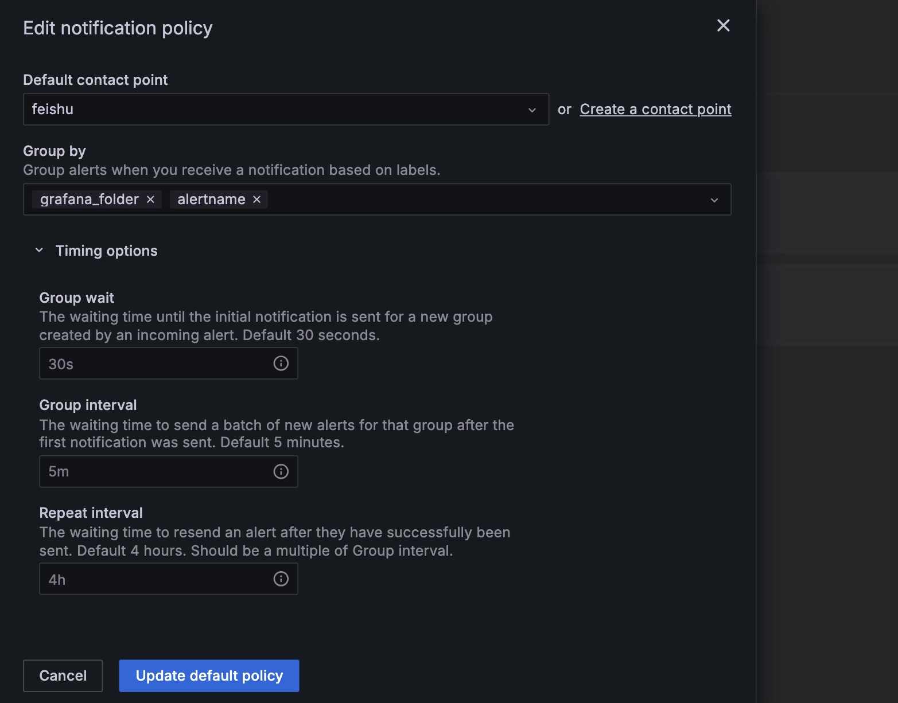

import Tabs from "@theme/Tabs";
import TabItem from "@theme/TabItem";

## 概述
本文档介绍如何将 TDengine 数据源与开源数据可视化系统 [Grafana](https://www.grafana.com/) 集成，以实现数据的可视化和监测报警系统的搭建。通过 TDengine 插件，您可以轻松地将 TDengine 数据表的数据展示在 Grafana 仪表盘上，且无需进行复杂的开发工作。

## Grafana 版本要求
当前 TDengine 支持 Grafana 7.5 及以上版本，建议使用最新版本。请根据您的系统环境下载并安装对应版本的 Grafana。


## 前置条件

要让 Grafana 能正常添加 TDengine 数据源，需要以下几方面的准备工作。

- Grafana 服务已经部署并正常运行。  
    **注意**：要确保启动 Grafana 的账号有其安装目录的写权限，否则可能后面无法安装插件。
- TDengine 集群已经部署并正常运行。
- taosAdapter 已经安装并正常运行。具体细节请参考 [taosAdapter 的使用手册](../../../reference/components/taosadapter)

记录以下信息：

- TDengine 集群 REST API 地址，如：`http://tdengine.local:6041`。
- TDengine 集群认证信息，可使用用户名及密码。

## 安装 Grafana Plugin 并配置数据源

<Tabs defaultValue="script">
<TabItem value="gui" label="图形化界面安装">

使用 Grafana 最新版本（8.5+），您可以在 Grafana 中[浏览和管理插件](https://grafana.com/docs/grafana/next/administration/plugin-management/#plugin-catalog)（对于 7.x 版本，请采用 **安装脚本** 或 **手动安装** 方式）。在 Grafana 管理界面中的 **Configurations > Plugins** 页面直接搜索 `TDengine` 并按照提示安装。

安装完毕后，按照指示 **Create a TDengine data source** 添加数据源，输入 TDengine 相关配置：
- Host： TDengine 集群中提供 REST 服务的 IP 地址与端口号，默认 `http://localhost:6041`
- User：TDengine 用户名。
- Password：TDengine 用户密码。

点击 `Save & Test` 进行测试，成功会提示：`TDengine Data source is working`。  

</TabItem>
<TabItem value="script" label="安装脚本">

对于使用 Grafana 7.x 版本或使用 [Grafana Provisioning](https://grafana.com/docs/grafana/latest/administration/provisioning/) 配置的用户，可以在 Grafana 服务器上使用安装脚本自动安装插件即添加数据源 Provisioning 配置文件。

```sh
bash -c "$(curl -fsSL \
  https://raw.githubusercontent.com/taosdata/grafanaplugin/master/install.sh)" -- \
  -a http://localhost:6041 \
  -u root \
  -p taosdata
```

安装完毕后，需要重启 Grafana 服务后方可生效。

保存该脚本并执行 `./install.sh --help` 可查看详细帮助文档。

</TabItem>
<TabItem value="manual" label="手动安装">

使用 [`grafana-cli` 命令行工具](https://grafana.com/docs/grafana/latest/administration/cli/) 进行插件[安装](https://grafana.com/grafana/plugins/tdengine-datasource/?tab=installation)。

```bash
grafana-cli plugins install tdengine-datasource
# with sudo
sudo -u grafana grafana-cli plugins install tdengine-datasource
```

或者从 [GitHub](https://github.com/taosdata/grafanaplugin/releases/tag/latest) 或 [Grafana](https://grafana.com/grafana/plugins/tdengine-datasource/?tab=installation) 下载 .zip 文件到本地并解压到 Grafana 插件目录。命令行下载示例如下：

```bash
GF_VERSION=3.5.1
# from GitHub
wget https://github.com/taosdata/grafanaplugin/releases/download/v$GF_VERSION/tdengine-datasource-$GF_VERSION.zip
# from Grafana
wget -O tdengine-datasource-$GF_VERSION.zip https://grafana.com/api/plugins/tdengine-datasource/versions/$GF_VERSION/download
```

以 CentOS 7.2 操作系统为例，将插件包解压到 /var/lib/grafana/plugins 目录下，重新启动 grafana 即可。

```bash
sudo unzip tdengine-datasource-$GF_VERSION.zip -d /var/lib/grafana/plugins/
```

如果 Grafana 在 Docker 环境下运行，可以使用如下的环境变量设置自动安装 TDengine 数据源插件：

```bash
GF_INSTALL_PLUGINS=tdengine-datasource
```

之后，用户可以直接通过 http://localhost:3000 的网址，登录 Grafana 服务器（用户名/密码：admin/admin），通过左侧 `Configuration -> Data Sources` 可以添加数据源，

点击 `Add data source` 可进入新增数据源页面，在查询框中输入 TDengine， 然后点击 `select` 选择添加后会进入数据源配置页面，按照默认提示修改相应配置：

- Host： TDengine 集群中提供 REST 服务的 IP 地址与端口号，默认 `http://localhost:6041`
- User：TDengine 用户名。
- Password：TDengine 用户密码。

点击 `Save & Test` 进行测试，成功会提示：`TDengine Data source is working`

</TabItem>
<TabItem value="container" label="K8s/Docker 容器">

参考 [Grafana 容器化安装说明](https://grafana.com/docs/grafana/next/setup-grafana/installation/docker/#install-plugins-in-the-docker-container)。使用如下命令启动一个容器，并自动安装 TDengine 插件：

```bash
docker run -d \
  -p 3000:3000 \
  --name=grafana \
  -e "GF_INSTALL_PLUGINS=tdengine-datasource" \
  grafana/grafana
```

使用 docker-compose，配置 Grafana Provisioning 自动化配置，体验 TDengine + Grafana 组合的零配置启动：

1. 保存该文件为 `tdengine.yml`。

    ```yml
    apiVersion: 1
    datasources:
    - name: TDengine
      type: tdengine-datasource
      orgId: 1
      url: "$TDENGINE_API"
      isDefault: true
      secureJsonData:
        url: "$TDENGINE_URL"
        basicAuth: "$TDENGINE_BASIC_AUTH"
        token: "$TDENGINE_CLOUD_TOKEN"
      version: 1
      editable: true
    ```

2. 保存该文件为 `docker-compose.yml`。

    ```yml
    version: "3.7"

    services:
      tdengine:
        image: tdengine/tdengine:3.3.0.0
        environment:
          TAOS_FQDN: tdengine
        volumes:
          - tdengine-data:/var/lib/taos/
      grafana:
        image: grafana/grafana:9.3.6
        volumes:
          - ./tdengine.yml/:/etc/grafana/provisioning/tdengine.yml
          - grafana-data:/var/lib/grafana
        environment:
          # install tdengine plugin at start
          GF_INSTALL_PLUGINS: "tdengine-datasource"
          TDENGINE_URL: "http://tdengine:6041"
          #printf "$TDENGINE_USER:$TDENGINE_PASSWORD" | base64
          TDENGINE_BASIC_AUTH: "cm9vdDp0YmFzZTEyNQ=="
        ports:
          - 3000:3000
    volumes:
      grafana-data:
      tdengine-data:
    ```

3. 使用 docker-compose 命令启动 TDengine + Grafana ：`docker-compose up -d`。

打开 Grafana [http://localhost:3000](http://localhost:3000)，现在可以添加 Dashboard 了。

</TabItem>
</Tabs>

:::info

下文介绍中，都以 Grafana v11.0.0 版本为例，其他版本功能可能有差异，请参考 [Grafana 官网](https://grafana.com/docs/grafana/latest/)。

:::

## Dashboard 使用指南

本节内容按如下方式组织：  
1. 介绍基础知识，包括 Grafana 的内置变量和自定义变量，TDengine 对与时序查询的特色语法支持。
2. 介绍如何使用 TDengine 数据源在 Grafana 中创建 Dashboard，然后给出使用时序查询的特色语法和如何分组展示数据。
3. 由于配置的 Dashbord 在页面显示时会定时查询 TDengine 来刷新显示，如果 SQL 编写不当会导致严重的性能问题，我们给出了性能优化建议。
4. 最后我们以 TDengine 监控面板 TDinsight 为例介绍了如何导入我们提供的 DashBoard。

### Grafana 内置变量和自定义变量

Grafana 中的 Variable（变量）功能非常强大，可以在 Dashboard 的查询、面板标题、标签等地方使用，用来创建更加动态和交互式的 Dashbord，提高用户体验和效率。

变量的主要作用和特点包括：

- 动态数据查询：变量可以用于查询语句中，使得用户可以通过选择不同的变量值来动态更改查询条件，从而查看不同的数据视图。这对于需要根据用户输入动态展示数据的场景非常有用。

- 提高可重用性：通过定义变量，可以在多个地方重用相同的配置或查询逻辑，而不需要重复编写相同的代码。这使得 Dashboard 的维护和更新变得更加简单高效。

- 灵活的配置选项：变量提供了多种配置选项，如预定义的静态值列表、从数据源动态查询值、正则表达式过滤等，使得变量的应用更加灵活和强大。

Grafana 提供了内置变量和自定义变量，它们都可以可以在编写 SQL 时引用，引用的方式是 `$variableName`，`variableName` 是变量的名字，其他引用方式请参考 [引用方式](https://grafana.com/docs/grafana/latest/dashboards/variables/variable-syntax/)。

#### 内置变量

Grafana 内置了 `from`、`to` 和 `interval` 等变量，都取自于 Grafana 插件面板。其含义如下：
- `from` 查询范围的起始时间
- `to` 查询范围的结束时间
- `interval` 窗口切分间隔

对于每个查询都建议设置查询范围的起始时间和结束时间，可以有效的减少 TDengine 服务端执行查询扫描的数据量。`interval` 是窗口切分的大小，在 Grafana 11 版本中，其大小为时间间隔和返回点数计算而得。

除了上述三个常用变量，Grafana 还提供了如 `__timezone`, `__org`, `__user` 等变量，详情请参考 [内置变量](https://grafana.com/docs/grafana/latest/dashboards/variables/add-template-variables/#global-variables)。

#### 自定义变量

我们可以在 Dashbord 中增加自定义变量。自定义变量和内置变量的使用方式没有区别，都是在 SQL 中用 `$variableName` 进行引用。
自定义变量支持多种类型，常见的类型包括 `Query`（查询）、`Constant`（常量）、`Interval`（间隔）、`Data source`（数据源）等。
自定义变量可以引用其他自定义变量，比如一个变量表示区域，另一个变量可以引用区域的值，来查询这个区域的设备。

##### 添加查询类型变量

在 Dashbord 的配置中，选择 【Variables】，然后点击 【New variable】：
1. 在 “Name” 字段中，输入你的变量名，此处我们设置变量名为 `selected_groups`。
2. 在 【Select variable type】下拉菜单中，选择 “Query”（查询）。
根据选择的变量类型，配置相应的选项。例如，如果选择了 “Query” 类型，你需要指定数据源和用于获取变量值的查询语句。此处我们还以智能电表为例，设置查询类型，选择数据源后，配置 SQL 为 `select distinct(groupid) from power.meters where groupid < 3 and ts > $from and ts < $to;`
3. 点击底部的【Run Query】后，可以在 “Preview of values”（值预览）部分，查看到根据你的配置生成的变量值。
4. 还有其他配置不再赘述，完成配置后，点击页面底部的【Apply】（应用）按钮，然后点击右上角的【Save dashboard】保存。  

完成以上步骤后，我们就成功在 Dashboard 中添加了一个新的自定义变量 `$selected_groups`。我们可以后面在 Dashboard 的查询中通过 `$selected_groups` 的方式引用这个变量。  

我们还可以再新增自定义变量来引用这个 `selected_groups` 变量，比如我们新增一个名为 `tbname_max_current` 的查询变量，其 SQL 为 `select tbname from power.meters where groupid = $selected_groups and ts > $from and ts < $to;`

##### 添加间隔类型变量

我们可以自定义时间窗口间隔，可以更加贴合业务需求。
1. 在 “Name” 字段中，输入变量名为 `interval`。
2. 在 【Select variable type】下拉菜单中，选择 “Interval”（间隔）。
3. 在 【Interval options】选项中输入 `1s,2s,5s,10s,15s,30s,1m`。
4. 还有其他配置不再赘述，完成配置后，点击页面底部的【Apply】（应用）按钮，然后点击右上角的【Save dashboard】保存。

完成以上步骤后，我们就成功在 Dashboard 中添加了一个新的自定义变量 `$interval`。我们可以后面在 Dashboard 的查询中通过 `$interval` 的方式引用这个变量。

:::note

自定义变量和 Grafana 内置变量重名时，会优先引用自定义变量。

:::

### TDengine 时序查询支持

TDengine 在支持标准 SQL 的基础之上，还提供了一系列满足时序业务场景需求的特色查询语法，这些语法能够为时序场景的应用的开发带来极大的便利。
- `partition by` 子句可以按一定的维度对数据进行切分，然后在切分出的数据空间内再进行一系列的计算。绝大多数情况可以替代 `group by`。
- `interval` 子句用于产生相等时间周期的窗口
- `fill` 语句指定某一窗口区间数据缺失的情况下的填充模式
- `时间戳伪列` 如果需要在结果中输出聚合结果所对应的时间窗口信息，需要在 SELECT 子句中使用时间戳相关的伪列： 时间窗口起始时间 (_wstart), 时间窗口结束时间 (_wend) 等  

上述特性详细介绍可以参考 [特色查询](../../../reference/taos-sql/distinguished/)。

### 创建 Dashboard

有了前面的基础知识，我们可以配置基于 TDengine 数据源的时间序列数据展示 Dashbord。  
在 Grafana 主界面创建 Dashboard，点击【Add Query】进入面板查询页面：


如上图所示，在 “Query” 中选中 `TDengine` 数据源，在下方查询框可输入相应 SQL 进行查询。 我们继续用智能电表来举例，为了展示曲线美观，此处**用了虚拟数据**。

#### 时间序列数据展示

假设我们想查询一段时间内的平均电流大小，时间窗口按 `$interval` 切分，若某一时间窗口区间数据缺失，填充 null。
- “INPUT SQL”：输入要查询的语句（该 SQL 语句的结果集应为两列多行），此处输入：`select _wstart as ts, avg(current) as current from power.meters where groupid in ($selected_groups) and ts > $from and ts < $to interval($interval) fill(null)` ，其中，from、to 和 interval 为 Grafana 内置变量，selected_groups 为自定义变量。
- “ALIAS BY”：可设置当前查询别名。
- “GENERATE SQL”： 点击该按钮会自动替换相应变量，并生成最终执行的语句。

在顶部的自定义变量中，若选择 `selected_groups` 的值为 1，则查询 `meters` 超级表中 `groupid` 为 1 的所有设备电流平均值变化如下图：


:::note

由于 REST 接口无状态， 不能使用 `use db` 语句来切换数据库。Grafana 插件中 SQL 语句中可以使用 \<db_name>.\<table_name> 来指定数据库。

:::

#### 时间序列数据分组展示

假设我们想查询一段时间内的平均电流大小，按 `groupid` 分组展示，我们可以修改之前的 SQL 为 `select _wstart as ts, groupid, avg(current) as current from power.meters where ts > $from and ts < $to partition by groupid interval($interval) fill(null)`

- “Group by column(s)”： **半角**逗号分隔的 `group by` 或 `partition by` 列名。如果是 `group by` 或 `partition by` 查询语句，设置 “Group by” 列，可以展示多维数据。此处设置 “Group by” 列名为 `groupid`，可以按 `groupid` 分组展示数据。
- “Group By Format”： `Group by` 或 `Partition by` 场景下多维数据 legend 格式化格式。例如上述 INPUT SQL，将 “Group By Format” 设置为 `groupid-{{groupid}}`，展示的 legend 名字为格式化的分组名。

完成设置后，按照 `groupid` 分组展示如下图：


> 关于如何使用 Grafana 创建相应的监测界面以及更多有关使用 Grafana 的信息，请参考 Grafana 官方的[文档](https://grafana.com/docs/)。

### 性能优化建议

- **所有查询加上时间范围**，在时序数据库中，如果不加查询的时间范围，会扫表导致性能低下。常见的 SQL 写法是 `select column_name from db.table where ts > $from and ts < $to;`
- 对于最新状态类型的查询，我们一般建议在**创建数据库的时候打开缓存**（`CACHEMODEL` 设置为 last_row 或者 both），常见的 SQL 写法是 `select last(column_name) from db.table where ts > $from and ts < $to;`

### 导入 Dashboard

在数据源配置页面，您可以为该数据源导入 TDinsight 面板，作为 TDengine 集群的监控可视化工具。如果 TDengine 服务端为 3.0 版本请选择 `TDinsight for 3.x` 导入。注意 TDinsight for 3.x 需要运行和配置 taoskeeper。


其中适配 TDengine 2.* 的 Dashboard 已发布在 Grafana：[Dashboard 15167 - TDinsight](https://grafana.com/grafana/dashboards/15167)) 。

使用 TDengine 作为数据源的其他面板，可以[在此搜索](https://grafana.com/grafana/dashboards/?dataSource=tdengine-datasource)。以下是一份不完全列表：

- [15146](https://grafana.com/grafana/dashboards/15146)： 监控多个 TDengine 集群
- [15155](https://grafana.com/grafana/dashboards/15155)： TDengine 告警示例
- [15167](https://grafana.com/grafana/dashboards/15167)： TDinsight
- [16388](https://grafana.com/grafana/dashboards/16388)： Telegraf 采集节点信息的数据展示

## 告警配置

TDengine Grafana 插件支持告警，如果要配置告警，需要以下几个步骤：
1. 配置联络点（“Contact points”）：配置通知渠道，包括 DingDing、Email、Slack、WebHook、Prometheus Alertmanager 等
2. 配置告警通知策略（“Notification policies”）：配置告警发送到哪个通道的路由，以及发送通知的时间和重复频率
3. 配置告警规则（“Alert rules”）：配置详细的告警规则  
    3.1 配置告警名称  
    3.2 配置查询和告警触发条件  
    3.3 配置规则评估策略  
    3.4 配置标签和告警通道  
    3.5 配置通知文案  

### 告警配置界面介绍

在Grafana 11 告警界面一共有 6 个 Tab，分别是 “Alert rules”、“Contact points”、“Notification policies”、“Silences”、 “Groups” 和 “Settings”。
- “Alert rules” 告警规则列表，用于展示和配置告警规则
- “Contact points” 通知渠道，包括 DingDing、Email、Slack、WebHook、Prometheus Alertmanager 等
- “Notification policies” 配置告警发送到哪个通道的路由，以及发送通知的时间和重复频率
- “Silences” 配置告警静默时间段
- “Groups” 告警组，配置的告警触发后会在这里分组显示
- “Settings” 提供通过 JSON 方式修改告警配置

### 配置联络点

本节以邮件和飞书为例配置联络点。

#### 配置邮件联络点

在 Grafana 服务的配置文件中添加 SMTP/Emailing 和 Alerting 模块。（以 Linux 系统为例，其配置文件一般位于 `/etc/grafana/grafana.ini`）

在配置文件中增加下面内容：

```ini
#################################### SMTP / Emailing ##########################
[smtp]
enabled = true
host = smtp.qq.com:465      #使用的邮箱
user = receiver@foxmail.com
password = ***********      #使用mail授权码
skip_verify = true
from_address = sender@foxmail.com
```

然后重启 Grafana 服务（以 Linux 系统为例，执行 `systemctl restart grafana-server.service`）即可添加完成

在 Grafana 页面找到 “Home” -> “Alerting” -> “Contact points”，创建新联络点  
“Name”： Email Contact Point  
“Integration”：选择联络类型，这里选择 Email，填写邮件接收地址，完成后保存联络点  


#### 配置飞书联络点  

按照以下步骤配置飞书机器人：

1. “飞书工作台” -> “获取应用” -> “搜索飞书机器人助手” -> “新建指令”
2. 选择触发器：Grafana
3. 选择操作：通过官方机器人发送消息，填写发送对象和发送内容


在 Grafana 页面找到 “Home” -> “Alerting” -> “Contact points” 创建新联络点  
“Name”：Feishu Contact Point  
“Integration”：选择联络类型，这里选择 Webhook，并填写 URL (在飞书机器人助手的 Grafana 触发器 Webhook 地址)，完成后保存联络点  


### 配置告警通知策略

配置好联络点后，可以看到已有一个Default Policy


点击右侧 “...” -> ”Edit”，然后编辑默认通知策略，弹出配置窗口：



然后配置下列参数：
- “Group wait”： 发送首次告警之前的等待时间。
- “Group interval”： 发送第一个告警后，为该组发送下一批新告警的等待时间。
- “Repeat interval”： 成功发送告警后再次重复发送告警的等待时间。

### 配置告警规则  

以配置智能电表告警为例，告警规则的配置主要包括告警名称、查询和告警触发条件、规则评估策略、标签和告警通道、通知文案。

#### 配置告警名称

在需要配置告警的面板中选择 “Edit” -> “Alert” -> “New alert rule”。

“Enter alert rule name“ (输入告警规则名称)：此处以智能电表为例输入 `power meters alert`

#### 配置查询和告警触发条件

在 “Define query and alert condition” (定义查询和告警触发条件) 中配置告警规则。
1. 选择数据源：`TDengine Datasource`  
2. 查询语句：

    ```sql
    select _wstart as ts, groupid, avg(current) as current from power.meters where ts > $from and ts < $to partition by groupid interval($interval) fill(null)
    ```

3. 设置 “Expression”（表达式）：`Threshold is above 100`  
4. 点击【Set as alert condition】
5. “Preview”：查看设置的规则的结果  

完成设置后可以看到下面图片展示：


Grafana 的 “Expression”（表达式）支持对数据做各种操作和计算，其类型分为：
1. “Reduce”：将所选时间范围内的时间序列值聚合为单个值  
    1.1 “Function” 用来设置聚合方法，支持 Min、Max、Last、Mean、Sum 和 Count。  
    1.2 “Mode” 支持下面三种：  
        - “Strict”：如果查询不到数据，数据会赋值为 NaN。  
        - “Drop Non-numeric Value”：去掉非法数据结果。  
        - “Replace Non-numeric Value”：如果是非法数据，使用固定值进行替换。  
2. “Threshold”：检查时间序列数据是否符合阈值判断条件。当条件为假时返回 0，为真则返回1。支持下列方式：
    - Is above (x > y)
    - Is below (x < y)
    - Is within range (x > y1 AND x < y2)
    - Is outside range (x < y1 AND x > y2)
3. “Math”：对时间序列的数据进行数学运算。
4. “Resample”：更改每个时间序列中的时间戳使其具有一致的时间间隔，以便在它们之间执行数学运算。
5. “Classic condition (legacy)”： 可配置多个逻辑条件，判断是否触发告警。

如上节截图显示，此处我们设置最大值超过 100 触发告警。

#### 配置规则评估策略


完成下面配置：  
- “Folder”：设置告警规则所属目录。
- “Evaluation group”：设置告警规则评估组。“Evaluation group” 可以选择已有组或者新建组，新建组可以设置组名和评估时间间隔。
- “Pending period”：在告警规则的阈值被触发后，异常值持续多长时间可以触发告警，合理设置可以避免误报。

#### 配置标签和告警通道


完成下面配置：  
- “Labels” 将标签添加到规则中，以便进行搜索、静默或路由到通知策略。
- “Contact point” 选择联络点，当告警发生时通过设置的联络点进行通知。

#### 配置通知文案


设置 “Summary” 和 “Description” 后，若告警触发，将会收到告警通知。
