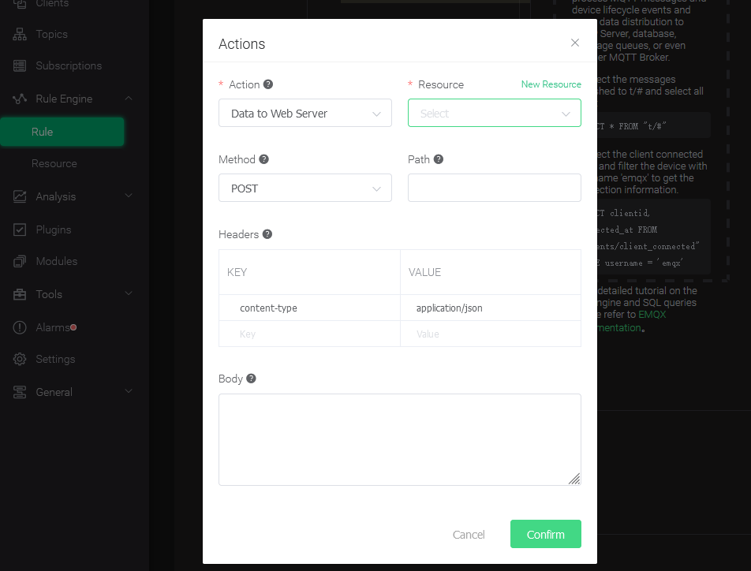
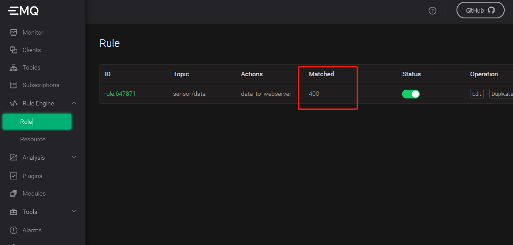

MQTT 是流行的物联网数据传输协议，[EMQX](https://github.com/emqx/emqx)是一开源的 MQTT Broker 软件，无需任何代码，只需要在 EMQX Dashboard 里使用“规则”做简单配置，即可将 MQTT 的数据直接写入 TDengine。EMQX 支持通过 发送到 Web 服务的方式保存数据到 TDengine，也在企业版上提供原生的 TDengine 驱动实现直接保存。

## 前置条件

要让 EMQX 能正常添加 TDengine 数据源，需要以下几方面的准备工作。

- TDengine 集群已经部署并正常运行
- taosAdapter 已经安装并正常运行。具体细节请参考 [taosAdapter 的使用手册](/reference/taosadapter)
- 如果使用后文介绍的模拟写入程序，需要安装合适版本的 Node.js，推荐安装 v12

## 安装并启动 EMQX

用户可以根据当前的操作系统，到 EMQX 官网下载安装包，并执行安装。下载地址如下：<https://www.emqx.io/zh/downloads>。安装后使用 `sudo emqx start` 或 `sudo systemctl start emqx` 启动 EMQX 服务。

注意：本文基于 EMQX v4.4.5 版本，其他版本由于相关配置界面、配置方法以及功能可能随着版本升级有所区别。

## 创建数据库和表

在 TDengine 中为接收 MQTT 数据创建相应数据库和表结构。进入 TDengine CLI 复制并执行以下 SQL 语句：

```sql
CREATE DATABASE test;
USE test;
CREATE TABLE sensor_data (ts TIMESTAMP, temperature FLOAT, humidity FLOAT, volume FLOAT, pm10 FLOAT, pm25 FLOAT, so2 FLOAT, no2 FLOAT, co FLOAT, sensor_id NCHAR(255), area TINYINT, coll_time TIMESTAMP);
```

注：表结构以博客[数据传输、存储、展现，EMQX + TDengine 搭建 MQTT 物联网数据可视化平台](https://www.taosdata.com/blog/2020/08/04/1722.html)为例。后续操作均以此博客场景为例进行，请你根据实际应用场景进行修改。

## 配置 EMQX 规则

由于 EMQX 不同版本配置界面所有不同，这里仅以 v4.4.5 为例，其他版本请参考相应官网文档。

### 登录 EMQX Dashboard

使用浏览器打开网址 http://IP:18083 并登录 EMQX Dashboard。初次安装用户名为 `admin` 密码为：`public`。


### 创建规则（Rule）

选择左侧“规则引擎（Rule Engine）”中的“规则（Rule）”并点击“创建（Create）”按钮：


### 编辑 SQL 字段

复制以下内容输入到 SQL 编辑框：

```sql
SELECT
  payload
FROM
  "sensor/data"
```

其中 `payload` 代表整个消息体， `sensor/data` 为本规则选取的消息主题。


### 新增“动作（action handler）”


### 新增“资源（Resource）”



选择“发送数据到 Web 服务”并点击“新建资源”按钮：

### 编辑“资源（Resource）”

选择“WebHook”并填写“请求 URL”为 taosAdapter 提供 REST 服务的地址，如果是本地启动的 taosadapter， 那么默认地址为：

```
http://127.0.0.1:6041/rest/sql
```

其他属性请保持默认值。


### 编辑“动作（action）”

编辑资源配置，增加 Authorization 认证的键/值配对项。默认用户名和密码对应的 Authorization 值为：
```
Basic cm9vdDp0YW9zZGF0YQ==
```
相关文档请参考[ TDengine REST API 文档](../../connector/rest-api/)。

在消息体中输入规则引擎替换模板:

```sql
INSERT INTO test.sensor_data VALUES(
  now,
  ${payload.temperature},
  ${payload.humidity},
  ${payload.volume},
  ${payload.PM10},
  ${payload.pm25},
  ${payload.SO2},
  ${payload.NO2},
  ${payload.CO},
  '${payload.id}',
  ${payload.area},
  ${payload.ts}
)
```


最后点击左下方的 “Create” 按钮，保存规则。
## 编写模拟测试程序

```javascript
{{#include docs/examples/other/mock.js}}
```

注意：代码中 CLIENT_NUM 在开始测试中可以先设置一个较小的值，避免硬件性能不能完全处理较大并发客户端数量。


## 执行测试模拟发送 MQTT 数据

```
npm install mqtt mockjs --save --registry=https://registry.npm.taobao.org
node mock.js
```


## 验证 EMQX 接收到数据

在 EMQX Dashboard 规则引擎界面进行刷新，可以看到有多少条记录被正确接收到：



## 验证数据写入到 TDengine

使用 TDengine CLI 程序登录并查询相应数据库和表，验证数据是否被正确写入到 TDengine 中：


TDengine 详细使用方法请参考 [TDengine 官方文档](https://docs.taosdata.com/)。
EMQX 详细使用方法请参考 [EMQX 官方文档](https://www.emqx.io/docs/zh/v4.4/rule/rule-engine.html)。
