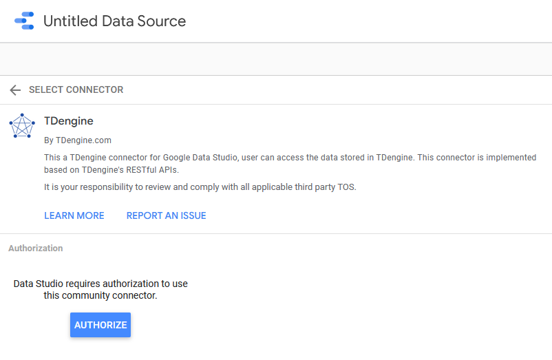
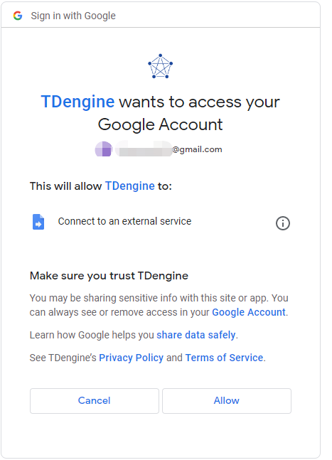
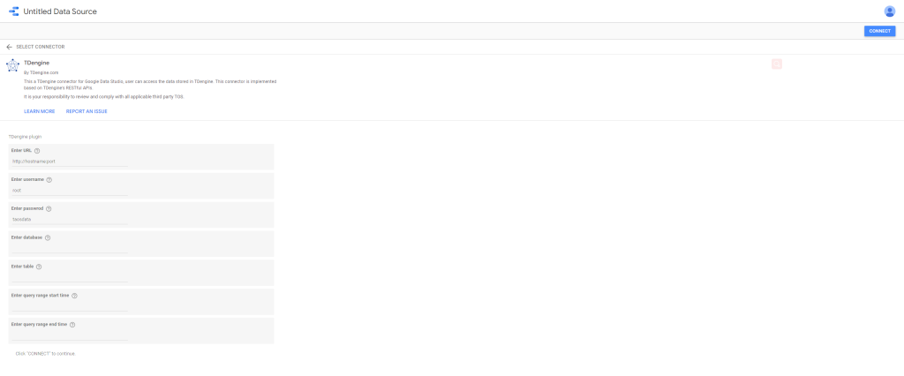
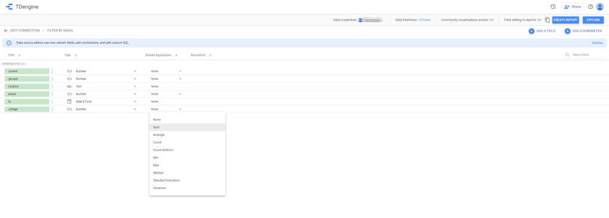
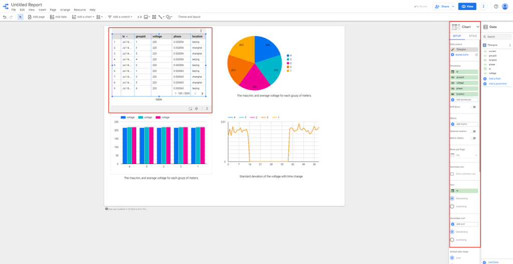
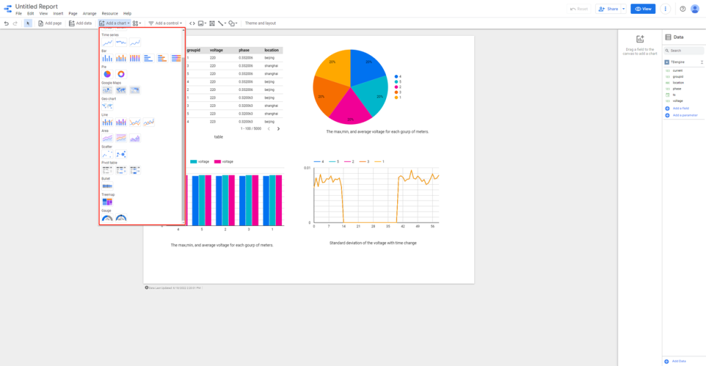

Google Data Studio 是一个强大的报表可视化工具，它提供了丰富的数据图表和数据连接，可以非常方便地按照既定模板生成报表。因其简便易用和生态丰富而在数据分析领域得到一众数据科学家的青睐。

Data Studio 可以支持多种数据来源，除了诸如 Google Analytics、Google AdWords、Search Console、BigQuery 等 Google 自己的服务之外，用户也可以直接将离线文件上传至 Google Cloud Storage，或是通过连接器来接入其它数据源。

目前 TDengine 连接器已经发布到 Google Data Studio 应用商店，你可以在 “Connect to Data” 页面下直接搜索 TDengine，将其选作数据源。

接下来选择 AUTHORIZE 按钮。

设置允许连接自己的账号到外部服务。

在接下来的页面选择运行 TDengine REST 服务的 URL，并输入用户名、密码、数据库名称、表名称以及查询时间范围，并点击右上角的 CONNECT 按钮。

注意：查询时间范围为可选输入项，如果不设置查询开始时间和结束时间，那么返回的数据为截至当前时间前30天的数据。如果30天内没有数据，生成的报告的会没数据。

连接成功后，就可以使用 GDS 方便地进行数据处理并创建报表了。

目前的维度和指标规则是：timestamp 类型的字段和 tag 字段会被连接器定义为维度，而其他类型的字段是指标。用户还可以根据自己的需求创建不同的表。

以下为使用 GDS 对 TDengine 提供数据进行可视化图表设计的过程示例。

