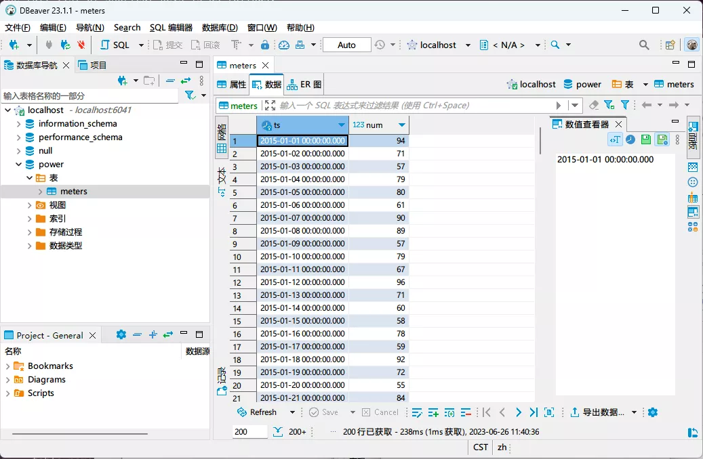

DBeaver 是一款流行的跨平台数据库管理工具，方便开发者、数据库管理员、数据分析师等用户管理数据。DBeaver 从 23.1.1 版本开始内嵌支持 TDengine。既支持独立部署的 TDengine 集群也支持 TDengine Cloud。

## 前置条件

使用 DBeaver 管理 TDengine 需要以下几方面的准备工作。

- 安装 DBeaver。DBeaver 支持主流操作系统包括 Windows、macOS 和 Linux。请注意[下载](https://dbeaver.io/download/)正确平台和版本（23.1.1+）的安装包。详细安装步骤请参考 [DBeaver 官方文档](https://github.com/dbeaver/dbeaver/wiki/Installation)。
- 如果使用独立部署的 TDengine 集群，请确认 TDengine 正常运行，并且 taosAdapter 已经安装并正常运行，具体细节请参考 [taosAdapter 的使用手册](/reference/taosadapter)。

## 使用 DBeaver 访问内部部署的 TDengine

1. 启动 DBeaver 应用，点击按钮或菜单项选择“连接到数据库”，然后在时间序列分类栏中选择 TDengine。

 

2. 配置 TDengine 连接，填入主机地址、端口号、用户名和密码。如果 TDengine 部署在本机，可以只填用户名和密码，默认用户名为 root，默认密码为 taosdata。点击“测试连接”可以对连接是否可用进行测试。如果本机没有安装 TDengine Java
 连接器，DBeaver 会提示下载安装。

 

3. 连接成功将显示如下图所示。如果显示连接失败，请检查 TDengine 服务和 taosAdapter 是否正确运行，主机地址、端口号、用户名和密码是否正确。

 

4. 使用 DBeaver 选择数据库和表可以浏览 TDengine 服务的数据。

 

5. 也可以通过执行 SQL 命令的方式对 TDengine 数据进行操作。

 
