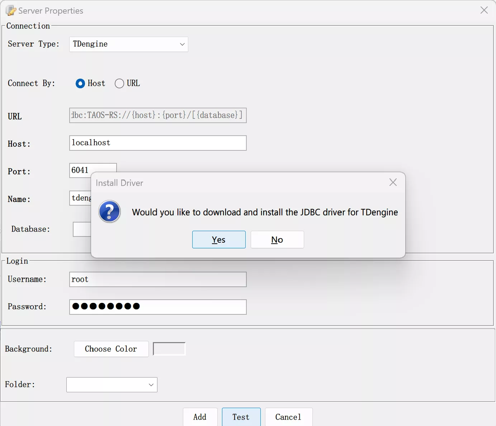
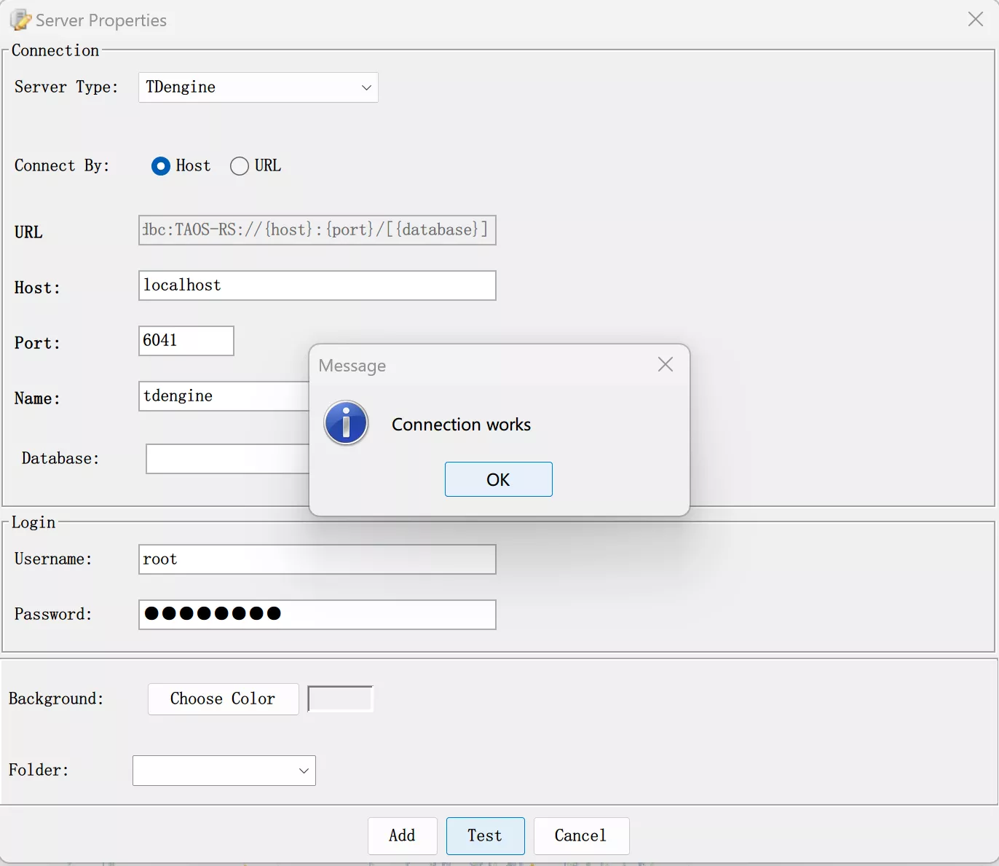
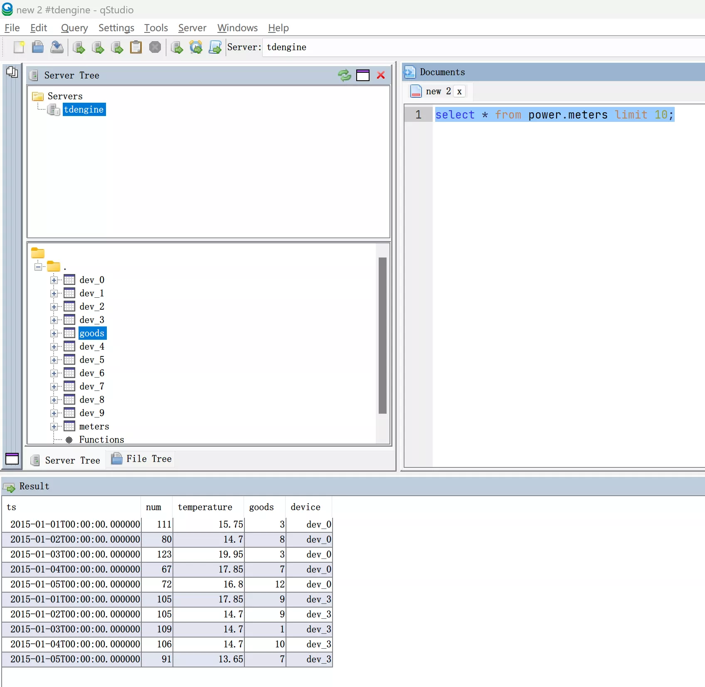

qStudio 是一款免费的多平台 SQL 数据分析工具，可以轻松浏览数据库中的表、变量、函数和配置设置。最新版本 qStudio 内嵌支持 TDengine。

## 前置条件

使用 qStudio 连接 TDengine 需要以下几方面的准备工作。

- 安装 qStudio。qStudio 支持主流操作系统包括 Windows、macOS 和 Linux。请注意[下载](https://www.timestored.com/qstudio/download/)正确平台的安装包。
- 安装 TDengine 实例，请确认 TDengine 正常运行，并且 taosAdapter 已经安装并正常运行，具体细节请参考 [taosAdapter 的使用手册](/reference/taosadapter)。

## 使用 qStudio 连接 TDengine

1. 启动 qStudio 应用，从菜单项选择“Server” 和 “Add Server...”，然后在 Server Type 下拉框中选择 TDengine。

 

2. 配置 TDengine 连接，填入主机地址、端口号、用户名和密码。如果 TDengine 部署在本机，可以只填用户名和密码，默认用户名为 root，默认密码为 taosdata。点击“Test”可以对连接是否可用进行测试。如果本机没有安装 TDengine Java
 连接器，qStudio 会提示下载安装。

 

3. 连接成功将显示如下图所示。如果显示连接失败，请检查 TDengine 服务和 taosAdapter 是否正确运行，主机地址、端口号、用户名和密码是否正确。

 

4. 使用 qStudio 选择数据库和表可以浏览 TDengine 服务的数据。

 

5. 也可以通过执行 SQL 命令的方式对 TDengine 数据进行操作。

 

6. qStudio 支持根据数据绘制图表等功能，请参考 [qStudio 的帮助文档](https://www.timestored.com/qstudio/help)

 
